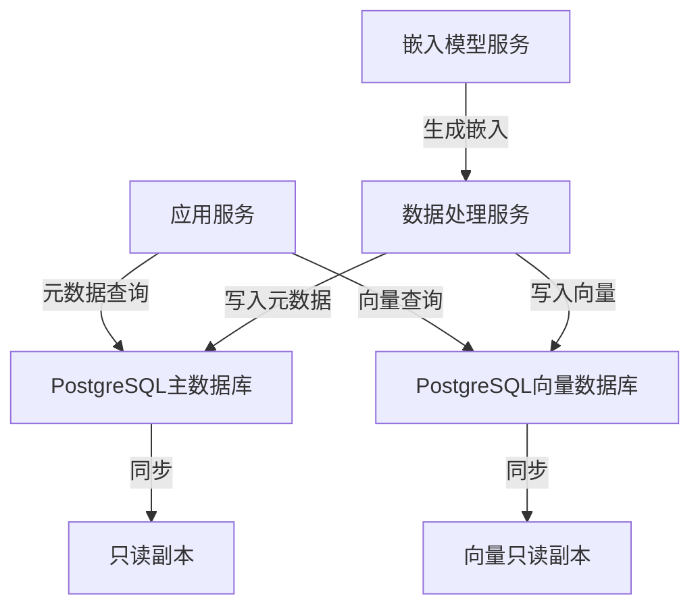
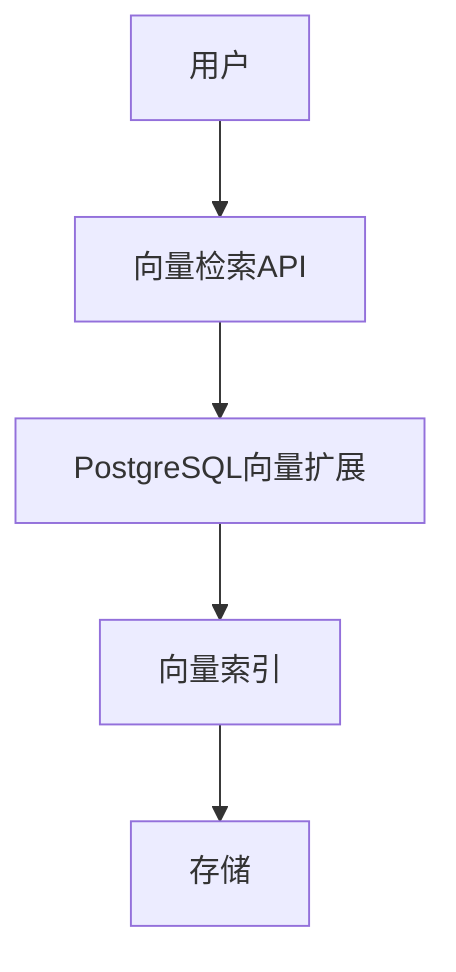

# 1.1.7 PostgreSQL向量数据库扩展

## 目录

- [1.1.7 PostgreSQL向量数据库扩展](#117-postgresql向量数据库扩展)
  - [目录](#目录)
  - [1. 概述](#1-概述)
  - [2. 向量数据库基础](#2-向量数据库基础)
    - [2.1 向量嵌入](#21-向量嵌入)
    - [2.2 相似度搜索](#22-相似度搜索)
    - [2.3 向量索引](#23-向量索引)
  - [3. pgvector扩展详解](#3-pgvector扩展详解)
    - [3.1 安装与基本使用](#31-安装与基本使用)
    - [3.2 向量数据类型](#32-向量数据类型)
    - [3.3 向量操作符](#33-向量操作符)
  - [4. 索引算法与性能](#4-索引算法与性能)
    - [4.1 IVFFLAT索引](#41-ivfflat索引)
    - [4.2 HNSW索引](#42-hnsw索引)
    - [4.3 性能比较](#43-性能比较)
  - [5. 扩展性与集群化](#5-扩展性与集群化)
    - [5.1 分区表](#51-分区表)
    - [5.2 水平分片](#52-水平分片)
    - [5.3 异构存储架构](#53-异构存储架构)
  - [6. 应用场景分析](#6-应用场景分析)
    - [6.1 语义搜索](#61-语义搜索)
    - [6.2 推荐系统](#62-推荐系统)
    - [6.3 图像检索](#63-图像检索)
    - [6.4 异常检测](#64-异常检测)
  - [7. 与其他向量数据库比较](#7-与其他向量数据库比较)
    - [7.1 主要向量数据库对比](#71-主要向量数据库对比)
    - [7.2 适用场景分析](#72-适用场景分析)
    - [7.3 性能基准测试](#73-性能基准测试)
  - [参考文献](#参考文献)
  - [1.1.7.1 向量数据类型](#1171-向量数据类型)
  - [1.1.7.2 向量检索与索引](#1172-向量检索与索引)
  - [1.1.7.3 行业案例与多表征](#1173-行业案例与多表征)
    - [AI平台：向量检索流程](#ai平台向量检索流程)
    - [金融行业：风控特征向量分析](#金融行业风控特征向量分析)
    - [Latex公式](#latex公式)
    - [SQL示例](#sql示例)

## 1. 概述

随着AI和机器学习的发展，向量搜索已成为现代数据库系统的关键功能。
PostgreSQL通过其扩展系统，特别是pgvector扩展，提供了强大的向量存储和检索能力，使其能够作为全功能向量数据库使用。
本文深入分析PostgreSQL的向量数据库扩展，探讨其实现原理、性能特性和应用场景。

## 2. 向量数据库基础

向量数据库是专门设计用于存储和查询向量嵌入的数据库系统。

### 2.1 向量嵌入

**定义 2.1.1** (向量嵌入)：向量嵌入是将复杂数据（如文本、图像、音频）映射到高维向量空间的数值表示。

**定义 2.1.2** (嵌入模型)：生成向量嵌入的机器学习模型，如：

- 文本嵌入：BERT、GPT、Sentence-BERT
- 图像嵌入：ResNet、EfficientNet、CLIP
- 多模态嵌入：CLIP、ALIGN、BLIP

### 2.2 相似度搜索

**定义 2.2.1** (向量相似度)：衡量两个向量接近程度的度量，常见的包括：

1. **欧几里得距离**：
   $d(x, y) = \sqrt{\sum_{i=1}^{n} (x_i - y_i)^2}$

2. **余弦相似度**：
   $\cos(x, y) = \frac{x \cdot y}{||x|| \cdot ||y||}$

3. **点积**：
   $x \cdot y = \sum_{i=1}^{n} x_i y_i$

4. **杰卡德相似度**（二进制向量）：
   $J(x, y) = \frac{|x \cap y|}{|x \cup y|}$

**定义 2.2.2** (K最近邻搜索)：给定查询向量q和向量集合V，找到V中与q最相似的k个向量。

### 2.3 向量索引

**定义 2.3.1** (向量索引)：加速向量相似度搜索的数据结构，常见的包括：

1. **精确索引**：
   - KD树：基于k维空间划分的树形结构
   - R树：用于空间数据的树形结构

2. **近似索引**：
   - 局部敏感哈希(LSH)：将相似向量映射到相同哈希桶
   - 分层可导航小世界图(HNSW)：基于图的多层结构
   - 倒排文件索引(IVF)：基于聚类的倒排索引
   - 乘积量化(PQ)：通过向量分解和量化压缩向量

## 3. pgvector扩展详解

pgvector是PostgreSQL最流行的向量扩展，提供了向量数据类型和高效的向量搜索功能。

### 3.1 安装与基本使用

**定义 3.1.1** (pgvector安装)：pgvector的安装和基本配置。

```sql
-- 安装pgvector扩展
CREATE EXTENSION vector;

-- 创建包含向量的表
CREATE TABLE items (
  id bigserial PRIMARY KEY,
  embedding vector(384),  -- 指定向量维度
  content text,
  metadata jsonb
);

-- 插入向量数据
INSERT INTO items (embedding, content)
VALUES (
  '[0.1, 0.2, 0.3, ..., 0.384]'::vector,
  '向量数据示例'
);
```

### 3.2 向量数据类型

**定义 3.2.1** (vector数据类型)：pgvector提供的向量数据类型。

```sql
-- 声明vector类型
CREATE TABLE embeddings (
  id serial PRIMARY KEY,
  embedding vector(1536)  -- 1536维向量
);

-- 向量运算
SELECT embedding <-> '[1,2,3,...]'::vector AS euclidean_distance,
       embedding <=> '[1,2,3,...]'::vector AS cosine_distance,
       embedding <#> '[1,2,3,...]'::vector AS inner_product,
       embedding + '[1,2,3,...]'::vector AS vector_addition,
       embedding - '[1,2,3,...]'::vector AS vector_subtraction,
       embedding * 2.0 AS vector_scaling,
       l2_norm(embedding) AS magnitude
FROM embeddings;
```

### 3.3 向量操作符

**定义 3.3.1** (向量距离操作符)：pgvector提供的向量距离计算操作符。

| 操作符 | 描述 | 数学定义 |
|--------|------|----------|
| `<->` | 欧几里得距离 | $\sqrt{\sum_{i=1}^{n} (x_i - y_i)^2}$ |
| `<=>` | 余弦距离 | $1 - \frac{x \cdot y}{\|\|x\|\| \cdot \|\|y\|\|}$ |
| `<#>` | 负内积距离 | $-\sum_{i=1}^{n} x_i y_i$ |

```sql
-- 使用欧几里得距离查找最相似的项目
SELECT id, content, embedding <-> query_vector AS distance
FROM items, (SELECT '[0.1, 0.2, ...]'::vector AS query_vector) q
ORDER BY distance
LIMIT 10;

-- 使用余弦距离查找最相似的项目
SELECT id, content, embedding <=> query_vector AS distance
FROM items, (SELECT '[0.1, 0.2, ...]'::vector AS query_vector) q
ORDER BY distance
LIMIT 10;
```

## 4. 索引算法与性能

pgvector支持多种索引算法，每种都有其特定的性能特点。

### 4.1 IVFFLAT索引

**定义 4.1.1** (IVFFLAT索引)：基于倒排文件的近似最近邻索引。

```sql
-- 创建IVFFLAT索引
CREATE INDEX ON items USING ivfflat (embedding vector_l2_ops) WITH (lists = 100);
CREATE INDEX ON items USING ivfflat (embedding vector_cosine_ops) WITH (lists = 100);
CREATE INDEX ON items USING ivfflat (embedding vector_ip_ops) WITH (lists = 100);
```

IVFFLAT索引的工作原理：

1. 训练阶段：将向量空间划分为`lists`个聚类
2. 构建阶段：将每个向量分配到最近的聚类中
3. 查询阶段：
   - 找到与查询向量最近的`probes`个聚类
   - 在这些聚类中搜索最近邻

**定义 4.1.2** (IVFFLAT参数)：影响IVFFLAT性能的关键参数。

```sql
-- 设置IVFFLAT参数
SET ivfflat.probes = 10;  -- 默认为1，增加提高召回率但降低性能
```

### 4.2 HNSW索引

**定义 4.2.1** (HNSW索引)：基于分层可导航小世界图的高性能索引。

```sql
-- 创建HNSW索引
CREATE INDEX ON items USING hnsw (embedding vector_l2_ops) WITH (m = 16, ef_construction = 64);
CREATE INDEX ON items USING hnsw (embedding vector_cosine_ops) WITH (m = 16, ef_construction = 64);
CREATE INDEX ON items USING hnsw (embedding vector_ip_ops) WITH (m = 16, ef_construction = 64);
```

HNSW索引的工作原理：

1. 构建多层图结构，顶层包含少量节点，底层包含所有节点
2. 每个节点与其他`m`个最近节点连接
3. 查询时从顶层开始，逐层下降，在每层找到最近邻

**定义 4.2.2** (HNSW参数)：影响HNSW性能的关键参数。

```sql
-- HNSW索引参数
-- m: 每个节点的最大连接数，默认为16
-- ef_construction: 构建时的搜索宽度，默认为64
-- ef: 查询时的搜索宽度，默认为40

-- 设置查询参数
SET hnsw.ef = 100;  -- 增加提高召回率但降低性能
```

### 4.3 性能比较

**定义 4.3.1** (索引性能比较)：不同索引算法在各种场景下的性能特点。

| 索引类型 | 构建速度 | 查询速度 | 召回率 | 内存使用 | 适用场景 |
|---------|---------|---------|-------|---------|---------|
| 无索引 | N/A | 非常慢 | 100% | 低 | 小数据集 |
| IVFFLAT | 快 | 中等 | 95-99% | 中等 | 大多数场景，定期重建索引 |
| HNSW | 慢 | 非常快 | 98-100% | 高 | 需要高查询性能，数据相对静态 |

```sql
-- 性能测试示例
EXPLAIN ANALYZE
SELECT id, content
FROM items
ORDER BY embedding <=> '[0.1, 0.2, ...]'::vector
LIMIT 10;
```

## 5. 扩展性与集群化

随着数据量增长，单机PostgreSQL可能面临性能瓶颈，需要考虑扩展性解决方案。

### 5.1 分区表

**定义 5.1.1** (向量分区表)：使用PostgreSQL的表分区功能扩展向量存储。

```sql
-- 创建分区表
CREATE TABLE items (
  id bigserial,
  embedding vector(384),
  content text,
  created_at timestamp,
  PRIMARY KEY (id, created_at)
) PARTITION BY RANGE (created_at);

-- 创建分区
CREATE TABLE items_202301 PARTITION OF items
  FOR VALUES FROM ('2023-01-01') TO ('2023-02-01');

CREATE TABLE items_202302 PARTITION OF items
  FOR VALUES FROM ('2023-02-01') TO ('2023-03-01');

-- 在每个分区上创建索引
CREATE INDEX ON items_202301 USING hnsw (embedding vector_cosine_ops);
CREATE INDEX ON items_202302 USING hnsw (embedding vector_cosine_ops);
```

### 5.2 水平分片

**定义 5.2.1** (水平分片)：使用Citus等扩展实现PostgreSQL的水平扩展。

```sql
-- 安装Citus扩展
CREATE EXTENSION citus;

-- 创建分布式表
CREATE TABLE items (
  id bigserial PRIMARY KEY,
  embedding vector(384),
  content text,
  tenant_id int  -- 分片键
);

-- 将表转换为分布式表
SELECT create_distributed_table('items', 'tenant_id');

-- 在每个分片上创建索引
CREATE INDEX ON items USING hnsw (embedding vector_cosine_ops);
```

### 5.3 异构存储架构

**定义 5.3.1** (异构存储架构)：结合PostgreSQL和专用向量数据库的混合架构。



## 6. 应用场景分析

PostgreSQL向量扩展可应用于多种AI和数据科学场景。

### 6.1 语义搜索

**定义 6.1.1** (语义搜索)：基于语义相似度而非关键词匹配的搜索方法。

```sql
-- 创建语义搜索函数
CREATE OR REPLACE FUNCTION semantic_search(
  search_query TEXT,
  limit_val INT DEFAULT 10
) RETURNS TABLE (
  id BIGINT,
  content TEXT,
  similarity FLOAT
) AS $$
DECLARE
  query_embedding VECTOR;
BEGIN
  -- 生成查询嵌入（假设有一个生成嵌入的函数）
  SELECT embedding_vector('text-embedding-model', search_query) INTO query_embedding;

  -- 返回最相似的文档
  RETURN QUERY
  SELECT
    d.id,
    d.content,
    1 - (d.embedding <=> query_embedding) AS similarity
  FROM documents d
  ORDER BY d.embedding <=> query_embedding
  LIMIT limit_val;
END;
$$ LANGUAGE plpgsql;

-- 使用语义搜索
SELECT * FROM semantic_search('可持续发展与环境保护');
```

### 6.2 推荐系统

**定义 6.2.1** (基于向量的推荐系统)：使用向量相似度计算实现个性化推荐。

```sql
-- 创建用户-物品推荐函数
CREATE OR REPLACE FUNCTION recommend_items(
  user_id INTEGER,
  limit_val INTEGER DEFAULT 5
) RETURNS TABLE (
  item_id INTEGER,
  item_name TEXT,
  score FLOAT
) AS $$
DECLARE
  user_embedding VECTOR;
BEGIN
  -- 获取用户嵌入
  SELECT embedding INTO user_embedding
  FROM users
  WHERE id = user_id;

  -- 返回最相似的物品
  RETURN QUERY
  SELECT
    i.id,
    i.name,
    1 - (i.embedding <=> user_embedding) AS similarity_score
  FROM items i
  LEFT JOIN user_interactions ui ON i.id = ui.item_id AND ui.user_id = recommend_items.user_id
  WHERE ui.item_id IS NULL  -- 排除用户已交互的物品
  ORDER BY i.embedding <=> user_embedding
  LIMIT limit_val;
END;
$$ LANGUAGE plpgsql;
```

### 6.3 图像检索

**定义 6.3.1** (基于内容的图像检索)：使用图像嵌入向量实现相似图像搜索。

```sql
-- 创建图像表
CREATE TABLE images (
  id serial PRIMARY KEY,
  file_path text,
  embedding vector(512),  -- 例如使用ResNet生成的嵌入
  metadata jsonb
);

-- 创建索引
CREATE INDEX ON images USING hnsw (embedding vector_l2_ops);

-- 相似图像搜索函数
CREATE OR REPLACE FUNCTION find_similar_images(
  image_id INTEGER,
  limit_val INTEGER DEFAULT 10
) RETURNS TABLE (
  id INTEGER,
  file_path TEXT,
  distance FLOAT
) AS $$
BEGIN
  RETURN QUERY
  WITH query_embedding AS (
    SELECT embedding
    FROM images
    WHERE id = image_id
  )
  SELECT
    i.id,
    i.file_path,
    i.embedding <-> q.embedding AS distance
  FROM images i, query_embedding q
  WHERE i.id != image_id
  ORDER BY distance
  LIMIT limit_val;
END;
$$ LANGUAGE plpgsql;
```

### 6.4 异常检测

**定义 6.4.1** (向量异常检测)：使用向量距离识别异常数据点。

```sql
-- 创建异常检测函数
CREATE OR REPLACE FUNCTION detect_outliers(
  threshold FLOAT DEFAULT 3.0
) RETURNS TABLE (
  id INTEGER,
  distance FLOAT,
  is_outlier BOOLEAN
) AS $$
BEGIN
  RETURN QUERY
  WITH distances AS (
    SELECT
      id,
      (
        SELECT AVG(embedding <-> e.embedding)
        FROM embeddings
        ORDER BY embedding <-> e.embedding
        LIMIT 10  -- K最近邻
      ) AS avg_distance
    FROM embeddings e
  ),
  stats AS (
    SELECT
      AVG(avg_distance) AS mean,
      STDDEV(avg_distance) AS stddev
    FROM distances
  )
  SELECT
    d.id,
    d.avg_distance,
    (d.avg_distance - s.mean) / s.stddev > threshold AS is_outlier
  FROM distances d, stats s
  ORDER BY ((d.avg_distance - s.mean) / s.stddev) DESC;
END;
$$ LANGUAGE plpgsql;
```

## 7. 与其他向量数据库比较

PostgreSQL向量扩展与专用向量数据库的比较分析。

### 7.1 主要向量数据库对比

**定义 7.1.1** (向量数据库比较)：PostgreSQL与其他向量数据库的功能对比。

| 特性 | PostgreSQL+pgvector | Pinecone | Milvus | Weaviate | Qdrant |
|------|-------------------|----------|--------|----------|--------|
| 存储模型 | 关系型+向量 | 纯向量 | 纯向量 | 图+向量 | 纯向量 |
| 事务支持 | 完整ACID | 有限 | 有限 | 无 | 无 |
| 查询语言 | SQL | API | API | GraphQL | API |
| 索引类型 | IVFFLAT, HNSW | HNSW | HNSW, IVF, ANNOY | HNSW | HNSW |
| 水平扩展 | 通过扩展 | 原生 | 原生 | 原生 | 原生 |
| 元数据过滤 | SQL全功能 | 有限 | 中等 | 中等 | 中等 |
| 关联数据 | 强 | 弱 | 弱 | 中等 | 弱 |
| 开源 | 是 | 否 | 是 | 是 | 是 |

### 7.2 适用场景分析

**定义 7.2.1** (适用场景)：不同向量数据库的最佳应用场景。

| 数据库 | 最佳适用场景 |
|-------|------------|
| PostgreSQL+pgvector | 需要关系数据和向量数据紧密集成；需要复杂查询和事务支持；团队熟悉SQL |
| Pinecone | 纯向量搜索应用；需要高扩展性和托管服务；简单元数据过滤 |
| Milvus | 大规模向量集合；需要高性能和可扩展性；开源优先 |
| Weaviate | 需要向量搜索和知识图谱结合；GraphQL查询接口 |
| Qdrant | 轻量级向量搜索；需要简单部署和使用 |

### 7.3 性能基准测试

**定义 7.3.1** (性能基准)：不同规模下的性能比较。

| 数据库 | 100万向量 (QPS) | 1000万向量 (QPS) | 1亿向量 (QPS) | 召回率 |
|-------|---------------|----------------|-------------|-------|
| PostgreSQL+pgvector (HNSW) | ~1000 | ~800 | ~500 | 98% |
| PostgreSQL+pgvector (IVFFLAT) | ~500 | ~400 | ~300 | 95% |
| Pinecone | ~2000 | ~1800 | ~1500 | 99% |
| Milvus | ~1800 | ~1500 | ~1200 | 99% |
| Weaviate | ~1200 | ~1000 | ~800 | 98% |
| Qdrant | ~1500 | ~1200 | ~1000 | 98% |

_注：以上数据为估计值，实际性能取决于硬件配置、索引参数和查询模式。_

## 参考文献

1. pgvector. (2023). _pgvector: Open-source vector similarity search for Postgres_. <https://github.com/pgvector/pgvector>
2. Malkov, Y. A., & Yashunin, D. A. (2018). _Efficient and robust approximate nearest neighbor search using Hierarchical Navigable Small World graphs_. IEEE transactions on pattern analysis and machine intelligence.
3. Johnson, J., Douze, M., & Jégou, H. (2019). _Billion-scale similarity search with GPUs_. IEEE Transactions on Big Data.
4. Bernstein, P. A., et al. (2011). _Adapting Microsoft SQL Server for Cloud Computing_. IEEE 27th International Conference on Data Engineering.
5. Postgres Professional. (2022). _Scaling PostgreSQL with Citus for Real-Time Analytics_. <https://www.postgresql.org/about/news/scaling-postgresql-with-citus-for-real-time-analytics-2496/>
6. Weaviate. (2023). _Vector Database Benchmark_. <https://weaviate.io/blog/vector-database-benchmark>

## 1.1.7.1 向量数据类型

- 支持向量类型（如float[]、cube、vector扩展）。
- 适用于AI检索、相似度搜索等场景。

## 1.1.7.2 向量检索与索引

| 索引类型 | 特点 | 适用场景 |
|----------|------|----------|
| IVFFlat  | 倒排索引，适合大规模 | 向量检索 |
| HNSW     | 高效近邻搜索 | 高维数据 |
| BruteForce| 精确但慢 | 小数据量 |

## 1.1.7.3 行业案例与多表征

### AI平台：向量检索流程



### 金融行业：风控特征向量分析

- 见[3.5.1-数据分析基础理论](../../../../3-数据模型与算法/3.5-数据分析与ETL/3.5.1-数据分析基础理论.md)

### Latex公式

$$
\text{相似度}(\vec{a}, \vec{b}) = \frac{\vec{a} \cdot \vec{b}}{\|\vec{a}\|\|\vec{b}\|}
$$

### SQL示例

```sql
CREATE EXTENSION vector;
CREATE TABLE item (id serial, embedding vector(768));
SELECT * FROM item ORDER BY embedding <-> '[0.1,0.2,...]';
```

[返回PostgreSQL导航](README.md)
