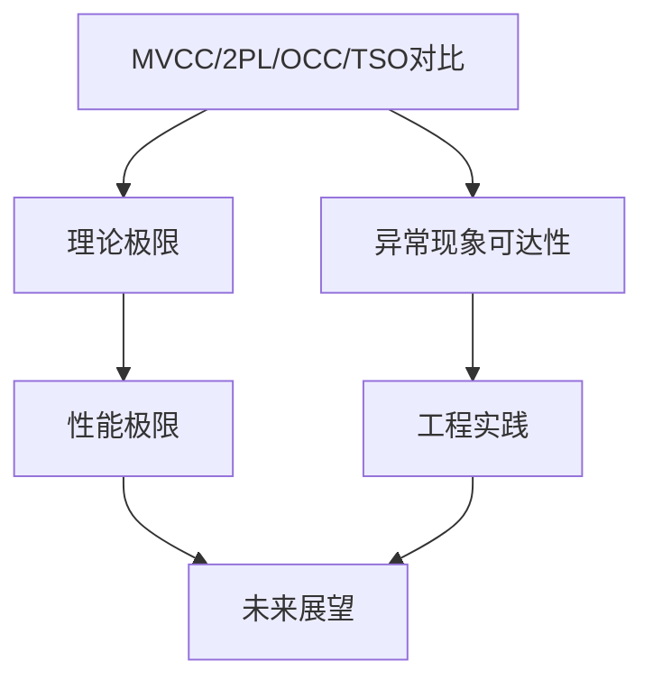
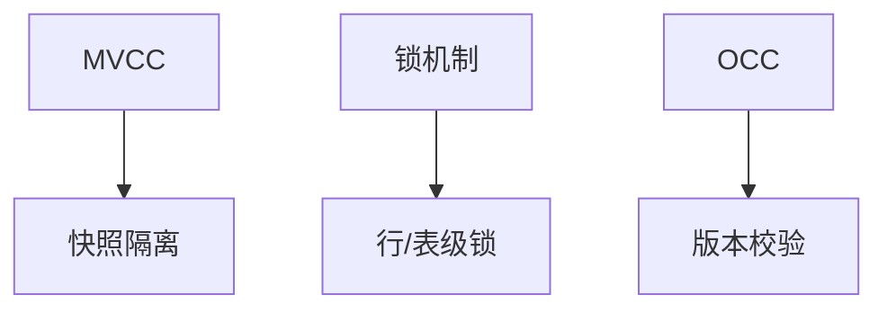

# 1.1.10 MVCC与其他并发控制模型对比与极限分析

## 目录

- [1.1.10 MVCC与其他并发控制模型对比与极限分析](#1110-mvcc与其他并发控制模型对比与极限分析)
  - [目录](#目录)
  - [1. 并发控制模型的形式化定义](#1-并发控制模型的形式化定义)
    - [1.1 MVCC](#11-mvcc)
    - [1.2 2PL（两阶段锁）](#12-2pl两阶段锁)
    - [1.3 OCC（乐观并发控制）](#13-occ乐观并发控制)
    - [1.4 TSO（时间戳排序）](#14-tso时间戳排序)
  - [2. MVCC/2PL/OCC/TSO的优缺点对比](#2-mvcc2plocctso的优缺点对比)
    - [2.1 定理：MVCC在高读并发下的吞吐量极限](#21-定理mvcc在高读并发下的吞吐量极限)
    - [2.2 反例：OCC在高冲突场景下的中止率](#22-反例occ在高冲突场景下的中止率)
    - [2.3 工程实践对比](#23-工程实践对比)
    - [2.4 图表](#24-图表)
  - [3. 典型异常现象的可达性证明](#3-典型异常现象的可达性证明)
    - [3.1 并发异常现象定义](#31-并发异常现象定义)
    - [3.2 可达性表格](#32-可达性表格)
    - [3.3 定理与证明](#33-定理与证明)
  - [4. 性能极限与工程实践](#4-性能极限与工程实践)
    - [4.1 理论极限推导](#41-理论极限推导)
      - [4.1.1 MVCC存储放大极限](#411-mvcc存储放大极限)
      - [4.1.2 2PL锁等待极限](#412-2pl锁等待极限)
    - [4.2 工程实践对比](#42-工程实践对比)
    - [4.3 典型优化与工程经验](#43-典型优化与工程经验)
    - [4.4 图表](#44-图表)
  - [5. 未来展望](#5-未来展望)
    - [5.1 新型并发控制模型](#51-新型并发控制模型)
    - [5.2 AI驱动数据库自优化](#52-ai驱动数据库自优化)
    - [5.3 形式化建模与自动验证](#53-形式化建模与自动验证)
    - [5.4 未来研究方向](#54-未来研究方向)
  - [知识图谱（Mermaid）](#知识图谱mermaid)
  - [1.1.10.1 MVCC原理](#11101-mvcc原理)
  - [1.1.10.2 其他并发控制模型](#11102-其他并发控制模型)
  - [1.1.10.3 行业案例与多表征](#11103-行业案例与多表征)
    - [金融行业：高并发转账事务](#金融行业高并发转账事务)
    - [互联网行业：OCC乐观并发控制](#互联网行业occ乐观并发控制)
    - [Mermaid并发控制对比图](#mermaid并发控制对比图)
    - [Latex公式](#latex公式)

## 1. 并发控制模型的形式化定义

### 1.1 MVCC

（详细定义见1.1.8）

### 1.2 2PL（两阶段锁）

- 定义：所有读写操作前加锁，事务结束前不释放写锁。
- 串行化图理论证明。

### 1.3 OCC（乐观并发控制）

- 定义：读-验证-写三阶段，冲突检测后决定提交或中止。

### 1.4 TSO（时间戳排序）

- 定义：每个事务分配全局时间戳，按时间戳顺序调度。

## 2. MVCC/2PL/OCC/TSO的优缺点对比

| 模型 | 并发度 | 事务中止率 | 存储开销 | 实现复杂性 | 读写性能 |
|------|--------|------------|----------|------------|----------|
| MVCC | 高     | 低         | 高       | 高         | 读高写中 |
| 2PL  | 低     | 低         | 低       | 中         | 读写低   |
| OCC  | 高     | 高         | 低       | 高         | 读高写低 |
| TSO  | 中     | 中         | 低       | 高         | 读写中   |

### 2.1 定理：MVCC在高读并发下的吞吐量极限

**代码示例：PostgreSQL高并发读写SQL**:

```sql
-- 并发读事务
BEGIN ISOLATION LEVEL REPEATABLE READ;
SELECT * FROM test_table WHERE id = 1;
-- 并发写事务
BEGIN;
UPDATE test_table SET value = value + 1 WHERE id = 1;
COMMIT;
```

### 2.2 反例：OCC在高冲突场景下的中止率

**代码示例：OCC冲突检测Python伪代码**:

```python
def validate_commit(txn, active_txns):
    for other in active_txns:
        if set(txn.write_set) & set(other.write_set):
            return False  # 冲突，需中止
    return True
```

### 2.3 工程实践对比

- PostgreSQL（MVCC）：高并发读写，适合复杂事务，存储膨胀需VACUUM。
- MySQL/InnoDB（2PL+MVCC）：高并发下锁冲突明显，读写混合性能一般。
- TiDB（TSO+Percolator）：分布式一致性好，写放大明显。
- CockroachDB（MVCC+Raft）：强一致性，写延迟高。

### 2.4 图表


## 3. 典型异常现象的可达性证明

### 3.1 并发异常现象定义

- **P0 (脏写)**：两个未提交事务写同一数据项。
- **P1 (脏读)**：一个事务读到另一个未提交事务的写。
- **P2 (不可重复读)**：同一事务两次读同一数据项，期间被其他事务修改。
- **P3 (幻读)**：同一事务两次查询集合，期间被其他事务插入/删除数据。
- **P4 (写偏差)**：两个事务并发读同一集合并分别写入，导致约束失效。

### 3.2 可达性表格

| 异常现象 | 2PL-RU | 2PL-RC | 2PL-RR | 2PL-S | MVCC-RC | MVCC-SI | MVCC-SSI | OCC | TSO |
|----------|--------|--------|--------|-------|---------|---------|----------|-----|-----|
| P0 脏写   | ×      | ×      | ×      | ×     | ×       | ×       | ×        | ×   | ×   |
| P1 脏读   | ×      | ×      | ×      | ×     | ×       | ×       | ×        | ×   | ×   |
| P2 不可重复读 | ○  | ○      | ×      | ×     | ○       | ×       | ×        | ○   | ○   |
| P3 幻读   | ○      | ○      | ○      | ×     | ○       | ○       | ×        | ○   | ○   |
| P4 写偏差 | ○      | ○      | ○      | ×     | ○       | ○       | ×        | ○   | ○   |

注：×表示不可达，○表示可达。

### 3.3 定理与证明

> 参见：[1.1.8-MVCC高级分析与形式证明.md](./1.1.8-MVCC高级分析与形式证明.md)

## 4. 性能极限与工程实践

### 4.1 理论极限推导

#### 4.1.1 MVCC存储放大极限

**定理 4.1.1**：MVCC系统的存储放大因子$F$与活跃事务数$N$、写比例$p_w$、平均事务持续时间$d$成正比：
\[
F = 1 + N \cdot d \cdot p_w
\]

**推论**：长事务和高写比例会显著增加存储压力。

**代码示例：MVCC存储放大模拟Python**:

```python
def mvcc_storage_factor(n_txn, avg_duration, write_ratio):
    return 1 + n_txn * avg_duration * write_ratio
# 示例：10并发，平均持续2s，写比例0.2
print(mvcc_storage_factor(10, 2, 0.2))
```

#### 4.1.2 2PL锁等待极限

**定理 4.1.2**：2PL下，锁等待队列长度$L$的理论上界为并发事务数$N$，平均等待时间$T_{wait} \propto N \cdot p_{conflict}$。

### 4.2 工程实践对比

| 系统         | 并发控制 | 读吞吐 | 写吞吐 | 存储放大 | 典型场景           |
|--------------|----------|--------|--------|----------|--------------------|
| PostgreSQL   | MVCC     | 高     | 中     | 高       | OLTP/OLAP/AI混合   |
| MySQL/InnoDB | 2PL+MVCC | 中     | 中     | 中       | OLTP/中小型业务     |
| TiDB         | TSO      | 高     | 中     | 高       | 分布式/弹性扩展     |
| CockroachDB  | MVCC+Raft| 中     | 低     | 高       | 强一致分布式事务   |

### 4.3 典型优化与工程经验

**代码示例：VACUUM参数调优SQL**:

```sql
ALTER TABLE test_table SET (autovacuum_vacuum_scale_factor = 0.05);
```

### 4.4 图表


## 5. 未来展望

### 5.1 新型并发控制模型

- 混合MVCC+OCC：结合多版本读优势与乐观提交，适应高并发AI/流式场景。
- 自适应锁粒度与动态调度：根据负载自动调整并发控制策略。
- 分布式快照隔离的全局优化：跨节点一致性与高可用性的平衡。

### 5.2 AI驱动数据库自优化

- 利用机器学习预测事务冲突、自动调整隔离级别与调度顺序。
- 智能VACUUM与存储回收策略。
- AI辅助索引与数据分布优化。

### 5.3 形式化建模与自动验证

- 自动化验证并发控制正确性（模型检测、定理证明器）。
- 隔离级别与异常现象的可达性自动推导。
- 数据库协议的形式化规范与可验证实现。

### 5.4 未来研究方向

- 面向AI/大数据/流式场景的新型并发控制理论。
- 异构硬件（GPU/FPGA/存内计算）下的并发控制与事务模型。
- 分布式数据库的全局一致性与高可用性极限。
- 数据库与知识图谱、推理引擎的深度融合。

> **注**：本节内容为前沿展望，欢迎持续补充最新学术与工程进展。

## 知识图谱（Mermaid）



---

> 参见：[1.1.8-MVCC高级分析与形式证明.md](./1.1.8-MVCC高级分析与形式证明.md)
> 参见：[1.1.11-PostgreSQL系统设计与现代硬件AI场景适配性分析.md](./1.1.11-PostgreSQL系统设计与现代硬件AI场景适配性分析.md)

## 1.1.10.1 MVCC原理

- 多版本并发控制，快照隔离，提升读写并发。
- 典型实现：PostgreSQL、MySQL InnoDB。

## 1.1.10.2 其他并发控制模型

| 模型 | 特点 | 典型系统 |
|------|------|----------|
| 锁机制 | 行/表级锁，简单 | MySQL MyISAM |
| OCC   | 乐观并发控制 | 分布式数据库 |
| MVCC  | 多版本，快照隔离 | PostgreSQL |

## 1.1.10.3 行业案例与多表征

### 金融行业：高并发转账事务

```sql
BEGIN;
UPDATE account SET balance = balance - 100 WHERE id = 1;
UPDATE account SET balance = balance + 100 WHERE id = 2;
COMMIT;
```

### 互联网行业：OCC乐观并发控制

- 见[1.4.4-分布式事务与一致性](../../1.4-NewSQL/1.4.4-分布式事务与一致性.md)

### Mermaid并发控制对比图



### Latex公式

$$
\text{吞吐量}_{MVCC} > \text{吞吐量}_{LOCK}
$$

[返回PostgreSQL导航](README.md)
