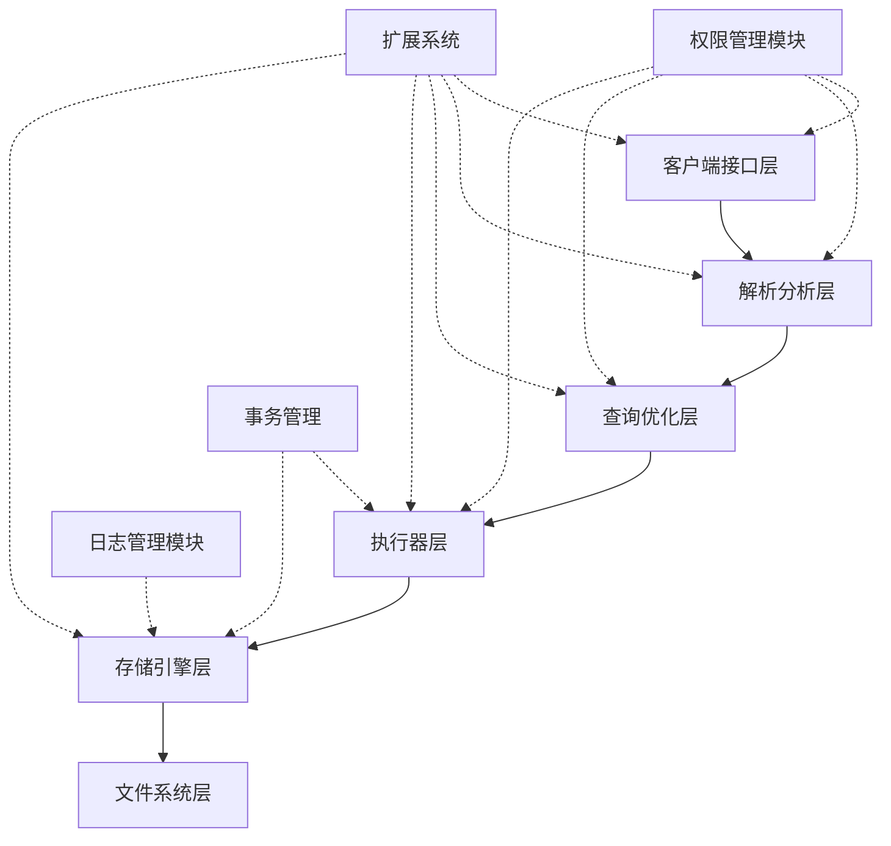
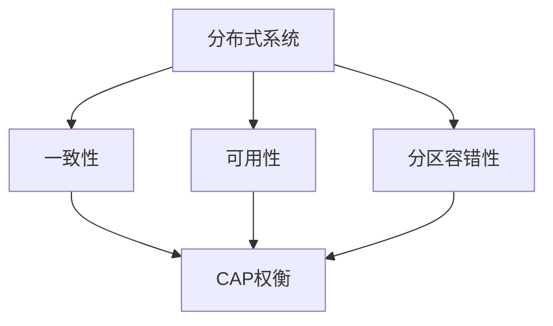
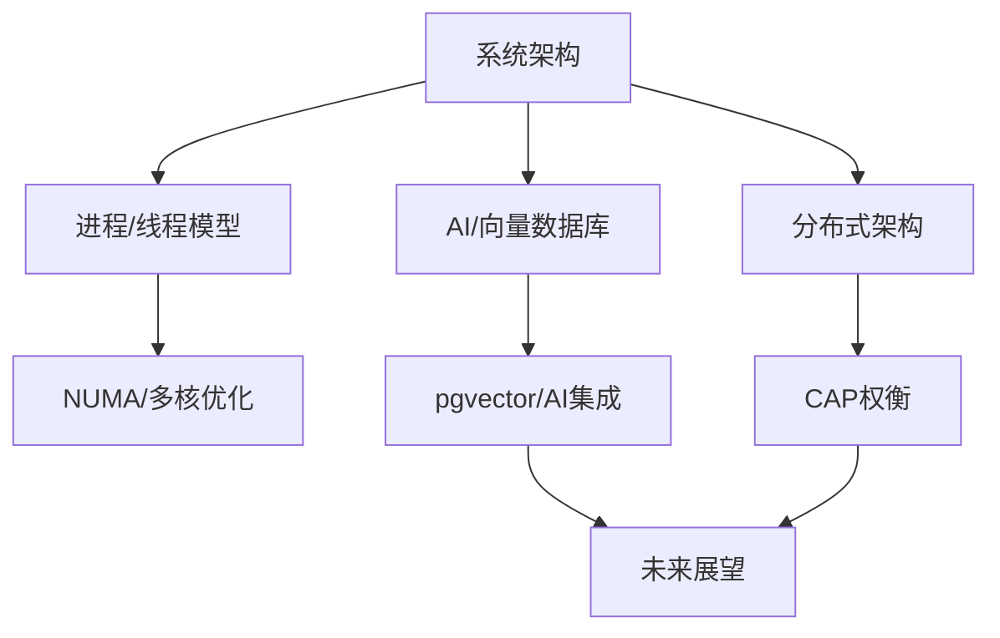

# 1.1.11 PostgreSQL系统设计与现代硬件/AI场景适配性分析

## 目录

- [1.1.11 PostgreSQL系统设计与现代硬件/AI场景适配性分析](#1111-postgresql系统设计与现代硬件ai场景适配性分析)
  - [目录](#目录)
  - [1. 架构层次的形式化建模与证明](#1-架构层次的形式化建模与证明)
    - [1.1 PostgreSQL系统架构mermaid图](#11-postgresql系统架构mermaid图)
    - [1.2 集合论与接口描述](#12-集合论与接口描述)
    - [1.3 定理与证明](#13-定理与证明)
    - [1.4 工程案例](#14-工程案例)
  - [2. 进程模型与线程模型的极限分析](#2-进程模型与线程模型的极限分析)
    - [2.1 理论对比表](#21-理论对比表)
    - [2.2 定理与证明](#22-定理与证明)
    - [2.3 现代硬件下的优劣势分析](#23-现代硬件下的优劣势分析)
    - [2.4 工程案例](#24-工程案例)
  - [3. 分布式架构的理论极限与CAP权衡](#3-分布式架构的理论极限与cap权衡)
    - [3.1 分布式方案的CAP三性分析](#31-分布式方案的cap三性分析)
    - [3.2 分布式事务协议与MVCC结合](#32-分布式事务协议与mvcc结合)
    - [3.3 反例与工程案例](#33-反例与工程案例)
    - [3.4 图表](#34-图表)
  - [4. AI/向量数据库场景下的适配性与优化](#4-ai向量数据库场景下的适配性与优化)
    - [4.1 向量数据类型与索引机制](#41-向量数据类型与索引机制)
    - [4.2 高维检索与ANN理论瓶颈](#42-高维检索与ann理论瓶颈)
    - [4.3 AI推理/训练的高并发与弱一致性](#43-ai推理训练的高并发与弱一致性)
    - [4.4 工程案例](#44-工程案例)
    - [4.5 优化建议与未来方向](#45-优化建议与未来方向)
  - [5. 未来展望](#5-未来展望)
    - [5.1 AI驱动数据库自优化](#51-ai驱动数据库自优化)
    - [5.2 硬件感知调度与异构计算](#52-硬件感知调度与异构计算)
    - [5.3 数据库原生AI融合](#53-数据库原生ai融合)
    - [5.4 未来研究方向](#54-未来研究方向)

## 1. 架构层次的形式化建模与证明

### 1.1 PostgreSQL系统架构mermaid图



### 1.2 集合论与接口描述

- 设系统模块集合$M = \{M_1, M_2, ..., M_n\}$，每个模块$M_i$暴露接口$I_i$。
- 系统整体功能$F = \bigcup_{i=1}^n I_i$。
- 扩展点集合$E = \{e_1, e_2, ..., e_k\}$，满足$E \subseteq F$。

### 1.3 定理与证明

**定理 1.3.1（模块独立性）**：若$M_i$通过接口$I_i$与其他模块交互，则$M_i$可被任意实现$I_i$的$M_i'$替换，系统功能不变。

**证明**：

- $M_i$与其他模块仅通过$I_i$通信，$M_i'$实现$I_i$，则所有对$I_i$的调用行为等价，系统整体功能$F$不变。$\square$

**定理 1.3.2（扩展点覆盖性）**：PostgreSQL扩展点$E$覆盖了数据库核心功能区域。

**证明**：

- $E$包括数据类型、索引、函数、存储过程、外部数据、优化器钩子等，$E \supseteq$核心功能集合。$\square$

### 1.4 工程案例

- 插件化存储引擎（如zheap、cstore_fdw）可无缝替换存储层。
- 自定义索引方法（如GIN、BRIN）通过扩展点集成。

## 2. 进程模型与线程模型的极限分析

### 2.1 理论对比表

| 特性         | 进程模型（PostgreSQL） | 线程模型（MySQL等） |
|--------------|------------------------|---------------------|
| 资源消耗     | 高（每连接独立进程）   | 低（共享内存）      |
| 隔离性       | 强（地址空间隔离）     | 弱（内存共享）      |
| 可扩展性     | 中（受OS进程数限制）   | 高（轻量级线程）    |
| 故障恢复     | 易于单连接回收         | 线程崩溃影响全局    |
| NUMA适配     | 一般                   | 优化空间大          |
| 多核利用     | 依赖OS调度             | 可细粒度调度        |

### 2.2 定理与证明

**定理 2.2.1（隔离性极限）**：进程模型的隔离性优于线程模型。

**证明**：进程拥有独立地址空间，内存错误、崩溃等不会影响其他进程。线程共享内存，单线程崩溃可能破坏全局状态。$\square$

**定理 2.2.2（可扩展性极限）**：线程模型在高并发下理论吞吐量上限高于进程模型。

**证明**：线程上下文切换和创建销毁成本远低于进程，OS对线程的调度更高效。$\square$

### 2.3 现代硬件下的优劣势分析

- NUMA架构下，线程模型可更好地绑定CPU亲和性，减少跨节点访问。
- 多核/超线程环境下，线程模型可实现更细粒度的负载均衡。
- 进程模型适合高安全隔离、低故障扩散场景。

### 2.4 工程案例

**代码示例：PostgreSQL进程池（pgbouncer）配置**
```ini
[databases]
mydb = host=127.0.0.1 dbname=mydb

[pgbouncer]
listen_port = 6432
max_client_conn = 1000
pool_size = 50
```

**代码示例：MySQL线程池参数**
```sql
SET GLOBAL thread_pool_size = 32;
```

**代码示例：Linux NUMA亲和性设置**
```bash
numactl --cpunodebind=0 --membind=0 postgres -D /data/pgdata
```

## 3. 分布式架构的理论极限与CAP权衡

### 3.1 分布式方案的CAP三性分析

| 系统         | 一致性(C) | 可用性(A) | 分区容错性(P) | 典型实现           |
|--------------|-----------|-----------|---------------|--------------------|
| Citus        | 强        | 部分      | 强            | 2PC+同步复制       |
| BDR          | 弱        | 强        | 强            | 多主+冲突解决      |
| Postgres-XL  | 强        | 部分      | 强            | GTM+2PC            |
| CockroachDB  | 强        | 部分      | 强            | MVCC+Raft          |
| TiDB         | 强        | 部分      | 强            | TSO+Percolator     |

### 3.2 分布式事务协议与MVCC结合

**定理 3.2.1（全局快照隔离充要条件）**：分布式系统实现全局快照隔离需满足：

1. 各节点本地快照隔离
2. 全局提交顺序
3. 跨节点快照/提交时间戳一致

**证明**：若不满足任一条件，可能出现跨节点读写不一致。满足时可等价于全局串行调度。$\square$

**定理 3.2.2（CAP不可兼得）**：分布式MVCC系统在网络分区时无法同时保证强一致性和100%可用性。

**证明**：见CAP定理。分区时若保证一致性，部分写入需阻塞，牺牲可用性；若保证可用性，允许本地提交，牺牲全局一致性。$\square$

### 3.3 反例与工程案例

- Citus分布式事务在分区时阻塞写入，牺牲可用性。
- BDR多主允许分区时写入，恢复后需冲突解决，牺牲强一致性。
- CockroachDB通过Raft保证强一致性，但分区时部分写入不可用。

### 3.4 图表



## 4. AI/向量数据库场景下的适配性与优化

### 4.1 向量数据类型与索引机制

- PostgreSQL通过插件（如pgvector）支持向量数据类型（float[], vector等）。
- 支持IVFFlat、HNSW等ANN（近似最近邻）索引。
- SQL示例：

```sql
CREATE TABLE items (id serial PRIMARY KEY, embedding vector(768));
CREATE INDEX ON items USING ivfflat (embedding vector_l2_ops);
```

### 4.2 高维检索与ANN理论瓶颈

- 高维空间下"维度灾难"导致索引效率下降。
- ANN算法（如HNSW、IVF）在高维下查准率与性能权衡：
  - 查准率$P_{recall}$与索引参数、数据分布相关。
  - 理论上，$O(n)$全表扫描在极高维下接近最优。

### 4.3 AI推理/训练的高并发与弱一致性

- AI推理/训练场景下，读多写少、弱一致性容忍度高。
- MVCC/RC隔离级别可满足大部分推理场景需求。
- 批量写入/流式数据需结合分区表、异步写入优化。

### 4.4 工程案例

**代码示例：pgvector向量检索SQL**
```sql
CREATE TABLE items (id serial PRIMARY KEY, embedding vector(768));
CREATE INDEX ON items USING ivfflat (embedding vector_l2_ops);
SELECT id FROM items ORDER BY embedding <-> '[0.1,0.2,...]' LIMIT 5;
```

**代码示例：Python集成AI推理服务**
```python
import psycopg2
import numpy as np
from sentence_transformers import SentenceTransformer

model = SentenceTransformer('all-MiniLM-L6-v2')
conn = psycopg2.connect(...)
text = "example query"
vec = model.encode([text])[0].tolist()
cur = conn.cursor()
cur.execute("SELECT id FROM items ORDER BY embedding <-> %s LIMIT 5", (vec,))
print(cur.fetchall())
```

### 4.5 优化建议与未来方向

- 向量索引参数自适应调优（AI驱动自动化）
- 异构硬件（GPU/TPU）加速向量计算与检索
- 数据库原生支持批量推理与流式AI数据处理

## 5. 未来展望

### 5.1 AI驱动数据库自优化

- 利用机器学习预测负载、自动调整索引、缓存、并发控制参数。
- 智能VACUUM、自动分区、冷热数据分层存储。

### 5.2 硬件感知调度与异构计算

- 数据库调度器感知NUMA、GPU、FPGA等异构硬件，动态分配任务。
- 向量计算、批量推理等操作下，自动切换至GPU/TPU加速。

### 5.3 数据库原生AI融合

- SQL原生支持AI推理（如SELECT ... FROM ... WHERE embedding <-> query_embedding < 0.5）。
- 数据库与AI框架（如PyTorch、TensorFlow、ONNX）深度集成，实现端到端数据-模型-推理闭环。

### 5.4 未来研究方向

- 新型AI原生数据库架构（HTAP+AI、流式AI数据库）。
- 数据库与知识图谱、推理引擎的深度融合。
- 自动化数据库协议验证与自愈能力。

> **注**：本节内容为前沿展望，欢迎持续补充最新学术与工程进展。

## 知识图谱（Mermaid）


---

> 参见：[1.1.10-MVCC与其他并发控制模型对比与极限分析.md](./1.1.10-MVCC与其他并发控制模型对比与极限分析.md)
> 参见：[1.1.12-PostgreSQL与主流数据库系统对比分析.md](./1.1.12-PostgreSQL与主流数据库系统对比分析.md)
