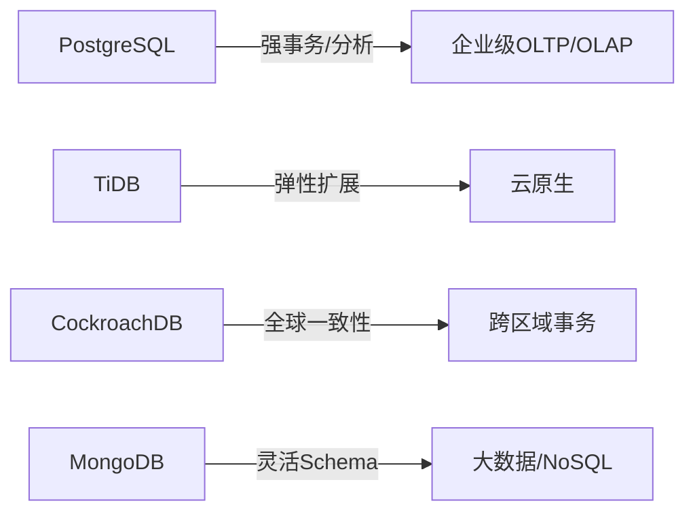
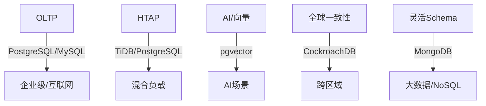
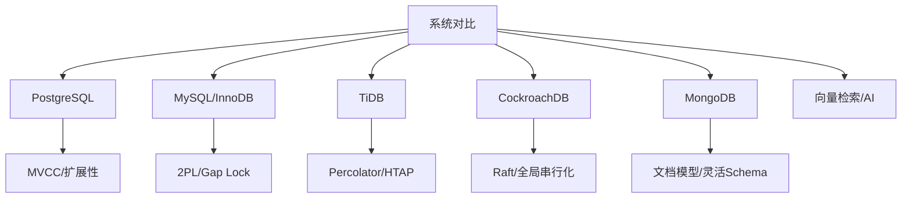
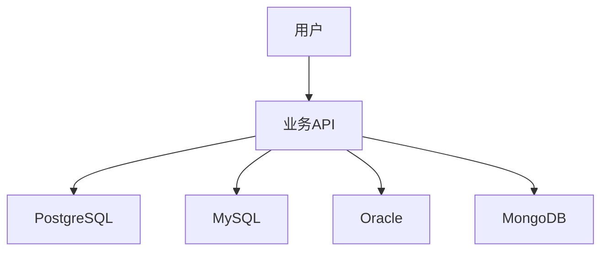

# 1.1.12 PostgreSQL与主流数据库系统对比分析

## 目录

- [1.1.12 PostgreSQL与主流数据库系统对比分析](#1112-postgresql与主流数据库系统对比分析)
  - [目录](#目录)
  - [1. MySQL/InnoDB对比](#1-mysqlinnodb对比)
    - [1.1 MVCC实现差异](#11-mvcc实现差异)
    - [1.2 锁机制](#12-锁机制)
    - [1.3 分布式能力](#13-分布式能力)
    - [1.4 存储引擎](#14-存储引擎)
    - [1.5 工程案例与对比表](#15-工程案例与对比表)
    - [1.6 定理与推论](#16-定理与推论)
  - [2. TiDB对比](#2-tidb对比)
    - [2.1 分布式事务与一致性](#21-分布式事务与一致性)
    - [2.2 调度与存储架构](#22-调度与存储架构)
    - [2.3 事务协议对比](#23-事务协议对比)
    - [2.4 工程案例与对比表](#24-工程案例与对比表)
    - [2.5 定理与推论](#25-定理与推论)
  - [3. CockroachDB对比](#3-cockroachdb对比)
    - [3.1 分布式SQL与架构](#31-分布式sql与架构)
    - [3.2 一致性与事务模型](#32-一致性与事务模型)
    - [3.3 全局事务与隔离级别](#33-全局事务与隔离级别)
    - [3.4 工程案例与对比表](#34-工程案例与对比表)
    - [3.5 定理与推论](#35-定理与推论)
  - [4. MongoDB对比](#4-mongodb对比)
    - [4.1 数据模型与架构](#41-数据模型与架构)
    - [4.2 一致性与事务](#42-一致性与事务)
    - [4.3 分片与扩展机制](#43-分片与扩展机制)
    - [4.4 工程案例与对比表](#44-工程案例与对比表)
    - [4.5 定理与推论](#45-定理与推论)
  - [5. 关键特性、理论极限、工程实现对比](#5-关键特性理论极限工程实现对比)
    - [5.1 多系统核心特性对比表](#51-多系统核心特性对比表)
    - [5.2 理论极限分析](#52-理论极限分析)
    - [5.3 工程实现差异](#53-工程实现差异)
    - [5.4 图表](#54-图表)
  - [6. 适用场景与未来趋势](#6-适用场景与未来趋势)
    - [6.1 典型场景下的系统优劣势](#61-典型场景下的系统优劣势)
    - [6.2 工程建议](#62-工程建议)
    - [6.3 未来趋势](#63-未来趋势)
    - [6.4 图表](#64-图表)
  - [知识图谱（Mermaid）](#知识图谱mermaid)

## 1. MySQL/InnoDB对比

### 1.1 MVCC实现差异

- PostgreSQL：多版本存储于主表，VACUUM清理旧版本。
- InnoDB：多版本通过undo log链表维护，历史版本存于undo页，自动清理。

### 1.2 锁机制

- PostgreSQL：行级锁（MVCC下读不加锁），支持表锁、advisory lock。
- InnoDB：行级锁+间隙锁（Gap Lock），防止幻读，读已提交/可重复读隔离级别。

### 1.3 分布式能力

- PostgreSQL：原生不支持分布式事务，依赖扩展（Citus、XL等）。
- InnoDB：单机为主，分布式需依赖MySQL Group Replication、TiDB等方案。

### 1.4 存储引擎

- PostgreSQL：单一堆表存储，支持插件化表访问方法（如zheap、cstore_fdw）。
- MySQL：多存储引擎（InnoDB、MyISAM、RocksDB等），可按表选择。

### 1.5 工程案例与对比表

| 特性         | PostgreSQL         | MySQL/InnoDB         |
|--------------|--------------------|----------------------|
| MVCC实现     | 主表多版本+VACUUM  | undo log链表         |
| 锁机制       | 行锁/表锁/无Gap锁  | 行锁+间隙锁          |
| 幻读防护     | SI/SSI需显式锁     | Gap Lock自动防护     |
| 分布式能力   | 依赖扩展           | 需外部方案           |
| 存储引擎     | 单一+插件化        | 多引擎可选           |

**代码示例：PostgreSQL与MySQL/InnoDB基本SQL对比**:

```sql
-- PostgreSQL
CREATE TABLE users (id SERIAL PRIMARY KEY, name TEXT);
INSERT INTO users (name) VALUES ('Alice');
SELECT * FROM users WHERE id = 1;

-- MySQL/InnoDB
CREATE TABLE users (id INT AUTO_INCREMENT PRIMARY KEY, name VARCHAR(255));
INSERT INTO users (name) VALUES ('Alice');
SELECT * FROM users WHERE id = 1;
```

### 1.6 定理与推论

**定理 1.6.1**：InnoDB的Gap Lock可防止幻读，但会降低并发度。

**证明**：Gap Lock锁定范围，防止插入/删除导致幻读，但增加锁冲突。$\square$

**推论**：PostgreSQL在高并发读写下吞吐量优于InnoDB，但幻读防护需显式加锁。

## 2. TiDB对比

### 2.1 分布式事务与一致性

- PostgreSQL：原生单机事务，分布式需扩展（Citus/XL）。
- TiDB：原生分布式事务，Percolator协议，支持全局快照隔离（SI）。

### 2.2 调度与存储架构

- PostgreSQL：主从复制/分区表，扩展方案需手动分片。
- TiDB：分布式调度器（PD），自动分片（Region），多副本Raft一致性。

### 2.3 事务协议对比

- PostgreSQL扩展多用2PC，存在阻塞与脑裂风险。
- TiDB采用Percolator，两阶段提交+乐观锁，支持大规模分布式并发。

### 2.4 工程案例与对比表

| 特性         | PostgreSQL         | TiDB                  |
|--------------|--------------------|-----------------------|
| 分布式事务   | 需扩展/2PC         | 原生/Percolator       |
| 一致性模型   | SI/SSI（扩展）     | SI（全局）+Raft强一致 |
| 分片机制     | 手动/扩展          | 自动Region分片        |
| 调度         | 静态/扩展          | 动态/PD调度           |
| 容错         | 依赖扩展           | 多副本Raft            |

**代码示例：TiDB分布式事务SQL**:

```sql
BEGIN PESSIMISTIC;
UPDATE accounts SET balance = balance - 100 WHERE id = 1;
UPDATE accounts SET balance = balance + 100 WHERE id = 2;
COMMIT;
```

### 2.5 定理与推论

**定理 2.5.1**：Percolator协议可在大规模分布式环境下实现全局快照隔离。

**证明**：Percolator通过预写锁+两阶段提交，结合全局时间戳分配，保证所有节点读写一致。$\square$

**推论**：TiDB适合大规模弹性扩展场景，PostgreSQL适合单机/中小规模分布式。

## 3. CockroachDB对比

### 3.1 分布式SQL与架构

- PostgreSQL：单机SQL，分布式需扩展（Citus/XL）。
- CockroachDB：原生分布式SQL，自动分片、全局命名空间。

### 3.2 一致性与事务模型

- PostgreSQL：本地MVCC，扩展分布式需2PC/SSI。
- CockroachDB：全局MVCC+Raft，所有写入需多数副本一致。

### 3.3 全局事务与隔离级别

- PostgreSQL：扩展后支持SI/SSI，分布式串行化需额外协议。
- CockroachDB：原生全局串行化隔离（Serializable），强一致性。

### 3.4 工程案例与对比表

| 特性         | PostgreSQL         | CockroachDB           |
|--------------|--------------------|-----------------------|
| SQL能力      | 单机/扩展          | 原生分布式SQL         |
| 一致性模型   | SI/SSI/扩展        | 全局串行化+Raft       |
| 分片机制     | 手动/扩展          | 自动分片+副本         |
| 容错         | 依赖扩展           | 多副本Raft            |
| 事务隔离     | SI/SSI/扩展        | 全局Serializable      |

**代码示例：CockroachDB分布式SQL**:

```sql
CREATE TABLE bank (id INT PRIMARY KEY, balance DECIMAL);
INSERT INTO bank VALUES (1, 1000), (2, 2000);
BEGIN;
UPDATE bank SET balance = balance - 100 WHERE id = 1;
UPDATE bank SET balance = balance + 100 WHERE id = 2;
COMMIT;
```

### 3.5 定理与推论

**定理 3.5.1**：Raft协议可保证分布式系统中任意时刻只有一个合法提交顺序，实现强一致性。

**证明**：Raft通过选主、日志复制和提交确认，确保所有副本日志顺序一致，提交顺序全局唯一。$\square$

**推论**：CockroachDB适合对强一致性和全局事务隔离有极高要求的分布式场景。

## 4. MongoDB对比

### 4.1 数据模型与架构

- PostgreSQL：关系模型，强模式约束，SQL标准。
- MongoDB：文档模型（BSON），灵活Schema，NoSQL风格。

### 4.2 一致性与事务

- PostgreSQL：强一致性，ACID事务，MVCC。
- MongoDB：默认最终一致性，副本集支持多文档事务（4.0+），但性能受限。

### 4.3 分片与扩展机制

- PostgreSQL：分区表/扩展分片，需手动或依赖Citus等。
- MongoDB：原生分片（Sharding），自动分区与路由，水平扩展。

### 4.4 工程案例与对比表

| 特性         | PostgreSQL         | MongoDB               |
|--------------|--------------------|-----------------------|
| 数据模型     | 关系型             | 文档型（BSON）        |
| 一致性       | 强一致性           | 最终一致性/副本集     |
| 事务         | ACID全支持         | 单文档/多文档(4.0+)   |
| 分片机制     | 分区/扩展          | 原生Sharding          |
| 查询语言     | SQL                | MongoDB Query         |

**代码示例：MongoDB文档操作**:

```javascript
// 插入文档
use testdb
db.users.insertOne({name: "Alice"})
// 查询文档
var user = db.users.findOne({name: "Alice"})
// 更新文档
 db.users.updateOne({name: "Alice"}, {$set: {age: 30}})
```

### 4.5 定理与推论

**定理 4.5.1**：文档模型在灵活性与扩展性上优于关系模型，但难以实现强一致性与复杂事务。

**证明**：文档模型允许动态Schema、嵌套结构，适合非结构化/半结构化数据，但缺乏关系约束与全局事务支持。$\square$

**推论**：MongoDB适合高扩展、灵活Schema、弱一致性场景，PostgreSQL适合强一致性、复杂事务、结构化数据。

## 5. 关键特性、理论极限、工程实现对比

### 5.1 多系统核心特性对比表

| 特性         | PostgreSQL   | MySQL/InnoDB | TiDB        | CockroachDB | MongoDB     |
|--------------|--------------|--------------|-------------|-------------|-------------|
| 数据模型     | 关系型       | 关系型       | 关系型      | 关系型      | 文档型      |
| 一致性       | 强/可串行化  | RC/RR/SI     | SI+Raft     | 全局串行化  | 最终一致性  |
| 事务         | ACID全支持   | ACID全支持   | 分布式ACID  | 分布式ACID  | 单/多文档   |
| 分布式能力   | 扩展/插件    | 外部方案     | 原生        | 原生        | 原生        |
| 分片机制     | 分区/扩展    | 外部         | 自动Region  | 自动分片    | Sharding    |
| 查询语言     | SQL          | SQL          | SQL         | SQL         | Mongo Query |
| 索引类型     | B+树/GIN/BRIN| B+树         | B+树        | B+树        | B树/哈希    |
| 向量检索     | pgvector等   | 外部插件     | 外部        | 外部        | 外部        |

**代码示例：PostgreSQL向量检索SQL**:

```sql
CREATE TABLE items (id serial PRIMARY KEY, embedding vector(768));
CREATE INDEX ON items USING ivfflat (embedding vector_l2_ops);
SELECT id FROM items ORDER BY embedding <-> '[0.1,0.2,...]' LIMIT 5;
```

### 5.2 理论极限分析

- 分布式一致性极限：CAP定理约束，强一致性与高可用不可兼得。
- MVCC存储放大极限：$F = 1 + N \cdot d \cdot p_w$，长事务/高写比例下存储压力大。
- 分片负载均衡极限：理想分片函数$h(r)$需满足$L(S_i) \approx L(S_j)$，否则系统瓶颈受限于最重分片。

### 5.3 工程实现差异

- PostgreSQL：插件化、扩展性强，适合复杂事务与分析。
- MySQL/InnoDB：生态成熟，适合中小型OLTP。
- TiDB：弹性扩展，适合云原生分布式场景。
- CockroachDB：强一致性，适合全球分布式事务。
- MongoDB：灵活Schema，适合非结构化/半结构化数据。

### 5.4 图表



## 6. 适用场景与未来趋势

### 6.1 典型场景下的系统优劣势

| 场景         | PostgreSQL   | MySQL/InnoDB | TiDB        | CockroachDB | MongoDB     |
|--------------|--------------|--------------|-------------|-------------|-------------|
| OLTP         | 优           | 优           | 良          | 良          | 一般        |
| OLAP         | 良           | 一般         | 良          | 一般        | 一般        |
| HTAP         | 良           | 一般         | 优          | 良          | 一般        |
| AI/向量检索  | 良（pgvector）| 一般         | 一般        | 一般        | 一般        |
| 分布式弹性   | 需扩展       | 需外部       | 优          | 优          | 优          |
| 全球一致性   | 需扩展       | 需外部       | 良          | 优          | 一般        |
| 灵活Schema   | 一般         | 一般         | 一般        | 一般        | 优          |

### 6.2 工程建议

- PostgreSQL：适合复杂事务、分析型、AI/向量检索、企业级OLTP/OLAP混合负载。
- MySQL/InnoDB：适合中小型OLTP、互联网应用、生态丰富。
- TiDB：适合云原生、弹性扩展、HTAP混合负载。
- CockroachDB：适合全球分布式、强一致性、跨区域事务。
- MongoDB：适合灵活Schema、大数据、非结构化/半结构化场景。

### 6.3 未来趋势

- HTAP（混合事务与分析）数据库持续发展，PostgreSQL/TiDB等不断增强分析能力。
- AI原生数据库、向量检索、知识图谱等新型场景需求推动数据库创新。
- 分布式、弹性、全球一致性成为主流数据库核心能力。
- 数据库与AI/大数据/流式计算深度融合，自动化、自优化、智能化趋势明显。

### 6.4 图表



## 知识图谱（Mermaid）



---

> 参见：[1.1.8-MVCC高级分析与形式证明.md](./1.1.8-MVCC高级分析与形式证明.md)
> 参见：[1.1.11-PostgreSQL系统设计与现代硬件AI场景适配性分析.md](./1.1.11-PostgreSQL系统设计与现代硬件AI场景适配性分析.md)
> 参见：[1.1.13-未解难题与未来研究方向.md](./1.1.13-未解难题与未来研究方向.md)

## 1.1.12.1 功能对比
| 特性         | PostgreSQL | MySQL | Oracle | SQL Server | MongoDB |
|--------------|------------|-------|--------|------------|---------|
| 事务支持     | ✓          | ✓     | ✓      | ✓          | 部分    |
| 扩展性       | 高         | 中    | 低     | 低         | 高      |
| JSON/数组    | ✓          | 部分  | ✓      | ✓          | ✓       |
| 并发控制     | MVCC       | MVCC  | 锁+MVCC| 锁+MVCC    | OCC     |
| 分布式能力   | FDW/插件   | 低    | RAC    | 复制/镜像  | 高      |

## 1.1.12.2 性能与扩展性
- PostgreSQL在复杂查询、扩展性、数据类型支持上表现突出。
- MySQL适合高并发读写，Oracle/SQL Server适合企业级事务，MongoDB适合大数据与灵活结构。

## 1.1.12.3 行业案例与多表征

### 金融行业：多数据库混合架构


### 互联网行业：PostgreSQL+MongoDB异构数据分析
- 见[3.5.7-数据存储与访问](../../../../3-数据模型与算法/3.5-数据分析与ETL/3.5.7-数据存储与访问.md)

### Latex公式
$$
\text{综合性能}_{PG} > \text{综合性能}_{MySQL}
$$

### 配置示例
```conf
shared_buffers = 8GB
max_connections = 500
```

[返回PostgreSQL导航](README.md)
