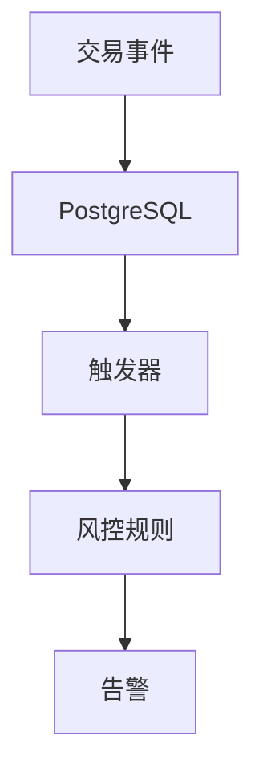

# 1.1.14 实时流处理与CEP

## 目录

- [1.1.14 实时流处理与CEP](#1114-实时流处理与cep)
  - [目录](#目录)
  - [1.1.14.1 流处理架构](#11141-流处理架构)
  - [1.1.14.2 CEP复杂事件处理](#11142-cep复杂事件处理)
  - [1.1.14.3 行业案例与多表征](#11143-行业案例与多表征)
    - [金融行业：实时风控系统](#金融行业实时风控系统)
    - [互联网行业：实时推荐系统](#互联网行业实时推荐系统)
    - [Latex公式](#latex公式)
    - [SQL示例](#sql示例)

## 1.1.14.1 流处理架构

- 基于触发器、通知、外部表的流处理。
- 支持窗口函数、聚合函数等流式SQL。

## 1.1.14.2 CEP复杂事件处理

| 功能 | 说明 | 适用场景 |
|------|------|----------|
| 触发器 | 事件驱动处理 | 实时响应 |
| 通知   | 异步事件通知 | 解耦架构 |
| 窗口函数 | 时间窗口聚合 | 实时分析 |

## 1.1.14.3 行业案例与多表征

### 金融行业：实时风控系统



### 互联网行业：实时推荐系统

- 见[3.5.5-数据流处理与架构](../../../../3-数据模型与算法/3.5-数据分析与ETL/3.5.5-数据流处理与架构.md)

### Latex公式

$$
\text{流处理延迟} = \text{事件接收} + \text{处理时间} + \text{结果输出}
$$

### SQL示例

```sql
CREATE OR REPLACE FUNCTION process_transaction()
RETURNS TRIGGER AS $$
BEGIN
  -- 实时风控逻辑
  IF NEW.amount > 10000 THEN
    INSERT INTO alerts VALUES (NEW.id, 'high_amount');
  END IF;
  RETURN NEW;
END;
$$ LANGUAGE plpgsql;
```

[返回PostgreSQL导航](README.md)
