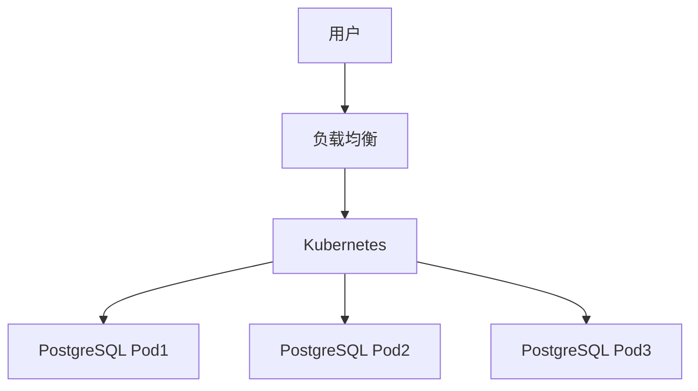

# 1.1.15 云原生与容器化部署

## 1.1.15.1 容器化部署
- Docker容器化、Kubernetes编排。
- 支持水平扩展、自动故障恢复。

## 1.1.15.2 云原生架构
| 特性 | 说明 | 适用场景 |
|------|------|----------|
| 容器化 | Docker镜像部署 | 环境一致性 |
| 编排   | Kubernetes管理 | 自动扩缩容 |
| 服务网格 | Istio流量管理 | 微服务架构 |

## 1.1.15.3 行业案例与多表征

### 互联网行业：Kubernetes集群部署


### 金融行业：云原生高可用架构
- 见[7.3.1-部署流程基础理论](../../../../7-持续集成与演进/7.3-部署流程/7.3.1-部署流程基础理论.md)

### Latex公式
$$
\text{可用性}_{云原生} = 1 - (1-p)^n
$$

### Dockerfile示例
```dockerfile
FROM postgres:15
COPY init.sql /docker-entrypoint-initdb.d/
EXPOSE 5432
```

[返回PostgreSQL导航](README.md) 