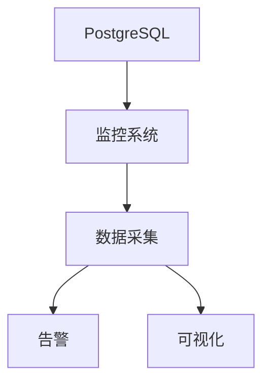

# 1.1.16 性能调优与监控

## 1.1.16.1 性能调优方法
- 参数调优、索引优化、查询重写。
- 硬件资源优化、并发控制调优。

## 1.1.16.2 监控与诊断
| 监控维度 | 指标 | 工具 |
|----------|------|------|
| 性能指标 | QPS、TPS、延迟 | pg_stat_statements |
| 资源使用 | CPU、内存、IO | pg_stat_activity |
| 慢查询   | 执行时间、计划 | EXPLAIN ANALYZE |

## 1.1.16.3 行业案例与多表征

### 互联网行业：性能监控大盘


### 金融行业：性能调优最佳实践
- 见[7.4.1-CI_CD最佳实践](../../../../7-持续集成与演进/7.4-CI_CD/7.4.1-CI_CD最佳实践.md)

### Latex公式
$$
\text{性能提升} = \frac{\text{优化后TPS}}{\text{优化前TPS}}
$$

### 监控查询示例
```sql
SELECT query, calls, total_time, mean_time 
FROM pg_stat_statements 
ORDER BY total_time DESC 
LIMIT 10;
```

[返回PostgreSQL导航](README.md) 