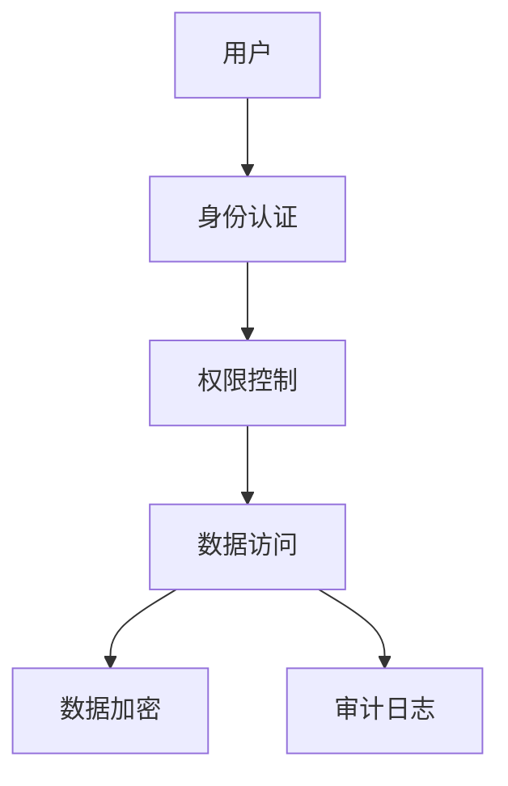

# 1.1.17 安全与合规

## 目录

- [1.1.17 安全与合规](#1117-安全与合规)
  - [目录](#目录)
  - [1.1.17.1 安全机制](#11171-安全机制)
  - [1.1.17.2 合规要求](#11172-合规要求)
  - [1.1.17.3 行业案例与多表征](#11173-行业案例与多表征)
    - [金融行业：数据安全架构](#金融行业数据安全架构)
    - [医疗行业：HIPAA合规](#医疗行业hipaa合规)
    - [Latex公式](#latex公式)
    - [安全配置示例](#安全配置示例)

## 1.1.17.1 安全机制

- 身份认证、权限控制、数据加密。
- 审计日志、行级安全、数据脱敏。

## 1.1.17.2 合规要求

| 合规标准 | 要求 | PostgreSQL支持 |
|----------|------|----------------|
| GDPR     | 数据保护 | 行级安全、加密 |
| SOX      | 审计追踪 | 审计日志 |
| PCI DSS  | 支付安全 | 数据加密 |

## 1.1.17.3 行业案例与多表征

### 金融行业：数据安全架构



### 医疗行业：HIPAA合规

- 见[5.1.1-金融数据科学基础理论](../../../../5-行业应用与场景/5.1-金融数据分析/5.1.1-金融数据科学基础理论.md)

### Latex公式

$$
\text{安全等级} = \text{认证强度} \times \text{加密强度} \times \text{审计完整性}
$$

### 安全配置示例

```sql
-- 行级安全策略
CREATE POLICY user_policy ON users 
FOR ALL USING (user_id = current_user);

-- 审计日志
CREATE TABLE audit_log (
  id serial PRIMARY KEY,
  user_name text,
  action text,
  table_name text,
  timestamp timestamptz
);
```

[返回PostgreSQL导航](README.md)
