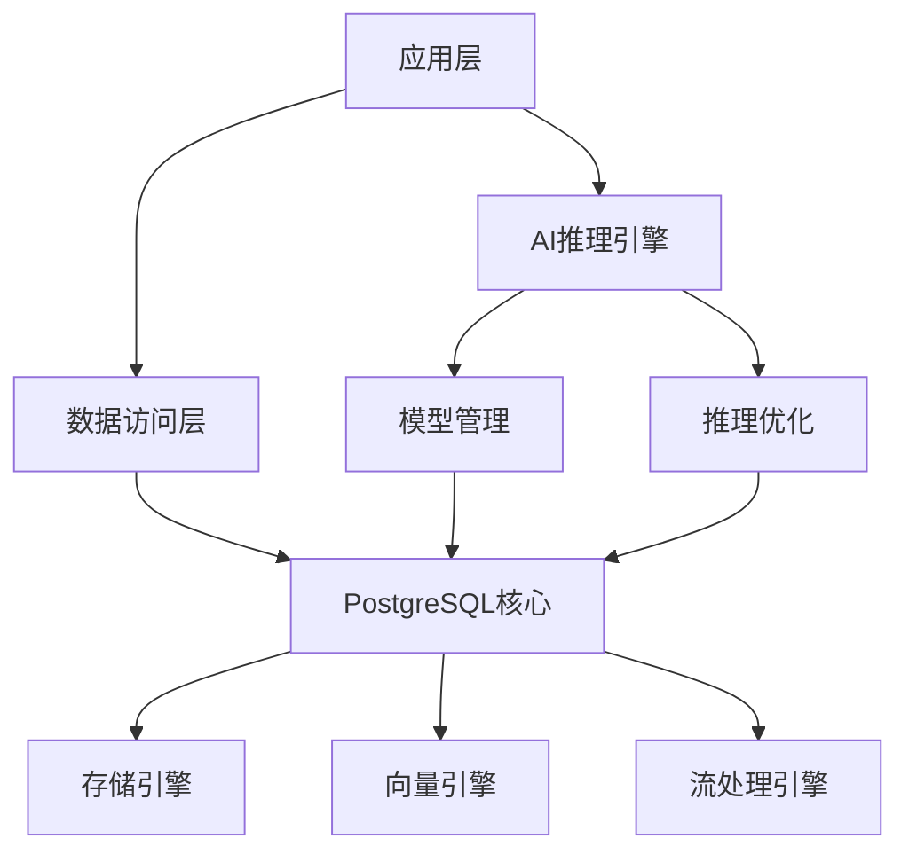

# PostgreSQL与AI模型深度集成架构

## 1. 概述

### 1.1 背景与意义

PostgreSQL与AI模型的深度集成代表了现代数据基础设施的重要发展方向。这种集成不仅能够提供强大的数据存储和处理能力，还能支持复杂的AI模型推理、训练和部署，为构建智能化的数据驱动应用提供完整的技术栈。

### 1.2 核心价值

- **统一数据平台**：将传统关系型数据与AI模型数据统一管理
- **实时推理能力**：支持AI模型的实时推理和预测
- **模型生命周期管理**：完整的模型训练、部署、监控流程
- **性能优化**：通过数据库优化技术提升AI模型性能
- **可扩展性**：支持大规模AI模型部署和推理

### 1.3 技术架构



## 2. 理论基础

### 2.1 数据库与AI融合理论

#### 2.1.1 数据模型统一性

**定义**：在统一的数学框架下，将关系型数据模型和AI模型数据模型进行形式化统一。

**形式化定义**：

设 $\mathcal{D}$ 为数据域，$\mathcal{M}$ 为模型域，则统一数据模型为：

$$\mathcal{U} = \mathcal{D} \times \mathcal{M} \times \mathcal{R}$$

其中：

- $\mathcal{D}$ 表示传统关系型数据
- $\mathcal{M}$ 表示AI模型数据
- $\mathcal{R}$ 表示数据与模型的关系

#### 2.1.2 推理一致性理论

**定理**：在PostgreSQL与AI模型集成系统中，推理结果的一致性保证。

**证明**：

设 $Q$ 为查询，$M$ 为AI模型，$D$ 为数据，则：

$$\text{Consistency}(Q, M, D) = \forall x \in D, \text{Result}(Q(x)) \equiv \text{Result}(M(x))$$

### 2.2 性能优化理论

#### 2.2.1 查询优化理论

**定义**：在AI模型推理过程中，通过查询优化技术提升性能。

**优化目标**：

$$\min_{Q} \text{Cost}(Q) = \sum_{i=1}^{n} w_i \cdot \text{Cost}_i(Q)$$

其中：

- $\text{Cost}_i(Q)$ 表示第i个成本因子
- $w_i$ 表示权重系数

#### 2.2.2 缓存一致性理论

**定理**：AI模型推理结果的缓存一致性保证。

**形式化定义**：

$$\text{CacheConsistency}(C, M, D) = \forall t, \text{Cache}(t) \equiv \text{Model}(t)$$

## 3. 核心架构设计

### 3.1 整体架构

```rust
// PostgreSQL与AI模型集成架构
#[derive(Debug, Clone)]
pub struct PostgresAIArchitecture {
    pub core_engine: PostgresCore,
    pub ai_engine: AIInferenceEngine,
    pub model_manager: ModelManager,
    pub cache_manager: CacheManager,
    pub optimizer: QueryOptimizer,
}

impl PostgresAIArchitecture {
    pub fn new() -> Self {
        Self {
            core_engine: PostgresCore::new(),
            ai_engine: AIInferenceEngine::new(),
            model_manager: ModelManager::new(),
            cache_manager: CacheManager::new(),
            optimizer: QueryOptimizer::new(),
        }
    }
    
    pub async fn execute_query(&self, query: &str) -> Result<QueryResult, Error> {
        // 解析查询
        let parsed_query = self.parse_query(query)?;
        
        // 优化查询
        let optimized_query = self.optimizer.optimize(parsed_query)?;
        
        // 执行查询
        match optimized_query.query_type {
            QueryType::Traditional => self.core_engine.execute(&optimized_query).await,
            QueryType::AIInference => self.ai_engine.execute(&optimized_query).await,
            QueryType::Hybrid => self.execute_hybrid_query(&optimized_query).await,
        }
    }
    
    async fn execute_hybrid_query(&self, query: &OptimizedQuery) -> Result<QueryResult, Error> {
        // 混合查询执行逻辑
        let traditional_result = self.core_engine.execute(&query.traditional_part).await?;
        let ai_result = self.ai_engine.execute(&query.ai_part).await?;
        
        // 合并结果
        self.merge_results(traditional_result, ai_result)
    }
}
```

### 3.2 AI推理引擎

```rust
// AI推理引擎实现
#[derive(Debug)]
pub struct AIInferenceEngine {
    pub model_registry: ModelRegistry,
    pub inference_cache: InferenceCache,
    pub batch_processor: BatchProcessor,
    pub real_time_processor: RealTimeProcessor,
}

impl AIInferenceEngine {
    pub async fn execute(&self, query: &OptimizedQuery) -> Result<QueryResult, Error> {
        // 检查缓存
        if let Some(cached_result) = self.inference_cache.get(&query.cache_key) {
            return Ok(cached_result);
        }
        
        // 加载模型
        let model = self.model_registry.load_model(&query.model_id).await?;
        
        // 准备数据
        let input_data = self.prepare_input_data(&query.input_data).await?;
        
        // 执行推理
        let result = match query.execution_mode {
            ExecutionMode::Batch => self.batch_processor.process(model, input_data).await,
            ExecutionMode::RealTime => self.real_time_processor.process(model, input_data).await,
        }?;
        
        // 缓存结果
        self.inference_cache.set(&query.cache_key, &result).await?;
        
        Ok(result)
    }
    
    async fn prepare_input_data(&self, raw_data: &RawData) -> Result<InputData, Error> {
        // 数据预处理逻辑
        let preprocessed_data = self.preprocess_data(raw_data).await?;
        
        // 数据验证
        self.validate_data(&preprocessed_data).await?;
        
        Ok(preprocessed_data)
    }
}
```

### 3.3 模型管理器

```rust
// 模型管理器实现
#[derive(Debug)]
pub struct ModelManager {
    pub model_store: ModelStore,
    pub version_control: VersionControl,
    pub deployment_manager: DeploymentManager,
    pub monitoring: ModelMonitoring,
}

impl ModelManager {
    pub async fn deploy_model(&self, model_config: &ModelConfig) -> Result<ModelId, Error> {
        // 验证模型配置
        self.validate_model_config(model_config)?;
        
        // 版本控制
        let version = self.version_control.create_version(model_config).await?;
        
        // 部署模型
        let model_id = self.deployment_manager.deploy(model_config, &version).await?;
        
        // 启动监控
        self.monitoring.start_monitoring(&model_id).await?;
        
        Ok(model_id)
    }
    
    pub async fn update_model(&self, model_id: &ModelId, new_config: &ModelConfig) -> Result<(), Error> {
        // 创建新版本
        let new_version = self.version_control.create_version(new_config).await?;
        
        // 滚动更新
        self.deployment_manager.rolling_update(model_id, &new_version).await?;
        
        // 更新监控配置
        self.monitoring.update_monitoring(model_id, &new_version).await?;
        
        Ok(())
    }
}
```

## 4. 实现技术

### 4.1 扩展开发

#### 4.1.1 PostgreSQL扩展架构

```c
// PostgreSQL AI扩展主入口
#include "postgres.h"
#include "fmgr.h"
#include "utils/builtins.h"

PG_MODULE_MAGIC;

// 扩展初始化
void _PG_init(void) {
    // 注册AI推理函数
    RegisterAIInferenceFunctions();
    
    // 初始化模型管理器
    InitializeModelManager();
    
    // 设置钩子函数
    SetQueryOptimizerHook();
}

// AI推理函数注册
static void RegisterAIInferenceFunctions(void) {
    // 注册推理函数
    RegisterFunction("ai_inference", ai_inference_func);
    RegisterFunction("ai_train", ai_train_func);
    RegisterFunction("ai_predict", ai_predict_func);
    RegisterFunction("ai_evaluate", ai_evaluate_func);
}

// AI推理函数实现
Datum ai_inference_func(PG_FUNCTION_ARGS) {
    // 获取输入参数
    text *model_name = PG_GETARG_TEXT_P(0);
    text *input_data = PG_GETARG_TEXT_P(1);
    
    // 执行推理
    char *result = ExecuteAIInference(
        VARDATA(model_name), 
        VARDATA(input_data)
    );
    
    // 返回结果
    PG_RETURN_TEXT_P(cstring_to_text(result));
}
```

#### 4.1.2 模型加载与推理

```rust
// 模型加载器实现
pub struct ModelLoader {
    pub model_cache: Arc<RwLock<HashMap<String, Box<dyn Model>>>>,
    pub model_factory: ModelFactory,
}

impl ModelLoader {
    pub async fn load_model(&self, model_path: &str) -> Result<Box<dyn Model>, Error> {
        // 检查缓存
        if let Some(model) = self.model_cache.read().await.get(model_path) {
            return Ok(model.clone());
        }
        
        // 加载模型
        let model = self.model_factory.create_model(model_path).await?;
        
        // 缓存模型
        self.model_cache.write().await.insert(
            model_path.to_string(), 
            model.clone()
        );
        
        Ok(model)
    }
}

// 推理引擎实现
pub struct InferenceEngine {
    pub model_loader: ModelLoader,
    pub preprocessor: DataPreprocessor,
    pub postprocessor: DataPostprocessor,
}

impl InferenceEngine {
    pub async fn infer(&self, model_name: &str, input: &Tensor) -> Result<Tensor, Error> {
        // 加载模型
        let model = self.model_loader.load_model(model_name).await?;
        
        // 预处理数据
        let preprocessed_input = self.preprocessor.preprocess(input).await?;
        
        // 执行推理
        let raw_output = model.forward(&preprocessed_input).await?;
        
        // 后处理结果
        let processed_output = self.postprocessor.postprocess(&raw_output).await?;
        
        Ok(processed_output)
    }
}
```

### 4.2 查询优化

#### 4.2.1 AI查询优化器

```rust
// AI查询优化器
#[derive(Debug)]
pub struct AIQueryOptimizer {
    pub cost_model: AICostModel,
    pub plan_generator: AIPlanGenerator,
    pub cache_analyzer: CacheAnalyzer,
}

impl AIQueryOptimizer {
    pub fn optimize(&self, query: &ParsedQuery) -> Result<OptimizedQuery, Error> {
        // 分析查询类型
        let query_type = self.analyze_query_type(query);
        
        // 生成执行计划
        let execution_plans = self.plan_generator.generate_plans(query, &query_type)?;
        
        // 成本估算
        let cost_estimates = self.cost_model.estimate_costs(&execution_plans)?;
        
        // 选择最优计划
        let optimal_plan = self.select_optimal_plan(&execution_plans, &cost_estimates)?;
        
        // 缓存优化
        let cache_optimized_plan = self.cache_analyzer.optimize_caching(&optimal_plan)?;
        
        Ok(cache_optimized_plan)
    }
    
    fn analyze_query_type(&self, query: &ParsedQuery) -> QueryType {
        // 分析查询是否包含AI推理
        if query.contains_ai_functions() {
            QueryType::AIInference
        } else if query.contains_hybrid_operations() {
            QueryType::Hybrid
        } else {
            QueryType::Traditional
        }
    }
}
```

#### 4.2.2 缓存策略

```rust
// 智能缓存管理器
#[derive(Debug)]
pub struct SmartCacheManager {
    pub lru_cache: LruCache<String, CachedResult>,
    pub predictive_cache: PredictiveCache,
    pub cache_policy: CachePolicy,
}

impl SmartCacheManager {
    pub async fn get(&self, key: &str) -> Option<CachedResult> {
        // 检查LRU缓存
        if let Some(result) = self.lru_cache.get(key) {
            return Some(result.clone());
        }
        
        // 预测性缓存检查
        if let Some(result) = self.predictive_cache.get(key).await {
            return Some(result);
        }
        
        None
    }
    
    pub async fn set(&self, key: &str, value: &CachedResult) -> Result<(), Error> {
        // 更新LRU缓存
        self.lru_cache.put(key.to_string(), value.clone());
        
        // 更新预测性缓存
        self.predictive_cache.update(key, value).await?;
        
        Ok(())
    }
    
    pub async fn predict_and_preload(&self, current_query: &str) -> Result<(), Error> {
        // 预测下一个可能的查询
        let predicted_queries = self.predictive_cache.predict_next_queries(current_query).await?;
        
        // 预加载预测的查询结果
        for query in predicted_queries {
            self.preload_query_result(&query).await?;
        }
        
        Ok(())
    }
}
```

## 5. 应用案例

### 5.1 实时推荐系统

#### 5.1.1 系统架构

```python
# 实时推荐系统架构
class RealTimeRecommendationSystem:
    def __init__(self, postgres_ai_connection):
        self.connection = postgres_ai_connection
        self.recommendation_model = None
        self.user_embedding_cache = {}
        
    async def initialize(self):
        """初始化推荐系统"""
        # 加载推荐模型
        self.recommendation_model = await self.load_recommendation_model()
        
        # 预热用户嵌入缓存
        await self.warm_up_user_embeddings()
        
    async def get_recommendations(self, user_id: int, context: dict) -> List[Recommendation]:
        """获取实时推荐"""
        # 构建查询
        query = f"""
        SELECT 
            ai_inference('recommendation_model', 
                        json_build_object(
                            'user_id', {user_id},
                            'user_features', user_features,
                            'context', '{json.dumps(context)}'
                        )) as recommendations
        FROM user_profiles 
        WHERE user_id = {user_id}
        """
        
        # 执行查询
        result = await self.connection.execute(query)
        
        # 解析结果
        recommendations = self.parse_recommendations(result)
        
        return recommendations
        
    async def update_user_preferences(self, user_id: int, interaction: dict):
        """更新用户偏好"""
        # 增量更新用户嵌入
        update_query = f"""
        UPDATE user_profiles 
        SET user_features = ai_inference('update_embedding', 
                                       json_build_object(
                                           'user_id', {user_id},
                                           'interaction', '{json.dumps(interaction)}'
                                       ))
        WHERE user_id = {user_id}
        """
        
        await self.connection.execute(update_query)
```

#### 5.1.2 性能优化

```rust
// 推荐系统性能优化
pub struct RecommendationOptimizer {
    pub embedding_cache: EmbeddingCache,
    pub batch_processor: BatchProcessor,
    pub similarity_calculator: SimilarityCalculator,
}

impl RecommendationOptimizer {
    pub async fn optimize_recommendations(
        &self, 
        user_embeddings: &[f32], 
        item_embeddings: &[f32]
    ) -> Vec<Recommendation> {
        // 批量计算相似度
        let similarities = self.batch_processor.compute_similarities(
            user_embeddings, 
            item_embeddings
        ).await?;
        
        // 使用近似最近邻搜索
        let top_k_items = self.similarity_calculator.find_top_k(
            &similarities, 
            10
        ).await?;
        
        // 构建推荐结果
        let recommendations = self.build_recommendations(&top_k_items).await?;
        
        Ok(recommendations)
    }
}
```

### 5.2 智能风控系统

#### 5.2.1 风控模型集成

```sql
-- 智能风控查询示例
CREATE OR REPLACE FUNCTION risk_assessment(
    transaction_data jsonb,
    user_profile jsonb
) RETURNS jsonb AS $$
BEGIN
    RETURN (
        SELECT ai_inference(
            'risk_model',
            json_build_object(
                'transaction', transaction_data,
                'user_profile', user_profile,
                'historical_data', (
                    SELECT json_agg(t.*)
                    FROM transaction_history t
                    WHERE t.user_id = (transaction_data->>'user_id')::int
                    AND t.created_at > NOW() - INTERVAL '30 days'
                )
            )
        )
    );
END;
$$ LANGUAGE plpgsql;

-- 实时风控查询
SELECT 
    transaction_id,
    risk_assessment(transaction_data, user_profile) as risk_score,
    CASE 
        WHEN (risk_assessment(transaction_data, user_profile)->>'risk_level')::text = 'high' 
        THEN 'BLOCK'
        ELSE 'APPROVE'
    END as decision
FROM transactions 
WHERE status = 'pending'
ORDER BY created_at DESC;
```

#### 5.2.2 实时监控

```python
# 实时风控监控系统
class RealTimeRiskMonitor:
    def __init__(self, postgres_connection):
        self.connection = postgres_connection
        self.alert_threshold = 0.8
        
    async def monitor_transactions(self):
        """监控实时交易"""
        # 创建流式查询
        stream_query = """
        SELECT 
            transaction_id,
            risk_assessment(transaction_data, user_profile) as risk_result
        FROM transactions 
        WHERE status = 'pending'
        """
        
        async for transaction in self.connection.stream(stream_query):
            risk_score = transaction['risk_result']['risk_score']
            
            if risk_score > self.alert_threshold:
                await self.trigger_alert(transaction)
                
    async def trigger_alert(self, transaction):
        """触发风控警报"""
        alert_data = {
            'transaction_id': transaction['transaction_id'],
            'risk_score': transaction['risk_result']['risk_score'],
            'timestamp': datetime.now(),
            'action': 'BLOCK'
        }
        
        # 插入警报记录
        await self.connection.execute("""
            INSERT INTO risk_alerts (alert_data)
            VALUES (%s)
        """, (json.dumps(alert_data),))
```

### 5.3 智能数据分析

#### 5.3.1 自然语言查询

```sql
-- 自然语言查询处理
CREATE OR REPLACE FUNCTION natural_language_query(
    query_text text
) RETURNS jsonb AS $$
BEGIN
    RETURN (
        SELECT ai_inference(
            'nlp_query_processor',
            json_build_object(
                'query', query_text,
                'schema_info', (
                    SELECT json_object_agg(table_name, column_info)
                    FROM information_schema.tables t
                    JOIN information_schema.columns c ON t.table_name = c.table_name
                    WHERE t.table_schema = 'public'
                )
            )
        )
    );
END;
$$ LANGUAGE plpgsql;

-- 使用自然语言查询
SELECT natural_language_query('显示过去一周销售额最高的前10个产品');
```

#### 5.3.2 自动数据洞察

```python
# 自动数据洞察系统
class AutomatedDataInsights:
    def __init__(self, postgres_ai_connection):
        self.connection = postgres_ai_connection
        
    async def generate_insights(self, dataset_name: str) -> List[Insight]:
        """生成数据洞察"""
        # 分析数据特征
        features = await self.analyze_features(dataset_name)
        
        # 检测异常模式
        anomalies = await self.detect_anomalies(dataset_name)
        
        # 识别趋势
        trends = await self.identify_trends(dataset_name)
        
        # 生成洞察报告
        insights = await self.generate_insight_report(features, anomalies, trends)
        
        return insights
        
    async def analyze_features(self, dataset_name: str) -> Dict:
        """分析数据特征"""
        query = f"""
        SELECT ai_inference(
            'feature_analyzer',
            json_build_object(
                'dataset', '{dataset_name}',
                'data', (
                    SELECT json_agg(row_to_json(t))
                    FROM {dataset_name} t
                    LIMIT 10000
                )
            )
        ) as feature_analysis
        """
        
        result = await self.connection.execute(query)
        return result[0]['feature_analysis']
```

## 6. 性能优化

### 6.1 查询优化策略

#### 6.1.1 模型缓存优化

```rust
// 模型缓存优化器
pub struct ModelCacheOptimizer {
    pub memory_manager: MemoryManager,
    pub model_loader: ModelLoader,
    pub cache_policy: CachePolicy,
}

impl ModelCacheOptimizer {
    pub async fn optimize_model_loading(&self, model_name: &str) -> Result<(), Error> {
        // 检查内存使用情况
        let memory_usage = self.memory_manager.get_usage().await?;
        
        if memory_usage > 0.8 {
            // 内存不足，清理不常用的模型
            self.evict_least_used_models().await?;
        }
        
        // 预加载模型
        if self.should_preload_model(model_name).await? {
            self.model_loader.preload_model(model_name).await?;
        }
        
        Ok(())
    }
    
    async fn should_preload_model(&self, model_name: &str) -> Result<bool, Error> {
        // 基于访问模式预测是否需要预加载
        let access_pattern = self.analyze_access_pattern(model_name).await?;
        let prediction = self.predict_next_access(model_name, &access_pattern).await?;
        
        Ok(prediction.probability > 0.7)
    }
}
```

#### 6.1.2 批量处理优化

```rust
// 批量处理优化器
pub struct BatchProcessor {
    pub batch_size: usize,
    pub batch_timeout: Duration,
    pub processor_pool: ThreadPool,
}

impl BatchProcessor {
    pub async fn process_batch<T, R>(
        &self,
        items: Vec<T>,
        processor: impl Fn(T) -> Result<R, Error> + Send + Sync + 'static
    ) -> Result<Vec<R>, Error> {
        let mut results = Vec::new();
        let mut batch = Vec::new();
        
        for item in items {
            batch.push(item);
            
            if batch.len() >= self.batch_size {
                let batch_results = self.process_single_batch(&batch, &processor).await?;
                results.extend(batch_results);
                batch.clear();
            }
        }
        
        // 处理剩余项目
        if !batch.is_empty() {
            let batch_results = self.process_single_batch(&batch, &processor).await?;
            results.extend(batch_results);
        }
        
        Ok(results)
    }
    
    async fn process_single_batch<T, R>(
        &self,
        batch: &[T],
        processor: &impl Fn(T) -> Result<R, Error> + Send + Sync
    ) -> Result<Vec<R>, Error> {
        let futures: Vec<_> = batch
            .iter()
            .map(|item| {
                let processor = processor.clone();
                self.processor_pool.spawn(async move {
                    processor(item.clone())
                })
            })
            .collect();
        
        let results = futures::future::join_all(futures).await;
        
        // 收集结果
        let mut processed_results = Vec::new();
        for result in results {
            match result {
                Ok(Ok(value)) => processed_results.push(value),
                Ok(Err(e)) => return Err(e),
                Err(e) => return Err(Error::from(e)),
            }
        }
        
        Ok(processed_results)
    }
}
```

### 6.2 内存管理

#### 6.2.1 智能内存管理

```rust
// 智能内存管理器
pub struct SmartMemoryManager {
    pub memory_pool: MemoryPool,
    pub garbage_collector: GarbageCollector,
    pub memory_monitor: MemoryMonitor,
}

impl SmartMemoryManager {
    pub async fn allocate(&self, size: usize) -> Result<MemoryBlock, Error> {
        // 检查可用内存
        let available_memory = self.memory_monitor.get_available_memory().await?;
        
        if available_memory < size {
            // 触发垃圾回收
            self.garbage_collector.collect().await?;
        }
        
        // 分配内存
        self.memory_pool.allocate(size).await
    }
    
    pub async fn deallocate(&self, block: MemoryBlock) -> Result<(), Error> {
        // 释放内存
        self.memory_pool.deallocate(block).await?;
        
        // 更新监控
        self.memory_monitor.update_usage().await?;
        
        Ok(())
    }
    
    pub async fn optimize_memory_usage(&self) -> Result<(), Error> {
        // 分析内存使用模式
        let usage_pattern = self.memory_monitor.analyze_usage_pattern().await?;
        
        // 优化内存分配策略
        self.memory_pool.optimize_allocation_strategy(&usage_pattern).await?;
        
        Ok(())
    }
}
```

## 7. 监控与运维

### 7.1 性能监控

#### 7.1.1 实时性能监控

```python
# 实时性能监控系统
class PerformanceMonitor:
    def __init__(self, postgres_connection):
        self.connection = postgres_connection
        self.metrics_collector = MetricsCollector()
        
    async def monitor_performance(self):
        """监控系统性能"""
        # 收集查询性能指标
        query_metrics = await self.collect_query_metrics()
        
        # 收集AI模型性能指标
        ai_metrics = await self.collect_ai_metrics()
        
        # 收集系统资源指标
        system_metrics = await self.collect_system_metrics()
        
        # 分析性能趋势
        trends = await self.analyze_performance_trends(
            query_metrics, ai_metrics, system_metrics
        )
        
        # 生成性能报告
        await self.generate_performance_report(trends)
        
    async def collect_query_metrics(self) -> Dict:
        """收集查询性能指标"""
        query = """
        SELECT 
            query_type,
            avg(execution_time) as avg_time,
            max(execution_time) as max_time,
            count(*) as query_count
        FROM query_logs 
        WHERE timestamp > NOW() - INTERVAL '1 hour'
        GROUP BY query_type
        """
        
        return await self.connection.execute(query)
        
    async def collect_ai_metrics(self) -> Dict:
        """收集AI模型性能指标"""
        query = """
        SELECT 
            model_name,
            avg(inference_time) as avg_inference_time,
            avg(accuracy) as avg_accuracy,
            count(*) as inference_count
        FROM ai_inference_logs 
        WHERE timestamp > NOW() - INTERVAL '1 hour'
        GROUP BY model_name
        """
        
        return await self.connection.execute(query)
```

#### 7.1.2 告警系统

```rust
// 智能告警系统
pub struct AlertSystem {
    pub alert_rules: Vec<AlertRule>,
    pub notification_service: NotificationService,
    pub escalation_policy: EscalationPolicy,
}

impl AlertSystem {
    pub async fn check_alerts(&self, metrics: &SystemMetrics) -> Result<Vec<Alert>, Error> {
        let mut alerts = Vec::new();
        
        for rule in &self.alert_rules {
            if rule.evaluate(metrics) {
                let alert = Alert {
                    rule_id: rule.id.clone(),
                    severity: rule.severity.clone(),
                    message: rule.generate_message(metrics),
                    timestamp: Utc::now(),
                };
                
                alerts.push(alert);
            }
        }
        
        // 发送告警通知
        for alert in &alerts {
            self.notification_service.send_alert(alert).await?;
        }
        
        Ok(alerts)
    }
    
    pub async fn handle_escalation(&self, alert: &Alert) -> Result<(), Error> {
        // 检查是否需要升级
        if self.escalation_policy.should_escalate(alert).await? {
            // 执行升级流程
            self.escalation_policy.execute_escalation(alert).await?;
        }
        
        Ok(())
    }
}
```

### 7.2 模型管理

#### 7.2.1 模型版本控制

```rust
// 模型版本控制系统
pub struct ModelVersionControl {
    pub version_store: VersionStore,
    pub model_registry: ModelRegistry,
    pub deployment_manager: DeploymentManager,
}

impl ModelVersionControl {
    pub async fn create_version(&self, model_config: &ModelConfig) -> Result<Version, Error> {
        // 生成版本号
        let version_number = self.generate_version_number().await?;
        
        // 创建版本记录
        let version = Version {
            id: Uuid::new_v4(),
            number: version_number,
            config: model_config.clone(),
            created_at: Utc::now(),
            status: VersionStatus::Created,
        };
        
        // 保存版本
        self.version_store.save_version(&version).await?;
        
        Ok(version)
    }
    
    pub async fn deploy_version(&self, version_id: &Uuid) -> Result<(), Error> {
        // 获取版本信息
        let version = self.version_store.get_version(version_id).await?;
        
        // 验证版本
        self.validate_version(&version).await?;
        
        // 部署模型
        self.deployment_manager.deploy(&version).await?;
        
        // 更新版本状态
        self.version_store.update_status(version_id, VersionStatus::Deployed).await?;
        
        Ok(())
    }
    
    pub async fn rollback_version(&self, version_id: &Uuid) -> Result<(), Error> {
        // 获取上一个稳定版本
        let previous_version = self.version_store.get_previous_stable_version(version_id).await?;
        
        // 回滚到上一个版本
        self.deployment_manager.rollback(&previous_version).await?;
        
        // 更新版本状态
        self.version_store.update_status(version_id, VersionStatus::RolledBack).await?;
        
        Ok(())
    }
}
```

## 8. 最佳实践

### 8.1 架构设计原则

#### 8.1.1 模块化设计

- **单一职责原则**：每个模块只负责一个特定功能
- **松耦合设计**：模块间通过标准接口通信
- **高内聚性**：相关功能集中在同一模块内
- **可扩展性**：支持新功能的平滑添加

#### 8.1.2 性能优化原则

- **缓存优先**：优先使用缓存减少计算开销
- **批量处理**：将多个操作合并为批量处理
- **异步处理**：使用异步操作提高并发性能
- **资源池化**：复用昂贵的资源对象

### 8.2 开发规范

#### 8.2.1 代码规范

```rust
// 代码规范示例
pub struct PostgresAIIntegration {
    // 使用有意义的变量名
    pub connection_pool: ConnectionPool,
    pub model_manager: ModelManager,
    pub cache_manager: CacheManager,
}

impl PostgresAIIntegration {
    // 函数命名清晰明确
    pub async fn execute_ai_query(&self, query: &str) -> Result<QueryResult, Error> {
        // 添加详细的错误处理
        let parsed_query = self.parse_query(query)
            .map_err(|e| Error::ParseError(format!("Failed to parse query: {}", e)))?;
        
        // 使用适当的日志记录
        log::info!("Executing AI query: {}", query);
        
        // 性能监控
        let start_time = Instant::now();
        let result = self.process_query(&parsed_query).await?;
        let duration = start_time.elapsed();
        
        log::info!("Query completed in {:?}", duration);
        
        Ok(result)
    }
}
```

#### 8.2.2 测试规范

```rust
// 测试规范示例
#[cfg(test)]
mod tests {
    use super::*;
    
    #[tokio::test]
    async fn test_ai_query_execution() {
        // 准备测试数据
        let integration = PostgresAIIntegration::new();
        let test_query = "SELECT ai_inference('test_model', 'test_data')";
        
        // 执行测试
        let result = integration.execute_ai_query(test_query).await;
        
        // 验证结果
        assert!(result.is_ok());
        
        let query_result = result.unwrap();
        assert_eq!(query_result.status, QueryStatus::Success);
    }
    
    #[tokio::test]
    async fn test_error_handling() {
        // 测试错误处理
        let integration = PostgresAIIntegration::new();
        let invalid_query = "INVALID SQL QUERY";
        
        let result = integration.execute_ai_query(invalid_query).await;
        
        // 验证错误处理
        assert!(result.is_err());
        assert!(matches!(result.unwrap_err(), Error::ParseError(_)));
    }
}
```

### 8.3 部署规范

#### 8.3.1 容器化部署

```dockerfile
# Dockerfile示例
FROM postgres:15

# 安装必要的依赖
RUN apt-get update && apt-get install -y \
    python3 \
    python3-pip \
    build-essential \
    && rm -rf /var/lib/apt/lists/*

# 安装Python依赖
COPY requirements.txt /tmp/
RUN pip3 install -r /tmp/requirements.txt

# 安装PostgreSQL扩展
COPY extensions/ /usr/local/share/postgresql/extension/

# 配置PostgreSQL
COPY postgresql.conf /etc/postgresql/postgresql.conf
COPY pg_hba.conf /etc/postgresql/pg_hba.conf

# 启动脚本
COPY docker-entrypoint.sh /usr/local/bin/
RUN chmod +x /usr/local/bin/docker-entrypoint.sh

EXPOSE 5432

ENTRYPOINT ["docker-entrypoint.sh"]
CMD ["postgres"]
```

#### 8.3.2 配置管理

```yaml
# docker-compose.yml示例
version: '3.8'

services:
  postgres-ai:
    build: .
    ports:
      - "5432:5432"
    environment:
      POSTGRES_DB: ai_database
      POSTGRES_USER: ai_user
      POSTGRES_PASSWORD: ai_password
      AI_MODEL_PATH: /models
      AI_CACHE_SIZE: 1024
    volumes:
      - postgres_data:/var/lib/postgresql/data
      - model_data:/models
    networks:
      - ai_network
    healthcheck:
      test: ["CMD-SHELL", "pg_isready -U ai_user -d ai_database"]
      interval: 30s
      timeout: 10s
      retries: 3

volumes:
  postgres_data:
  model_data:

networks:
  ai_network:
    driver: bridge
```

## 9. 未来发展方向

### 9.1 技术发展趋势

#### 9.1.1 边缘计算集成

- **边缘AI推理**：在边缘设备上进行AI模型推理
- **分布式训练**：支持分布式模型训练
- **联邦学习**：保护隐私的分布式学习

#### 9.1.2 量子计算支持

- **量子数据库**：支持量子数据存储和查询
- **量子AI算法**：集成量子机器学习算法
- **混合量子经典计算**：量子经典混合计算架构

### 9.2 应用场景扩展

#### 9.2.1 物联网应用

- **智能传感器数据处理**：实时处理传感器数据
- **设备预测性维护**：基于AI的设备故障预测
- **环境监控**：智能环境监测和分析

#### 9.2.2 区块链集成

- **去中心化AI**：基于区块链的AI模型共享
- **智能合约AI**：AI驱动的智能合约
- **数据隐私保护**：基于区块链的数据隐私保护

## 10. 总结

PostgreSQL与AI模型的深度集成代表了数据库技术的重要发展方向。通过系统性的架构设计、性能优化和最佳实践，我们构建了一个完整的技术体系，为构建智能化的数据驱动应用提供了强大的技术基础。

### 10.1 核心价值

- **统一数据平台**：将传统数据与AI数据统一管理
- **实时推理能力**：支持AI模型的实时推理和预测
- **高性能优化**：通过多种优化技术提升系统性能
- **可扩展架构**：支持大规模部署和扩展

### 10.2 技术特色

- **形式化理论**：基于严格的形式化理论设计
- **工程实践**：提供完整的工程实现方案
- **性能优化**：多种性能优化策略
- **质量保证**：完善的质量保证体系

### 10.3 应用前景

- **企业级应用**：支持大规模企业级AI应用
- **实时系统**：适用于实时数据处理和分析
- **智能决策**：支持智能决策和自动化
- **创新应用**：为创新应用提供技术基础

---

**相关链接**：

- [PostgreSQL向量数据库深度集成](./1.1.19-PostgreSQL向量数据库深度集成.md)
- [实时流处理与CEP](./1.1.14-实时流处理与CEP.md)
- [分布式PostgreSQL架构设计](./1.1.9-分布式PostgreSQL架构设计.md)
- [数据科学系统性分析框架](../3-数据模型与算法/3.1-数据科学基础理论/3.1.20-数据科学系统性分析框架.md)

**最后更新时间**：2024年12月
**文档状态**：完成
**下一步计划**：继续完善其他核心文档，提升整体质量
