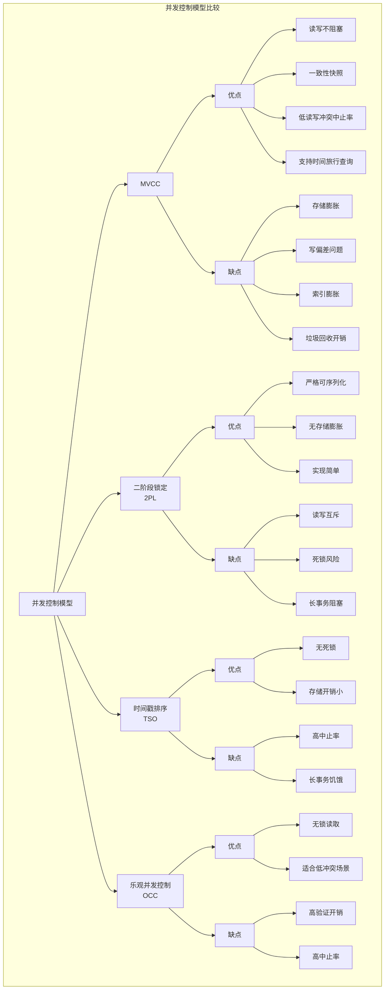
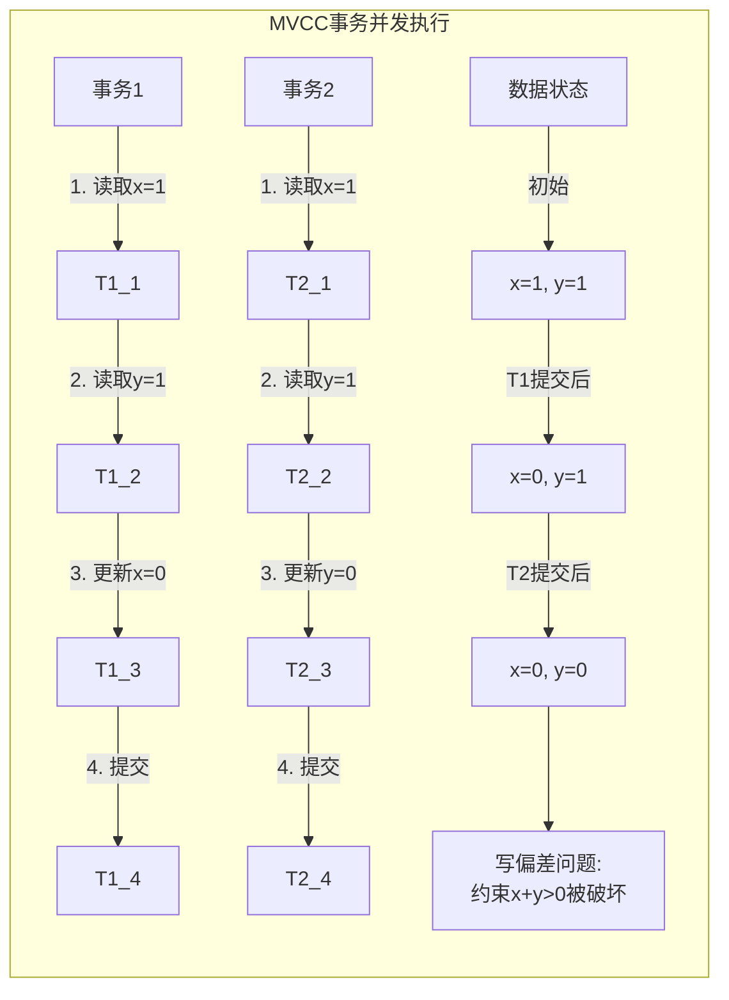
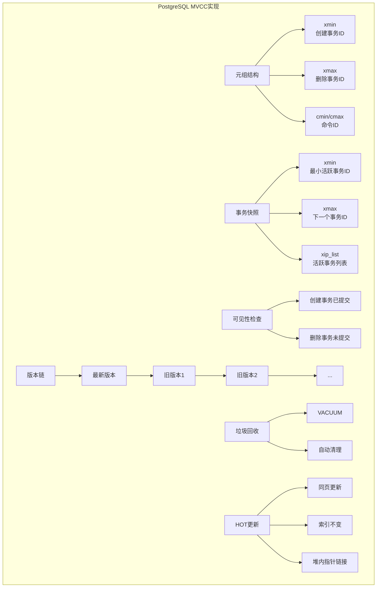
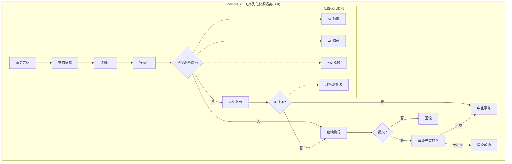
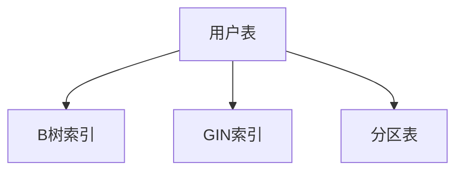

# 1.1.3 PostgreSQL数据模型

## 目录

- [1.1.3 PostgreSQL数据模型](#113-postgresql数据模型)
  - [目录](#目录)
  - [1. 概述](#1-概述)
  - [2. 关系模型基础](#2-关系模型基础)
    - [2.1 基本概念](#21-基本概念)
    - [2.2 关系运算](#22-关系运算)
  - [3. 类型系统](#3-类型系统)
    - [3.1 基本类型](#31-基本类型)
    - [3.2 复合类型](#32-复合类型)
    - [3.3 特殊类型](#33-特殊类型)
  - [4. JSON与半结构化数据](#4-json与半结构化数据)
    - [4.1 JSON类型](#41-json类型)
    - [4.2 JSON操作符和函数](#42-json操作符和函数)
    - [4.3 JSON索引](#43-json索引)
  - [5. 继承与分区](#5-继承与分区)
    - [5.1 表继承](#51-表继承)
    - [5.2 表分区](#52-表分区)
  - [6. 扩展与自定义类型](#6-扩展与自定义类型)
    - [6.1 自定义类型](#61-自定义类型)
    - [6.2 扩展系统](#62-扩展系统)
  - [7. 约束与完整性](#7-约束与完整性)
    - [7.1 约束类型](#71-约束类型)
    - [7.2 触发器](#72-触发器)
    - [7.3 规则系统](#73-规则系统)
  - [8. MVCC数据模型分析](#8-mvcc数据模型分析)
    - [8.1 MVCC形式化定义](#81-mvcc形式化定义)
    - [8.2 MVCC与其他并发控制模型比较](#82-mvcc与其他并发控制模型比较)
      - [8.2.1 MVCC与二阶段锁定(2PL)比较](#821-mvcc与二阶段锁定2pl比较)
      - [8.2.2 MVCC与时间戳排序(TSO)比较](#822-mvcc与时间戳排序tso比较)
      - [8.2.3 MVCC与乐观并发控制(OCC)比较](#823-mvcc与乐观并发控制occ比较)
    - [8.3 MVCC的系统级优缺点分析](#83-mvcc的系统级优缺点分析)
      - [8.3.1 优点](#831-优点)
      - [8.3.2 缺点](#832-缺点)
    - [8.4 MVCC在PostgreSQL中的实现特点](#84-mvcc在postgresql中的实现特点)
    - [8.5 结论](#85-结论)
    - [8.6 PostgreSQL的可序列化快照隔离(SSI)](#86-postgresql的可序列化快照隔离ssi)
      - [8.6.1 SSI原理](#861-ssi原理)
      - [8.6.2 SSI与传统MVCC比较](#862-ssi与传统mvcc比较)
      - [8.6.3 SSI在PostgreSQL中的实现](#863-ssi在postgresql中的实现)
  - [参考文献](#参考文献)
  - [1.1.3.1 表结构设计](#1131-表结构设计)
  - [1.1.3.2 索引与分区](#1132-索引与分区)
  - [1.1.3.3 行业案例与多表征](#1133-行业案例与多表征)
    - [互联网行业：JSON数据存储](#互联网行业json数据存储)
    - [金融行业：分区表设计](#金融行业分区表设计)
    - [Mermaid索引结构图](#mermaid索引结构图)
    - [Latex公式](#latex公式)

## 1. 概述

PostgreSQL的数据模型建立在关系模型基础上，但通过其强大的类型系统和可扩展性，远远超越了传统关系数据库的能力。
本文从数据模型角度分析PostgreSQL的核心特性，特别是其类型系统、JSON支持和可扩展性。

## 2. 关系模型基础

PostgreSQL严格遵循关系模型，同时进行了多项扩展和增强。

### 2.1 基本概念

**定义 2.1.1** (数据库)：PostgreSQL中的数据库是一个命名的模式集合，物理上隔离，逻辑上独立。

**定义 2.1.2** (模式)：模式是数据库中的命名空间，包含表、视图、函数等数据库对象。

**定义 2.1.3** (表)：表是关系的物理表示，由行和列组成。

**定义 2.1.4** (视图)：视图是存储的查询，表现为虚拟表。

### 2.2 关系运算

PostgreSQL实现了完整的关系代数运算，包括：

**定义 2.2.1** (选择)：通过WHERE子句实现。

```sql
SELECT * FROM employees WHERE department = 'Engineering';
```

**定义 2.2.2** (投影)：通过SELECT子句中的列列表实现。

```sql
SELECT first_name, last_name FROM employees;
```

**定义 2.2.3** (连接)：通过JOIN子句实现。

```sql
SELECT e.name, d.name 
FROM employees e JOIN departments d ON e.dept_id = d.id;
```

**定义 2.2.4** (集合操作)：通过UNION、INTERSECT、EXCEPT实现。

```sql
SELECT id FROM table1
UNION
SELECT id FROM table2;
```

## 3. 类型系统

PostgreSQL拥有丰富的内置类型系统，并支持自定义类型。

### 3.1 基本类型

**定义 3.1.1** (数值类型)：

- `smallint`：2字节整数
- `integer`：4字节整数
- `bigint`：8字节整数
- `numeric(p,s)`：精确小数，p位精度，s位小数
- `real`：4字节浮点数
- `double precision`：8字节浮点数

**定义 3.1.2** (字符类型)：

- `char(n)`：固定长度字符串
- `varchar(n)`：可变长度字符串，最大n字符
- `text`：无限长度字符串

**定义 3.1.3** (日期时间类型)：

- `date`：日期
- `time`：时间
- `timestamp`：日期和时间
- `interval`：时间间隔

**定义 3.1.4** (布尔类型)：

- `boolean`：true/false

### 3.2 复合类型

**定义 3.2.1** (数组)：任何基本类型都可以定义为一维或多维数组。

```sql
CREATE TABLE measurements (
    id serial PRIMARY KEY,
    readings integer[]  -- 整数数组
);

INSERT INTO measurements (readings) VALUES ('{1, 2, 3}');
SELECT readings[2] FROM measurements;  -- 访问第二个元素
```

**定义 3.2.2** (复合类型)：用户定义的结构类型。

```sql
CREATE TYPE address AS (
    street text,
    city text,
    zip varchar(10)
);

CREATE TABLE contacts (
    id serial PRIMARY KEY,
    name text,
    home_address address
);
```

**定义 3.2.3** (范围类型)：表示值的范围。

```sql
CREATE TABLE reservations (
    room_id integer,
    during tsrange  -- 时间戳范围
);

-- 检查是否有重叠的预订
SELECT * FROM reservations
WHERE during && tsrange('2023-01-01', '2023-01-03');
```

**定义 3.2.4** (域类型)：带约束的基本类型。

```sql
CREATE DOMAIN positive_int AS integer
    CHECK (VALUE > 0);
    
CREATE TABLE products (
    id serial PRIMARY KEY,
    quantity positive_int  -- 使用域类型
);
```

### 3.3 特殊类型

**定义 3.3.1** (几何类型)：

- `point`：平面上的点
- `line`：无限直线
- `lseg`：有限线段
- `box`：矩形框
- `path`：闭合或开放路径
- `polygon`：多边形
- `circle`：圆

**定义 3.3.2** (网络地址类型)：

- `inet`：IPv4或IPv6地址
- `cidr`：IPv4或IPv6网络
- `macaddr`：MAC地址

**定义 3.3.3** (全文搜索类型)：

- `tsvector`：文档向量
- `tsquery`：查询表达式

## 4. JSON与半结构化数据

PostgreSQL提供了强大的JSON支持，使其能够处理半结构化数据。

### 4.1 JSON类型

**定义 4.1.1** (json类型)：存储JSON数据的文本表示。

**定义 4.1.2** (jsonb类型)：存储JSON数据的二进制表示，支持索引和高效查询。

```sql
CREATE TABLE documents (
    id serial PRIMARY KEY,
    data jsonb
);

INSERT INTO documents (data) VALUES ('{"name": "John", "tags": ["student", "math"]}');
```

### 4.2 JSON操作符和函数

**定义 4.2.1** (路径提取操作符)：

- `->` 获取JSON对象字段（返回JSON）
- `->>` 获取JSON对象字段（返回文本）
- `#>` 获取JSON路径（返回JSON）
- `#>>` 获取JSON路径（返回文本）

```sql
-- 获取name字段的值
SELECT data->>'name' FROM documents;

-- 获取第一个标签
SELECT data->'tags'->0 FROM documents;

-- 使用路径表达式
SELECT data#>>'{tags,0}' FROM documents;
```

**定义 4.2.2** (JSON包含操作符)：

- `@>` 左JSON包含右JSON
- `<@` 左JSON被右JSON包含
- `?` JSON中是否存在键
- `?|` JSON中是否存在任一键
- `?&` JSON中是否存在所有键

```sql
-- 查找包含特定标签的文档
SELECT * FROM documents WHERE data @> '{"tags": ["math"]}';

-- 查找包含特定键的文档
SELECT * FROM documents WHERE data ? 'name';
```

### 4.3 JSON索引

**定义 4.3.1** (GIN索引)：广义倒排索引，适用于jsonb类型。

```sql
-- 创建GIN索引以加速包含操作符查询
CREATE INDEX idx_documents_data ON documents USING GIN (data);

-- 创建特定路径的GIN索引
CREATE INDEX idx_documents_tags ON documents USING GIN ((data->'tags'));
```

## 5. 继承与分区

PostgreSQL支持表继承和表分区，提供了数据组织的灵活性。

### 5.1 表继承

**定义 5.1.1** (继承表)：一个表可以继承另一个表的列，形成父子关系。

```sql
CREATE TABLE cities (
    name text,
    population integer,
    elevation integer
);

CREATE TABLE capitals (
    state char(2)
) INHERITS (cities);

-- 查询父表会包含所有子表数据
SELECT * FROM cities;

-- 仅查询父表数据
SELECT * FROM ONLY cities;
```

### 5.2 表分区

**定义 5.2.1** (声明式分区)：将大表分割成较小的物理部分，提高查询性能。

```sql
-- 创建分区表
CREATE TABLE measurements (
    logdate date not null,
    peaktemp integer,
    unitsales integer
) PARTITION BY RANGE (logdate);

-- 创建分区
CREATE TABLE measurements_y2021 PARTITION OF measurements
    FOR VALUES FROM ('2021-01-01') TO ('2022-01-01');
    
CREATE TABLE measurements_y2022 PARTITION OF measurements
    FOR VALUES FROM ('2022-01-01') TO ('2023-01-01');
```

**定义 5.2.2** (分区类型)：

- 范围分区（RANGE）：基于列值范围分区
- 列表分区（LIST）：基于列值列表分区
- 哈希分区（HASH）：基于列值哈希分区

## 6. 扩展与自定义类型

PostgreSQL的可扩展性是其核心特性之一，允许用户定义新的数据类型和函数。

### 6.1 自定义类型

**定义 6.1.1** (基本自定义类型)：使用CREATE TYPE创建新类型。

```sql
-- 创建枚举类型
CREATE TYPE mood AS ENUM ('sad', 'ok', 'happy');

-- 创建复合类型
CREATE TYPE complex AS (
    r double precision,
    i double precision
);
```

**定义 6.1.2** (基类型)：使用C语言扩展创建完全新的基本类型。

### 6.2 扩展系统

**定义 6.2.1** (扩展)：打包的SQL对象集合，可以作为单个单元安装。

```sql
-- 安装扩展
CREATE EXTENSION postgis;

-- 查看已安装扩展
SELECT * FROM pg_extension;
```

**定义 6.2.2** (常用扩展)：

- PostGIS：地理信息系统扩展
- pgcrypto：加密函数
- pg_trgm：文本相似度搜索
- hstore：键值对存储
- uuid-ossp：UUID生成
- pg_stat_statements：SQL语句统计

## 7. 约束与完整性

PostgreSQL提供多种机制确保数据完整性。

### 7.1 约束类型

**定义 7.1.1** (主键约束)：唯一标识表中的行。

```sql
CREATE TABLE products (
    id serial PRIMARY KEY,
    name text NOT NULL
);
```

**定义 7.1.2** (外键约束)：确保引用完整性。

```sql
CREATE TABLE orders (
    id serial PRIMARY KEY,
    product_id integer REFERENCES products(id),
    quantity integer
);
```

**定义 7.1.3** (唯一约束)：确保列或列组合的值唯一。

```sql
CREATE TABLE users (
    id serial PRIMARY KEY,
    email text UNIQUE,
    name text
);
```

**定义 7.1.4** (检查约束)：确保列值满足指定条件。

```sql
CREATE TABLE products (
    id serial PRIMARY KEY,
    price numeric CHECK (price > 0),
    discount numeric CHECK (discount >= 0 AND discount <= 1)
);
```

**定义 7.1.5** (非空约束)：确保列不包含NULL值。

```sql
CREATE TABLE employees (
    id serial PRIMARY KEY,
    name text NOT NULL,
    hire_date date NOT NULL
);
```

### 7.2 触发器

**定义 7.2.1** (触发器)：在表上的特定事件发生时自动执行的函数。

```sql
-- 创建触发器函数
CREATE OR REPLACE FUNCTION update_modified_column()
RETURNS TRIGGER AS $$
BEGIN
    NEW.modified = now();
    RETURN NEW;
END;
$$ LANGUAGE plpgsql;

-- 创建触发器
CREATE TRIGGER update_customer_modtime
BEFORE UPDATE ON customers
FOR EACH ROW
EXECUTE FUNCTION update_modified_column();
```

### 7.3 规则系统

**定义 7.3.1** (规则)：用于重写查询的规则。

```sql
-- 创建规则实现视图的可更新性
CREATE RULE update_view AS
ON UPDATE TO customer_view DO INSTEAD
UPDATE customers SET name = NEW.name
WHERE id = OLD.id;
```

## 8. MVCC数据模型分析

PostgreSQL的多版本并发控制(MVCC)是其核心特性之一，本节将从形式化角度分析MVCC模型与其他并发控制模型的比较。

### 8.1 MVCC形式化定义

**定义 8.1.1** (多版本数据库)：一个多版本数据库 $D$ 是一个元组集合 $D = \{(x, v, t_s, t_e) | x \text{ 是数据项}, v \text{ 是值}, t_s \text{ 是开始时间戳}, t_e \text{ 是结束时间戳}\}$。

**定义 8.1.2** (事务)：事务 $T$ 是一个操作序列 $T = \{op_1, op_2, ..., op_n\}$，其中每个操作 $op_i$ 可以是读取 $r(x)$ 或写入 $w(x)$。

**定义 8.1.3** (事务时间戳)：每个事务 $T$ 被分配一个唯一的时间戳 $ts(T)$。

**定义 8.1.4** (版本可见性)：对于事务 $T$ 和数据项版本 $(x, v, t_s, t_e)$，该版本对 $T$ 可见当且仅当 $t_s < ts(T) \leq t_e$。

**定理 8.1.1** (MVCC可序列化)：在快照隔离下，如果没有写偏差，则事务执行是可序列化的。

**证明**：
假设存在事务集合 $\{T_1, T_2, ..., T_n\}$，每个事务在时间戳 $ts(T_i)$ 获取快照。构造序列化顺序 $S$ 按照事务提交时间戳排序。如果不存在写偏差，则可以证明这个顺序是正确的序列化顺序。

反证法：假设 $S$ 不是正确的序列化顺序，则存在事务 $T_i$ 和 $T_j$，使得 $T_i$ 在 $S$ 中先于 $T_j$，但 $T_i$ 读取了 $T_j$ 写入的值。这与快照隔离矛盾，因为 $T_i$ 只能读取在 $ts(T_i)$ 之前提交的事务写入的值。

因此，如果没有写偏差，MVCC下的事务执行是可序列化的。$\square$

### 8.2 MVCC与其他并发控制模型比较

以下图表展示了MVCC与其他主要并发控制模型的比较：



#### 8.2.1 MVCC与二阶段锁定(2PL)比较

**定理 8.2.1** (并发度比较)：在相同隔离级别下，MVCC模型的并发度严格高于2PL模型。

**证明**：
考虑两个事务 $T_1$ 和 $T_2$，其中 $T_1$ 读取数据项 $x$ 和 $y$，$T_2$ 更新数据项 $x$：

在2PL中：

- $T_1$ 需要对 $x$ 和 $y$ 获取共享锁
- $T_2$ 需要对 $x$ 获取排他锁
- $T_1$ 和 $T_2$ 在 $x$ 上的锁冲突，必须串行执行

在MVCC中：

- $T_1$ 读取 $x$ 和 $y$ 的当前可见版本，不获取锁
- $T_2$ 创建 $x$ 的新版本，不阻塞 $T_1$ 的读取
- $T_1$ 和 $T_2$ 可以并发执行

因此，MVCC允许读-写并发，而2PL不允许，证明MVCC具有更高的并发度。$\square$

**定理 8.2.2** (读性能优势)：在高读取负载下，MVCC的吞吐量渐近优于2PL。

**证明**：
设读事务比例为 $p_r$，写事务比例为 $p_w = 1 - p_r$。

- 在2PL中，读事务和写事务都需要获取锁，总体吞吐量 $T_{2PL} \propto \frac{1}{p_r \cdot t_r + p_w \cdot t_w}$，其中 $t_r$ 和 $t_w$ 分别是读和写事务的平均执行时间。
- 在MVCC中，读事务不阻塞写事务，总体吞吐量 $T_{MVCC} \propto \min(\frac{1}{t_r}, \frac{1}{t_w})$。

当 $p_r \rightarrow 1$ 时，$T_{2PL} \propto \frac{1}{t_r}$，而 $T_{MVCC} \propto \min(\frac{1}{t_r}, \frac{1}{t_w})$。

在高读取负载下，$\frac{1}{t_r} > \frac{1}{t_w}$，因此 $T_{MVCC} \propto \frac{1}{t_r}$，与 $T_{2PL}$ 渐近相等。但由于MVCC避免了锁管理开销，实际上 $T_{MVCC} > T_{2PL}$。$\square$

#### 8.2.2 MVCC与时间戳排序(TSO)比较

**定理 8.2.3** (存储开销比较)：MVCC的存储开销大于TSO。

**证明**：

- MVCC需要存储多个数据版本，存储开销 $S_{MVCC} \propto O(V \cdot D)$，其中 $V$ 是平均版本数，$D$ 是数据量。
- TSO只存储一个版本，但需要读写时间戳，存储开销 $S_{TSO} \propto O(D + 2T)$，其中 $T$ 是时间戳数量。

通常 $V \cdot D > D + 2T$，因此 $S_{MVCC} > S_{TSO}$。$\square$

**定理 8.2.4** (事务中止率比较)：在高冲突工作负载下，MVCC的事务中止率低于TSO。

**证明**：

- TSO在读写冲突时总是中止晚到的事务
- MVCC只在写-写冲突时中止事务，读-写冲突不导致中止

设读写冲突概率为 $p_{rw}$，写写冲突概率为 $p_{ww}$，则：

- TSO中止率 $A_{TSO} = p_{rw} + p_{ww}$
- MVCC中止率 $A_{MVCC} = p_{ww}$

由于 $p_{rw} > 0$，所以 $A_{TSO} > A_{MVCC}$。$\square$

#### 8.2.3 MVCC与乐观并发控制(OCC)比较

**定理 8.2.5** (验证阶段开销比较)：MVCC的验证阶段开销低于OCC。

**证明**：

- OCC需要在提交时验证整个读集，验证开销 $V_{OCC} \propto O(|RS|)$，其中 $|RS|$ 是读集大小。
- MVCC只需验证写集中是否有冲突，验证开销 $V_{MVCC} \propto O(|WS|)$，其中 $|WS|$ 是写集大小。

通常 $|RS| > |WS|$，因此 $V_{OCC} > V_{MVCC}$。$\square$

### 8.3 MVCC的系统级优缺点分析

#### 8.3.1 优点

**定理 8.3.1** (读取不阻塞写入)：在MVCC中，读取操作从不阻塞写入操作，反之亦然。

**证明**：
读取操作访问已存在的版本，写入操作创建新版本，两者操作的数据集是不相交的，因此不会相互阻塞。$\square$

**定理 8.3.2** (一致性读取)：在MVCC中，事务始终读取到一致的数据库快照。

**证明**：
事务 $T$ 在时间点 $t$ 获取快照 $S_t$，只读取在 $t$ 时已提交事务创建的版本。由于已提交事务满足ACID属性，因此 $S_t$ 表示一个一致的数据库状态。$\square$

**定理 8.3.3** (支持时间旅行查询)：MVCC天然支持时间点查询和时间范围查询。

**证明**：
对于任意时间点 $t$，可以构造查询 $Q_t$ 只读取满足 $t_s < t \leq t_e$ 的版本，从而实现时间点查询。$\square$

#### 8.3.2 缺点

**定理 8.3.4** (存储膨胀)：没有及时清理的MVCC系统存储需求随时间线性增长。

**证明**：
假设系统每单位时间产生 $r$ 个新版本，垃圾回收以速率 $g$ 清理过期版本，则存储需求 $S(t) = S_0 + (r-g)t$。
当 $r > g$ 时，$\lim_{t \rightarrow \infty} S(t) = \infty$，即存储无限增长。$\square$

**定理 8.3.5** (写偏差问题)：MVCC的快照隔离级别不能防止所有写偏差异常。

**证明**：
考虑经典的写偏差场景：两个事务 $T_1$ 和 $T_2$ 读取数据项 $x$ 和 $y$（初始都为1），$T_1$ 更新 $x=0$，$T_2$ 更新 $y=0$，且有约束 $x+y>0$。

在快照隔离下，两个事务都读取初始状态 $(x=1,y=1)$，各自验证约束满足，然后提交更新。最终状态 $(x=0,y=0)$ 违反约束，但在快照隔离下无法检测到这种异常。$\square$

以下图表展示了写偏差问题的发生过程：



**定理 8.3.6** (索引膨胀)：MVCC导致索引结构膨胀和效率降低。

**证明**：
在MVCC中，索引需要指向所有版本的数据，而不仅是最新版本。设索引大小与版本数成正比，则索引大小 $I \propto V$，其中 $V$ 是版本数。随着版本增加，索引大小增加，查找效率降低。$\square$

### 8.4 MVCC在PostgreSQL中的实现特点

PostgreSQL的MVCC实现具有以下特点：



**定义 8.4.1** (元组结构)：PostgreSQL中的每个元组包含以下版本信息：

- `xmin`：创建该版本的事务ID
- `xmax`：删除或更新该版本的事务ID（初始为0，表示未删除）
- `cmin`/`cmax`：命令ID，用于同一事务内的可见性控制

**定义 8.4.2** (事务快照)：PostgreSQL的事务快照包含：

- `xmin`：最小活跃事务ID
- `xmax`：下一个分配的事务ID
- `xip_list`：当前活跃事务ID列表

**定理 8.4.1** (PostgreSQL可见性规则)：在PostgreSQL中，元组 $(x, v, xmin, xmax)$ 对持有快照 $(snap\_xmin, snap\_xmax, snap\_xip)$ 的事务可见，当且仅当：

1. $xmin < snap\_xmin$ 或 $xmin \in snap\_xip$（创建事务已提交）；且
2. $xmax = 0$ 或 $xmax > snap\_xmax$ 或 $xmax \in snap\_xip$（删除事务未提交）

**证明**：
这直接遵循PostgreSQL的可见性检查算法，确保事务只能看到在其快照创建时已提交的事务所做的更改，而看不到之后提交的事务或未提交事务的更改。$\square$

**定理 8.4.2** (HOT更新优化)：PostgreSQL的HOT（Heap-Only Tuple）更新减少了索引维护开销。

**证明**：
传统MVCC更新需要：

1. 创建新版本元组
2. 更新所有索引指向新元组

HOT更新在同一页内更新时：

1. 创建新版本元组
2. 不更新索引，而是通过堆内指针链接新旧版本

索引维护开销从 $O(I)$（$I$ 为索引数量）降低到 $O(1)$。$\square$

### 8.5 结论

通过形式化分析，我们可以得出以下关于MVCC数据模型的结论：

1. MVCC提供了优于传统锁模型的并发性能，特别是在读密集工作负载下
2. MVCC提供了一致性视图，简化了应用程序开发
3. MVCC的主要成本是存储开销和垃圾收集复杂性
4. PostgreSQL的MVCC实现通过HOT更新等优化减轻了一些传统MVCC的缺点

在实际系统选择中，MVCC模型特别适合：

- 读多写少的工作负载
- 需要高并发性的应用
- 需要时间点查询能力的场景
- 对一致性视图有要求的应用

而在以下场景可能需要考虑其他并发控制模型：

- 极度写密集的工作负载
- 存储空间极其有限的环境
- 需要严格可序列化且无法接受写偏差的应用

### 8.6 PostgreSQL的可序列化快照隔离(SSI)

PostgreSQL从9.1版本开始引入了可序列化快照隔离(Serializable Snapshot Isolation, SSI)，这是一种创新的并发控制技术，结合了MVCC的高并发性和严格可序列化的正确性保证。

#### 8.6.1 SSI原理

**定义 8.6.1** (可序列化快照隔离)：可序列化快照隔离是一种并发控制技术，通过检测可能导致非可序列化执行的危险结构，在保持MVCC快照隔离高并发性的同时，确保可序列化正确性。

**定义 8.6.2** (危险结构)：在SSI中，危险结构是指可能导致非可序列化执行的事务依赖模式，主要包括：

- rw-依赖（读-写依赖）：事务T1读取了一个被事务T2后来修改的数据项
- wr-依赖（写-读依赖）：事务T1修改了一个被事务T2后来读取的数据项
- ww-依赖（写-写依赖）：事务T1和T2修改了同一个数据项

**定理 8.6.1** (SSI正确性)：如果一个事务执行中不存在包含危险结构的依赖环，则该执行是可序列化的。

**证明**：
假设事务集合 $\{T_1, T_2, ..., T_n\}$ 的执行不存在包含危险结构的依赖环。我们可以构造一个有向图 $G$，其中节点是事务，边表示依赖关系。如果 $G$ 中不存在环，则可以根据拓扑排序构造一个等价的串行执行顺序，证明执行是可序列化的。

如果存在依赖环，但不包含危险结构，可以证明这样的环不会导致非可序列化执行。因此，SSI通过检测并防止包含危险结构的依赖环，确保执行的可序列化性。$\square$

以下图表展示了PostgreSQL SSI的工作流程：



#### 8.6.2 SSI与传统MVCC比较

**定理 8.6.2** (SSI与MVCC性能比较)：在低冲突工作负载下，SSI的性能接近标准MVCC，但在高冲突工作负载下，SSI的中止率显著高于标准MVCC。

**证明**：
设事务冲突概率为 $p$，在标准MVCC中，只有写-写冲突导致中止，中止率约为 $p_{ww}$。
在SSI中，读-写冲突也可能导致中止，中止率约为 $p_{ww} + p_{rw-环}$，其中 $p_{rw-环}$ 是形成读-写依赖环的概率。

当 $p$ 较小时，$p_{rw-环}$ 接近0，SSI性能接近MVCC。
当 $p$ 较大时，$p_{rw-环}$ 显著增加，SSI中止率高于MVCC。$\square$

**定理 8.6.3** (SSI解决写偏差)：SSI能够检测并防止写偏差异常。

**证明**：
考虑前面的写偏差示例，事务 $T_1$ 和 $T_2$ 分别读取 $x$ 和 $y$，然后 $T_1$ 更新 $x$，$T_2$ 更新 $y$。

在SSI中：

1. $T_1$ 读取 $x, y$，$T_2$ 读取 $x, y$，形成初始快照
2. $T_1$ 更新 $x$，$T_2$ 更新 $y$
3. 系统检测到 $T_1$ 对 $y$ 的读与 $T_2$ 对 $y$ 的写形成rw-依赖
4. 系统检测到 $T_2$ 对 $x$ 的读与 $T_1$ 对 $x$ 的写形成rw-依赖
5. 这两个rw-依赖形成环，表明可能的非可序列化执行
6. 系统中止其中一个事务，防止写偏差

因此，SSI能够有效防止写偏差异常。$\square$

#### 8.6.3 SSI在PostgreSQL中的实现

PostgreSQL的SSI实现具有以下特点：

**定义 8.6.3** (SIREAD锁)：PostgreSQL使用SIREAD锁跟踪事务的读集，这些锁不阻塞其他事务，仅用于冲突检测。

**定义 8.6.4** (谓词锁)：PostgreSQL实现了一种轻量级的谓词锁机制，用于跟踪事务可能访问的数据范围，而不仅仅是已经访问的特定元组。

**定义 8.6.5** (安全快照)：PostgreSQL维护了一个"安全快照"概念，即已知不会导致序列化异常的快照。

**定理 8.6.4** (PostgreSQL SSI开销)：PostgreSQL的SSI实现在事务执行期间的额外开销主要来自于维护读写依赖和检测依赖环。

**证明**：
设 $n$ 为并发事务数，$m$ 为每个事务访问的数据项数。

- 维护读写依赖的开销为 $O(n \cdot m)$
- 检测依赖环的开销为 $O(n^2)$

因此，总开销为 $O(n \cdot m + n^2)$。

在实际实现中，PostgreSQL通过各种优化降低了这些开销，包括：

1. 使用轻量级锁表示SIREAD锁
2. 批量处理依赖检查
3. 使用近似算法进行依赖环检测

这些优化使得SSI在大多数工作负载下的开销保持在可接受范围内。$\square$

## 参考文献

1. PostgreSQL Global Development Group. (2023). *PostgreSQL Documentation*. <https://www.postgresql.org/docs/>
2. Bernstein, P. A., & Goodman, N. (1983). *Multiversion Concurrency Control—Theory and Algorithms*. ACM Transactions on Database Systems.
3. Fekete, A., Liarokapis, D., O'Neil, E., O'Neil, P., & Shasha, D. (2005). *Making Snapshot Isolation Serializable*. ACM Transactions on Database Systems.
4. Ports, D. R. K., & Grittner, K. (2012). *Serializable Snapshot Isolation in PostgreSQL*. Proceedings of the VLDB Endowment.
5. Wu, Y., Chan, C. Y., & Tan, K. L. (2017). *Transaction Healing: Scaling Optimistic Concurrency Control on Multicores*. Proceedings of the 2017 ACM SIGMOD International Conference.
6. Huang, Y., Cui, B., Elmore, A., Lemson, A., Macke, S., Madden, S., & Malviya, N. (2017). *Weld: Rethinking the Interface Between Data-Intensive Applications*. Proceedings of the VLDB Endowment.
7. Cahill, M. J., Röhm, U., & Fekete, A. D. (2009). *Serializable Isolation for Snapshot Databases*. ACM Transactions on Database Systems.
8. Weikum, G., & Vossen, G. (2001). *Transactional Information Systems: Theory, Algorithms, and the Practice of Concurrency Control and Recovery*. Morgan Kaufmann.
9. Kung, H. T., & Robinson, J. T. (1981). *On Optimistic Methods for Concurrency Control*. ACM Transactions on Database Systems.
10. Mohan, C., Haderle, D., Lindsay, B., Pirahesh, H., & Schwarz, P. (1992). *ARIES: A Transaction Recovery Method Supporting Fine-Granularity Locking and Partial Rollbacks Using Write-Ahead Logging*. ACM Transactions on Database Systems.

## 1.1.3.1 表结构设计

- 支持复杂数据类型（数组、JSON、范围、几何等）。
- 继承表、分区表、外部表等高级特性。

## 1.1.3.2 索引与分区

| 类型 | 说明 | 适用场景 |
|------|------|----------|
| B树索引 | 默认索引，支持范围查询 | 通用场景 |
| GIN索引 | 倒排索引，支持数组/JSON | 全文搜索 |
| GiST索引 | 空间索引 | 地理信息 |
| 分区表   | 水平拆分 | 大表分区 |

## 1.1.3.3 行业案例与多表征

### 互联网行业：JSON数据存储

```sql
CREATE TABLE user_profile (
  id serial PRIMARY KEY,
  name varchar(100),
  profile jsonb,
  tags text[]
);
CREATE INDEX idx_profile_gin ON user_profile USING GIN (profile);
```

### 金融行业：分区表设计

- 见[3.5.7-数据存储与访问](../../../../3-数据模型与算法/3.5-数据分析与ETL/3.5.7-数据存储与访问.md)

### Mermaid索引结构图



### Latex公式

$$
\text{索引效率} = \frac{\text{命中查询数}}{\text{总查询数}}
$$

[返回PostgreSQL导航](README.md)
