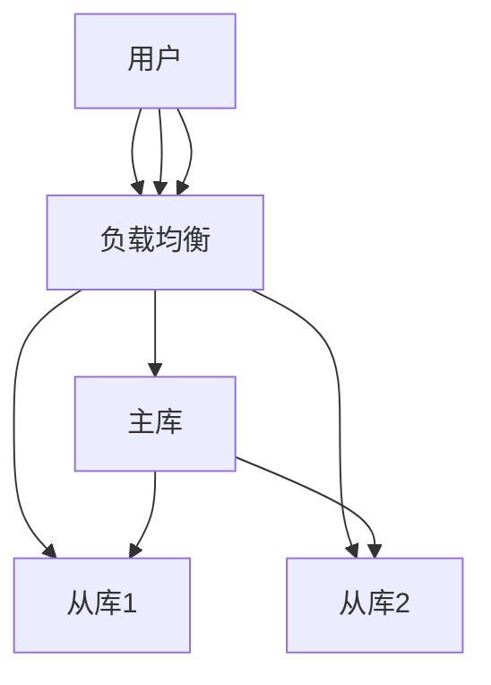

# 1.1.5 分布式与高可用

## 目录

- [1.1.5 分布式与高可用](#115-分布式与高可用)
  - [目录](#目录)
  - [1.1.5.1 主从复制](#1151-主从复制)
  - [1.1.5.2 读写分离与高可用](#1152-读写分离与高可用)
  - [1.1.5.3 行业案例与多表征](#1153-行业案例与多表征)
    - [金融行业：高可用集群](#金融行业高可用集群)
    - [互联网行业：读写分离架构](#互联网行业读写分离架构)
    - [Latex公式](#latex公式)
    - [配置示例](#配置示例)

## 1.1.5.1 主从复制

- 基于WAL日志的物理复制、逻辑复制。
- 支持同步/异步复制，提升数据安全性。

## 1.1.5.2 读写分离与高可用

| 架构模式 | 特点 | 适用场景 |
|----------|------|----------|
| 一主多从 | 简单、易扩展 | 读多写少 |
| 流复制   | 实时同步 | 高可用 |
| 逻辑复制 | 跨版本升级 | 版本迁移 |

## 1.1.5.3 行业案例与多表征

### 金融行业：高可用集群



### 互联网行业：读写分离架构

- 见[4.3.1-微服务架构基础理论](../../../../4-软件架构与工程/4.3-微服务架构/4.3.1-微服务架构基础理论.md)

### Latex公式

$$
Availability = \frac{MTBF}{MTBF + MTTR}
$$

### 配置示例

```conf
# 主库配置
wal_level = replica
max_wal_senders = 3

# 从库配置
hot_standby = on
primary_conninfo = 'host=master port=5432'
```

[返回PostgreSQL导航](README.md)
