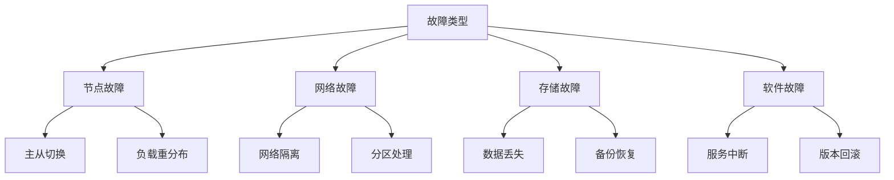
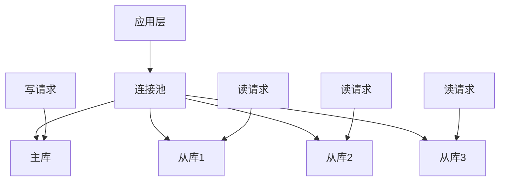

# 1.1.5 分布式与高可用

## 📋 概述

分布式与高可用是PostgreSQL企业级应用的核心特性，通过主从复制、读写分离、故障转移等技术手段，确保数据库系统的高可用性、数据安全性和业务连续性。本文档系统性地阐述PostgreSQL分布式架构的设计原理、实现方法和最佳实践。

## 🏗️ 理论基础

### 1. 高可用性基础概念

#### 1.1 可用性定义与计算

**定义 1.1 (系统可用性)**
系统可用性是指在指定时间段内，系统能够正常提供服务的时间比例：

$$Availability = \frac{MTBF}{MTBF + MTTR}$$

其中：

- $MTBF$ (Mean Time Between Failures) 是平均故障间隔时间
- $MTTR$ (Mean Time To Repair) 是平均修复时间

**可用性等级**：

| 可用性等级 | 可用性百分比 | 年停机时间 | 适用场景 |
|-----------|-------------|-----------|----------|
| 99% | 99% | 87.6小时 | 一般业务 |
| 99.9% | 99.9% | 8.76小时 | 重要业务 |
| 99.99% | 99.99% | 52.56分钟 | 关键业务 |
| 99.999% | 99.999% | 5.26分钟 | 核心业务 |

#### 1.2 故障模式与影响分析

**定义 1.2 (故障模式)**
PostgreSQL分布式系统的故障模式包括：

1. **节点故障**：单个数据库节点不可用
2. **网络故障**：节点间网络连接中断
3. **存储故障**：磁盘或存储系统故障
4. **软件故障**：数据库软件或应用软件故障

**故障影响分析**：



### 2. 复制理论与一致性模型

#### 2.1 复制一致性理论

**定义 2.1 (复制一致性)**
在分布式PostgreSQL系统中，复制一致性定义为：

1. **强一致性**：$\forall i,j \in N, \forall t \in T, v_i(t) = v_j(t)$
2. **最终一致性**：$\lim_{t \to \infty} v_i(t) = \lim_{t \to \infty} v_j(t)$
3. **会话一致性**：$\forall s \in S, \forall t_1, t_2 \in T, v_s(t_1) \leq v_s(t_2)$

其中：

- $N$ 是节点集合
- $T$ 是时间域
- $v_i(t)$ 是节点 $i$ 在时间 $t$ 的数据版本
- $S$ 是会话集合

#### 2.2 复制延迟分析

**复制延迟模型**：

$$T_{replication} = T_{network} + T_{transfer} + T_{apply}$$

其中：

- $T_{network}$ 是网络传输延迟
- $T_{transfer}$ 是WAL日志传输时间
- $T_{apply}$ 是日志应用时间

**延迟优化策略**：

1. **网络优化**：$T_{network} = \frac{data\_size}{bandwidth} + propagation\_delay$
2. **批量传输**：$T_{transfer} = \frac{wal\_size}{batch\_size} \times transfer\_time$
3. **并行应用**：$T_{apply} = \frac{wal\_records}{parallel\_workers} \times apply\_time$

### 3. 分布式事务理论

#### 3.1 分布式事务模型

**定义 3.1 (分布式事务)**
分布式事务是一个五元组 $T = (O, S, C, A, T)$，其中：

- $O$ 是操作集合
- $S$ 是状态集合
- $C$ 是提交条件
- $A$ 是中止条件
- $T$ 是时间约束

**事务一致性级别**：

1. **读未提交**：$RC_0$ - 允许脏读
2. **读已提交**：$RC_1$ - 防止脏读
3. **可重复读**：$RC_2$ - 防止不可重复读
4. **串行化**：$RC_3$ - 最高隔离级别

#### 3.2 两阶段提交协议

**2PC协议状态机**：

```rust
// Rust实现的2PC协议
use std::collections::HashMap;
use tokio::sync::mpsc;
use serde::{Serialize, Deserialize};

#[derive(Debug, Clone, Serialize, Deserialize)]
pub enum TransactionState {
    Initial,
    Prepared,
    Committed,
    Aborted,
}

#[derive(Debug, Clone, Serialize, Deserialize)]
pub enum Message {
    Prepare { transaction_id: String },
    Prepared { transaction_id: String, participant_id: String },
    Commit { transaction_id: String },
    Abort { transaction_id: String },
}

pub struct TwoPhaseCommit {
    transaction_id: String,
    participants: Vec<String>,
    state: TransactionState,
    prepared_participants: HashMap<String, bool>,
}

impl TwoPhaseCommit {
    pub fn new(transaction_id: String, participants: Vec<String>) -> Self {
        Self {
            transaction_id,
            participants,
            state: TransactionState::Initial,
            prepared_participants: HashMap::new(),
        }
    }
    
    pub async fn execute(&mut self, tx: mpsc::Sender<Message>) -> Result<bool, String> {
        // 第一阶段：准备阶段
        let prepare_result = self.prepare_phase(&tx).await?;
        
        if !prepare_result {
            self.abort_phase(&tx).await?;
            return Ok(false);
        }
        
        // 第二阶段：提交阶段
        let commit_result = self.commit_phase(&tx).await?;
        Ok(commit_result)
    }
    
    async fn prepare_phase(&mut self, tx: &mpsc::Sender<Message>) -> Result<bool, String> {
        // 发送准备消息给所有参与者
        for participant in &self.participants {
            let msg = Message::Prepare {
                transaction_id: self.transaction_id.clone(),
            };
            tx.send(msg).await.map_err(|e| e.to_string())?;
        }
        
        // 等待所有参与者响应
        let mut prepared_count = 0;
        for _ in 0..self.participants.len() {
            // 这里应该接收响应消息
            prepared_count += 1;
        }
        
        Ok(prepared_count == self.participants.len())
    }
    
    async fn commit_phase(&mut self, tx: &mpsc::Sender<Message>) -> Result<bool, String> {
        // 发送提交消息给所有参与者
        for participant in &self.participants {
            let msg = Message::Commit {
                transaction_id: self.transaction_id.clone(),
            };
            tx.send(msg).await.map_err(|e| e.to_string())?;
        }
        
        self.state = TransactionState::Committed;
        Ok(true)
    }
    
    async fn abort_phase(&mut self, tx: &mpsc::Sender<Message>) -> Result<(), String> {
        // 发送中止消息给所有参与者
        for participant in &self.participants {
            let msg = Message::Abort {
                transaction_id: self.transaction_id.clone(),
            };
            tx.send(msg).await.map_err(|e| e.to_string())?;
        }
        
        self.state = TransactionState::Aborted;
        Ok(())
    }
}
```

## 🔧 主从复制实现

### 1. 物理复制架构

#### 1.1 WAL日志机制

**WAL日志结构**：

```sql
-- 查看WAL日志配置
SHOW wal_level;
SHOW max_wal_senders;
SHOW wal_keep_segments;

-- 查看WAL日志状态
SELECT * FROM pg_stat_wal_receiver;
SELECT * FROM pg_stat_replication;
```

**WAL日志配置优化**：

```sql
-- 主库WAL配置
ALTER SYSTEM SET wal_level = replica;
ALTER SYSTEM SET max_wal_senders = 10;
ALTER SYSTEM SET wal_keep_segments = 64;
ALTER SYSTEM SET synchronous_commit = on;

-- 从库WAL配置
ALTER SYSTEM SET hot_standby = on;
ALTER SYSTEM SET primary_conninfo = 'host=master port=5432 user=repl password=repl';
ALTER SYSTEM SET recovery_target_timeline = 'latest';
```

#### 1.2 复制配置实现

**主库配置**：

```sql
-- 创建复制用户
CREATE USER repl REPLICATION LOGIN PASSWORD 'repl_password';

-- 配置pg_hba.conf
-- host replication repl 192.168.1.0/24 md5

-- 配置postgresql.conf
wal_level = replica
max_wal_senders = 10
wal_keep_segments = 64
synchronous_commit = on
synchronous_standby_names = 'standby1,standby2'
```

**从库配置**：

```sql
-- 配置postgresql.conf
hot_standby = on
primary_conninfo = 'host=master port=5432 user=repl password=repl_password'
recovery_target_timeline = 'latest'
max_standby_archive_delay = 30s
max_standby_streaming_delay = 30s
```

#### 1.3 复制监控与管理

```sql
-- 复制状态监控
SELECT 
    pid,
    application_name,
    client_addr,
    state,
    sent_lsn,
    write_lsn,
    flush_lsn,
    replay_lsn,
    sync_priority,
    sync_state
FROM pg_stat_replication;

-- 复制延迟计算
SELECT 
    application_name,
    client_addr,
    (pg_current_wal_lsn() - sent_lsn) as sent_lag_bytes,
    (pg_current_wal_lsn() - write_lsn) as write_lag_bytes,
    (pg_current_wal_lsn() - flush_lsn) as flush_lag_bytes,
    (pg_current_wal_lsn() - replay_lsn) as replay_lag_bytes
FROM pg_stat_replication;

-- 复制连接状态
SELECT 
    application_name,
    state,
    COUNT(*) as connection_count
FROM pg_stat_replication
GROUP BY application_name, state;
```

### 2. 逻辑复制实现

#### 2.1 逻辑复制架构

**逻辑复制配置**：

```sql
-- 发布端配置
CREATE PUBLICATION sales_pub FOR TABLE sales, customers;

-- 订阅端配置
CREATE SUBSCRIPTION sales_sub 
CONNECTION 'host=master port=5432 dbname=sales user=repl password=repl'
PUBLICATION sales_pub;

-- 查看发布状态
SELECT * FROM pg_publication;
SELECT * FROM pg_publication_tables;

-- 查看订阅状态
SELECT * FROM pg_subscription;
SELECT * FROM pg_stat_subscription;
```

#### 2.2 逻辑复制监控

```sql
-- 逻辑复制延迟监控
SELECT 
    subname,
    pid,
    received_lsn,
    latest_end_lsn,
    latest_end_time,
    (pg_current_wal_lsn() - received_lsn) as lag_bytes
FROM pg_stat_subscription;

-- 逻辑复制错误监控
SELECT 
    subname,
    pid,
    relname,
    received_lsn,
    latest_end_lsn,
    latest_end_time
FROM pg_stat_subscription_stats;
```

## 🏭 读写分离架构

### 1. 读写分离设计

#### 1.1 负载均衡策略

**读写分离架构**：



**负载均衡算法**：

```python
# Python负载均衡器实现
import random
import time
from typing import List, Dict, Any
import psycopg2

class LoadBalancer:
    def __init__(self, master_config: Dict[str, Any], slave_configs: List[Dict[str, Any]]):
        self.master_config = master_config
        self.slave_configs = slave_configs
        self.current_slave_index = 0
        self.slave_weights = [1] * len(slave_configs)
        self.slave_health = [True] * len(slave_configs)
    
    def get_master_connection(self):
        """获取主库连接"""
        return psycopg2.connect(**self.master_config)
    
    def get_slave_connection(self, strategy: str = 'round_robin'):
        """获取从库连接"""
        if strategy == 'round_robin':
            return self._round_robin()
        elif strategy == 'random':
            return self._random()
        elif strategy == 'weighted':
            return self._weighted()
        else:
            return self._round_robin()
    
    def _round_robin(self):
        """轮询策略"""
        for i in range(len(self.slave_configs)):
            self.current_slave_index = (self.current_slave_index + 1) % len(self.slave_configs)
            if self.slave_health[self.current_slave_index]:
                return psycopg2.connect(**self.slave_configs[self.current_slave_index])
        raise Exception("No healthy slave available")
    
    def _random(self):
        """随机策略"""
        healthy_slaves = [i for i, healthy in enumerate(self.slave_health) if healthy]
        if not healthy_slaves:
            raise Exception("No healthy slave available")
        
        slave_index = random.choice(healthy_slaves)
        return psycopg2.connect(**self.slave_configs[slave_index])
    
    def _weighted(self):
        """加权策略"""
        total_weight = sum(self.slave_weights[i] for i, healthy in enumerate(self.slave_health) if healthy)
        if total_weight == 0:
            raise Exception("No healthy slave available")
        
        rand = random.uniform(0, total_weight)
        current_weight = 0
        
        for i, healthy in enumerate(self.slave_health):
            if healthy:
                current_weight += self.slave_weights[i]
                if rand <= current_weight:
                    return psycopg2.connect(**self.slave_configs[i])
        
        raise Exception("No healthy slave available")
    
    def check_slave_health(self):
        """检查从库健康状态"""
        for i, config in enumerate(self.slave_configs):
            try:
                conn = psycopg2.connect(**config)
                cursor = conn.cursor()
                cursor.execute("SELECT 1")
                cursor.fetchone()
                conn.close()
                self.slave_health[i] = True
            except Exception as e:
                print(f"Slave {i} is unhealthy: {e}")
                self.slave_health[i] = False
    
    def update_slave_weight(self, slave_index: int, weight: int):
        """更新从库权重"""
        if 0 <= slave_index < len(self.slave_weights):
            self.slave_weights[slave_index] = weight

# 使用示例
class DatabaseManager:
    def __init__(self):
        master_config = {
            'host': 'master',
            'database': 'app_db',
            'user': 'app_user',
            'password': 'password'
        }
        
        slave_configs = [
            {'host': 'slave1', 'database': 'app_db', 'user': 'app_user', 'password': 'password'},
            {'host': 'slave2', 'database': 'app_db', 'user': 'app_user', 'password': 'password'},
            {'host': 'slave3', 'database': 'app_db', 'user': 'app_user', 'password': 'password'},
        ]
        
        self.load_balancer = LoadBalancer(master_config, slave_configs)
    
    def execute_write(self, query: str, params: tuple = None):
        """执行写操作"""
        conn = self.load_balancer.get_master_connection()
        cursor = conn.cursor()
        
        try:
            if params:
                cursor.execute(query, params)
            else:
                cursor.execute(query)
            conn.commit()
            return cursor.fetchall()
        finally:
            conn.close()
    
    def execute_read(self, query: str, params: tuple = None, strategy: str = 'round_robin'):
        """执行读操作"""
        conn = self.load_balancer.get_slave_connection(strategy)
        cursor = conn.cursor()
        
        try:
            if params:
                cursor.execute(query, params)
            else:
                cursor.execute(query)
            return cursor.fetchall()
        finally:
            conn.close()
```

#### 1.2 连接池配置

```sql
-- PgBouncer配置示例
[databases]
app_db = host=master port=5432 dbname=app_db

[pgbouncer]
listen_addr = *
listen_port = 6432
auth_type = md5
auth_file = /etc/pgbouncer/userlist.txt
pool_mode = transaction
max_client_conn = 1000
default_pool_size = 20
max_db_connections = 100
max_user_connections = 100

# 读写分离配置
[databases]
app_db_master = host=master port=5432 dbname=app_db
app_db_slave1 = host=slave1 port=5432 dbname=app_db
app_db_slave2 = host=slave2 port=5432 dbname=app_db
```

### 2. 故障转移机制

#### 2.1 自动故障转移

```python
# Python自动故障转移实现
import psycopg2
import time
import threading
from typing import Dict, List, Any

class FailoverManager:
    def __init__(self, master_config: Dict[str, Any], slave_configs: List[Dict[str, Any]]):
        self.master_config = master_config
        self.slave_configs = slave_configs
        self.current_master = master_config
        self.available_slaves = slave_configs.copy()
        self.failover_lock = threading.Lock()
        self.monitoring = False
    
    def start_monitoring(self):
        """开始监控"""
        self.monitoring = True
        monitor_thread = threading.Thread(target=self._monitor_master)
        monitor_thread.daemon = True
        monitor_thread.start()
    
    def stop_monitoring(self):
        """停止监控"""
        self.monitoring = False
    
    def _monitor_master(self):
        """监控主库状态"""
        while self.monitoring:
            try:
                conn = psycopg2.connect(**self.current_master)
                cursor = conn.cursor()
                cursor.execute("SELECT 1")
                cursor.fetchone()
                conn.close()
                time.sleep(5)  # 每5秒检查一次
            except Exception as e:
                print(f"Master is down: {e}")
                self._trigger_failover()
                break
    
    def _trigger_failover(self):
        """触发故障转移"""
        with self.failover_lock:
            print("Starting failover process...")
            
            # 选择新的主库
            new_master = self._select_new_master()
            if new_master:
                self._promote_slave_to_master(new_master)
                print(f"Failover completed. New master: {new_master['host']}")
            else:
                print("No suitable slave for failover")
    
    def _select_new_master(self) -> Dict[str, Any]:
        """选择新的主库"""
        for slave in self.available_slaves:
            try:
                conn = psycopg2.connect(**slave)
                cursor = conn.cursor()
                
                # 检查复制延迟
                cursor.execute("""
                    SELECT 
                        CASE 
                            WHEN pg_is_in_recovery() THEN 
                                (pg_current_wal_lsn() - received_lsn)
                            ELSE 0
                        END as lag_bytes
                    FROM pg_stat_wal_receiver
                """)
                
                result = cursor.fetchone()
                lag_bytes = result[0] if result else 0
                
                conn.close()
                
                # 选择延迟最小的从库
                if lag_bytes < 1024 * 1024:  # 小于1MB延迟
                    return slave
                    
            except Exception as e:
                print(f"Slave {slave['host']} is not suitable: {e}")
                continue
        
        return None
    
    def _promote_slave_to_master(self, new_master: Dict[str, Any]):
        """将从库提升为主库"""
        try:
            # 停止复制
            conn = psycopg2.connect(**new_master)
            cursor = conn.cursor()
            cursor.execute("SELECT pg_promote_node()")
            conn.close()
            
            # 更新当前主库
            self.current_master = new_master
            
            # 从可用从库列表中移除
            self.available_slaves = [s for s in self.available_slaves if s != new_master]
            
        except Exception as e:
            print(f"Failed to promote slave: {e}")
    
    def get_current_master(self) -> Dict[str, Any]:
        """获取当前主库配置"""
        return self.current_master
    
    def get_available_slaves(self) -> List[Dict[str, Any]]:
        """获取可用从库列表"""
        return self.available_slaves.copy()

# 使用示例
def test_failover():
    master_config = {
        'host': 'master',
        'database': 'app_db',
        'user': 'app_user',
        'password': 'password'
    }
    
    slave_configs = [
        {'host': 'slave1', 'database': 'app_db', 'user': 'app_user', 'password': 'password'},
        {'host': 'slave2', 'database': 'app_db', 'user': 'app_user', 'password': 'password'},
    ]
    
    failover_manager = FailoverManager(master_config, slave_configs)
    failover_manager.start_monitoring()
    
    try:
        while True:
            current_master = failover_manager.get_current_master()
            print(f"Current master: {current_master['host']}")
            time.sleep(10)
    except KeyboardInterrupt:
        failover_manager.stop_monitoring()
        print("Monitoring stopped")
```

## 📊 监控与维护

### 1. 高可用监控

#### 1.1 复制状态监控

```sql
-- 创建复制监控视图
CREATE OR REPLACE VIEW replication_monitor AS
WITH replication_stats AS (
    SELECT 
        application_name,
        client_addr,
        state,
        sent_lsn,
        write_lsn,
        flush_lsn,
        replay_lsn,
        sync_priority,
        sync_state,
        EXTRACT(EPOCH FROM (now() - backend_start)) as uptime_seconds
    FROM pg_stat_replication
),
lag_calculation AS (
    SELECT 
        *,
        (pg_current_wal_lsn() - sent_lsn) as sent_lag_bytes,
        (pg_current_wal_lsn() - write_lsn) as write_lag_bytes,
        (pg_current_wal_lsn() - flush_lsn) as flush_lag_bytes,
        (pg_current_wal_lsn() - replay_lsn) as replay_lag_bytes
    FROM replication_stats
)
SELECT 
    application_name,
    client_addr,
    state,
    sync_state,
    sent_lag_bytes,
    write_lag_bytes,
    flush_lag_bytes,
    replay_lag_bytes,
    uptime_seconds,
    CASE 
        WHEN replay_lag_bytes > 1024*1024*100 THEN 'HIGH'
        WHEN replay_lag_bytes > 1024*1024*10 THEN 'MEDIUM'
        ELSE 'LOW'
    END as lag_level
FROM lag_calculation
ORDER BY replay_lag_bytes DESC;

-- 查询复制监控
SELECT * FROM replication_monitor;
```

#### 1.2 性能监控

```sql
-- 创建性能监控视图
CREATE OR REPLACE VIEW performance_monitor AS
SELECT 
    -- 连接统计
    (SELECT COUNT(*) FROM pg_stat_activity) as active_connections,
    (SELECT COUNT(*) FROM pg_stat_activity WHERE state = 'active') as active_queries,
    
    -- 事务统计
    (SELECT xact_commit FROM pg_stat_database WHERE datname = current_database()) as commits,
    (SELECT xact_rollback FROM pg_stat_database WHERE datname = current_database()) as rollbacks,
    
    -- 缓存统计
    (SELECT blks_hit FROM pg_stat_database WHERE datname = current_database()) as cache_hits,
    (SELECT blks_read FROM pg_stat_database WHERE datname = current_database()) as disk_reads,
    
    -- 复制统计
    (SELECT COUNT(*) FROM pg_stat_replication) as replication_connections,
    (SELECT COUNT(*) FROM pg_stat_replication WHERE sync_state = 'sync') as sync_replicas,
    
    -- 系统资源
    (SELECT pg_database_size(current_database())) as database_size,
    (SELECT pg_size_pretty(pg_database_size(current_database()))) as database_size_pretty;

-- 查询性能监控
SELECT * FROM performance_monitor;
```

### 2. 自动化维护

#### 2.1 自动备份策略

```python
# Python自动备份脚本
import psycopg2
import subprocess
import os
import time
from datetime import datetime
from typing import Dict, Any

class BackupManager:
    def __init__(self, db_config: Dict[str, Any], backup_dir: str):
        self.db_config = db_config
        self.backup_dir = backup_dir
        self.retention_days = 7
    
    def create_full_backup(self) -> str:
        """创建全量备份"""
        timestamp = datetime.now().strftime('%Y%m%d_%H%M%S')
        backup_file = f"{self.backup_dir}/full_backup_{timestamp}.sql"
        
        # 使用pg_dump创建备份
        cmd = [
            'pg_dump',
            '-h', self.db_config['host'],
            '-p', str(self.db_config['port']),
            '-U', self.db_config['user'],
            '-d', self.db_config['database'],
            '-f', backup_file,
            '--verbose'
        ]
        
        env = os.environ.copy()
        env['PGPASSWORD'] = self.db_config['password']
        
        try:
            result = subprocess.run(cmd, env=env, capture_output=True, text=True)
            if result.returncode == 0:
                print(f"Full backup created: {backup_file}")
                return backup_file
            else:
                print(f"Backup failed: {result.stderr}")
                return None
        except Exception as e:
            print(f"Backup error: {e}")
            return None
    
    def create_incremental_backup(self) -> str:
        """创建增量备份"""
        timestamp = datetime.now().strftime('%Y%m%d_%H%M%S')
        backup_file = f"{self.backup_dir}/incremental_backup_{timestamp}.sql"
        
        # 使用pg_dump创建增量备份
        cmd = [
            'pg_dump',
            '-h', self.db_config['host'],
            '-p', str(self.db_config['port']),
            '-U', self.db_config['user'],
            '-d', self.db_config['database'],
            '-f', backup_file,
            '--verbose',
            '--data-only',
            '--exclude-table=*'
        ]
        
        env = os.environ.copy()
        env['PGPASSWORD'] = self.db_config['password']
        
        try:
            result = subprocess.run(cmd, env=env, capture_output=True, text=True)
            if result.returncode == 0:
                print(f"Incremental backup created: {backup_file}")
                return backup_file
            else:
                print(f"Incremental backup failed: {result.stderr}")
                return None
        except Exception as e:
            print(f"Incremental backup error: {e}")
            return None
    
    def cleanup_old_backups(self):
        """清理旧备份"""
        current_time = time.time()
        
        for filename in os.listdir(self.backup_dir):
            filepath = os.path.join(self.backup_dir, filename)
            if os.path.isfile(filepath):
                file_age = current_time - os.path.getmtime(filepath)
                if file_age > (self.retention_days * 24 * 3600):
                    os.remove(filepath)
                    print(f"Removed old backup: {filename}")
    
    def restore_backup(self, backup_file: str) -> bool:
        """恢复备份"""
        if not os.path.exists(backup_file):
            print(f"Backup file not found: {backup_file}")
            return False
        
        cmd = [
            'psql',
            '-h', self.db_config['host'],
            '-p', str(self.db_config['port']),
            '-U', self.db_config['user'],
            '-d', self.db_config['database'],
            '-f', backup_file
        ]
        
        env = os.environ.copy()
        env['PGPASSWORD'] = self.db_config['password']
        
        try:
            result = subprocess.run(cmd, env=env, capture_output=True, text=True)
            if result.returncode == 0:
                print(f"Backup restored: {backup_file}")
                return True
            else:
                print(f"Restore failed: {result.stderr}")
                return False
        except Exception as e:
            print(f"Restore error: {e}")
            return False

# 使用示例
def schedule_backups():
    db_config = {
        'host': 'master',
        'port': 5432,
        'database': 'app_db',
        'user': 'backup_user',
        'password': 'backup_password'
    }
    
    backup_manager = BackupManager(db_config, '/backups')
    
    while True:
        try:
            # 每天凌晨2点创建全量备份
            current_hour = datetime.now().hour
            if current_hour == 2:
                backup_manager.create_full_backup()
            
            # 每小时创建增量备份
            backup_manager.create_incremental_backup()
            
            # 清理旧备份
            backup_manager.cleanup_old_backups()
            
            # 等待1小时
            time.sleep(3600)
            
        except Exception as e:
            print(f"Backup schedule error: {e}")
            time.sleep(3600)
```

## 🔗 相关链接

- [1.1.9-分布式PostgreSQL架构设计](1.1.9-分布式PostgreSQL架构设计.md) - 分布式架构设计
- [1.1.14-实时流处理与CEP](1.1.14-实时流处理与CEP.md) - 实时数据处理
- [1.1.15-云原生与容器化部署](1.1.15-云原生与容器化部署.md) - 云原生部署
- [4.3.1-微服务架构基础理论](../../../4-软件架构与工程/4.3-微服务架构/4.3.1-微服务架构基础理论.md) - 微服务架构

[返回PostgreSQL导航](README.md)
