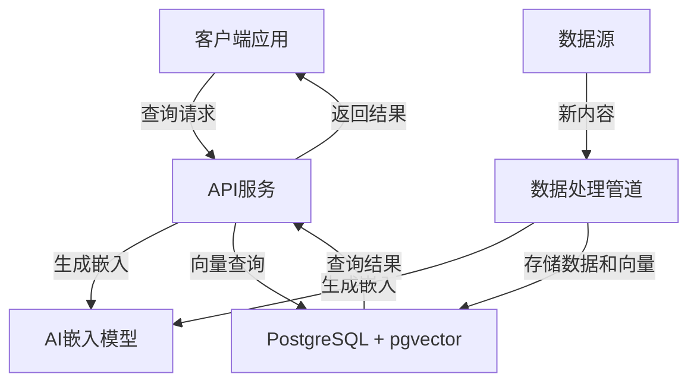

# 1.1.6 AI与PostgreSQL集成

## 目录

- [1.1.6 AI与PostgreSQL集成](#116-ai与postgresql集成)
  - [目录](#目录)
  - [1. 概述](#1-概述)
  - [2. 向量搜索基础](#2-向量搜索基础)
    - [2.1 向量表示](#21-向量表示)
    - [2.2 近似最近邻搜索](#22-近似最近邻搜索)
  - [3. PostgreSQL向量扩展](#3-postgresql向量扩展)
    - [3.1 pgvector扩展](#31-pgvector扩展)
    - [3.2 向量索引类型](#32-向量索引类型)
    - [3.3 向量操作符](#33-向量操作符)
  - [4. 嵌入式AI模型集成](#4-嵌入式ai模型集成)
    - [4.1 PL/Python与AI框架](#41-plpython与ai框架)
    - [4.2 pg\_embedding扩展](#42-pg_embedding扩展)
    - [4.3 实时嵌入生成](#43-实时嵌入生成)
  - [5. 自然语言处理与全文搜索](#5-自然语言处理与全文搜索)
    - [5.1 全文搜索基础](#51-全文搜索基础)
    - [5.2 语义搜索与混合搜索](#52-语义搜索与混合搜索)
    - [5.3 多语言支持](#53-多语言支持)
  - [6. 机器学习集成](#6-机器学习集成)
    - [6.1 MADlib扩展](#61-madlib扩展)
    - [6.2 外部机器学习服务集成](#62-外部机器学习服务集成)
    - [6.3 实时特征工程](#63-实时特征工程)
  - [7. 实时AI应用架构](#7-实时ai应用架构)
    - [7.1 向量数据库架构](#71-向量数据库架构)
    - [7.2 混合搜索系统](#72-混合搜索系统)
    - [7.3 实时推荐系统](#73-实时推荐系统)
    - [7.4 实时异常检测](#74-实时异常检测)
  - [参考文献](#参考文献)

## 1. 概述

随着AI技术的快速发展，数据库系统正在演变为AI应用的核心基础设施。
PostgreSQL凭借其强大的可扩展性，已成为AI应用的理想存储和处理平台。
本文分析PostgreSQL与AI技术的集成方式，特别关注向量搜索、嵌入模型和机器学习功能。

## 2. 向量搜索基础

向量搜索是现代AI应用的核心组件，特别是在处理自然语言、图像和其他高维数据时。

### 2.1 向量表示

**定义 2.1.1** (嵌入向量)：嵌入向量是将高维数据（如文本、图像）映射到低维向量空间的数值表示。

**定义 2.1.2** (向量相似度)：两个向量之间的相似度可以通过多种距离或相似度度量来计算：

- 欧几里得距离：$d(x, y) = \sqrt{\sum_{i=1}^{n} (x_i - y_i)^2}$
- 余弦相似度：$\cos(x, y) = \frac{x \cdot y}{||x|| \cdot ||y||}$
- 内积：$x \cdot y = \sum_{i=1}^{n} x_i y_i$

### 2.2 近似最近邻搜索

**定义 2.2.1** (最近邻搜索)：给定查询向量 $q$ 和向量集合 $V$，找到 $V$ 中与 $q$ 最相似的 $k$ 个向量。

**定义 2.2.2** (近似最近邻算法)：用于高效搜索大规模向量数据的算法，包括：

- 局部敏感哈希(LSH)
- 分层可导航小世界图(HNSW)
- 倒排文件索引(IVF)
- 乘积量化(PQ)

## 3. PostgreSQL向量扩展

PostgreSQL通过扩展支持向量数据类型和向量搜索功能。

### 3.1 pgvector扩展

**定义 3.1.1** (pgvector)：PostgreSQL的向量扩展，提供向量数据类型和高效的向量搜索算法。

```sql
-- 安装pgvector扩展
CREATE EXTENSION vector;

-- 创建包含向量的表
CREATE TABLE items (
  id bigserial PRIMARY KEY,
  embedding vector(1536),  -- OpenAI嵌入维度
  content text,
  metadata jsonb
);

-- 创建向量索引
CREATE INDEX ON items USING ivfflat (embedding vector_l2_ops) WITH (lists = 100);
```

### 3.2 向量索引类型

**定义 3.2.1** (IVFFLAT索引)：基于倒排文件的近似最近邻索引。

```sql
-- IVFFLAT索引（较快的构建，适中的查询性能）
CREATE INDEX ON items USING ivfflat (embedding vector_l2_ops) WITH (lists = 100);
```

**定义 3.2.2** (HNSW索引)：基于分层可导航小世界图的高性能索引。

```sql
-- HNSW索引（较慢的构建，最佳的查询性能）
CREATE INDEX ON items USING hnsw (embedding vector_cosine_ops) WITH (m = 16, ef_construction = 64);
```

### 3.3 向量操作符

**定义 3.3.1** (向量距离操作符)：

- `<->` 欧几里得距离
- `<=>` 余弦距离
- `<#>` 内积距离（负内积）

```sql
-- 使用余弦距离查找最相似的项目
SELECT id, content, embedding <=> '[0.1, 0.2, ...]'::vector AS distance
FROM items
ORDER BY distance
LIMIT 5;
```

## 4. 嵌入式AI模型集成

PostgreSQL可以与嵌入式AI模型集成，实现数据库内的智能处理。

### 4.1 PL/Python与AI框架

**定义 4.1.1** (PL/Python)：PostgreSQL的Python过程语言扩展，允许在数据库中执行Python代码。

```sql
-- 安装PL/Python扩展
CREATE EXTENSION plpython3u;

-- 创建使用scikit-learn的函数
CREATE OR REPLACE FUNCTION classify_text(text_content TEXT)
RETURNS TEXT AS $$
  import pickle
  import numpy as np
  from sklearn.feature_extraction.text import TfidfVectorizer
  
  # 加载预训练模型（假设已保存）
  with open('/path/to/model.pkl', 'rb') as f:
      model = pickle.load(f)
  with open('/path/to/vectorizer.pkl', 'rb') as f:
      vectorizer = pickle.load(f)
      
  # 预处理和预测
  X = vectorizer.transform([text_content])
  prediction = model.predict(X)[0]
  return prediction
$$ LANGUAGE plpython3u;

-- 使用函数
SELECT id, content, classify_text(content) AS category
FROM documents;
```

### 4.2 pg_embedding扩展

**定义 4.2.1** (pg_embedding)：将文本转换为嵌入向量的PostgreSQL扩展。

```sql
-- 安装扩展
CREATE EXTENSION pg_embedding;

-- 创建嵌入模型
SELECT embedding_model_create(
  'text-embedding-ada-002',
  'openai',
  '{"api_key": "your_openai_api_key"}'
);

-- 生成嵌入
SELECT embedding_vector('text-embedding-ada-002', 'PostgreSQL is a powerful database system');
```

### 4.3 实时嵌入生成

**定义 4.3.1** (实时嵌入生成)：在数据插入或更新时自动生成嵌入向量。

```sql
-- 创建触发器函数
CREATE OR REPLACE FUNCTION generate_embedding()
RETURNS TRIGGER AS $$
BEGIN
  NEW.embedding = embedding_vector('text-embedding-ada-002', NEW.content);
  RETURN NEW;
END;
$$ LANGUAGE plpgsql;

-- 创建触发器
CREATE TRIGGER before_insert_items
  BEFORE INSERT OR UPDATE ON items
  FOR EACH ROW
  EXECUTE FUNCTION generate_embedding();
```

## 5. 自然语言处理与全文搜索

PostgreSQL提供强大的全文搜索功能，可与现代NLP技术结合。

### 5.1 全文搜索基础

**定义 5.1.1** (全文搜索)：PostgreSQL内置的全文搜索功能，基于文档向量化和排名算法。

```sql
-- 创建全文搜索索引
CREATE INDEX idx_documents_fts ON documents USING gin(to_tsvector('english', content));

-- 执行全文搜索
SELECT id, content
FROM documents
WHERE to_tsvector('english', content) @@ to_tsquery('english', 'database & system');
```

### 5.2 语义搜索与混合搜索

**定义 5.2.1** (语义搜索)：基于向量相似度的搜索，捕捉语义关系而非关键词匹配。

**定义 5.2.2** (混合搜索)：结合全文搜索和向量搜索的方法。

```sql
-- 混合搜索：结合全文搜索和向量搜索
WITH keyword_matches AS (
  SELECT id, ts_rank(to_tsvector('english', content), to_tsquery('english', 'database')) AS keyword_rank
  FROM documents
  WHERE to_tsvector('english', content) @@ to_tsquery('english', 'database')
),
vector_matches AS (
  SELECT id, embedding <=> query_embedding AS vector_distance
  FROM documents, (SELECT embedding_vector('text-embedding-ada-002', 'database systems') AS query_embedding) q
  ORDER BY vector_distance
  LIMIT 100
)
SELECT d.id, d.content, 
       k.keyword_rank * 0.3 + (1 - v.vector_distance) * 0.7 AS hybrid_score
FROM documents d
JOIN keyword_matches k ON d.id = k.id
JOIN vector_matches v ON d.id = v.id
ORDER BY hybrid_score DESC
LIMIT 10;
```

### 5.3 多语言支持

**定义 5.3.1** (多语言NLP)：支持多种语言的自然语言处理功能。

```sql
-- 多语言分词和词干提取
SELECT to_tsvector('spanish', 'La base de datos PostgreSQL es muy potente');

-- 多语言向量搜索
SELECT id, content, embedding <=> query_embedding AS distance
FROM multilingual_documents, 
     (SELECT embedding_vector('multilingual-embedding-model', '数据库系统') AS query_embedding) q
ORDER BY distance
LIMIT 5;
```

## 6. 机器学习集成

PostgreSQL可以与机器学习框架集成，实现数据库内的预测和分析。

### 6.1 MADlib扩展

**定义 6.1.1** (MADlib)：PostgreSQL的机器学习扩展，提供数据库内分析功能。

```sql
-- 安装MADlib
CREATE EXTENSION madlib;

-- 使用线性回归
SELECT madlib.linregr_train(
  'public.housing_data',  -- 训练数据表
  'public.housing_model', -- 模型输出表
  'price',                -- 目标变量
  'ARRAY[sqft, bedrooms, bathrooms]', -- 特征
  NULL                    -- 分组列
);

-- 使用模型进行预测
SELECT madlib.linregr_predict(
  ARRAY[1500, 3, 2],      -- 新数据点
  (SELECT coef FROM public.housing_model)
);
```

### 6.2 外部机器学习服务集成

**定义 6.2.1** (外部ML服务集成)：通过Foreign Data Wrapper或HTTP调用集成外部机器学习服务。

```sql
-- 创建外部服务连接
CREATE EXTENSION http;

-- 创建调用ML服务的函数
CREATE OR REPLACE FUNCTION predict_sentiment(text_content TEXT)
RETURNS TEXT AS $$
DECLARE
  response json;
BEGIN
  SELECT content::json INTO response
  FROM http_post(
    'https://api.ml-service.com/predict',
    json_build_object('text', text_content)::text,
    'application/json'
  );
  
  RETURN response->>'sentiment';
END;
$$ LANGUAGE plpgsql;

-- 使用函数
SELECT id, content, predict_sentiment(content) AS sentiment
FROM customer_reviews;
```

### 6.3 实时特征工程

**定义 6.3.1** (实时特征工程)：在数据库中进行特征提取和转换。

```sql
-- 创建特征工程视图
CREATE VIEW customer_features AS
SELECT 
  customer_id,
  AVG(order_amount) AS avg_order_value,
  COUNT(*) AS order_count,
  MAX(order_date) - MIN(order_date) AS customer_lifetime,
  SUM(CASE WHEN returned = true THEN 1 ELSE 0 END)::float / COUNT(*) AS return_rate
FROM orders
GROUP BY customer_id;

-- 使用特征进行预测
SELECT 
  c.customer_id,
  predict_churn(
    ARRAY[c.avg_order_value, c.order_count, c.customer_lifetime, c.return_rate]
  ) AS churn_probability
FROM customer_features c;
```

## 7. 实时AI应用架构

PostgreSQL可以作为AI应用的核心数据平台，支持实时智能服务。

### 7.1 向量数据库架构

**定义 7.1.1** (向量数据库架构)：以PostgreSQL为核心的向量搜索系统架构。



### 7.2 混合搜索系统

**定义 7.2.1** (混合搜索系统)：结合关键词搜索、向量搜索和排序模型的系统。

```sql
-- 创建混合搜索函数
CREATE OR REPLACE FUNCTION hybrid_search(
  query_text TEXT,
  limit_results INTEGER DEFAULT 10
) RETURNS TABLE (
  id BIGINT,
  content TEXT,
  score FLOAT
) AS $$
DECLARE
  query_embedding VECTOR;
  query_tokens TSQUERY;
BEGIN
  -- 生成查询嵌入
  SELECT embedding_vector('text-embedding-ada-002', query_text) INTO query_embedding;
  
  -- 生成查询tokens
  SELECT to_tsquery('english', query_text) INTO query_tokens;
  
  -- 返回混合结果
  RETURN QUERY
  WITH keyword_matches AS (
    SELECT id, ts_rank(to_tsvector('english', content), query_tokens) AS keyword_score
    FROM documents
    WHERE to_tsvector('english', content) @@ query_tokens
  ),
  vector_matches AS (
    SELECT id, 1 - (embedding <=> query_embedding) AS vector_score
    FROM documents
    ORDER BY vector_score DESC
    LIMIT 100
  )
  SELECT 
    d.id,
    d.content,
    COALESCE(k.keyword_score, 0) * 0.4 + COALESCE(v.vector_score, 0) * 0.6 AS combined_score
  FROM documents d
  LEFT JOIN keyword_matches k ON d.id = k.id
  LEFT JOIN vector_matches v ON d.id = v.id
  WHERE COALESCE(k.keyword_score, 0) > 0 OR COALESCE(v.vector_score, 0) > 0
  ORDER BY combined_score DESC
  LIMIT limit_results;
END;
$$ LANGUAGE plpgsql;

-- 使用混合搜索
SELECT * FROM hybrid_search('advanced database concepts');
```

### 7.3 实时推荐系统

**定义 7.3.1** (实时推荐系统)：基于PostgreSQL的个性化推荐架构。

```sql
-- 创建用户-物品相似度函数
CREATE OR REPLACE FUNCTION get_item_recommendations(
  user_id INTEGER,
  limit_results INTEGER DEFAULT 5
) RETURNS TABLE (
  item_id INTEGER,
  score FLOAT
) AS $$
DECLARE
  user_embedding VECTOR;
BEGIN
  -- 获取用户嵌入
  SELECT embedding INTO user_embedding
  FROM users
  WHERE id = user_id;
  
  -- 返回最相似的物品
  RETURN QUERY
  SELECT 
    i.id AS item_id,
    1 - (i.embedding <=> user_embedding) AS similarity_score
  FROM items i
  LEFT JOIN user_interactions ui ON i.id = ui.item_id AND ui.user_id = get_item_recommendations.user_id
  WHERE ui.item_id IS NULL  -- 排除用户已交互的物品
  ORDER BY similarity_score DESC
  LIMIT limit_results;
END;
$$ LANGUAGE plpgsql;

-- 获取推荐
SELECT * FROM get_item_recommendations(123);
```

### 7.4 实时异常检测

**定义 7.4.1** (实时异常检测)：使用PostgreSQL进行数据流异常检测。

```sql
-- 创建异常检测函数
CREATE OR REPLACE FUNCTION detect_anomalies(
  metric_name TEXT,
  window_size INTEGER DEFAULT 100
) RETURNS TABLE (
  timestamp TIMESTAMP,
  value FLOAT,
  is_anomaly BOOLEAN,
  z_score FLOAT
) AS $$
BEGIN
  RETURN QUERY
  WITH recent_metrics AS (
    SELECT 
      timestamp,
      value
    FROM metrics
    WHERE name = metric_name
    ORDER BY timestamp DESC
    LIMIT window_size
  ),
  stats AS (
    SELECT 
      AVG(value) AS mean,
      STDDEV(value) AS stddev
    FROM recent_metrics
  )
  SELECT 
    m.timestamp,
    m.value,
    ABS((m.value - s.mean) / NULLIF(s.stddev, 0)) > 3 AS is_anomaly,
    (m.value - s.mean) / NULLIF(s.stddev, 0) AS z_score
  FROM recent_metrics m, stats s
  ORDER BY m.timestamp DESC;
END;
$$ LANGUAGE plpgsql;

-- 检测异常
SELECT * FROM detect_anomalies('cpu_usage');
```

## 参考文献

1. PostgreSQL Global Development Group. (2023). *PostgreSQL Documentation*. <https://www.postgresql.org/docs/>
2. pgvector. (2023). *pgvector: Open-source vector similarity search for Postgres*. <https://github.com/pgvector/pgvector>
3. Johnson, J., & Guestrin, C. (2019). *Billion-scale similarity search with GPUs*. IEEE Transactions on Big Data.
4. Faiss. (2022). *A library for efficient similarity search*. <https://github.com/facebookresearch/faiss>
5. Lewis, P., et al. (2020). *Retrieval-Augmented Generation for Knowledge-Intensive NLP Tasks*. NeurIPS 2020.
6. MADlib. (2023). *MADlib: An open-source library for scalable in-database analytics*. <http://madlib.apache.org/>
