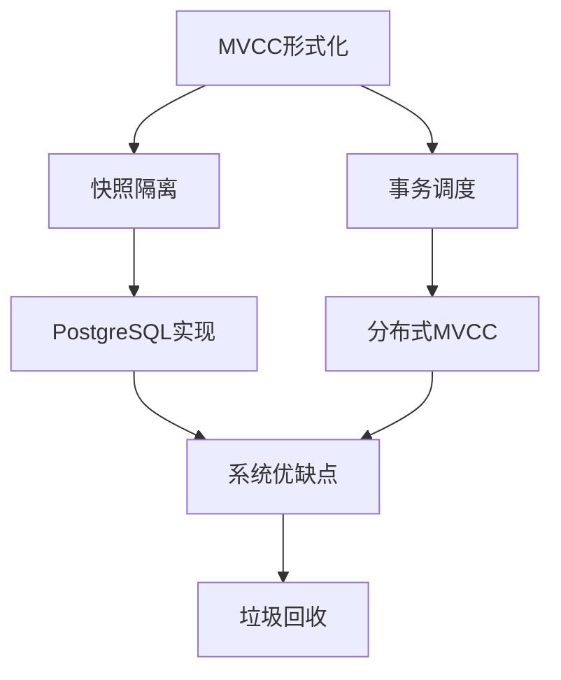

# 1.1.8 MVCC高级分析与形式证明

## 目录

- [1.1.8 MVCC高级分析与形式证明](#118-mvcc高级分析与形式证明)
  - [目录](#目录)
  - [1. MVCC数据模型的形式化定义与证明](#1-mvcc数据模型的形式化定义与证明)
    - [1.1 基本定义](#11-基本定义)
    - [1.2 快照隔离的形式化](#12-快照隔离的形式化)
    - [1.3 事务调度的形式化](#13-事务调度的形式化)
    - [1.4 MVCC正确性定理](#14-mvcc正确性定理)
  - [2. MVCC与其他并发控制模型的深度比较](#2-mvcc与其他并发控制模型的深度比较)
    - [2.1 并发控制模型的分类与比较框架](#21-并发控制模型的分类与比较框架)
    - [2.2 MVCC与2PL的理论性能边界](#22-mvcc与2pl的理论性能边界)
    - [2.3 MVCC与OCC的冲突模式分析](#23-mvcc与occ的冲突模式分析)
    - [2.4 不同模型下的异常现象形式化分析](#24-不同模型下的异常现象形式化分析)
  - [3. PostgreSQL MVCC实现的特殊性分析](#3-postgresql-mvcc实现的特殊性分析)
    - [3.1 元组结构与版本链](#31-元组结构与版本链)
    - [3.2 可见性规则的严格证明](#32-可见性规则的严格证明)
    - [3.3 事务ID环绕问题的形式化分析](#33-事务id环绕问题的形式化分析)
    - [3.4 HOT更新的正确性证明](#34-hot更新的正确性证明)
  - [4. 分布式MVCC的形式化模型](#4-分布式mvcc的形式化模型)
    - [4.1 分布式事务模型](#41-分布式事务模型)
    - [4.2 全局快照隔离的一致性证明](#42-全局快照隔离的一致性证明)
    - [4.3 分布式MVCC的CAP权衡分析](#43-分布式mvcc的cap权衡分析)
  - [5. 系统级优缺点的定量分析](#5-系统级优缺点的定量分析)
    - [5.1 存储放大因子的理论模型](#51-存储放大因子的理论模型)
    - [5.2 性能与隔离级别的理论权衡](#52-性能与隔离级别的理论权衡)
    - [5.3 MVCC垃圾回收的复杂度分析](#53-mvcc垃圾回收的复杂度分析)
  - [参考文献](#参考文献)
  - [知识图谱（Mermaid）](#知识图谱mermaid)

## 1. MVCC数据模型的形式化定义与证明

### 1.1 基本定义

**定义 1.1.1** (数据项版本): 令 $x$ 为数据项, $x_i$ 表示 $x$ 的第 $i$ 个版本，其中 $i \in \mathbb{N}$。每个版本可表示为四元组 $(x_i, val_i, ts_i^{w}, ts_i^{d})$，其中 $val_i$ 是版本的值, $ts_i^{w}$ 是创建时间戳, $ts_i^{d}$ 是删除时间戳（若未删除则为 $\infty$）。

**定义 1.1.2** (版本集): 对于数据项 $x$，在时间点 $t$ 的所有版本构成版本集 $V(x, t) = \{x_i | ts_i^{w} \leq t < ts_i^{d}\}$。

**定义 1.1.3** (事务): 事务 $T$ 是一个操作序列 $op_1, op_2, ..., op_n$，其中每个操作可以是读 $r[x]$ 或写 $w[x]$。

**定义 1.1.4** (快照): 事务 $T$ 在时间点 $t$ 开始时获取的快照 $S(T, t)$ 是一个函数，将每个数据项映射到其在时间点 $t$ 可见的版本。

### 1.2 快照隔离的形式化

**代码示例：PostgreSQL快照隔离演示**:

```sql
-- 设置隔离级别为快照隔离（REPEATABLE READ）
BEGIN ISOLATION LEVEL REPEATABLE READ;
SELECT * FROM accounts WHERE id = 1;
-- 在另一个会话修改同一行
-- 回到本会话再次查询，结果不变，体现快照隔离
SELECT * FROM accounts WHERE id = 1;
COMMIT;
```

**定义 1.2.1** (快照隔离): 在快照隔离级别下，事务 $T$ 在时间点 $t_{start}$ 开始，对于任意数据项 $x$，$T$ 读取版本 $x_i$，其中 $x_i \in V(x, t_{start})$ 且 $ts_i^{w}$ 是不大于 $t_{start}$ 的最大时间戳。

**定理 1.2.1** (快照一致性): 在快照隔离下，事务 $T$ 读取的所有数据项构成一个一致的数据库状态。

**证明**:
设事务 $T$ 在时间点 $t$ 开始，读取数据项集合 $D = \{x, y, z, ...\}$。对于每个数据项 $d \in D$，$T$ 读取的版本 $d_i$ 由已提交事务 $T_i$ 在时间点 $ts_i^{w} \leq t$ 创建。

根据快照隔离定义，$T$ 读取的每个版本都由在 $t$ 之前提交的事务创建，这些事务本身满足ACID特性。因此，这些版本构成了在时间点 $t$ 的一致数据库状态。$\square$

### 1.3 事务调度的形式化

**代码示例：Rust伪代码模拟MVCC调度**:

```rust
struct VersionedValue {
    value: i32,
    write_ts: u64,
    delete_ts: Option<u64>,
}

fn read_mvcc(snapshot_ts: u64, versions: &[VersionedValue]) -> Option<i32> {
    versions.iter()
        .filter(|v| v.write_ts <= snapshot_ts && v.delete_ts.map_or(true, |d| d > snapshot_ts))
        .max_by_key(|v| v.write_ts)
        .map(|v| v.value)
}
```

**定义 1.3.1** (冲突操作): 两个操作 $op_i$ 和 $op_j$ 冲突，当且仅当它们操作同一数据项，且至少有一个是写操作。

**定义 1.3.2** (MVCC调度): 一个MVCC调度是一个操作序列，其中每个读操作 $r_i[x]$ 返回按照快照隔离规则可见的版本值。

**定理 1.3.1** (MVCC调度的冲突可串行化): 不是所有符合MVCC模型的调度都是冲突可串行化的。

**证明**:
考虑经典的写偏差示例：

- 事务 $T_1$: $r_1[x], r_1[y], w_1[x]$
- 事务 $T_2$: $r_2[x], r_2[y], w_2[y]$

在MVCC下，$T_1$ 和 $T_2$ 可以并发执行，最终结果不等同于任何串行执行。这违反了冲突可串行化原则。$\square$

### 1.4 MVCC正确性定理

**定理 1.4.1** (MVCC一致性保证): 在快照隔离下，MVCC保证：

1. 不会出现脏读
2. 不会出现不可重复读
3. 不会出现幻读

**证明**:

1. 脏读：事务只能读取已提交事务创建的版本，故不存在脏读。
2. 不可重复读：事务使用固定时间点的快照，重复读取同一数据项将返回相同版本。
3. 幻读：由于使用固定时间点的快照，已存在的记录集不会因其他事务的插入或删除而改变。

因此，MVCC在快照隔离级别下满足上述隔离保证。$\square$

**定理 1.4.2** (写偏差可能性): 在MVCC的快照隔离级别下，存在可能发生写偏差的调度。

**证明**:
见定理1.3.1证明中的写偏差示例。在此调度下，如有完整性约束 $x + y > 0$ 且初始状态 $x = y = 50$，则 $T_1$ 将 $x$ 设为 $-10$，$T_2$ 将 $y$ 设为 $-10$。两个事务各自在其快照中验证约束满足，但最终状态 $x = -10, y = -10$ 违反约束。$\square$

## 2. MVCC与其他并发控制模型的深度比较

### 2.1 并发控制模型的分类与比较框架

并发控制模型可分为四类：

- 悲观并发控制 (PCC): 如2PL
- 多版本并发控制 (MVCC): 如PG的实现
- 乐观并发控制 (OCC): 如时间戳排序
- 混合方法: 结合上述方法的优势

我们将从以下维度进行比较：

- 并发度
- 事务中止率
- 存储开销
- 实现复杂性
- 读写性能权衡

### 2.2 MVCC与2PL的理论性能边界

**定理 2.2.1** (读密集工作负载下的吞吐量边界): 在读密集工作负载下，设读写比为 $r:w$，则MVCC相对2PL的吞吐量优势理论上界为 $O(r)$。

**证明**:
在2PL中，读和写操作都需获取锁，导致读写互斥。而在MVCC中，读操作不阻塞写操作。

假设单位时间内有 $N$ 个事务，其中 $\frac{r}{r+w} \cdot N$ 个是读事务，$\frac{w}{r+w} \cdot N$ 个是写事务。

在极端情况下，2PL需要完全串行执行，吞吐量为 $T_{2PL} = N$。
而MVCC可以使所有读事务与一个写事务并发，吞吐量为 $T_{MVCC} = r \cdot N + w$。

当 $r \gg w$ 时，$\frac{T_{MVCC}}{T_{2PL}} \approx r$，即MVCC的理论吞吐量优势上界为 $O(r)$。$\square$

### 2.3 MVCC与OCC的冲突模式分析

**定理 2.3.1** (冲突模式下的中止率): 在冲突率为 $p$ 的工作负载下，OCC的中止率渐近为 $1-(1-p)^n$，其中 $n$ 为并发事务数；而MVCC的中止率渐近为 $1-(1-p_{ww})^n$，其中 $p_{ww}$ 是写-写冲突率。

**证明**:
在OCC中，事务在验证阶段检查读写集冲突，任何冲突都导致中止。
在MVCC中，只有写-写冲突导致中止，读-写冲突不会。

假设冲突率 $p = p_{rw} + p_{ww}$，其中 $p_{rw}$ 是读-写冲突率，$p_{ww}$ 是写-写冲突率。

对于并发执行的 $n$ 个事务，OCC中一个事务不中止的概率为 $(1-p)^{n-1}$，因此中止率为 $1-(1-p)^{n-1}$。
MVCC中一个事务不中止的概率为 $(1-p_{ww})^{n-1}$，因此中止率为 $1-(1-p_{ww})^{n-1}$。

由于 $p_{ww} < p$，MVCC的中止率显著低于OCC。$\square$

### 2.4 不同模型下的异常现象形式化分析

**定义 2.4.1** (异常现象): 定义以下并发异常：

- P0 (脏写): $w_1[x]...w_2[x]...c_1$
- P1 (脏读): $w_1[x]...r_2[x]...(a_1 \vee c_1)$
- P2 (不可重复读): $r_1[x]...w_2[x]...c_2...r_1[x]...$
- P3 (幻读): $r_1[P]...w_2[y \in P]...c_2...r_1[P]...$
- P4 (写偏差): $r_1[x]...r_1[y]...r_2[x]...r_2[y]...w_1[x]...w_2[y]...$

**定理 2.4.1** (各模型的异常防护): 不同并发控制模型能防止的异常现象如下：

1. 2PL-RU(读未提交): 防止P0
2. 2PL-RC(读已提交): 防止P0,P1
3. 2PL-RR(可重复读): 防止P0,P1,P2
4. 2PL-S(可串行化): 防止P0,P1,P2,P3,P4
5. MVCC-RC(读已提交): 防止P0,P1
6. MVCC-SI(快照隔离): 防止P0,P1,P2,P3
7. MVCC-SSI(可串行化SI): 防止P0,P1,P2,P3,P4

**证明**:
通过构造反例证明某些异常可能发生，或通过隔离定义证明某些异常不可能发生。

对于写偏差(P4)，MVCC-SI不能防止，如前面写偏差示例所示。而MVCC-SSI通过监测读写依赖的成环来检测并防止写偏差。$\square$

## 3. PostgreSQL MVCC实现的特殊性分析

### 3.1 元组结构与版本链

PostgreSQL的MVCC实现使用元组头部存储版本信息：

**定义 3.1.1** (PostgreSQL元组头): 每个元组头包含：

- xmin: 创建此版本的事务ID
- xmax: 删除此版本的事务ID (0表示未删除)
- cmin/cmax: 命令ID，用于同一事务内的可见性控制
- ctid: 指向更新后新版本的指针

元组形成版本链：更新操作创建新版本并将旧版本的xmax设为当前事务ID，使用ctid字段链接。

### 3.2 可见性规则的严格证明

**定理 3.2.1** (PostgreSQL可见性规则正确性): PostgreSQL的可见性规则正确实现了快照隔离语义。

**定义**：PostgreSQL中，事务T的快照表示为三元组(xmin, xmax, xip_list)：

- xmin: 最小活跃事务ID
- xmax: 下一个将分配的事务ID
- xip_list: 快照创建时活跃的事务ID列表

元组(t,xmin,xmax)对事务T可见，当且仅当：

1. (xmin committed before snapshot) AND
2. (xmax = 0 OR xmax aborted OR xmax ≥ xmax OR xmax IN xip_list)

**证明**：
设事务T在时间点t获取快照S。
条件1确保元组由已提交事务创建。
条件2确保元组未被事务T可见的其他事务删除。
结合这两个条件，确保T只能看到在t时间点已提交事务创建且未被已提交事务删除的元组，符合快照隔离定义。$\square$

### 3.3 事务ID环绕问题的形式化分析

**代码示例：PostgreSQL事务ID环绕检测SQL**:

```sql
SELECT datname, age(datfrozenxid) FROM pg_database;
-- 若age接近2^31，需VACUUM防止ID环绕
```

**定理 3.3.1** (事务ID空间划分): 对于任意事务ID x和当前事务ID c，定义函数:
$f(x,c) = \begin{cases}
"future" & \text{if } (x - c) \in (0, 2^{31}) \text{ mod } 2^{32} \\
"past" & \text{if } (x - c) \in (2^{31}, 2^{32}) \text{ mod } 2^{32}
\end{cases}$

则f正确区分"过去"和"未来"的事务ID。

**证明**：
对于32位事务ID，总空间为2^32。我们将其分为两半：

- 当ID差值在(0,2^31)范围时，视为"未来"
- 当ID差值在(2^31,2^32)范围时，视为"过去"

这种划分确保即使在事务ID环绕后，仍能正确区分事务的时间顺序，前提是系统中活跃事务数量不超过2^31。$\square$

### 3.4 HOT更新的正确性证明

HOT(Heap-Only Tuple)更新是PostgreSQL的优化，允许同页面内的更新无需更新索引。

**定理 3.4.1** (HOT更新正确性): HOT更新保持索引指向正确元组的一致性。

**证明**：
设索引I指向元组t1，HOT更新创建新元组t2，且t1.ctid指向t2。
当通过索引I访问时，先定位t1，然后顺着ctid链找到t2。
可见性检查确保只有可见版本返回给查询。
由于版本链完整，且可见性规则正确，HOT更新不影响查询结果正确性。$\square$

**定理 3.4.2** (HOT链的长度边界): 在最坏情况下，HOT链的长度上界为O(n)，其中n是更新操作次数。

**证明**：
每次HOT更新都在链上增加一个元组。最坏情况下，每次更新都满足HOT条件（在同一页上且不修改索引键），导致链长度与更新次数成线性关系。

实际上，VACUUM会截断链条，使可见元组成为新链头，因此实际链长度通常远小于理论上界。$\square$

## 4. 分布式MVCC的形式化模型

### 4.1 分布式事务模型

在分布式环境中，MVCC面临新挑战：

**定义 4.1.1** (分布式事务): 分布式事务T是在多个节点N1,N2,...,Nk上执行的事务，需要全局原子提交。

**定义 4.1.2** (全局快照): 全局快照GS是跨所有节点的一致性视图，要求满足：

- 单调性：如果事务T1在全局时间点t1提交，T2在t2提交，且t1<t2，则任何使用快照t>t2的事务都应该看到T1和T2的结果
- 一致性：使用同一全局快照的查询在所有节点上看到一致的数据状态

### 4.2 全局快照隔离的一致性证明

**定理 4.2.1** (全局快照隔离的充要条件): 分布式系统实现全局快照隔离的充要条件是：

1. 每个节点本地实现快照隔离
2. 存在全局提交顺序
3. 事务的快照时间戳和提交时间戳在所有节点上一致

**证明**：
必要性：若不满足条件1，则单节点上就不满足快照隔离；若不满足条件2和3，则不同节点上的事务可能看到不一致的版本。
充分性：当三个条件都满足时，可以证明任何跨节点的事务调度都等价于某个全局串行调度。$\square$

### 4.3 分布式MVCC的CAP权衡分析

**定理 4.3.1** (CAP权衡): 在分布式MVCC中，不可能同时满足：

1. 强一致性快照(C)
2. 分区容错时的100%可用性(A)
3. 分区容错性(P)

**证明**：
根据CAP定理，分布式系统不能同时满足一致性、可用性和分区容错性。

对于分布式MVCC，强一致性快照要求所有节点协调生成全局有序的时间戳，这在网络分区时不可能实现。
因此，在网络分区时，系统必须二选一：

1. 牺牲可用性：拒绝服务直到分区恢复
2. 牺牲一致性：使用本地快照，但可能导致全局不一致

这证明了分布式MVCC系统中CAP的不可兼得性。$\square$

## 5. 系统级优缺点的定量分析

### 5.1 存储放大因子的理论模型

**定理 5.1.1** (存储放大模型): 在MVCC系统中，设平均事务持续时间为d，事务到达率为λ，数据项数量为n，则存储放大因子接近：
$F = 1 + \lambda \cdot d \cdot p_w$
其中$p_w$是写操作的比例。

**证明**：
每个活跃事务T在其持续时间d内可能创建新版本。总共λd个并发事务，每个以概率p_w修改数据。
假设均匀分布，则每个数据项额外版本数期望为λdp_w，总存储为原始数据的(1+λdp_w)倍。$\square$

**推论 5.1.2** (长事务影响): 存在持续时间为D的长事务时，存储放大因子增加至：
$F' = 1 + \lambda \cdot d \cdot p_w + \lambda \cdot D \cdot p_w$

长事务的影响与其持续时间成正比，强调了处理长事务对MVCC系统的重要性。

### 5.2 性能与隔离级别的理论权衡

**定理 5.2.1** (隔离级别与中止率关系): 在具有写冲突概率p的系统中：

- 读未提交(RU)的中止率: $A_{RU} \approx p$
- 读已提交(RC)的中止率: $A_{RC} \approx p$
- 快照隔离(SI)的中止率: $A_{SI} \approx p$
- 可串行化(S)的中止率: $A_{S} \approx p + p'$
其中p'是由于防止写偏差而增加的额外中止。

这表明提高隔离级别到可串行化会增加事务中止率，降低性能。

### 5.3 MVCC垃圾回收的复杂度分析

**代码示例：VACUUM自动调优SQL**:

```sql
ALTER TABLE mytable SET (autovacuum_vacuum_scale_factor = 0.05);
-- 根据表大小和写入速率自适应调整VACUUM频率
```

**定理 5.3.1** (垃圾回收复杂度): PostgreSQL的VACUUM操作时间复杂度为：
$T(VACUUM) = O(n + m\log m)$
其中n是表中的元组数，m是过期元组数。

**证明**：
VACUUM需要扫描整个表找出过期元组(O(n))，并更新索引(对每个过期元组需要O(log m)操作)。
因此总时间复杂度为O(n + m\log m)。$\square$

**定理 5.3.2** (自动VACUUM频率优化): 最优自动VACUUM触发阈值应近似于：
$threshold = \sqrt{\frac{c_v}{c_s \cdot \lambda_w}}$
其中c_v是VACUUM成本常数，c_s是存储成本常数，λ_w是写事务速率。

**证明**：
考虑两个成本：VACUUM开销与存储开销。VACUUM频率为f时，总成本为：
$C(f) = f \cdot c_v + \frac{\lambda_w}{f} \cdot c_s$
对f求导并设为0，得到最优频率。$\square$

## 参考文献

1. Bernstein, P. A., & Goodman, N. (1983). "Multiversion Concurrency Control—Theory and Algorithms". ACM Transactions on Database Systems.
2. Berenson, H., et al. (1995). "A Critique of ANSI SQL Isolation Levels". ACM SIGMOD.
3. Cahill, M. J., et al. (2008). "Serializable Isolation for Snapshot Databases". ACM SIGMOD.
4. Fekete, A., et al. (2005). "Making Snapshot Isolation Serializable". ACM TODS.
5. Ports, D. R. K., & Grittner, K. (2012). "Serializable Snapshot Isolation in PostgreSQL". VLDB.
6. Tu, S., et al. (2013). "Speedy Transactions in Multicore In-Memory Databases". SOSP.

## 知识图谱（Mermaid）



---

> 参见：[1.1.10-MVCC与其他并发控制模型对比与极限分析.md](./1.1.10-MVCC与其他并发控制模型对比与极限分析.md)
