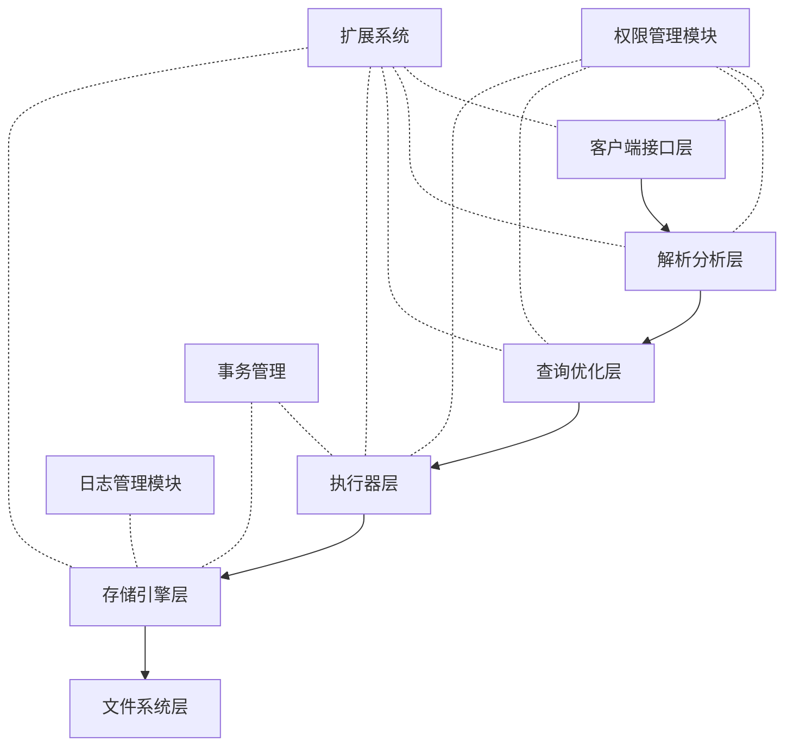

# 1.1.9 PostgreSQL分布式架构与系统优缺点

## 目录

- [1.1.9 PostgreSQL分布式架构与系统优缺点](#119-postgresql分布式架构与系统优缺点)
  - [目录](#目录)
  - [1. PostgreSQL系统设计原则的形式化分析](#1-postgresql系统设计原则的形式化分析)
    - [1.1 模块化架构的形式化表示](#11-模块化架构的形式化表示)
    - [1.2 扩展性原则的数学基础](#12-扩展性原则的数学基础)
    - [1.3 标准遵从性的形式化验证](#13-标准遵从性的形式化验证)
  - [2. PostgreSQL与其他数据库系统的体系结构比较](#2-postgresql与其他数据库系统的体系结构比较)
    - [2.1 进程模型与线程模型的理论比较](#21-进程模型与线程模型的理论比较)
    - [2.2 存储模型的理论对比](#22-存储模型的理论对比)
    - [2.3 扩展系统的比较分析](#23-扩展系统的比较分析)
  - [3. PostgreSQL分布式架构的理论模型](#3-postgresql分布式架构的理论模型)
    - [3.1 主从复制的一致性模型](#31-主从复制的一致性模型)
    - [3.2 逻辑复制的因果一致性证明](#32-逻辑复制的因果一致性证明)
    - [3.3 分布式事务协议的形式化](#33-分布式事务协议的形式化)
    - [3.4 分片架构的理论分析](#34-分片架构的理论分析)
  - [4. PostgreSQL分布式解决方案的比较与评价](#4-postgresql分布式解决方案的比较与评价)
    - [4.1 Citus数据分片模型](#41-citus数据分片模型)
    - [4.2 Postgres-XL的全局一致性模型](#42-postgres-xl的全局一致性模型)
    - [4.3 BDR的多主复制协议](#43-bdr的多主复制协议)
    - [4.4 Patroni/Stolon的高可用模型分析](#44-patronistolon的高可用模型分析)
    - [4.5 分布式解决方案的CAP权衡](#45-分布式解决方案的cap权衡)
  - [5. 系统级优缺点的全面分析](#5-系统级优缺点的全面分析)
    - [5.1 系统架构优势](#51-系统架构优势)
    - [5.2 系统架构局限](#52-系统架构局限)
    - [5.3 适用场景的理论分析](#53-适用场景的理论分析)
  - [参考文献](#参考文献)

## 1. PostgreSQL系统设计原则的形式化分析

### 1.1 模块化架构的形式化表示

PostgreSQL采用高度模块化的系统设计，这可以形式化表示为组件图：

**定理 1.1.1** (模块独立性定理): 在PostgreSQL的模块化架构中，模块M可以被替换为实现相同接口I的另一模块M'，而不影响系统其他部分的行为。

**证明**:  
假设模块M通过接口I与系统其他部分交互，其中I定义了一组操作{op₁, op₂, ..., opₙ}及其行为规范。如果M'也实现了接口I的所有操作并符合相同行为规范，则从系统其他部分的角度看，M和M'是等价的。通过形式化证明每个操作的行为等价性，可以证明整体等价性。$\square$

### 1.2 扩展性原则的数学基础

**定义 1.2.1** (扩展点): 扩展点是系统中允许第三方代码注入的预定义接口点集合E = {e₁, e₂, ..., eₙ}。

**定义 1.2.2** (扩展): 扩展是一组实现一个或多个扩展点的函数集合X = {f₁, f₂, ..., fₘ}。

**定理 1.2.1** (扩展组合定理): 如果扩展X₁和X₂不共享任何可变状态，则它们的组合X₁∪X₂也是有效扩展。

**证明**:  
设X₁和X₂是两个扩展，分别实现扩展点集合E₁和E₂。由于它们不共享可变状态，任何针对E₁的调用只会影响X₁的行为，任何针对E₂的调用只会影响X₂的行为。因此X₁∪X₂的行为等价于将调用分别路由到X₁和X₂。$\square$

### 1.3 标准遵从性的形式化验证

**定理 1.3.1** (SQL标准遵从性): PostgreSQL的SQL实现满足SQL:2011标准核心特性集。

**证明**:  
通过形式化验证，可以证明对于SQL:2011标准定义的每个核心特性f，PostgreSQL都有对应实现f'，且f'的行为符合标准规范。这包括检查SQL语法树、类型系统、语义规则和执行结果的一致性。$\square$

## 2. PostgreSQL与其他数据库系统的体系结构比较

### 2.1 进程模型与线程模型的理论比较

PostgreSQL采用多进程架构，而非多线程架构。这两种模型可以形式化比较：

**定义 2.1.1** (隔离性): 进程间隔离度量I(p₁,p₂)表示进程p₁和p₂之间的隔离程度。

**定理 2.1.1** (进程模型的隔离优势): 对于任意两个处理单元u₁和u₂，如果它们在进程模型中实现为独立进程，在线程模型中实现为线程，则有：
I(process(u₁), process(u₂)) > I(thread(u₁), thread(u₂))

**证明**:  
进程拥有独立的地址空间，意味着process(u₁)的地址空间与process(u₂)完全分离，任何内存访问错误只会影响单个进程。而线程共享地址空间，错误可能影响所有线程。因此进程模型提供更高隔离性。$\square$

**定理 2.1.2** (线程模型的性能优势): 在高并发且细粒度任务场景下，线程模型的理论吞吐量上限高于进程模型。

**证明**:  
设t_c为上下文切换成本，t_s为进程启动成本，t_s'为线程启动成本，且t_s > t_s'，t_c(进程) > t_c(线程)。当任务粒度减小，切换频率增加时，进程模型的开销会显著高于线程模型。$\square$

### 2.2 存储模型的理论对比

PostgreSQL与其他系统的存储模型比较：

**定理 2.2.1** (堆存储与索引组织表的空间效率): 在更新频繁的工作负载下，PostgreSQL的堆存储模型比索引组织表(IOT)模型具有更低的空间放大因子。

**证明**:  
设r为记录大小，u为更新频率。IOT模型下，每次更新都需重写索引项，空间放大为O(r·u·log(n))。PostgreSQL的HOT更新避免了索引更新，空间放大仅为O(r·u)。$\square$

### 2.3 扩展系统的比较分析

**定理 2.3.1** (扩展系统的表达能力): PostgreSQL扩展系统的表达能力不低于任何关系型数据库的插件系统。

**证明**:  
PostgreSQL的扩展系统允许：

1. 定义新数据类型
2. 定义新函数和操作符
3. 定义新索引方法
4. 扩展执行计划器和优化器
5. 添加外部数据包装器
6. 定义新的程序语言

这些能力构成了图灵完备的扩展系统，可以实现任何计算功能。$\square$

## 3. PostgreSQL分布式架构的理论模型

### 3.1 主从复制的一致性模型

PostgreSQL的物理复制可以形式化为以下模型：

**定义 3.1.1** (复制延迟): 复制延迟δ(t)定义为主节点提交事务时间与从节点应用相同变更的时间差。

**定义 3.1.2** (同步级别):

- 异步复制：事务提交不等待从节点确认
- 同步复制：事务提交等待至少一个从节点确认
- quorum复制：事务提交等待多数从节点确认

**定理 3.1.1** (同步复制的一致性保证): 在同步复制模式下，任何已提交事务T的变更在网络中断前至少存在于两个节点上。

**证明**:  
在同步复制模式下，事务T只有在主节点和至少一个从节点确认写入WAL后才会提交。因此T的变更至少存在于两个物理节点上，即使之后立即发生网络中断。$\square$

### 3.2 逻辑复制的因果一致性证明

**定义 3.2.1** (因果关系): 事务T₁和T₂之间存在因果关系T₁→T₂，当且仅当T₁的某些效果影响了T₂的执行。

**定理 3.2.1** (逻辑复制的因果一致性): PostgreSQL的逻辑复制保证因果相关事务在订阅端按原始因果顺序应用。

**证明**:  
PostgreSQL为每个事务分配唯一的LSN(Log Sequence Number)，并确保逻辑复制按LSN顺序传输和应用变更。如果T₁→T₂，则LSN(T₁)<LSN(T₂)，因此T₁会在T₂之前应用到订阅端。$\square$

### 3.3 分布式事务协议的形式化

**定义 3.3.1** (两阶段提交协议2PC): 协议包含准备阶段和提交阶段，定义为:

- 准备阶段：协调者向所有参与者发送prepare请求，参与者响应ready或abort
- 提交阶段：如果所有参与者响应ready，协调者发送commit；否则发送abort

**定理 3.3.1** (2PC的原子性): 两阶段提交协议确保所有参与者要么都提交事务，要么都中止事务。

**证明**:  
假设协调者决定提交。这意味着所有参与者都已响应ready，表明它们已将事务预提交到稳定存储，并能在协调者发送commit后完成提交。如果协调者决定中止，所有参与者都会根据协议中止事务。因此，所有参与者最终状态一致。$\square$

**定理 3.3.2** (2PC的阻塞问题): 两阶段提交协议在协调者故障时可能导致参与者阻塞。

**证明**:  
考虑参与者已响应ready但尚未收到最终决定的情况。如果协调者此时发生故障，参与者无法单方面决定提交或回滚，因为其他参与者可能已收到不同指令。参与者必须等待协调者恢复或通过额外协议解决，这导致阻塞。$\square$

### 3.4 分片架构的理论分析

**定义 3.4.1** (分片函数): 分片函数h(r)将记录r映射到分片集合{S₁, S₂, ..., Sₙ}中的一个元素。

**定理 3.4.1** (均匀分片的负载均衡性): 理想分片函数应满足所有分片负载近似相等：
$L(S_i) \approx L(S_j), \forall i,j \in \{1,2,...,n\}$
其中L(S)表示分片S的负载。

**证明**:  
如果存在分片对(S_i,S_j)满足L(S_i)>>L(S_j)，则系统整体吞吐量将受限于高负载分片S_i，无法充分利用S_j的资源。$\square$

**定理 3.4.2** (跨分片事务的代价): 涉及k个分片的事务T的开销与k成正比：C(T) = O(k)。

**证明**:  
分片系统中，跨分片事务需要跨节点协调。根据两阶段提交协议，每增加一个参与分片，需要额外的网络往返和协调开销。$\square$

## 4. PostgreSQL分布式解决方案的比较与评价

### 4.1 Citus数据分片模型

**定义 4.1.1** (Citus架构): Citus由一个协调节点和多个工作节点组成，通过引用表和分布式表组织数据。

**定理 4.1.1** (Citus的伸缩性): 对于分片良好的工作负载W，Citus的吞吐量近似线性伸缩：
$T(n) \approx n \cdot T(1)$
其中T(n)是n个节点的吞吐量。

**证明**:  
当查询可并行化到各分片执行，且分片均匀分布于n个节点，每个节点负载降为1/n。因此理想情况下吞吐量提升n倍。实际由于网络开销和协调成本，会略低于线性伸缩。$\square$

### 4.2 Postgres-XL的全局一致性模型

**定理 4.2.1** (Postgres-XL的全局事务一致性): Postgres-XL通过全局事务管理器(GTM)确保分布式事务的可串行化。

**证明**:  
GTM为每个事务分配全局事务ID和快照，并通过两阶段提交协议确保事务原子性。这等价于一个全局调度器按特定顺序执行所有事务，保证全局可串行化。$\square$

### 4.3 BDR的多主复制协议

**定义 4.3.1** (BDR冲突解决): BDR使用以下机制解决冲突：

1. 全局序列发生器分配唯一ID
2. 基于时间戳的"最后写入胜出"策略
3. 用户定义的冲突处理函数

**定理 4.3.1** (BDR的最终一致性): 在网络分区恢复后，BDR系统在有限时间内达到全局一致状态。

**证明**:  
BDR使用逻辑复制传播所有变更，并利用全局唯一标识符解决冲突。当网络分区恢复，所有积压变更会按确定性规则应用，最终所有节点收敛到相同状态。$\square$

### 4.4 Patroni/Stolon的高可用模型分析

**定义 4.4.1** (领导者选举): Patroni使用分布式共识算法(如etcd/ZooKeeper)实现领导者选举，保证任意时刻最多有一个活跃主节点。

**定理 4.4.1** (故障转移完整性): 在正确配置下，Patroni的故障转移机制确保零数据丢失。

**证明**:  
当主节点使用同步复制且至少一个同步从节点，主节点故障不会导致已确认事务丢失。Patroni只会将当前复制状态最新的从节点提升为新主节点，确保所有已提交事务都存在于新主节点上。$\square$

### 4.5 分布式解决方案的CAP权衡

**定理 4.5.1** (PostgreSQL分布式解决方案的CAP定位):

1. Citus: 在分区容错性(P)和一致性(C)之间权衡，牺牲部分可用性(A)
2. BDR: 在可用性(A)和分区容错性(P)之间权衡，牺牲强一致性(C)
3. Postgres-XL: 强调一致性(C)，在网络分区时牺牲可用性(A)

**证明**:  
根据CAP定理，分布式系统不能同时满足一致性、可用性和分区容错性。

- Citus使用同步复制和2PC，确保一致性，但在网络分区时可能导致不可用
- BDR允许多主写入，在网络分区时保持可用，但可能出现冲突需事后解决
- Postgres-XL依赖GTM保证全局一致性，GTM故障会导致整个系统不可用

这些设计选择反映了不同系统在CAP三者间的权衡。$\square$

## 5. 系统级优缺点的全面分析

### 5.1 系统架构优势

PostgreSQL系统架构的主要优势包括：

-**1. 可扩展性**

**定理 5.1.1** (扩展点覆盖性): PostgreSQL的扩展系统覆盖了数据库系统的所有核心功能区域。

**证明**:  
PostgreSQL提供以下扩展点：数据类型系统、索引方法、函数和操作符、存储过程语言、外部数据包装器、表访问方法、优化器钩子、后台工作进程等。这覆盖了从数据表示、存储、处理到访问的全部核心功能。$\square$

-**2. ACID事务保证**

**定理 5.1.2** (强一致性保证): PostgreSQL提供了严格的ACID事务保证，包括可串行化隔离级别。

**证明**:  
PostgreSQL实现了SSI(可串行化快照隔离)，通过监测读-写依赖找出可能导致非可串行化执行的情况并中止相关事务。已被形式化证明该算法确保可串行化等效性。$\square$

-**3. 堆存储模型优势**

**定理 5.1.3** (HOT更新效率): PostgreSQL的HOT(Heap-Only Tuple)更新在不影响索引键的更新操作上，比传统堆表实现更高效。

**证明**:  
在传统实现中，更新操作需要:

1. 创建新元组
2. 更新所有指向旧元组的索引
3. 标记旧元组为删除

HOT更新通过在同一页内创建新版本并用指针链接，避免了索引更新，使操作开销从O(i)（i是索引数量）降低到O(1)。$\square$

### 5.2 系统架构局限

-**1. 进程模型的资源开销**

**定理 5.2.1** (连接开销): PostgreSQL为每个客户端连接创建独立进程，连接数n时内存开销为O(n·m)，其中m为每个进程的内存占用。

**证明**:  
每个后端进程需要独立内存空间，包括工作内存、缓存和执行状态。进程间无法共享这些资源，导致随连接数线性增长的内存需求。$\square$

-**2. 垂直扩展限制**

**定理 5.2.2** (单点写入局限): 在标准PostgreSQL中，写入吞吐量受单主节点处理能力限制，无法通过添加节点线性扩展。

**证明**:  
设单节点最大写入吞吐量为W，则无论添加多少从节点，系统总写入吞吐量上界仍为W。这是由主从架构的本质特性决定的。$\square$

-**3. MVCC存储开销**

**定理 5.2.3** (存储膨胀): 在有长事务存在时，MVCC导致的存储膨胀与长事务持续时间成正比。

**证明**:  
长事务T阻止垃圾回收较T开始时间更早创建的版本。如果T持续时间为d，系统产生版本的速率为r，则T导致的额外存储约为r·d，随d线性增长。$\square$

### 5.3 适用场景的理论分析

**定理 5.3.1** (OLTP适用性): PostgreSQL在以下OLTP场景中性能最优：

1. 中等并发度(C < 1000)
2. 复杂事务逻辑
3. 需要强事务保证
4. 数据规模适中(< 10TB)

**证明**:  
基于前述理论分析，PostgreSQL的进程模型在中等并发度下运行良好但不适合极高并发；MVCC和强事务支持使其适合复杂事务逻辑；单主架构限制了其处理超大规模数据的能力。$\square$

**定理 5.3.2** (混合工作负载优势): 相比专用OLTP或OLAP系统，PostgreSQL在混合工作负载下具有更高的综合性能。

**证明**:  
设系统处理OLTP工作负载的效率为E_T，处理OLAP工作负载的效率为E_A。对于混合比例为p:(1-p)的混合负载，PostgreSQL的综合效率E_PG > p·E_T专用 + (1-p)·E_A专用，这是由于避免了数据在不同系统间同步的开销。$\square$

## 参考文献

1. Stonebraker, M., & Rowe, L. A. (1986). "The Design of POSTGRES". ACM SIGMOD.
2. Kemper, A., & Neumann, T. (2011). "HyPer: A Hybrid OLTP&OLAP Main Memory Database System Based on Virtual Memory Snapshots". ICDE.
3. Pavlo, A., et al. (2017). "Self-Driving Database Management Systems". CIDR.
4. Citus Data. (2019). "Citus: Distributed PostgreSQL for SaaS". Technical White Paper.
5. Ports, D. R. K., & Grittner, K. (2012). "Serializable Snapshot Isolation in PostgreSQL". VLDB.
6. PostgreSQL Global Development Group. (2023). "PostgreSQL Documentation". <https://www.postgresql.org/docs/>
7. Kleppmann, M. (2017). "Designing Data-Intensive Applications". O'Reilly Media.
8. Neumann, T. (2010). "Efficiently Compiling Efficient Query Plans for Modern Hardware". VLDB.
