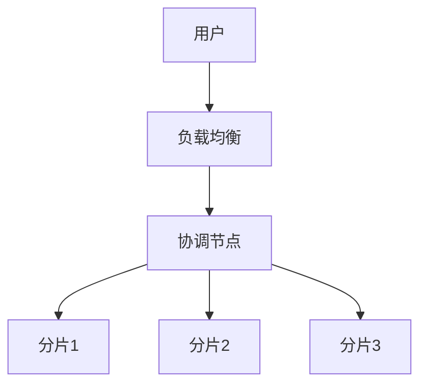

# 1.1.9 分布式PostgreSQL架构设计

## 1.1.9.1 分布式架构模式
- 主从复制、读写分离、分片集群。
- 典型方案：Citus、Greenplum、PostgreSQL-XL。

## 1.1.9.2 数据分片与复制
| 模式 | 说明 | 适用场景 |
|------|------|----------|
| 主从复制 | 一主多从，读写分离 | 读多写少 |
| 分片集群 | 水平分片，并行处理 | 大数据量 |
| 多主复制 | 多写节点，高可用 | 高可用需求 |

## 1.1.9.3 行业案例与多表征

### 互联网行业：Citus分片集群


### 金融行业：Greenplum数据仓库
- 见[3.5.1-数据分析基础理论](../../../../3-数据模型与算法/3.5-数据分析与ETL/3.5.1-数据分析基础理论.md)

### Latex公式
$$
\text{分片数} = \lceil \frac{\text{总数据量}}{\text{单分片容量}} \rceil
$$

### 配置示例
```yaml
citus:
  shard_count: 32
  replication_factor: 2
```

[返回PostgreSQL导航](README.md) 