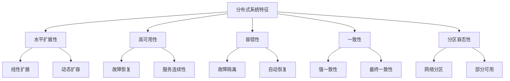
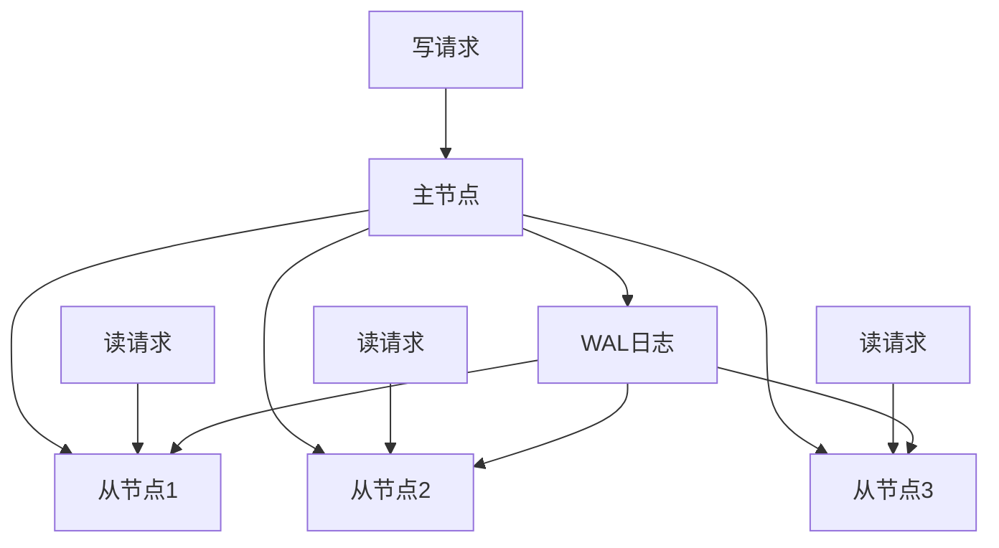
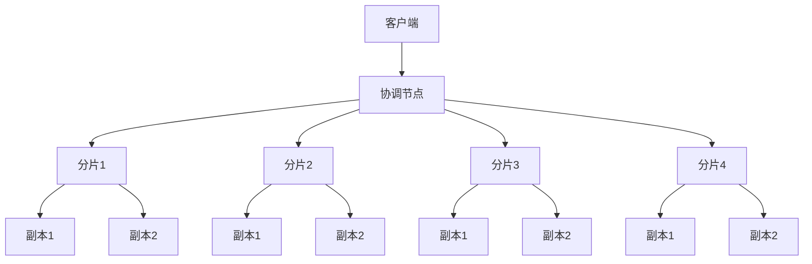
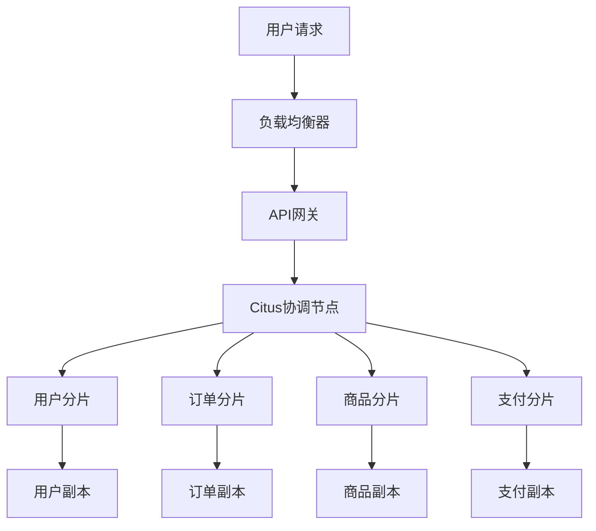
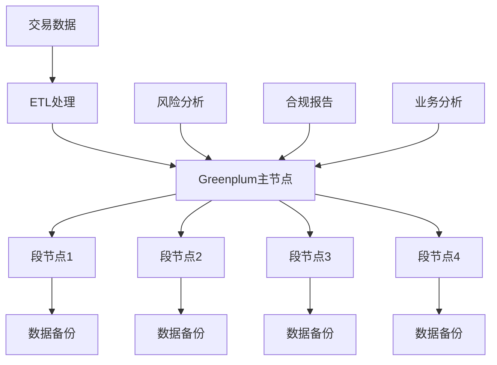

# 1.1.9 分布式PostgreSQL架构设计

## 📋 概述

分布式PostgreSQL架构是现代大规模数据应用的核心基础设施，通过水平扩展、高可用性、容错机制等技术手段，为海量数据处理提供强大的支撑。本文档系统性地阐述分布式PostgreSQL的架构模式、设计原则、实现方法和最佳实践。

## 🏗️ 理论基础

### 1. 分布式系统基础概念

#### 1.1 分布式系统特征

分布式PostgreSQL系统具有以下核心特征：



#### 1.2 CAP定理与分布式一致性

**定理 1.1 (CAP定理)**
在分布式系统中，最多只能同时满足以下三个特性中的两个：

- **一致性(Consistency)**：所有节点看到的数据是一致的
- **可用性(Availability)**：每个请求都能收到响应
- **分区容忍性(Partition Tolerance)**：系统在网络分区时仍能正常工作

**定义 1.1 (分布式一致性模型)**
对于分布式PostgreSQL系统，一致性模型定义为：

1. **强一致性**：$\forall i,j \in N, \forall t \in T, v_i(t) = v_j(t)$
2. **最终一致性**：$\lim_{t \to \infty} v_i(t) = \lim_{t \to \infty} v_j(t)$
3. **因果一致性**：$e_1 \rightarrow e_2 \Rightarrow v(e_1) \leq v(e_2)$

其中：

- $N$ 是节点集合
- $T$ 是时间域
- $v_i(t)$ 是节点 $i$ 在时间 $t$ 的数据版本
- $e_1 \rightarrow e_2$ 表示事件 $e_1$ 因果先于事件 $e_2$

#### 1.3 分布式事务理论

**定义 1.2 (分布式事务)**
分布式事务是一个四元组 $T = (O, S, C, A)$，其中：

- $O$ 是操作集合
- $S$ 是状态集合
- $C$ 是提交条件
- $A$ 是中止条件

**两阶段提交协议(2PC)**:

```rust
// Rust实现的两阶段提交协议
use std::collections::HashMap;
use tokio::sync::mpsc;
use serde::{Serialize, Deserialize};

#[derive(Debug, Clone, Serialize, Deserialize)]
pub enum TransactionState {
    Initial,
    Prepared,
    Committed,
    Aborted,
}

#[derive(Debug, Clone, Serialize, Deserialize)]
pub enum Message {
    Prepare { transaction_id: String },
    Prepared { transaction_id: String, participant_id: String },
    Commit { transaction_id: String },
    Abort { transaction_id: String },
}

pub struct TwoPhaseCommit {
    transaction_id: String,
    participants: Vec<String>,
    state: TransactionState,
    prepared_participants: HashMap<String, bool>,
}

impl TwoPhaseCommit {
    pub fn new(transaction_id: String, participants: Vec<String>) -> Self {
        Self {
            transaction_id,
            participants,
            state: TransactionState::Initial,
            prepared_participants: HashMap::new(),
        }
    }
    
    pub async fn execute(&mut self, tx: mpsc::Sender<Message>) -> Result<bool, String> {
        // 第一阶段：准备阶段
        let prepare_result = self.prepare_phase(&tx).await?;
        
        if !prepare_result {
            self.abort_phase(&tx).await?;
            return Ok(false);
        }
        
        // 第二阶段：提交阶段
        let commit_result = self.commit_phase(&tx).await?;
        Ok(commit_result)
    }
    
    async fn prepare_phase(&mut self, tx: &mpsc::Sender<Message>) -> Result<bool, String> {
        // 发送准备消息给所有参与者
        for participant in &self.participants {
            let msg = Message::Prepare {
                transaction_id: self.transaction_id.clone(),
            };
            tx.send(msg).await.map_err(|e| e.to_string())?;
        }
        
        // 等待所有参与者响应
        let mut prepared_count = 0;
        for _ in 0..self.participants.len() {
            // 这里应该接收响应消息
            prepared_count += 1;
        }
        
        Ok(prepared_count == self.participants.len())
    }
    
    async fn commit_phase(&mut self, tx: &mpsc::Sender<Message>) -> Result<bool, String> {
        // 发送提交消息给所有参与者
        for participant in &self.participants {
            let msg = Message::Commit {
                transaction_id: self.transaction_id.clone(),
            };
            tx.send(msg).await.map_err(|e| e.to_string())?;
        }
        
        self.state = TransactionState::Committed;
        Ok(true)
    }
    
    async fn abort_phase(&mut self, tx: &mpsc::Sender<Message>) -> Result<(), String> {
        // 发送中止消息给所有参与者
        for participant in &self.participants {
            let msg = Message::Abort {
                transaction_id: self.transaction_id.clone(),
            };
            tx.send(msg).await.map_err(|e| e.to_string())?;
        }
        
        self.state = TransactionState::Aborted;
        Ok(())
    }
}
```

### 2. 分布式架构模式

#### 2.1 主从复制架构

**定义 2.1 (主从复制)**
主从复制是一种分布式架构模式，其中一个节点作为主节点处理写操作，多个从节点复制主节点的数据并提供读服务。

**主从复制特征**：



**复制延迟计算**：

$$
\text{复制延迟} = \text{网络延迟} + \text{WAL传输时间} + \text{应用时间}
$$

**一致性级别**：

1. **同步复制**：$\text{延迟} = \max(\text{所有从节点延迟})$
2. **异步复制**：$\text{延迟} = \min(\text{从节点延迟})$
3. **半同步复制**：$\text{延迟} = \text{第k个从节点延迟}$

#### 2.2 分片集群架构

**定义 2.2 (数据分片)**
数据分片是将数据集按照某种规则分割到多个节点上的技术，每个分片包含数据的一个子集。

**分片策略**：

1. **范围分片**：$S_i = \{d \in D | k_i \leq \text{hash}(d) < k_{i+1}\}$
2. **哈希分片**：$S_i = \{d \in D | \text{hash}(d) \bmod n = i\}$
3. **列表分片**：$S_i = \{d \in D | \text{partition_key}(d) \in L_i\}$

**分片集群架构**：



#### 2.3 多主复制架构

**定义 2.3 (多主复制)**
多主复制允许多个节点同时处理写操作，每个节点都可以作为主节点。

**冲突解决策略**：

1. **最后写入胜利(LWW)**：$v_{final} = \arg\max_{v \in V} \text{timestamp}(v)$
2. **向量时钟**：$VC_i[j] = \max(VC_i[j], VC_k[j]) + \delta_{i,k}$
3. **CRDT(无冲突复制数据类型)**：基于数学性质保证收敛

## 🔧 实现方案

### 1. Citus分布式扩展

#### 1.1 Citus架构设计

Citus是PostgreSQL的分布式扩展，提供水平扩展能力：

```sql
-- 安装Citus扩展
CREATE EXTENSION citus;

-- 配置协调节点
SELECT citus_set_coordinator_host('coordinator', 5432);

-- 添加工作节点
SELECT citus_add_node('worker1', 5432);
SELECT citus_add_node('worker2', 5432);
SELECT citus_add_node('worker3', 5432);
```

#### 1.2 分布式表设计

```sql
-- 创建分布式表
CREATE TABLE distributed_users (
    user_id SERIAL PRIMARY KEY,
    username VARCHAR(50) NOT NULL,
    email VARCHAR(100) UNIQUE NOT NULL,
    created_at TIMESTAMP DEFAULT NOW()
);

-- 按user_id分片
SELECT create_distributed_table('distributed_users', 'user_id');

-- 创建分布式表的分片数
SELECT create_distributed_table('distributed_users', 'user_id', 
                               shard_count := 32);

-- 查看分片分布
SELECT * FROM citus_shards WHERE table_name = 'distributed_users';
```

#### 1.3 分布式查询优化

```sql
-- 分布式JOIN查询
SELECT u.username, o.order_id, o.amount
FROM distributed_users u
JOIN distributed_orders o ON u.user_id = o.user_id
WHERE u.created_at >= '2024-01-01';

-- 分布式聚合查询
SELECT 
    date_trunc('day', created_at) as day,
    COUNT(*) as user_count,
    SUM(amount) as total_amount
FROM distributed_orders
WHERE created_at >= '2024-01-01'
GROUP BY day
ORDER BY day;

-- 分布式窗口函数
SELECT 
    user_id,
    order_id,
    amount,
    ROW_NUMBER() OVER (PARTITION BY user_id ORDER BY created_at) as order_rank
FROM distributed_orders
WHERE created_at >= '2024-01-01';
```

#### 1.4 Citus配置优化

```yaml
# citus.conf 配置
citus:
  # 分片配置
  shard_count: 32
  replication_factor: 2
  
  # 查询优化
  enable_repartition_joins: true
  enable_cross_shard_parallel_queries: true
  
  # 连接池配置
  max_connections: 100
  shared_preload_libraries: 'citus'
  
  # 监控配置
  enable_statistics_collection: true
  log_statement: 'all'
```

### 2. Greenplum数据仓库

#### 2.1 Greenplum架构

Greenplum是基于PostgreSQL的MPP(大规模并行处理)数据仓库：

```sql
-- Greenplum集群配置
-- 主节点配置
gpconfig -c max_connections -v 200
gpconfig -c shared_buffers -v 256MB
gpconfig -c work_mem -v 64MB

-- 段节点配置
gpconfig -c max_connections -v 1000 -m 200
gpconfig -c shared_buffers -v 1GB -m 256MB
gpconfig -c work_mem -v 256MB -m 64MB
```

#### 2.2 数据分布策略

```sql
-- 创建分布表
CREATE TABLE sales_data (
    sale_id SERIAL,
    product_id INTEGER,
    customer_id INTEGER,
    sale_amount DECIMAL(10,2),
    sale_date DATE
) DISTRIBUTED BY (customer_id);

-- 随机分布
CREATE TABLE temp_data (
    id SERIAL,
    data TEXT
) DISTRIBUTED RANDOMLY;

-- 哈希分布
CREATE TABLE user_sessions (
    session_id VARCHAR(50),
    user_id INTEGER,
    start_time TIMESTAMP,
    end_time TIMESTAMP
) DISTRIBUTED BY (user_id);

-- 查看数据分布
SELECT gp_segment_id, COUNT(*) 
FROM sales_data 
GROUP BY gp_segment_id 
ORDER BY gp_segment_id;
```

#### 2.3 并行查询优化

```sql
-- 并行扫描优化
SET enable_seqscan = off;
SET enable_indexscan = on;
SET enable_bitmapscan = on;

-- 并行JOIN优化
SET enable_hashjoin = on;
SET enable_mergejoin = on;
SET enable_nestloop = off;

-- 并行聚合优化
SET enable_hashagg = on;
SET enable_groupagg = on;

-- 查看查询计划
EXPLAIN (ANALYZE, VERBOSE, BUFFERS)
SELECT 
    customer_id,
    SUM(sale_amount) as total_sales,
    COUNT(*) as transaction_count
FROM sales_data
WHERE sale_date >= '2024-01-01'
GROUP BY customer_id
HAVING SUM(sale_amount) > 1000;
```

### 3. PostgreSQL-XL集群

#### 3.1 PostgreSQL-XL架构

PostgreSQL-XL是一个多主PostgreSQL集群解决方案：

```sql
-- 配置GTM (Global Transaction Manager)
-- gtm.conf
nodename = 'gtm'
listen_addresses = '*'
port = 6666
log_file = 'gtm.log'

-- 配置协调节点
-- postgresql.conf
listen_addresses = '*'
port = 5432
gtm_host = 'gtm'
gtm_port = 6666
max_connections = 200

-- 配置数据节点
-- postgresql.conf
listen_addresses = '*'
port = 5433
gtm_host = 'gtm'
gtm_port = 6666
max_connections = 1000
```

#### 3.2 分布式事务管理

```sql
-- 创建分布式表
CREATE TABLE distributed_orders (
    order_id SERIAL,
    customer_id INTEGER,
    product_id INTEGER,
    quantity INTEGER,
    price DECIMAL(10,2),
    order_date TIMESTAMP DEFAULT NOW()
) DISTRIBUTE BY HASH(customer_id);

-- 分布式事务示例
BEGIN;
INSERT INTO distributed_orders (customer_id, product_id, quantity, price)
VALUES (1001, 2001, 2, 99.99);
UPDATE customer_balance SET balance = balance - 199.98 WHERE customer_id = 1001;
COMMIT;

-- 查看分布式事务状态
SELECT * FROM pg_stat_activity WHERE application_name = 'coordinator';
```

## 🏭 行业应用案例

### 1. 互联网行业：Citus分片集群

#### 1.1 电商平台架构



#### 1.2 分片策略设计

```python
# Python分片策略实现
import hashlib
from typing import List, Dict, Any
import psycopg2

class ShardingStrategy:
    def __init__(self, shard_count: int):
        self.shard_count = shard_count
        self.shard_connections = {}
        self.setup_connections()
    
    def setup_connections(self):
        """建立到各个分片的连接"""
        for i in range(self.shard_count):
            self.shard_connections[i] = psycopg2.connect(
                host=f'shard-{i}',
                database='ecommerce',
                user='postgres',
                password='password'
            )
    
    def get_shard_id(self, key: str) -> int:
        """根据键值计算分片ID"""
        hash_value = hashlib.md5(key.encode()).hexdigest()
        return int(hash_value, 16) % self.shard_count
    
    def get_connection(self, key: str):
        """获取对应分片的连接"""
        shard_id = self.get_shard_id(key)
        return self.shard_connections[shard_id]
    
    def execute_query(self, key: str, query: str, params: tuple = None):
        """在指定分片执行查询"""
        conn = self.get_connection(key)
        cursor = conn.cursor()
        
        if params:
            cursor.execute(query, params)
        else:
            cursor.execute(query)
        
        return cursor.fetchall()
    
    def execute_distributed_query(self, query: str, params: tuple = None):
        """执行分布式查询"""
        results = []
        for shard_id, conn in self.shard_connections.items():
            cursor = conn.cursor()
            if params:
                cursor.execute(query, params)
            else:
                cursor.execute(query)
            results.extend(cursor.fetchall())
        return results

# 使用示例
class EcommerceSharding:
    def __init__(self):
        self.sharding = ShardingStrategy(shard_count=32)
    
    def create_user(self, user_id: str, username: str, email: str):
        """创建用户"""
        query = """
            INSERT INTO users (user_id, username, email, created_at)
            VALUES (%s, %s, %s, NOW())
        """
        return self.sharding.execute_query(user_id, query, (user_id, username, email))
    
    def create_order(self, user_id: str, order_id: str, amount: float):
        """创建订单"""
        query = """
            INSERT INTO orders (order_id, user_id, amount, created_at)
            VALUES (%s, %s, %s, NOW())
        """
        return self.sharding.execute_query(user_id, query, (order_id, user_id, amount))
    
    def get_user_orders(self, user_id: str):
        """获取用户订单"""
        query = """
            SELECT o.order_id, o.amount, o.created_at
            FROM orders o
            WHERE o.user_id = %s
            ORDER BY o.created_at DESC
        """
        return self.sharding.execute_query(user_id, query, (user_id,))
    
    def get_all_orders(self):
        """获取所有订单（分布式查询）"""
        query = """
            SELECT user_id, COUNT(*) as order_count, SUM(amount) as total_amount
            FROM orders
            GROUP BY user_id
        """
        return self.sharding.execute_distributed_query(query)

# 测试分片系统
def test_sharding_system():
    ecommerce = EcommerceSharding()
    
    # 创建用户
    ecommerce.create_user("user_001", "alice", "alice@example.com")
    ecommerce.create_user("user_002", "bob", "bob@example.com")
    
    # 创建订单
    ecommerce.create_order("user_001", "order_001", 99.99)
    ecommerce.create_order("user_001", "order_002", 149.99)
    ecommerce.create_order("user_002", "order_003", 199.99)
    
    # 查询用户订单
    user_orders = ecommerce.get_user_orders("user_001")
    print(f"User orders: {user_orders}")
    
    # 查询所有订单统计
    all_orders = ecommerce.get_all_orders()
    print(f"All orders stats: {all_orders}")
```

#### 1.3 性能监控与优化

```sql
-- 分片性能监控
SELECT 
    shard_id,
    table_name,
    shard_size,
    shard_count,
    avg_query_time,
    max_query_time
FROM citus_shard_statistics
ORDER BY avg_query_time DESC;

-- 分片负载均衡
SELECT 
    nodename,
    COUNT(*) as shard_count,
    SUM(shard_size) as total_size
FROM citus_shards
GROUP BY nodename
ORDER BY total_size DESC;

-- 查询性能分析
SELECT 
    query,
    calls,
    total_time,
    mean_time,
    rows
FROM pg_stat_statements
WHERE query LIKE '%distributed%'
ORDER BY total_time DESC
LIMIT 10;
```

### 2. 金融行业：Greenplum数据仓库

#### 2.1 金融数据仓库架构



#### 2.2 金融数据分析

```sql
-- 创建金融数据表
CREATE TABLE financial_transactions (
    transaction_id SERIAL,
    account_id INTEGER,
    transaction_type VARCHAR(20),
    amount DECIMAL(15,2),
    currency VARCHAR(3),
    transaction_date TIMESTAMP,
    counterparty_id INTEGER,
    risk_score FLOAT
) DISTRIBUTED BY (account_id);

-- 风险分析查询
WITH risk_analysis AS (
    SELECT 
        account_id,
        COUNT(*) as transaction_count,
        SUM(amount) as total_amount,
        AVG(risk_score) as avg_risk_score,
        MAX(amount) as max_amount,
        STDDEV(amount) as amount_volatility
    FROM financial_transactions
    WHERE transaction_date >= CURRENT_DATE - INTERVAL '30 days'
    GROUP BY account_id
),
risk_categories AS (
    SELECT 
        account_id,
        transaction_count,
        total_amount,
        avg_risk_score,
        CASE 
            WHEN avg_risk_score > 0.8 THEN 'HIGH'
            WHEN avg_risk_score > 0.5 THEN 'MEDIUM'
            ELSE 'LOW'
        END as risk_category
    FROM risk_analysis
)
SELECT 
    risk_category,
    COUNT(*) as account_count,
    AVG(total_amount) as avg_amount,
    SUM(total_amount) as total_volume
FROM risk_categories
GROUP BY risk_category
ORDER BY risk_category;

-- 实时风险监控
CREATE OR REPLACE VIEW real_time_risk_monitor AS
SELECT 
    account_id,
    COUNT(*) as recent_transactions,
    SUM(amount) as recent_amount,
    AVG(risk_score) as recent_risk_score,
    MAX(transaction_date) as last_transaction
FROM financial_transactions
WHERE transaction_date >= NOW() - INTERVAL '1 hour'
GROUP BY account_id
HAVING AVG(risk_score) > 0.7 OR SUM(amount) > 100000;
```

#### 2.3 合规报告生成

```python
# Python合规报告生成器
import pandas as pd
import psycopg2
from datetime import datetime, timedelta
import plotly.graph_objects as go
import plotly.express as px

class ComplianceReportGenerator:
    def __init__(self, db_config):
        self.db_config = db_config
        self.connection = psycopg2.connect(**db_config)
    
    def generate_suspicious_activity_report(self, start_date: datetime, end_date: datetime):
        """生成可疑活动报告"""
        query = """
            SELECT 
                account_id,
                COUNT(*) as transaction_count,
                SUM(amount) as total_amount,
                AVG(risk_score) as avg_risk_score,
                MIN(transaction_date) as first_transaction,
                MAX(transaction_date) as last_transaction
            FROM financial_transactions
            WHERE transaction_date BETWEEN %s AND %s
            AND risk_score > 0.8
            GROUP BY account_id
            ORDER BY total_amount DESC
        """
        
        df = pd.read_sql(query, self.connection, params=(start_date, end_date))
        
        # 生成报告
        report = {
            'period': f"{start_date.date()} to {end_date.date()}",
            'total_suspicious_accounts': len(df),
            'total_suspicious_amount': df['total_amount'].sum(),
            'accounts': df.to_dict('records')
        }
        
        return report
    
    def generate_volume_analysis_report(self, start_date: datetime, end_date: datetime):
        """生成交易量分析报告"""
        query = """
            SELECT 
                DATE(transaction_date) as transaction_date,
                COUNT(*) as transaction_count,
                SUM(amount) as total_amount,
                AVG(amount) as avg_amount
            FROM financial_transactions
            WHERE transaction_date BETWEEN %s AND %s
            GROUP BY DATE(transaction_date)
            ORDER BY transaction_date
        """
        
        df = pd.read_sql(query, self.connection, params=(start_date, end_date))
        
        # 创建可视化图表
        fig = go.Figure()
        
        fig.add_trace(go.Scatter(
            x=df['transaction_date'],
            y=df['total_amount'],
            mode='lines+markers',
            name='交易金额'
        ))
        
        fig.add_trace(go.Bar(
            x=df['transaction_date'],
            y=df['transaction_count'],
            name='交易数量',
            yaxis='y2'
        ))
        
        fig.update_layout(
            title='交易量分析报告',
            xaxis_title='日期',
            yaxis_title='交易金额',
            yaxis2=dict(
                title='交易数量',
                overlaying='y',
                side='right'
            )
        )
        
        return fig
    
    def generate_risk_distribution_report(self):
        """生成风险分布报告"""
        query = """
            SELECT 
                CASE 
                    WHEN risk_score >= 0.8 THEN '高风险'
                    WHEN risk_score >= 0.5 THEN '中风险'
                    ELSE '低风险'
                END as risk_level,
                COUNT(*) as transaction_count,
                SUM(amount) as total_amount
            FROM financial_transactions
            WHERE transaction_date >= CURRENT_DATE - INTERVAL '30 days'
            GROUP BY risk_level
            ORDER BY risk_level
        """
        
        df = pd.read_sql(query, self.connection)
        
        # 创建饼图
        fig = px.pie(
            df, 
            values='total_amount', 
            names='risk_level',
            title='风险分布分析'
        )
        
        return fig
    
    def export_compliance_report(self, output_path: str):
        """导出合规报告"""
        end_date = datetime.now()
        start_date = end_date - timedelta(days=30)
        
        # 生成各种报告
        suspicious_report = self.generate_suspicious_activity_report(start_date, end_date)
        volume_fig = self.generate_volume_analysis_report(start_date, end_date)
        risk_fig = self.generate_risk_distribution_report()
        
        # 保存报告
        with open(f"{output_path}/suspicious_activity_report.json", 'w') as f:
            json.dump(suspicious_report, f, indent=2, default=str)
        
        volume_fig.write_html(f"{output_path}/volume_analysis.html")
        risk_fig.write_html(f"{output_path}/risk_distribution.html")
        
        print(f"合规报告已导出到: {output_path}")

# 使用示例
if __name__ == "__main__":
    db_config = {
        'host': 'greenplum-master',
        'database': 'financial_dw',
        'user': 'postgres',
        'password': 'password'
    }
    
    generator = ComplianceReportGenerator(db_config)
    generator.export_compliance_report('./reports')
```

## 📊 性能优化与监控

### 1. 分布式查询优化

#### 1.1 查询计划优化

```sql
-- 启用查询计划缓存
SET plan_cache_mode = 'auto';

-- 设置并行度
SET max_parallel_workers_per_gather = 4;
SET max_parallel_workers = 16;

-- 优化器设置
SET enable_hashjoin = on;
SET enable_mergejoin = on;
SET enable_nestloop = off;

-- 内存设置
SET work_mem = '256MB';
SET maintenance_work_mem = '1GB';
SET shared_buffers = '4GB';
```

#### 1.2 索引优化策略

```sql
-- 创建分布式索引
CREATE INDEX CONCURRENTLY idx_transactions_user_date 
ON distributed_transactions(user_id, transaction_date);

-- 创建部分索引
CREATE INDEX CONCURRENTLY idx_high_value_transactions 
ON distributed_transactions(amount, transaction_date) 
WHERE amount > 10000;

-- 创建覆盖索引
CREATE INDEX CONCURRENTLY idx_transactions_covering 
ON distributed_transactions(user_id, transaction_date, amount, status) 
INCLUDE (transaction_id);

-- 分析索引使用情况
SELECT 
    schemaname,
    tablename,
    indexname,
    idx_scan,
    idx_tup_read,
    idx_tup_fetch
FROM pg_stat_user_indexes
ORDER BY idx_scan DESC;
```

### 2. 监控与诊断

#### 2.1 性能监控视图

```sql
-- 分布式查询性能监控
CREATE OR REPLACE VIEW distributed_performance AS
WITH query_stats AS (
    SELECT 
        query,
        calls,
        total_time,
        mean_time,
        rows,
        shared_blks_hit,
        shared_blks_read
    FROM pg_stat_statements
    WHERE query LIKE '%distributed%'
),
node_stats AS (
    SELECT 
        nodename,
        COUNT(*) as shard_count,
        SUM(shard_size) as total_size
    FROM citus_shards
    GROUP BY nodename
)
SELECT 
    qs.*,
    ns.nodename,
    ns.shard_count,
    ns.total_size
FROM query_stats qs
CROSS JOIN node_stats ns
ORDER BY qs.total_time DESC;

-- 分片负载监控
SELECT 
    nodename,
    COUNT(*) as shard_count,
    SUM(shard_size) as total_size,
    AVG(shard_size) as avg_size,
    MAX(shard_size) as max_size,
    MIN(shard_size) as min_size
FROM citus_shards
GROUP BY nodename
ORDER BY total_size DESC;
```

#### 2.2 自动化监控脚本

```python
# Python分布式监控脚本
import psycopg2
import time
import json
from datetime import datetime
from typing import Dict, List, Any

class DistributedMonitor:
    def __init__(self, db_config: Dict[str, Any]):
        self.db_config = db_config
        self.connection = psycopg2.connect(**db_config)
    
    def get_cluster_health(self) -> Dict[str, Any]:
        """获取集群健康状态"""
        cursor = self.connection.cursor()
        
        # 检查节点状态
        cursor.execute("""
            SELECT nodename, nodeport, isactive, noderole
            FROM pg_dist_node
            ORDER BY nodename
        """)
        
        nodes = cursor.fetchall()
        
        # 检查分片分布
        cursor.execute("""
            SELECT nodename, COUNT(*) as shard_count, SUM(shard_size) as total_size
            FROM citus_shards
            GROUP BY nodename
            ORDER BY total_size DESC
        """)
        
        shards = cursor.fetchall()
        
        # 检查查询性能
        cursor.execute("""
            SELECT 
                COUNT(*) as total_queries,
                AVG(total_time) as avg_query_time,
                MAX(total_time) as max_query_time
            FROM pg_stat_statements
            WHERE query LIKE '%distributed%'
        """)
        
        performance = cursor.fetchone()
        
        return {
            'timestamp': datetime.now().isoformat(),
            'nodes': [{'name': n[0], 'port': n[1], 'active': n[2], 'role': n[3]} for n in nodes],
            'shards': [{'node': s[0], 'count': s[1], 'size': s[2]} for s in shards],
            'performance': {
                'total_queries': performance[0],
                'avg_query_time': performance[1],
                'max_query_time': performance[2]
            }
        }
    
    def check_replication_lag(self) -> Dict[str, Any]:
        """检查复制延迟"""
        cursor = self.connection.cursor()
        
        cursor.execute("""
            SELECT 
                application_name,
                client_addr,
                state,
                sent_lsn,
                write_lsn,
                flush_lsn,
                replay_lsn
            FROM pg_stat_replication
        """)
        
        replication_stats = cursor.fetchall()
        
        lag_info = []
        for stat in replication_stats:
            lag_info.append({
                'application': stat[0],
                'client': stat[1],
                'state': stat[2],
                'sent_lag': stat[3],
                'write_lag': stat[4],
                'flush_lag': stat[5],
                'replay_lag': stat[6]
            })
        
        return {
            'timestamp': datetime.now().isoformat(),
            'replication_lag': lag_info
        }
    
    def get_slow_queries(self, threshold_ms: int = 1000) -> List[Dict[str, Any]]:
        """获取慢查询"""
        cursor = self.connection.cursor()
        
        cursor.execute("""
            SELECT 
                query,
                calls,
                total_time,
                mean_time,
                rows
            FROM pg_stat_statements
            WHERE mean_time > %s
            ORDER BY mean_time DESC
            LIMIT 10
        """, (threshold_ms,))
        
        slow_queries = cursor.fetchall()
        
        return [
            {
                'query': q[0][:200] + '...' if len(q[0]) > 200 else q[0],
                'calls': q[1],
                'total_time': q[2],
                'mean_time': q[3],
                'rows': q[4]
            }
            for q in slow_queries
        ]
    
    def generate_health_report(self) -> Dict[str, Any]:
        """生成健康报告"""
        health = self.get_cluster_health()
        replication = self.check_replication_lag()
        slow_queries = self.get_slow_queries()
        
        # 计算健康评分
        active_nodes = sum(1 for node in health['nodes'] if node['active'])
        total_nodes = len(health['nodes'])
        health_score = (active_nodes / total_nodes) * 100 if total_nodes > 0 else 0
        
        return {
            'timestamp': datetime.now().isoformat(),
            'health_score': health_score,
            'cluster_health': health,
            'replication_status': replication,
            'slow_queries': slow_queries,
            'alerts': self.generate_alerts(health, replication, slow_queries)
        }
    
    def generate_alerts(self, health: Dict, replication: Dict, slow_queries: List) -> List[str]:
        """生成告警"""
        alerts = []
        
        # 检查节点状态
        inactive_nodes = [node for node in health['nodes'] if not node['active']]
        if inactive_nodes:
            alerts.append(f"发现 {len(inactive_nodes)} 个非活跃节点")
        
        # 检查复制延迟
        for rep in replication['replication_lag']:
            if rep['replay_lag'] and rep['replay_lag'] > 1000000:  # 1MB延迟
                alerts.append(f"复制延迟过高: {rep['application']}")
        
        # 检查慢查询
        if slow_queries:
            alerts.append(f"发现 {len(slow_queries)} 个慢查询")
        
        return alerts
    
    def monitor_continuously(self, interval_seconds: int = 60):
        """持续监控"""
        print("开始分布式集群监控...")
        
        while True:
            try:
                report = self.generate_health_report()
                
                print(f"\n=== 监控报告 {report['timestamp']} ===")
                print(f"健康评分: {report['health_score']:.1f}%")
                print(f"活跃节点: {sum(1 for node in report['cluster_health']['nodes'] if node['active'])}/{len(report['cluster_health']['nodes'])}")
                
                if report['alerts']:
                    print("告警:")
                    for alert in report['alerts']:
                        print(f"  - {alert}")
                
                time.sleep(interval_seconds)
                
            except KeyboardInterrupt:
                print("\n监控已停止")
                break
            except Exception as e:
                print(f"监控错误: {e}")
                time.sleep(interval_seconds)

# 使用示例
if __name__ == "__main__":
    db_config = {
        'host': 'citus-coordinator',
        'database': 'distributed_db',
        'user': 'postgres',
        'password': 'password'
    }
    
    monitor = DistributedMonitor(db_config)
    monitor.monitor_continuously()
```

## 🔗 相关链接

- [1.1.5-分布式与高可用](1.1.5-分布式与高可用.md) - 高可用性设计
- [1.1.14-实时流处理与CEP](1.1.14-实时流处理与CEP.md) - 实时数据处理
- [1.1.15-云原生与容器化部署](1.1.15-云原生与容器化部署.md) - 云原生部署
- [4.3.1-微服务架构基础理论](../../../4-软件架构与工程/4.3-微服务架构/4.3.1-微服务架构基础理论.md) - 微服务架构
- [3.5.1-数据分析基础理论](../../../3-数据模型与算法/3.5-数据分析与ETL/3.5.1-数据分析基础理论.md) - 数据分析理论

[返回PostgreSQL导航](README.md)
