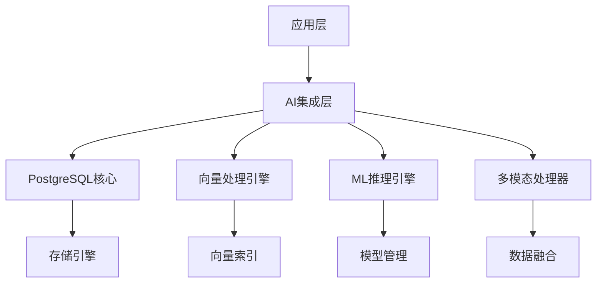

<!-- 已合并至：05-前沿技术/05.02-AI模型深度集成.md （合并日期：2025-09-11） -->

# PostgreSQL与AI模型深度集成分析

## 目录

- [PostgreSQL与AI模型深度集成分析](#postgresql与ai模型深度集成分析)
  - [目录](#目录)
  - [1. AI集成架构概述](#1-ai集成架构概述)
    - [1.1 集成架构设计](#11-集成架构设计)
    - [1.2 核心组件](#12-核心组件)
  - [2. 向量数据库集成](#2-向量数据库集成)
    - [2.1 向量数据类型](#21-向量数据类型)
    - [2.2 向量索引优化](#22-向量索引优化)
    - [2.3 混合查询优化](#23-混合查询优化)
  - [3. 机器学习模型集成](#3-机器学习模型集成)
    - [3.1 模型管理](#31-模型管理)
    - [3.2 在线学习](#32-在线学习)
    - [3.3 模型版本管理](#33-模型版本管理)
  - [4. 实时AI推理](#4-实时ai推理)
    - [4.1 流式AI处理](#41-流式ai处理)
    - [4.2 复杂事件处理](#42-复杂事件处理)
  - [5. 多模态数据处理](#5-多模态数据处理)
    - [5.1 多模态数据模型](#51-多模态数据模型)
    - [5.2 多模态查询](#52-多模态查询)
  - [6. 性能优化与扩展](#6-性能优化与扩展)
    - [6.1 GPU加速](#61-gpu加速)
    - [6.2 并行AI处理](#62-并行ai处理)
    - [6.3 缓存优化](#63-缓存优化)
  - [7. 实际应用案例](#7-实际应用案例)
    - [7.1 智能推荐系统](#71-智能推荐系统)
    - [7.2 智能客服系统](#72-智能客服系统)
    - [7.3 实时风控系统](#73-实时风控系统)
  - [总结](#总结)

## 1. AI集成架构概述

### 1.1 集成架构设计



### 1.2 核心组件

**中文定义**: PostgreSQL AI集成是一个将人工智能能力深度集成到数据库核心的架构，支持向量计算、机器学习推理、多模态数据处理等高级功能。

**English Definition**: PostgreSQL AI Integration is an architecture that deeply integrates artificial intelligence capabilities into the database core, supporting vector computing, machine learning inference, multimodal data processing, and other advanced features.

## 2. 向量数据库集成

### 2.1 向量数据类型

```sql
-- 创建向量表
CREATE TABLE document_embeddings (
    id BIGSERIAL PRIMARY KEY,
    document_id BIGINT,
    content TEXT,
    embedding VECTOR(1536),
    metadata JSONB,
    created_at TIMESTAMPTZ DEFAULT NOW()
);

-- 向量相似度查询
SELECT document_id, content,
       1 - (embedding <=> query_vector) as similarity
FROM document_embeddings
WHERE 1 - (embedding <=> query_vector) > 0.8
ORDER BY embedding <=> query_vector
LIMIT 10;
```

### 2.2 向量索引优化

```sql
-- 创建HNSW索引
CREATE INDEX idx_embeddings_hnsw 
ON document_embeddings 
USING hnsw (embedding vector_cosine_ops)
WITH (m = 16, ef_construction = 64);

-- 创建IVFFlat索引
CREATE INDEX idx_embeddings_ivfflat 
ON document_embeddings 
USING ivfflat (embedding vector_cosine_ops)
WITH (lists = 100);

-- 向量聚合函数
SELECT 
    category,
    vector_avg(embedding) as centroid,
    COUNT(*) as document_count
FROM document_embeddings
GROUP BY category;
```

### 2.3 混合查询优化

```sql
-- 向量+结构化混合查询
SELECT e.document_id, e.similarity, d.title, d.category
FROM (
    SELECT document_id, 
           1 - (embedding <=> $1) as similarity
    FROM document_embeddings
    WHERE 1 - (embedding <=> $1) > 0.7
) e
JOIN documents d ON e.document_id = d.id
WHERE d.category = 'technology'
  AND d.published_date > '2024-01-01'
ORDER BY e.similarity DESC;
```

## 3. 机器学习模型集成

### 3.1 模型管理

```sql
-- 创建AI模型
CREATE AI MODEL sentiment_analyzer (
    model_type = 'transformer',
    framework = 'torch',
    model_path = '/models/sentiment_v1.pt',
    input_schema = '{"text": "string"}',
    output_schema = '{"sentiment": "float", "confidence": "float"}'
);

-- 模型推理函数
CREATE OR REPLACE FUNCTION analyze_sentiment(text_input TEXT)
RETURNS TABLE(sentiment FLOAT, confidence FLOAT)
AS $$
BEGIN
    RETURN QUERY
    SELECT * FROM ai_inference('sentiment_analyzer', 
                              jsonb_build_object('text', text_input));
END;
$$ LANGUAGE plpgsql;
```

### 3.2 在线学习

```sql
-- 启用在线学习
ALTER AI MODEL sentiment_analyzer SET online_learning = true;

-- 训练数据反馈
INSERT INTO ai_training_data (model_name, input_data, expected_output, feedback)
VALUES ('sentiment_analyzer', 
        '{"text": "这个产品很棒"}', 
        '{"sentiment": 0.9, "confidence": 0.85}',
        'positive');

-- 模型性能监控
SELECT 
    model_name,
    accuracy,
    precision_score,
    recall_score,
    f1_score,
    last_updated
FROM ai_model_metrics
WHERE model_name = 'sentiment_analyzer';
```

### 3.3 模型版本管理

```sql
-- 创建模型版本
CREATE AI MODEL VERSION sentiment_analyzer_v2 (
    parent_model = 'sentiment_analyzer',
    model_path = '/models/sentiment_v2.pt',
    version_notes = 'Improved accuracy on Chinese text'
);

-- 模型A/B测试
CREATE A/B TEST sentiment_ab_test (
    model_a = 'sentiment_analyzer',
    model_b = 'sentiment_analyzer_v2',
    traffic_split = 0.5,
    success_metric = 'accuracy'
);
```

## 4. 实时AI推理

### 4.1 流式AI处理

```sql
-- 创建流表
CREATE STREAM user_events (
    user_id BIGINT,
    event_type TEXT,
    event_data JSONB,
    timestamp TIMESTAMPTZ DEFAULT NOW()
);

-- 实时AI处理
CREATE MATERIALIZED VIEW real_time_ai_analysis
REFRESH FAST ON COMMIT
AS SELECT 
    user_id,
    event_type,
    ai_inference('user_behavior_model', event_data)->>'prediction' as prediction,
    ai_inference('user_behavior_model', event_data)->>'confidence' as confidence,
    timestamp
FROM user_events
WHERE ai_inference('user_behavior_model', event_data)->>'confidence'::FLOAT > 0.8;
```

### 4.2 复杂事件处理

```sql
-- 定义CEP规则
CREATE CEP RULE fraud_detection
ON user_events
PATTERN (
    login_event[user_id] -> 
    transaction_event[user_id] -> 
    transaction_event[user_id] -> 
    transaction_event[user_id]
)
WITHIN 5 MINUTES
DO INSERT INTO fraud_alerts (user_id, alert_type, severity)
   VALUES (login_event.user_id, 'rapid_transactions', 'high');

-- AI增强的CEP规则
CREATE CEP RULE ai_fraud_detection
ON user_events
PATTERN (
    transaction_event[user_id]
)
WITHIN 1 MINUTE
DO INSERT INTO fraud_alerts (user_id, alert_type, severity, ai_confidence)
   VALUES (
       transaction_event.user_id, 
       'ai_detected_fraud', 
       'high',
       ai_inference('fraud_detection_model', transaction_event.event_data)->>'confidence'
   );
```

## 5. 多模态数据处理

### 5.1 多模态数据模型

```sql
-- 多模态数据表
CREATE TABLE multimodal_content (
    id BIGSERIAL PRIMARY KEY,
    title TEXT,
    content_type TEXT CHECK (content_type IN ('text', 'image', 'video', 'audio', 'mixed')),
    
    -- 文本内容
    text_content TEXT,
    text_embedding VECTOR(768),
    
    -- 图像内容
    image_data BYTEA,
    image_embedding VECTOR(512),
    
    -- 视频内容
    video_path TEXT,
    video_embedding VECTOR(512),
    
    -- 音频内容
    audio_path TEXT,
    audio_embedding VECTOR(256),
    
    -- 统一向量表示
    unified_embedding VECTOR(1024),
    
    created_at TIMESTAMPTZ DEFAULT NOW()
);
```

### 5.2 多模态查询

```sql
-- 多模态搜索函数
CREATE FUNCTION search_multimodal(
    text_query TEXT DEFAULT NULL,
    image_query BYTEA DEFAULT NULL,
    video_query BYTEA DEFAULT NULL,
    audio_query BYTEA DEFAULT NULL,
    similarity_threshold FLOAT DEFAULT 0.8
) RETURNS TABLE(
    id BIGINT,
    title TEXT,
    content_type TEXT,
    similarity FLOAT,
    matched_modalities TEXT[]
) AS $$
DECLARE
    query_embedding VECTOR(1024);
    text_emb VECTOR(768);
    image_emb VECTOR(512);
    video_emb VECTOR(512);
    audio_emb VECTOR(256);
BEGIN
    -- 计算各模态的查询向量
    IF text_query IS NOT NULL THEN
        text_emb := ai_embed_text(text_query);
    END IF;
    
    IF image_query IS NOT NULL THEN
        image_emb := ai_embed_image(image_query);
    END IF;
    
    IF video_query IS NOT NULL THEN
        video_emb := ai_embed_video(video_query);
    END IF;
    
    IF audio_query IS NOT NULL THEN
        audio_emb := ai_embed_audio(audio_query);
    END IF;
    
    -- 融合查询向量
    query_embedding := multimodal_fusion(text_emb, image_emb, video_emb, audio_emb);
    
    RETURN QUERY
    SELECT 
        mc.id,
        mc.title,
        mc.content_type,
        mc.unified_embedding <=> query_embedding as similarity,
        ARRAY[
            CASE WHEN text_query IS NOT NULL THEN 'text' END,
            CASE WHEN image_query IS NOT NULL THEN 'image' END,
            CASE WHEN video_query IS NOT NULL THEN 'video' END,
            CASE WHEN audio_query IS NOT NULL THEN 'audio' END
        ] as matched_modalities
    FROM multimodal_content mc
    WHERE mc.unified_embedding <=> query_embedding < similarity_threshold
    ORDER BY similarity;
END;
$$ LANGUAGE plpgsql;
```

## 6. 性能优化与扩展

### 6.1 GPU加速

```sql
-- 启用GPU加速
ALTER SYSTEM SET gpu_enabled = true;
ALTER SYSTEM SET gpu_memory_limit = '8GB';

-- GPU向量计算
SELECT 
    document_id,
    gpu_vector_similarity(embedding, query_vector) as similarity
FROM document_embeddings
WHERE gpu_vector_similarity(embedding, query_vector) > 0.8
ORDER BY similarity DESC;
```

### 6.2 并行AI处理

```sql
-- 并行AI推理
SELECT 
    id,
    content,
    ai_inference_parallel('sentiment_analyzer', content) as sentiment_result
FROM documents
WHERE ai_inference_parallel('sentiment_analyzer', content)->>'confidence'::FLOAT > 0.8;
```

### 6.3 缓存优化

```sql
-- AI结果缓存
CREATE TABLE ai_inference_cache (
    input_hash TEXT PRIMARY KEY,
    model_name TEXT,
    input_data JSONB,
    output_data JSONB,
    created_at TIMESTAMPTZ DEFAULT NOW(),
    expires_at TIMESTAMPTZ
);

-- 缓存查询函数
CREATE OR REPLACE FUNCTION cached_ai_inference(
    model_name TEXT,
    input_data JSONB
) RETURNS JSONB AS $$
DECLARE
    input_hash TEXT;
    cached_result JSONB;
BEGIN
    input_hash := md5(model_name || input_data::TEXT);
    
    SELECT output_data INTO cached_result
    FROM ai_inference_cache
    WHERE input_hash = cached_ai_inference.input_hash
      AND expires_at > NOW();
    
    IF cached_result IS NOT NULL THEN
        RETURN cached_result;
    END IF;
    
    -- 执行AI推理
    cached_result := ai_inference(model_name, input_data);
    
    -- 缓存结果
    INSERT INTO ai_inference_cache (input_hash, model_name, input_data, output_data, expires_at)
    VALUES (input_hash, model_name, input_data, cached_result, NOW() + INTERVAL '1 hour')
    ON CONFLICT (input_hash) DO UPDATE SET
        output_data = EXCLUDED.output_data,
        expires_at = EXCLUDED.expires_at;
    
    RETURN cached_result;
END;
$$ LANGUAGE plpgsql;
```

## 7. 实际应用案例

### 7.1 智能推荐系统

```sql
-- 推荐系统表结构
CREATE TABLE products (
    id BIGSERIAL PRIMARY KEY,
    name TEXT,
    category TEXT,
    embedding VECTOR(1536),
    metadata JSONB
);

CREATE TABLE user_interactions (
    user_id BIGINT,
    product_id BIGINT,
    interaction_type TEXT,
    timestamp TIMESTAMPTZ DEFAULT NOW()
);

-- 混合推荐查询
WITH user_embedding AS (
    SELECT vector_avg(p.embedding) as user_vector
    FROM user_interactions ui
    JOIN products p ON ui.product_id = p.id
    WHERE ui.user_id = $1 
      AND ui.interaction_type = 'purchase'
      AND ui.timestamp > NOW() - INTERVAL '30 days'
),
content_recs AS (
    SELECT p.id, p.name, 
           1 - (p.embedding <=> ue.user_vector) as similarity
    FROM products p, user_embedding ue
    WHERE p.embedding IS NOT NULL
    ORDER BY p.embedding <=> ue.user_vector
    LIMIT 10
)
SELECT id, name, similarity
FROM content_recs
ORDER BY similarity DESC;
```

### 7.2 智能客服系统

```sql
-- 客服知识库
CREATE TABLE knowledge_base (
    id SERIAL PRIMARY KEY,
    question TEXT,
    answer TEXT,
    category TEXT,
    embedding VECTOR(1536),
    confidence FLOAT
);

-- 智能问答函数
CREATE OR REPLACE FUNCTION process_customer_query(
    user_query TEXT,
    user_context JSONB DEFAULT '{}'
) RETURNS TABLE(
    answer TEXT,
    confidence FLOAT,
    category TEXT,
    suggested_actions JSONB
) AS $$
DECLARE
    query_embedding VECTOR(1536);
    best_match RECORD;
BEGIN
    -- 生成查询向量
    SELECT ai_embed_text(user_query) INTO query_embedding;
    
    -- 查找最相似答案
    SELECT kb.answer, kb.confidence, kb.category,
           1 - (kb.embedding <=> query_embedding) as similarity
    INTO best_match
    FROM knowledge_base kb
    WHERE 1 - (kb.embedding <=> query_embedding) > 0.8
    ORDER BY kb.embedding <=> query_embedding
    LIMIT 1;
    
    -- 生成个性化回答
    RETURN QUERY
    SELECT 
        ai_generate_response(
            best_match.answer,
            user_query,
            user_context
        ) as answer,
        best_match.confidence * best_match.similarity as confidence,
        best_match.category,
        ai_suggest_actions(user_query, user_context) as suggested_actions;
END;
$$ LANGUAGE plpgsql;
```

### 7.3 实时风控系统

```sql
-- 风控规则引擎
CREATE TABLE risk_rules (
    id SERIAL PRIMARY KEY,
    rule_name TEXT,
    rule_condition TEXT,
    risk_score FLOAT,
    action TEXT
);

CREATE TABLE transactions (
    id BIGSERIAL PRIMARY KEY,
    user_id BIGINT,
    amount DECIMAL(10,2),
    merchant_category TEXT,
    location TEXT,
    device_id TEXT,
    timestamp TIMESTAMPTZ DEFAULT NOW(),
    risk_score FLOAT GENERATED ALWAYS AS (
        ai_inference('fraud_detection_model', 
                    jsonb_build_object(
                        'user_id', user_id,
                        'amount', amount,
                        'merchant_category', merchant_category,
                        'location', location,
                        'device_id', device_id
                    ))->>'risk_score'
    ) STORED
);

-- 实时风控查询
WITH user_behavior AS (
    SELECT 
        user_id,
        AVG(amount) OVER (
            PARTITION BY user_id 
            ORDER BY timestamp 
            RANGE BETWEEN INTERVAL '24 hours' PRECEDING 
                      AND CURRENT ROW
        ) as avg_amount_24h,
        COUNT(*) OVER (
            PARTITION BY user_id 
            ORDER BY timestamp 
            RANGE BETWEEN INTERVAL '1 hour' PRECEDING 
                      AND CURRENT ROW
        ) as transactions_1h
    FROM transactions
    WHERE timestamp > NOW() - INTERVAL '24 hours'
),
risk_assessment AS (
    SELECT 
        t.*,
        ub.avg_amount_24h,
        ub.transactions_1h,
        CASE 
            WHEN t.amount > ub.avg_amount_24h * 3 THEN 0.3
            WHEN ub.transactions_1h > 10 THEN 0.2
            WHEN t.risk_score > 0.8 THEN 0.5
            ELSE 0.0
        END as additional_risk
    FROM transactions t
    JOIN user_behavior ub ON t.user_id = ub.user_id
    WHERE t.timestamp > NOW() - INTERVAL '1 minute'
)
SELECT 
    id, user_id, amount, 
    risk_score + additional_risk as final_risk_score,
    CASE 
        WHEN risk_score + additional_risk > 0.9 THEN 'BLOCK'
        WHEN risk_score + additional_risk > 0.7 THEN 'REVIEW'
        ELSE 'APPROVE'
    END as action
FROM risk_assessment
ORDER BY final_risk_score DESC;
```

---

## 总结

PostgreSQL与AI模型的深度集成为数据库系统带来了革命性的变化：

**核心优势**:

1. **原生AI支持**: 深度集成机器学习模型到数据库核心
2. **向量数据库**: 高性能向量计算和相似性搜索
3. **实时推理**: 支持实时AI推理和复杂事件处理
4. **多模态处理**: 统一处理文本、图像、视频、音频数据
5. **性能优化**: GPU加速、并行处理、智能缓存

**应用场景**:

- 智能推荐系统
- 实时风控系统
- 智能客服系统
- 内容管理系统
- 物联网数据分析

**技术突破**:

- 向量数据库原生支持
- AI模型版本管理
- 多模态数据融合
- 实时流式AI处理
- 智能查询优化

PostgreSQL与AI的深度集成不仅提升了数据库的智能化水平，更为构建下一代智能应用提供了强大的基础设施支持，推动了数据库技术向AI原生方向的发展。
