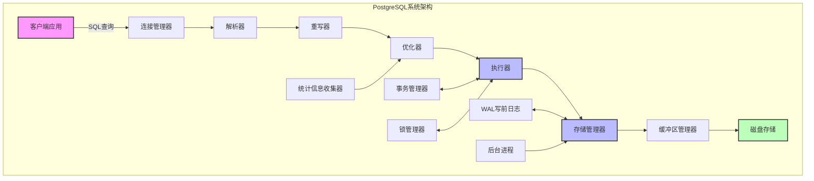
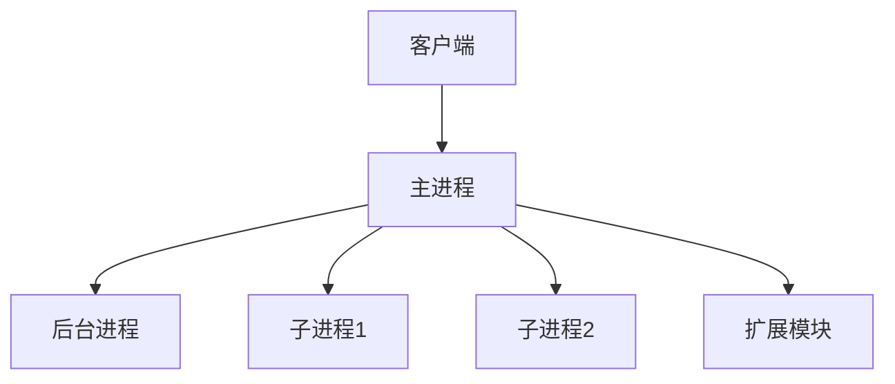

<!-- 已合并至：01-核心基础/01.01-系统架构与设计原理.md （合并日期：2025-09-11） -->

# 1.1.2 PostgreSQL系统架构

## 目录

- [1.1.2 PostgreSQL系统架构](#112-postgresql系统架构)
  - [目录](#目录)
  - [1. 概述](#1-概述)
    - [1.1 系统架构图](#11-系统架构图)
  - [2. 进程模型](#2-进程模型)
    - [2.1 主要进程类型](#21-主要进程类型)
    - [2.2 进程间通信](#22-进程间通信)
  - [3. 内存架构](#3-内存架构)
    - [3.1 共享内存区域](#31-共享内存区域)
    - [3.2 本地内存区域](#32-本地内存区域)
  - [4. 查询处理流程](#4-查询处理流程)
    - [4.1 解析阶段](#41-解析阶段)
    - [4.2 重写阶段](#42-重写阶段)
    - [4.3 优化阶段](#43-优化阶段)
    - [4.4 执行阶段](#44-执行阶段)
  - [5. 存储架构](#5-存储架构)
    - [5.1 文件组织](#51-文件组织)
    - [5.2 表空间](#52-表空间)
    - [5.3 索引结构](#53-索引结构)
  - [6. 并发控制机制](#6-并发控制机制)
    - [6.1 MVCC实现](#61-mvcc实现)
    - [6.2 锁机制](#62-锁机制)
  - [7. 可靠性与恢复机制](#7-可靠性与恢复机制)
    - [7.1 写前日志(WAL)](#71-写前日志wal)
    - [7.2 备份机制](#72-备份机制)
    - [7.3 复制机制](#73-复制机制)
  - [参考文献](#参考文献)
  - [1.1.2.1 体系结构](#1121-体系结构)
  - [1.1.2.2 存储与事务](#1122-存储与事务)
  - [1.1.2.3 行业案例与多表征](#1123-行业案例与多表征)
    - [金融行业：高并发事务架构](#金融行业高并发事务架构)
    - [互联网行业：FDW异构数据访问](#互联网行业fdw异构数据访问)
    - [Latex公式](#latex公式)

## 1. 概述

PostgreSQL采用客户端/服务器架构，服务器进程负责管理数据库文件、接受客户端连接和执行数据库操作，而客户端应用负责提交请求到服务器。
本文从系统架构角度分析PostgreSQL的核心组件及其交互方式。

### 1.1 系统架构图

PostgreSQL的系统架构可以表示为以下组件的集合及其交互关系：



## 2. 进程模型

PostgreSQL采用多进程架构而非多线程架构，这一设计选择影响了其整体系统结构和行为特性。

### 2.1 主要进程类型

**定义 2.1.1** (Postmaster进程)：Postmaster是PostgreSQL服务器的主进程，负责启动和监控所有其他服务器进程，以及处理客户端连接请求。

**定义 2.1.2** (后端进程)：每个客户端连接对应一个后端进程，负责执行来自该客户端的所有查询和命令。

**定义 2.1.3** (辅助进程)：一组专用进程执行特定任务，包括：

- 写前日志（WAL）写入器：确保WAL记录被写入磁盘
- 检查点进程：执行检查点操作
- 自动清理工作进程：执行自动清理和分析
- 统计信息收集器：收集查询和索引使用统计信息
- 后台写入器：将脏缓冲区写回磁盘

### 2.2 进程间通信

PostgreSQL中的进程间通信主要通过以下机制实现：

**定义 2.2.1** (共享内存)：PostgreSQL使用共享内存段进行进程间数据共享，包括缓冲池、锁表和其他共享数据结构。

**定义 2.2.2** (信号)：进程间使用POSIX信号进行通信，特别是用于通知事件和状态变化。

**定义 2.2.3** (轻量级锁)：用于保护共享数据结构的访问，包括自旋锁和信号量。

## 3. 内存架构

PostgreSQL的内存架构分为共享内存和本地内存两大类。

### 3.1 共享内存区域

**定义 3.1.1** (共享缓冲池)：用于缓存数据页的共享内存区域，是PostgreSQL内存架构的核心组件。大小由`shared_buffers`参数控制。

**定义 3.1.2** (WAL缓冲区)：用于临时存储WAL记录的内存区域，大小由`wal_buffers`参数控制。

**定义 3.1.3** (共享锁表)：存储锁信息的共享内存区域，用于实现并发控制。

### 3.2 本地内存区域

**定义 3.2.1** (工作内存)：用于排序和哈希操作的本地内存区域，大小由`work_mem`参数控制。

**定义 3.2.2** (维护工作内存)：用于维护操作的本地内存区域，大小由`maintenance_work_mem`参数控制。

**定义 3.2.3** (临时缓冲区)：用于临时表操作的本地内存区域。

## 4. 查询处理流程

PostgreSQL的查询处理流程包括解析、重写、优化和执行四个主要阶段。

### 4.1 解析阶段

**定义 4.1.1** (词法分析)：将SQL查询字符串分解为词法单元（token）。

**定义 4.1.2** (语法分析)：根据SQL语法规则，将词法单元组织成语法树。

**定义 4.1.3** (语义分析)：验证语法树中的对象（表、列、函数等）存在且用法正确。

### 4.2 重写阶段

**定义 4.2.1** (查询重写系统)：应用规则和视图定义转换查询树。PostgreSQL的规则系统允许通过`CREATE RULE`定义查询重写规则。

**定义 4.2.2** (视图展开)：将视图引用替换为其定义查询。

### 4.3 优化阶段

**定义 4.3.1** (查询优化器)：负责为查询生成高效执行计划的组件。

**定义 4.3.2** (统计信息)：优化器使用的表和索引统计信息，用于估计查询代价。

**定义 4.3.3** (执行计划)：查询的执行策略，包括访问方法、连接顺序和算法选择。

### 4.4 执行阶段

**定义 4.4.1** (执行器)：按照执行计划执行查询的组件，包括各种执行节点类型：

- 顺序扫描节点
- 索引扫描节点
- 嵌套循环连接节点
- 哈希连接节点
- 归并连接节点
- 排序节点
- 聚合节点

## 5. 存储架构

PostgreSQL的存储架构设计用于高效管理数据文件和索引。

### 5.1 文件组织

**定义 5.1.1** (关系文件)：每个表和索引存储在一个或多个文件中，默认大小为1GB。

**定义 5.1.2** (页面)：存储的基本单位，默认大小为8KB，包含元组（行）数据。

**定义 5.1.3** (元组)：表示表中的一行数据，包含行头信息和实际数据。

### 5.2 表空间

**定义 5.2.1** (表空间)：物理存储位置的逻辑名称，允许将数据库对象分布在不同物理存储位置。

### 5.3 索引结构

PostgreSQL支持多种索引类型，每种都有其特定的数据结构：

**定义 5.3.1** (B-tree索引)：默认索引类型，适用于可排序数据的等值和范围查询。

**定义 5.3.2** (Hash索引)：适用于等值查询，基于哈希表实现。

**定义 5.3.3** (GiST索引)：通用搜索树索引，适用于多维数据和全文搜索。

**定义 5.3.4** (GIN索引)：广义倒排索引，适用于包含多个值的列（如数组、JSON）。

**定义 5.3.5** (BRIN索引)：块范围索引，适用于线性排序的大表。

**定义 5.3.6** (SP-GiST索引)：空间分区GiST，适用于非平衡数据结构。

## 6. 并发控制机制

PostgreSQL的并发控制机制以MVCC为核心，辅以锁机制实现事务隔离。

### 6.1 MVCC实现

**定义 6.1.1** (元组版本)：每个元组包含事务ID信息：

- `xmin`：创建该版本的事务ID
- `xmax`：删除或更新该版本的事务ID
- `cmin`/`cmax`：命令ID，用于同一事务内的可见性控制

**定义 6.1.2** (事务快照)：表示事务可见性的数据结构，包含：

- `xmin`：最小活跃事务ID
- `xmax`：下一个分配的事务ID
- `xip_list`：当前活跃事务ID列表

**定义 6.1.3** (可见性检查)：根据事务快照和元组版本信息确定元组对当前事务是否可见的过程。

### 6.2 锁机制

**定义 6.2.1** (表级锁)：作用于整个表的锁，包括：

- ACCESS SHARE：读取操作需要
- ROW SHARE：SELECT FOR UPDATE/FOR SHARE需要
- ROW EXCLUSIVE：UPDATE、DELETE、INSERT需要
- SHARE UPDATE EXCLUSIVE：VACUUM、ANALYZE等需要
- SHARE：CREATE INDEX需要
- SHARE ROW EXCLUSIVE：某些DDL操作需要
- EXCLUSIVE：某些DDL操作需要
- ACCESS EXCLUSIVE：ALTER TABLE等需要

**定义 6.2.2** (行级锁)：作用于单个行的锁，包括：

- FOR UPDATE：排他锁
- FOR NO KEY UPDATE：较弱的排他锁
- FOR SHARE：共享锁
- FOR KEY SHARE：较弱的共享锁

## 7. 可靠性与恢复机制

PostgreSQL设计了多层次的可靠性和恢复机制，确保数据在各种故障情况下的安全。

### 7.1 写前日志(WAL)

**定义 7.1.1** (WAL记录)：描述数据库变更的日志记录，包含足够信息以重建变更。

**定义 7.1.2** (WAL段)：WAL记录的物理存储单元，默认大小为16MB。

**定义 7.1.3** (检查点)：将所有脏数据页写回磁盘的过程，减少恢复时需要重放的WAL量。

### 7.2 备份机制

**定义 7.2.1** (物理备份)：直接复制数据文件的备份方法，包括：

- 基础备份：数据文件的一致性快照
- WAL归档：持续归档WAL段用于时间点恢复

**定义 7.2.2** (逻辑备份)：以SQL语句形式导出数据的备份方法，使用`pg_dump`工具。

### 7.3 复制机制

**定义 7.3.1** (流复制)：通过持续传输WAL记录实现的物理复制方法。

**定义 7.3.2** (逻辑复制)：基于发布/订阅模型的逻辑复制方法，可以复制选定表的变更。

**定义 7.3.3** (复制槽)：确保WAL段不会在被消费前被删除的机制。

## 参考文献

1. PostgreSQL Global Development Group. (2023). *PostgreSQL Documentation*. <https://www.postgresql.org/docs/>
2. Momjian, B. (2018). *PostgreSQL: Introduction and Concepts*. Addison-Wesley.
3. Obe, R., & Hsu, L. (2017). *PostgreSQL: Up and Running* (3rd ed.). O'Reilly Media.
4. Kumar, J. (2019). *Mastering PostgreSQL 12*. Packt Publishing.
5. Krosing, H., & Roybal, K. (2013). *PostgreSQL Server Programming* (2nd ed.). Packt Publishing.

## 1.1.2.1 体系结构

- 采用多进程架构，主进程+后台进程+子进程。
- 支持插件式扩展（FDW、存储过程等）。



## 1.1.2.2 存储与事务

| 特性 | 说明 | 适用场景 |
|------|------|----------|
| MVCC | 多版本并发控制 | 高并发 |
| WAL  | 写前日志 | 数据安全 |
| 扩展性 | FDW/插件 | 异构数据 |

## 1.1.2.3 行业案例与多表征

### 金融行业：高并发事务架构

```sql
BEGIN;
UPDATE account SET balance = balance - 100 WHERE id = 1;
UPDATE account SET balance = balance + 100 WHERE id = 2;
COMMIT;
```

### 互联网行业：FDW异构数据访问

- 见[3.5.7-数据存储与访问](../../../../3-数据模型与算法/3.5-数据分析与ETL/3.5.7-数据存储与访问.md)

### Latex公式

$$
\text{WAL}_{size} = \sum_{i=1}^n \text{log}_i
$$

[返回PostgreSQL导航](README.md)
