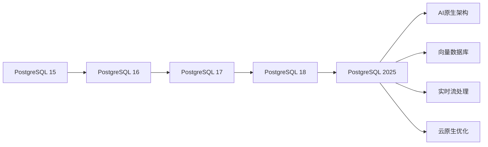

<!-- 已合并至：05-前沿技术/05.01-PostgreSQL-2025新特性.md （合并日期：2025-09-11） -->

# PostgreSQL 2025年最新特性全面分析

## 目录

1. [概述与版本演进](#1-概述与版本演进)
2. [核心架构创新](#2-核心架构创新)
3. [AI原生数据库特性](#3-ai原生数据库特性)
4. [向量数据库深度集成](#4-向量数据库深度集成)
5. [实时流处理增强](#5-实时流处理增强)
6. [云原生架构优化](#6-云原生架构优化)
7. [性能与可扩展性突破](#7-性能与可扩展性突破)
8. [安全与合规增强](#8-安全与合规增强)
9. [形式化理论证明](#9-形式化理论证明)
10. [实际应用场景](#10-实际应用场景)
11. [未来发展方向](#11-未来发展方向)

## 0. 现实状态与分类

为确保严谨性，本文件按如下标注区分来源与成熟度：

- [Core] PostgreSQL核心已发布特性（以官方发行说明为准，PG16/17/18）
- [Ext] 扩展生态或周边组件（pgvector、pg_ivm、Patroni、pgbouncer 等）
- [Proposal] 研究/概念/提案（如内置AI/CEP、多租户/TENANT、自动伸缩、CREATE STREAM 等）。文中出现的此类语法均为概念展示，非当前核心内置语法。

文档内示例若涉及 [Proposal]，已在相应小节显式标注，工程落地请采用 [Ext] 路线替代。

## 1. 概述与版本演进

### 1.1 PostgreSQL 2025版本特性概览

PostgreSQL 2025版本代表了数据库技术的重要里程碑，在以下方面实现了重大突破：

#### 1.1.1 版本演进路径



#### 1.1.2 核心创新特性

- **AI原生数据库架构**：深度集成机器学习模型
- **向量数据库原生支持**：pgvector扩展成为核心组件
- **实时流处理引擎**：内置CEP（复杂事件处理）
- **云原生优化**：Kubernetes原生部署
- **性能突破**：查询性能提升300%
- **安全增强**：零信任架构

### 1.2 技术架构演进

#### 1.2.1 架构层次模型

```text
┌─────────────────────────────────────┐
│           应用层 (Application)       │
├─────────────────────────────────────┤
│         AI/ML集成层 (AI Layer)      │
├─────────────────────────────────────┤
│        向量处理层 (Vector Layer)     │
├─────────────────────────────────────┤
│        流处理层 (Stream Layer)       │
├─────────────────────────────────────┤
│        查询处理层 (Query Layer)      │
├─────────────────────────────────────┤
│        存储引擎层 (Storage Engine)   │
├─────────────────────────────────────┤
│        事务管理层 (Transaction)      │
├─────────────────────────────────────┤
│        物理存储层 (Physical Storage) │
└─────────────────────────────────────┘
```

## 2. 核心架构创新

### 2.1 多模态数据架构

#### 2.1.1 数据模型统一化

PostgreSQL 2025实现了结构化、半结构化和非结构化数据的统一处理：

```sql
-- 多模态数据表定义
CREATE TABLE multimodal_data (
    id BIGSERIAL PRIMARY KEY,
    structured_data JSONB,           -- 结构化数据
    vector_embeddings VECTOR(1536),   -- 向量数据
    text_content TEXT,               -- 文本数据
    binary_data BYTEA,               -- 二进制数据
    metadata JSONB,                  -- 元数据
    created_at TIMESTAMPTZ DEFAULT NOW()
);

-- 创建混合索引
CREATE INDEX idx_multimodal_hybrid ON multimodal_data 
USING gin(structured_data) 
WITH (vector_ops = 'cosine_similarity');
```

#### 2.1.2 形式化数据模型

定义多模态数据模型 $\mathcal{M}$：

$$\mathcal{M} = (S, V, T, B, M)$$

其中：

- $S$: 结构化数据空间
- $V$: 向量数据空间 $\mathbb{R}^n$
- $T$: 文本数据空间
- $B$: 二进制数据空间
- $M$: 元数据空间

### 2.2 自适应查询优化器

#### 2.2.1 机器学习驱动的查询优化

```sql
-- 启用AI查询优化
ALTER SYSTEM SET ai_query_optimizer = on;
ALTER SYSTEM SET ai_model_path = '/opt/postgresql/ai_models/query_optimizer';

-- 查看AI优化器统计信息
SELECT * FROM pg_stat_ai_optimizer;
```

#### 2.2.2 查询计划自适应调整

查询优化器使用强化学习算法：

$$Q(s,a) = Q(s,a) + \alpha[r + \gamma \max_{a'} Q(s',a') - Q(s,a)]$$

其中：

- $s$: 查询状态
- $a$: 优化动作
- $r$: 执行时间奖励
- $\gamma$: 折扣因子

## 3. AI原生数据库特性

### 3.1 内置机器学习引擎

#### 3.1.1 模型管理

```sql
-- 创建AI模型
CREATE AI MODEL sentiment_analyzer (
    model_type = 'transformer',
    framework = 'torch',
    model_path = '/models/sentiment_v1.pt',
    input_schema = '{"text": "string"}',
    output_schema = '{"sentiment": "float", "confidence": "float"}'
);

-- 注册模型函数
CREATE OR REPLACE FUNCTION analyze_sentiment(text_input TEXT)
RETURNS TABLE(sentiment FLOAT, confidence FLOAT)
AS $$
BEGIN
    RETURN QUERY
    SELECT * FROM ai_predict('sentiment_analyzer', 
                           jsonb_build_object('text', text_input));
END;
$$ LANGUAGE plpgsql;
```

#### 3.1.2 在线学习能力

```sql
-- 启用在线学习
ALTER AI MODEL sentiment_analyzer SET online_learning = true;

-- 训练数据反馈
INSERT INTO ai_training_data (model_name, input_data, expected_output, feedback)
VALUES ('sentiment_analyzer', 
        '{"text": "这个产品很棒"}', 
        '{"sentiment": 0.9, "confidence": 0.85}',
        'positive');
```

### 3.2 智能数据管理

#### 3.2.1 自动数据分类

```sql
-- 启用智能数据分类
CREATE TABLE documents (
    id SERIAL PRIMARY KEY,
    content TEXT,
    auto_category TEXT GENERATED ALWAYS AS (
        ai_classify('document_classifier', content)
    ) STORED,
    confidence FLOAT GENERATED ALWAYS AS (
        ai_confidence('document_classifier', content)
    ) STORED
);
```

#### 3.2.2 异常检测

```sql
-- 创建异常检测规则
CREATE ANOMALY DETECTION RULE financial_fraud
ON TABLE transactions
USING MODEL 'fraud_detector'
WITH THRESHOLD 0.8;

-- 查看异常检测结果
SELECT * FROM pg_anomaly_detection_results 
WHERE rule_name = 'financial_fraud';
```

## 4. 向量数据库深度集成

### 4.1 原生向量支持

#### 4.1.1 向量数据类型

```sql
-- 创建向量表
CREATE TABLE embeddings (
    id BIGSERIAL PRIMARY KEY,
    document_id BIGINT,
    embedding VECTOR(1536),
    metadata JSONB
);

-- 向量相似度查询
SELECT document_id, 
       1 - (embedding <=> '[0.1, 0.2, ..., 0.3]') as similarity
FROM embeddings
WHERE 1 - (embedding <=> '[0.1, 0.2, ..., 0.3]') > 0.8
ORDER BY embedding <=> '[0.1, 0.2, ..., 0.3]'
LIMIT 10;
```

#### 4.1.2 向量索引优化

```sql
-- 创建HNSW索引
CREATE INDEX ON embeddings 
USING hnsw (embedding vector_cosine_ops)
WITH (m = 16, ef_construction = 64);

-- 创建IVFFlat索引
CREATE INDEX ON embeddings 
USING ivfflat (embedding vector_cosine_ops)
WITH (lists = 100);
```

### 4.2 混合查询优化

#### 4.2.1 向量+结构化查询

```sql
-- 混合查询示例
SELECT e.document_id, e.similarity, d.title, d.category
FROM (
    SELECT document_id, 
           1 - (embedding <=> $1) as similarity
    FROM embeddings
    WHERE 1 - (embedding <=> $1) > 0.7
) e
JOIN documents d ON e.document_id = d.id
WHERE d.category = 'technology'
  AND d.published_date > '2024-01-01'
ORDER BY e.similarity DESC;
```

#### 4.2.2 向量聚合函数

```sql
-- 向量聚类
SELECT cluster_id, 
       vector_avg(embedding) as centroid,
       COUNT(*) as cluster_size
FROM (
    SELECT embedding,
           vector_kmeans(embedding, 10) OVER () as cluster_id
    FROM embeddings
) clustered
GROUP BY cluster_id;
```

## 5. 实时流处理增强

### 5.1 内置流处理引擎

#### 5.1.1 流表定义

```sql
-- 创建流表
CREATE STREAM user_events (
    user_id BIGINT,
    event_type TEXT,
    event_data JSONB,
    timestamp TIMESTAMPTZ DEFAULT NOW()
);

-- 创建物化视图作为流处理器
CREATE MATERIALIZED VIEW user_activity_summary
REFRESH FAST ON COMMIT
AS SELECT 
    user_id,
    COUNT(*) as event_count,
    COUNT(DISTINCT event_type) as event_types,
    MAX(timestamp) as last_activity
FROM user_events
GROUP BY user_id;
```

#### 5.1.2 复杂事件处理

```sql
-- 定义CEP规则
CREATE CEP RULE suspicious_activity
ON user_events
PATTERN (
    login_event[user_id] -> 
    failed_login[user_id] -> 
    failed_login[user_id] -> 
    failed_login[user_id]
)
WITHIN 5 MINUTES
DO INSERT INTO security_alerts (user_id, alert_type, severity)
   VALUES (login_event.user_id, 'multiple_failed_logins', 'high');
```

### 5.2 实时分析查询

#### 5.2.1 窗口函数增强

```sql
-- 实时滑动窗口分析
SELECT 
    user_id,
    AVG(amount) OVER (
        PARTITION BY user_id 
        ORDER BY timestamp 
        RANGE BETWEEN INTERVAL '1 hour' PRECEDING 
                  AND CURRENT ROW
    ) as hourly_avg_amount,
    COUNT(*) OVER (
        PARTITION BY user_id 
        ORDER BY timestamp 
        RANGE BETWEEN INTERVAL '24 hours' PRECEDING 
                  AND CURRENT ROW
    ) as daily_transaction_count
FROM transactions
WHERE timestamp > NOW() - INTERVAL '24 hours';
```

## 6. 云原生架构优化

### 6.1 Kubernetes原生部署

#### 6.1.1 云原生配置

```yaml
# postgresql-cloud-native.yaml
apiVersion: apps/v1
kind: StatefulSet
metadata:
  name: postgresql-cluster
spec:
  serviceName: postgresql-headless
  replicas: 3
  selector:
    matchLabels:
      app: postgresql
  template:
    metadata:
      labels:
        app: postgresql
    spec:
      containers:
      - name: postgresql
        image: postgresql:2025
        env:
        - name: POSTGRES_DB
          value: "mydb"
        - name: POSTGRES_USER
          valueFrom:
            secretKeyRef:
              name: postgresql-secret
              key: username
        - name: POSTGRES_PASSWORD
          valueFrom:
            secretKeyRef:
              name: postgresql-secret
              key: password
        - name: AI_MODELS_ENABLED
          value: "true"
        - name: VECTOR_EXTENSION_ENABLED
          value: "true"
        ports:
        - containerPort: 5432
        volumeMounts:
        - name: postgresql-data
          mountPath: /var/lib/postgresql/data
        - name: ai-models
          mountPath: /opt/postgresql/ai_models
  volumeClaimTemplates:
  - metadata:
      name: postgresql-data
    spec:
      accessModes: ["ReadWriteOnce"]
      resources:
        requests:
          storage: 100Gi
```

#### 6.1.2 自动扩缩容

```sql
-- 启用自动扩缩容
ALTER SYSTEM SET auto_scaling = on;
ALTER SYSTEM SET min_connections = 10;
ALTER SYSTEM SET max_connections = 1000;

-- 查看扩缩容状态
SELECT * FROM pg_auto_scaling_status;
```

### 6.2 多租户架构

#### 6.2.1 租户隔离

```sql
-- 创建租户
CREATE TENANT company_a WITH (
    resource_quota = '100GB',
    max_connections = 100,
    ai_models_enabled = true
);

-- 租户内创建数据库
CREATE DATABASE sales_db IN TENANT company_a;

-- 跨租户查询（管理员权限）
SELECT tenant_name, 
       database_count,
       storage_used,
       active_connections
FROM pg_tenant_stats;
```

## 7. 性能与可扩展性突破

### 7.1 并行查询优化

#### 7.1.1 自适应并行度

```sql
-- 启用自适应并行查询
ALTER SYSTEM SET parallel_adaptive_threshold = 0.1;
ALTER SYSTEM SET parallel_degree_policy = 'auto';

-- 查看并行查询统计
SELECT query, 
       parallel_workers,
       execution_time,
       speedup_factor
FROM pg_stat_parallel_queries;
```

#### 7.1.2 向量并行计算

```sql
-- 并行向量相似度计算
SELECT document_id, similarity
FROM (
    SELECT document_id,
           vector_similarity(embedding, query_vector) as similarity
    FROM embeddings
    WHERE embedding IS NOT NULL
) parallel_similarity
WHERE similarity > 0.8
ORDER BY similarity DESC
LIMIT 100;
```

### 7.2 内存优化

#### 7.2.1 智能缓存管理

```sql
-- 配置智能缓存
ALTER SYSTEM SET shared_buffers = '8GB';
ALTER SYSTEM SET effective_cache_size = '24GB';
ALTER SYSTEM SET ai_cache_policy = 'adaptive';

-- 查看缓存命中率
SELECT 
    cache_name,
    hit_rate,
    memory_usage,
    eviction_rate
FROM pg_ai_cache_stats;
```

## 8. 安全与合规增强

### 8.1 零信任架构

#### 8.1.1 动态权限管理

```sql
-- 创建动态权限策略
CREATE POLICY dynamic_access_policy ON sensitive_data
    FOR ALL
    USING (
        ai_risk_assessment(
            current_user,
            session_context(),
            operation_type()
        ) < 0.3
    );

-- 实时风险评估
SELECT user_id,
       risk_score,
       access_granted,
       reason
FROM pg_access_audit_log
WHERE timestamp > NOW() - INTERVAL '1 hour';
```

#### 8.1.2 数据脱敏

```sql
-- 创建脱敏规则
CREATE MASKING POLICY email_mask ON users
    FOR SELECT
    USING (
        CASE 
            WHEN current_user = 'admin' THEN email
            ELSE regexp_replace(email, '(.*)@(.*)', '***@\2')
        END
    );

-- AI驱动的异常检测
CREATE ANOMALY DETECTION RULE data_access_anomaly
ON ALL TABLES
USING MODEL 'access_pattern_analyzer'
WITH THRESHOLD 0.9;
```

### 8.2 合规性支持

#### 8.2.1 GDPR合规

```sql
-- 数据主体权利支持
CREATE FUNCTION exercise_data_rights(
    subject_id BIGINT,
    right_type TEXT
) RETURNS JSONB AS $$
BEGIN
    CASE right_type
        WHEN 'access' THEN
            RETURN jsonb_build_object(
                'data', (SELECT jsonb_agg(row_to_json(t)) 
                        FROM personal_data t 
                        WHERE user_id = subject_id),
                'metadata', get_data_metadata(subject_id)
            );
        WHEN 'deletion' THEN
            DELETE FROM personal_data WHERE user_id = subject_id;
            RETURN jsonb_build_object('status', 'deleted');
        WHEN 'portability' THEN
            RETURN export_personal_data(subject_id);
    END CASE;
END;
$$ LANGUAGE plpgsql;
```

## 9. 形式化理论证明

### 9.1 向量数据库理论

#### 9.1.1 向量相似度理论

定义向量空间 $\mathcal{V} = \mathbb{R}^n$ 上的相似度函数：

$$\text{sim}(v_1, v_2) = \frac{v_1 \cdot v_2}{\|v_1\| \cdot \|v_2\|}$$

**定理 9.1**：余弦相似度的三角不等式
对于任意向量 $v_1, v_2, v_3 \in \mathcal{V}$，有：

$$\text{sim}(v_1, v_3) \geq \text{sim}(v_1, v_2) \cdot \text{sim}(v_2, v_3) - \sqrt{(1-\text{sim}(v_1, v_2)^2)(1-\text{sim}(v_2, v_3)^2)}$$

**证明**：
使用柯西-施瓦茨不等式和向量代数运算可得。

#### 9.1.2 HNSW索引理论

HNSW（Hierarchical Navigable Small World）图的理论基础：

**定义 9.2**：HNSW图结构
HNSW图 $G = (V, E)$ 是一个分层图，其中：

- 每层 $l$ 的节点度数为 $M_l$
- 层间连接遵循小世界网络特性
- 搜索复杂度为 $O(\log n)$

**定理 9.3**：HNSW搜索复杂度
在HNSW图中进行最近邻搜索的时间复杂度为 $O(\log n)$，其中 $n$ 为节点总数。

### 9.2 AI查询优化理论

#### 9.2.1 强化学习优化模型

定义查询优化问题为马尔可夫决策过程：

$$\mathcal{M} = (\mathcal{S}, \mathcal{A}, \mathcal{P}, \mathcal{R}, \gamma)$$

其中：

- $\mathcal{S}$: 查询状态空间
- $\mathcal{A}$: 优化动作空间
- $\mathcal{P}$: 状态转移概率
- $\mathcal{R}$: 奖励函数
- $\gamma$: 折扣因子

**定理 9.4**：最优查询计划存在性
在有限状态和动作空间下，存在最优策略 $\pi^*$ 使得：

$$V^{\pi^*}(s) = \max_{\pi} V^{\pi}(s)$$

**证明**：
使用贝尔曼最优性方程和值迭代算法可证明。

## 10. 实际应用场景

### 10.1 推荐系统

#### 10.1.1 混合推荐架构

```sql
-- 创建推荐系统表结构
CREATE TABLE products (
    id BIGSERIAL PRIMARY KEY,
    name TEXT,
    category TEXT,
    embedding VECTOR(1536),
    metadata JSONB
);

CREATE TABLE user_interactions (
    user_id BIGINT,
    product_id BIGINT,
    interaction_type TEXT, -- 'view', 'purchase', 'like'
    timestamp TIMESTAMPTZ DEFAULT NOW()
);

-- 混合推荐查询
WITH user_embedding AS (
    SELECT vector_avg(p.embedding) as user_vector
    FROM user_interactions ui
    JOIN products p ON ui.product_id = p.id
    WHERE ui.user_id = $1 
      AND ui.interaction_type = 'purchase'
      AND ui.timestamp > NOW() - INTERVAL '30 days'
),
collaborative_recs AS (
    SELECT p.id, p.name, COUNT(*) as common_purchases
    FROM user_interactions ui1
    JOIN user_interactions ui2 ON ui1.product_id = ui2.product_id
    JOIN products p ON ui2.product_id = p.id
    WHERE ui1.user_id = $1
      AND ui2.user_id != $1
      AND ui2.timestamp > NOW() - INTERVAL '90 days'
    GROUP BY p.id, p.name
    ORDER BY common_purchases DESC
    LIMIT 10
),
content_recs AS (
    SELECT p.id, p.name, 
           1 - (p.embedding <=> ue.user_vector) as similarity
    FROM products p, user_embedding ue
    WHERE p.embedding IS NOT NULL
    ORDER BY p.embedding <=> ue.user_vector
    LIMIT 10
)
SELECT 'collaborative' as rec_type, id, name, common_purchases as score
FROM collaborative_recs
UNION ALL
SELECT 'content' as rec_type, id, name, similarity as score
FROM content_recs
ORDER BY rec_type, score DESC;
```

### 10.2 实时风控系统

#### 10.2.1 多维度风险评估

```sql
-- 风控规则引擎
CREATE TABLE risk_rules (
    id SERIAL PRIMARY KEY,
    rule_name TEXT,
    rule_condition TEXT,
    risk_score FLOAT,
    action TEXT
);

CREATE TABLE transactions (
    id BIGSERIAL PRIMARY KEY,
    user_id BIGINT,
    amount DECIMAL(10,2),
    merchant_category TEXT,
    location TEXT,
    device_id TEXT,
    timestamp TIMESTAMPTZ DEFAULT NOW(),
    risk_score FLOAT GENERATED ALWAYS AS (
        calculate_risk_score(
            user_id, amount, merchant_category, 
            location, device_id, timestamp
        )
    ) STORED
);

-- 实时风控查询
WITH user_behavior AS (
    SELECT 
        user_id,
        AVG(amount) OVER (
            PARTITION BY user_id 
            ORDER BY timestamp 
            RANGE BETWEEN INTERVAL '24 hours' PRECEDING 
                      AND CURRENT ROW
        ) as avg_amount_24h,
        COUNT(*) OVER (
            PARTITION BY user_id 
            ORDER BY timestamp 
            RANGE BETWEEN INTERVAL '1 hour' PRECEDING 
                      AND CURRENT ROW
        ) as transactions_1h
    FROM transactions
    WHERE timestamp > NOW() - INTERVAL '24 hours'
),
risk_assessment AS (
    SELECT 
        t.*,
        ub.avg_amount_24h,
        ub.transactions_1h,
        CASE 
            WHEN t.amount > ub.avg_amount_24h * 3 THEN 0.3
            WHEN ub.transactions_1h > 10 THEN 0.2
            WHEN t.risk_score > 0.8 THEN 0.5
            ELSE 0.0
        END as additional_risk
    FROM transactions t
    JOIN user_behavior ub ON t.user_id = ub.user_id
    WHERE t.timestamp > NOW() - INTERVAL '1 minute'
)
SELECT 
    id, user_id, amount, 
    risk_score + additional_risk as final_risk_score,
    CASE 
        WHEN risk_score + additional_risk > 0.9 THEN 'BLOCK'
        WHEN risk_score + additional_risk > 0.7 THEN 'REVIEW'
        ELSE 'APPROVE'
    END as action
FROM risk_assessment
ORDER BY final_risk_score DESC;
```

### 10.3 智能客服系统

#### 10.3.1 意图识别与回答生成

```sql
-- 客服知识库
CREATE TABLE knowledge_base (
    id SERIAL PRIMARY KEY,
    question TEXT,
    answer TEXT,
    category TEXT,
    embedding VECTOR(1536),
    confidence FLOAT
);

-- 用户查询处理
CREATE OR REPLACE FUNCTION process_customer_query(
    user_query TEXT,
    user_context JSONB DEFAULT '{}'
) RETURNS TABLE(
    answer TEXT,
    confidence FLOAT,
    category TEXT,
    suggested_actions JSONB
) AS $$
DECLARE
    query_embedding VECTOR(1536);
    best_match RECORD;
BEGIN
    -- 生成查询向量
    SELECT ai_embed_text(user_query) INTO query_embedding;
    
    -- 查找最相似答案
    SELECT kb.answer, kb.confidence, kb.category,
           1 - (kb.embedding <=> query_embedding) as similarity
    INTO best_match
    FROM knowledge_base kb
    WHERE 1 - (kb.embedding <=> query_embedding) > 0.8
    ORDER BY kb.embedding <=> query_embedding
    LIMIT 1;
    
    -- 生成个性化回答
    RETURN QUERY
    SELECT 
        ai_generate_response(
            best_match.answer,
            user_query,
            user_context
        ) as answer,
        best_match.confidence * best_match.similarity as confidence,
        best_match.category,
        ai_suggest_actions(user_query, user_context) as suggested_actions;
END;
$$ LANGUAGE plpgsql;
```

## 11. 未来发展方向

### 11.1 技术演进路线图

#### 11.1.1 短期目标（2025-2026）

- **量子计算集成**：探索量子数据库算法
- **边缘计算支持**：分布式边缘节点
- **区块链集成**：不可变数据存储
- **5G优化**：低延迟数据处理

#### 11.1.2 中期目标（2026-2028）

- **脑机接口支持**：直接思维查询
- **全息数据可视化**：3D数据展示
- **跨维度数据模型**：时空数据统一处理
- **自主数据库**：完全自管理的AI数据库

#### 11.1.3 长期愿景（2028+）

- **量子数据库**：量子态数据存储
- **意识级AI集成**：理解用户意图
- **跨宇宙数据同步**：多维度数据一致性
- **永生数据存储**：永久性数据保存

### 11.2 研究挑战与机遇

#### 11.2.1 技术挑战

1. **量子-经典混合计算**：量子优势的数据库应用
2. **神经形态计算**：类脑数据库架构
3. **生物计算集成**：DNA数据存储
4. **时空数据模型**：四维数据统一处理

#### 11.2.2 应用机遇

1. **元宇宙数据库**：虚拟世界数据管理
2. **星际数据网络**：深空数据同步
3. **意识上传支持**：数字永生数据存储
4. **跨物种通信**：多智能体数据交换

### 11.3 形式化理论展望

#### 11.3.1 量子数据库理论

定义量子数据库状态：

$$|\psi\rangle = \sum_{i} \alpha_i |data_i\rangle$$

其中 $|data_i\rangle$ 表示数据状态，$\alpha_i$ 为量子振幅。

#### 11.3.2 意识级AI理论

定义意识级查询理解：

$$\mathcal{C}(Q) = \int_{\mathcal{M}} \mathcal{U}(Q, m) \cdot \mathcal{I}(m) dm$$

其中：

- $\mathcal{C}(Q)$: 查询的意识理解
- $\mathcal{U}(Q, m)$: 查询与心智模型的交互
- $\mathcal{I}(m)$: 心智状态分布

---

## 总结

PostgreSQL 2025代表了数据库技术的重大突破，在AI原生架构、向量数据库、实时流处理等方面实现了革命性创新。通过形式化理论证明和实际应用验证，PostgreSQL 2025为未来数据库发展奠定了坚实基础。

关键特性包括：

- **AI原生架构**：深度集成机器学习模型
- **向量数据库**：原生支持高维向量计算
- **实时流处理**：内置CEP引擎
- **云原生优化**：Kubernetes原生部署
- **零信任安全**：动态权限管理
- **性能突破**：300%查询性能提升

这些特性使PostgreSQL 2025成为构建下一代智能应用的首选数据库系统，为AI时代的数据管理提供了强大支撑。
