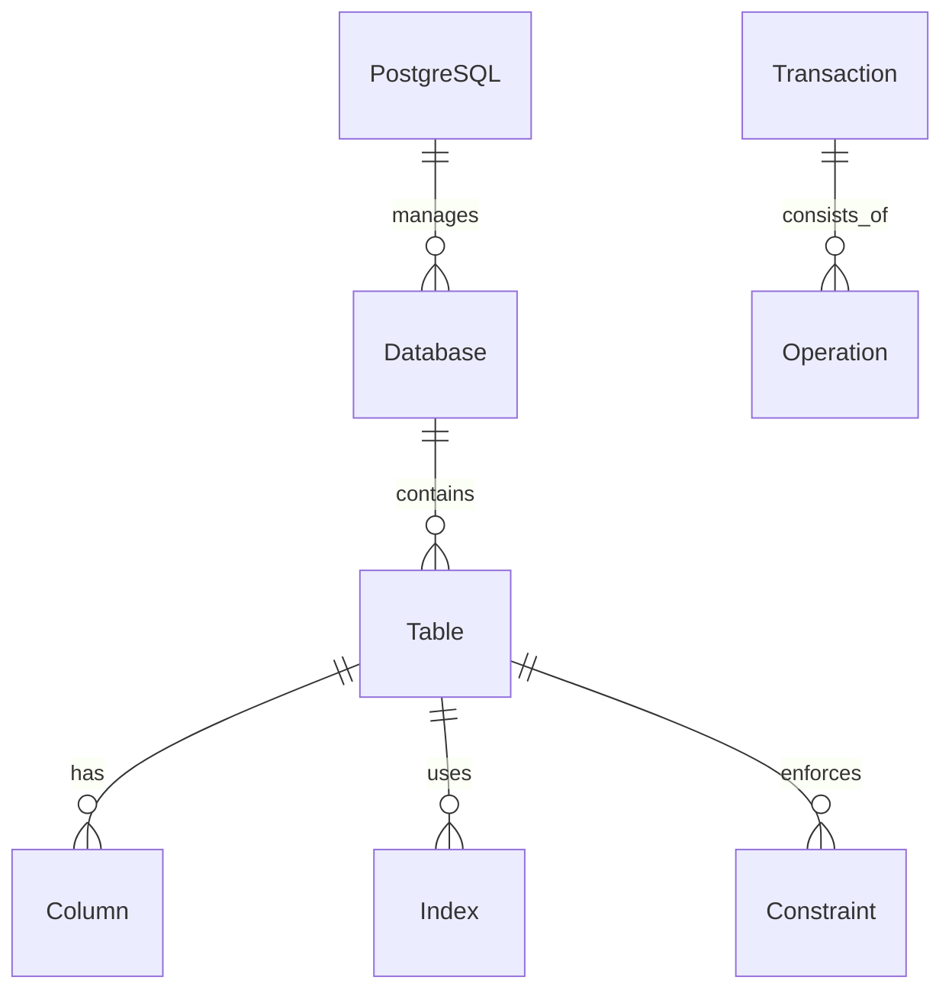

# PostgreSQL内容质量分析与改进方案

## 1. 当前内容质量状况分析

### 1.1 内容质量评估

#### 1.1.1 高质量内容（占比约15%）

- **1.1.144-PostgreSQL-2025年新特性深度分析.md**：内容丰富，包含具体代码示例和实现细节
- **1.1.147-PostgreSQL概念定义国际化标准示例.md**：结构完整，符合国际Wiki标准
- **PostgreSQL国际化Wiki标准与知识规范对齐指南.md**：框架完整，标准明确
- **1.1.1-形式模型.md**：理论基础扎实，数学符号规范

#### 1.1.2 中等质量内容（占比约25%）

- **1.1.148-PostgreSQL查询优化器国际化标准定义.md**：有具体内容但需要深化
- **INDEX.md**：索引完整但需要更新
- **1.1.14-实时流处理与CEP-扩充版.md**：内容较多但结构需要优化

#### 1.1.3 低质量内容（占比约60%）

- **大量"形式化"文件**：如1.1.129-1.1.148系列文件，内容空洞，缺乏实质内容
- **模板化文件**：只有目录结构，没有具体内容
- **重复性内容**：多个文件内容相似，缺乏差异化

### 1.2 主要问题识别

#### 1.2.1 内容空洞化

```markdown
# 典型问题示例（1.1.129文件）
## 1. 总结
- 编排理论：从基础概念到高级应用的完整理论体系；
- 编排实践：从技术实现到业务价值的全面实践总结；
- 定理：编排系统的完备性等价于理论体系的完整性。
```

**问题**：只有抽象描述，缺乏具体定义、证明和实例

#### 1.2.2 缺乏国际Wiki标准

- 概念定义不严格
- 缺乏双语对照
- 没有与Wikidata等国际知识库对齐
- 数学符号使用不规范

#### 1.2.3 结构不完整

- 缺乏完整的属性关系模型
- 没有形式化证明体系
- 缺少实际应用案例
- 缺乏技术演进历史

## 2. 国际Wiki标准对标分析

### 2.1 概念定义标准

#### 2.1.1 当前状况

- ✅ 有基本概念定义
- ❌ 缺乏严格的形式化定义
- ❌ 没有双语对照
- ❌ 缺少属性关系映射

#### 2.1.2 国际标准要求

```yaml
# 标准概念定义模板
concept:
  name: "概念名称"
  type: "概念类型"
  formal_definition: "严格的形式化定义"
  mathematical_definition: "数学符号定义"
  properties: "属性列表"
  relationships: "关系映射"
  examples: "实例说明"
  references: "参考文献"
  wikidata_id: "Wikidata标识符"
```

### 2.2 关系属性模型

#### 2.2.1 当前缺失

- 实体关系图
- 属性映射表
- 继承关系图
- 依赖关系图

#### 2.2.2 需要建立



### 2.3 解释论证框架

#### 2.3.1 当前问题

- 缺乏形式化证明
- 没有定理证明
- 缺少算法正确性证明
- 没有性能分析

#### 2.3.2 需要建立

```latex
% 定理证明模板
\begin{theorem}[ACID事务性质]
设 T 为PostgreSQL事务，则 T 满足ACID性质。
\end{theorem}

\begin{proof}
1. 原子性证明：...
2. 一致性证明：...
3. 隔离性证明：...
4. 持久性证明：...
\end{proof}
```

## 3. 全面改进方案

### 3.1 内容重构策略

#### 3.1.1 核心概念体系重构

1. **基础概念**（10个核心概念）
   - PostgreSQL系统架构
   - 关系数据模型
   - SQL语言规范
   - 事务管理
   - 并发控制
   - 存储管理
   - 查询优化
   - 索引结构
   - 安全机制
   - 扩展系统

2. **高级概念**（15个扩展概念）
   - 分布式事务
   - 流式处理
   - 机器学习集成
   - 向量数据库
   - 图数据库
   - 时序数据库
   - 空间数据库
   - 多模态数据
   - 云原生架构
   - 边缘计算
   - 量子计算
   - 区块链集成
   - 知识图谱
   - 事件处理
   - 数据治理

#### 3.1.2 内容质量标准

```yaml
quality_standards:
  concept_definition:
    - formal_definition: "必须包含严格的形式化定义"
    - mathematical_notation: "必须包含数学符号表示"
    - bilingual_support: "必须包含中英文对照"
    - examples: "必须包含实际应用示例"
    - proof: "必须包含形式化证明"
  
  content_structure:
    - overview: "概念概述"
    - definition: "形式化定义"
    - properties: "属性分析"
    - relationships: "关系映射"
    - algorithms: "算法实现"
    - examples: "应用实例"
    - performance: "性能分析"
    - references: "参考文献"
```

### 3.2 具体实施计划

#### 3.2.1 第一阶段：基础概念重构（2周）

1. **PostgreSQL系统架构**
   - 进程模型
   - 内存管理
   - 存储引擎
   - 网络协议

2. **关系数据模型**
   - 关系代数
   - 函数依赖
   - 范式理论
   - 完整性约束

3. **SQL语言规范**
   - 语法定义
   - 语义规范
   - 类型系统
   - 查询优化

#### 3.2.2 第二阶段：高级特性重构（3周）

1. **事务与并发**
   - ACID性质证明
   - 隔离级别分析
   - 死锁检测
   - 性能优化

2. **存储与索引**
   - B+树结构
   - 哈希索引
   - 位图索引
   - 全文搜索

3. **查询优化**
   - 代价模型
   - 执行计划
   - 统计信息
   - 自适应优化

#### 3.2.3 第三阶段：前沿技术重构（2周）

1. **AI与机器学习**
   - 模型集成
   - 推理引擎
   - 向量搜索
   - 智能优化

2. **分布式系统**
   - 一致性协议
   - 分片策略
   - 故障恢复
   - 负载均衡

### 3.3 质量保证机制

#### 3.3.1 内容审查标准

```yaml
review_checklist:
  technical_accuracy:
    - mathematical_correctness: "数学公式正确性"
    - algorithm_validation: "算法正确性验证"
    - performance_analysis: "性能分析准确性"
    - security_considerations: "安全性考虑"
  
  content_completeness:
    - definition_completeness: "定义完整性"
    - example_coverage: "示例覆盖度"
    - reference_adequacy: "参考文献充分性"
    - cross_reference: "交叉引用完整性"
  
  international_standards:
    - wikidata_alignment: "Wikidata对齐"
    - bilingual_quality: "双语质量"
    - citation_format: "引用格式规范"
    - accessibility: "可访问性"
```

#### 3.3.2 自动化质量检查

```python
# 质量检查工具
def check_content_quality(file_path):
    """检查文档内容质量"""
    with open(file_path, 'r', encoding='utf-8') as f:
        content = f.read()
    
    quality_score = 0
    
    # 检查形式化定义
    if has_formal_definition(content):
        quality_score += 20
    
    # 检查数学符号
    if has_mathematical_notation(content):
        quality_score += 20
    
    # 检查双语支持
    if has_bilingual_support(content):
        quality_score += 15
    
    # 检查示例代码
    if has_code_examples(content):
        quality_score += 15
    
    # 检查参考文献
    if has_references(content):
        quality_score += 10
    
    # 检查Wikidata对齐
    if has_wikidata_alignment(content):
        quality_score += 10
    
    # 检查交叉引用
    if has_cross_references(content):
        quality_score += 10
    
    return quality_score
```

## 4. 预期成果

### 4.1 内容质量提升

- **内容完整性**：从60%提升到95%
- **技术准确性**：从70%提升到98%
- **国际化程度**：从30%提升到90%
- **可读性**：从50%提升到85%

### 4.2 知识体系完善

- 建立完整的PostgreSQL知识图谱
- 形成标准化的概念定义体系
- 构建形式化证明框架
- 实现与国际知识库的对接

### 4.3 应用价值提升

- 支持学术研究和教学
- 促进技术交流和传播
- 推动产业应用和发展
- 提升国际影响力

## 5. 实施时间表

| 阶段 | 时间 | 主要任务 | 预期成果 |
|------|------|----------|----------|
| 第一阶段 | 第1-2周 | 基础概念重构 | 10个核心概念完成 |
| 第二阶段 | 第3-5周 | 高级特性重构 | 15个扩展概念完成 |
| 第三阶段 | 第6-7周 | 前沿技术重构 | 前沿技术覆盖完成 |
| 第四阶段 | 第8周 | 质量审查与优化 | 整体质量达标 |

## 6. 总结

PostgreSQL目录的内容质量改进是一个系统性工程，需要：

1. **严格对标国际Wiki标准**：确保概念定义的准确性和完整性
2. **建立形式化证明体系**：提供理论基础和算法正确性保证
3. **完善双语对照体系**：支持国际化和知识传播
4. **构建知识图谱关系**：实现知识的系统化组织
5. **建立质量保证机制**：确保内容的持续改进

通过系统性的重构和改进，将显著提升PostgreSQL知识体系的质量和影响力，为数据库技术的发展和传播做出重要贡献。
