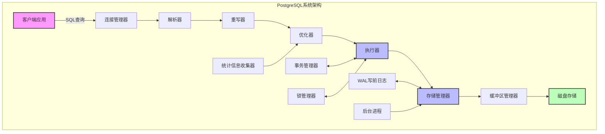
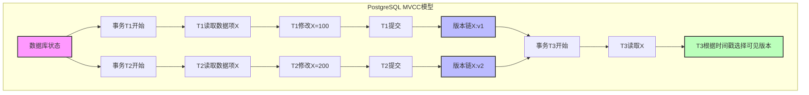
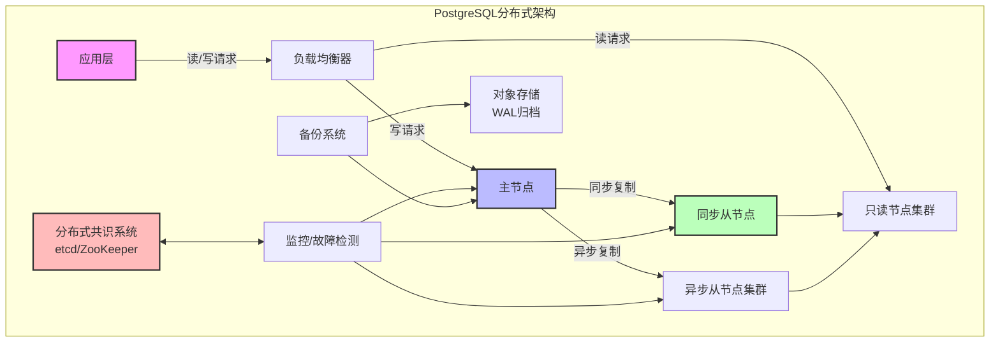
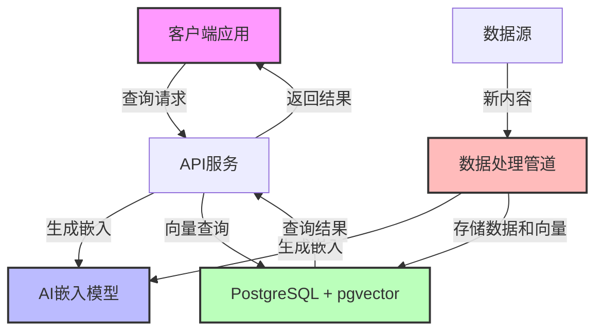
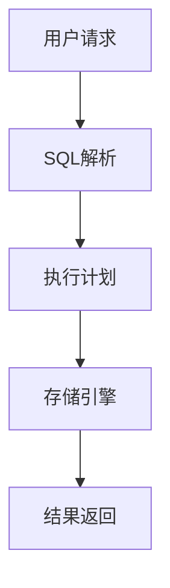

# PostgreSQL分析概述

## 简介

本目录包含对PostgreSQL数据库系统的全面分析，从形式化模型到实际应用，涵盖了PostgreSQL的核心概念、架构设计、数据模型以及与AI技术的集成。分析遵循严格的形式化方法，结合多种表征方式，包括数学符号、图表和代码示例。

## 文档结构

本分析分为九个主要部分：

1. [**形式模型**](./1.1.1-形式模型.md) - PostgreSQL的理论基础，包括关系代数、事务模型和并发控制的形式化定义。
   - 关系代数基础
   - 事务形式化模型
   - 查询处理形式化
   - 并发控制形式化
   - 形式验证与证明

2. [**系统架构**](./1.1.2-系统架构.md) - PostgreSQL的整体架构设计，包括进程模型、内存架构和查询处理流程。
   - 进程模型
   - 内存架构
   - 查询处理流程
   - 存储架构
   - 并发控制机制
   - 可靠性与恢复机制

3. [**数据模型**](./1.1.3-数据模型.md) - PostgreSQL的数据模型，重点关注其丰富的类型系统和扩展性。
   - 关系模型基础
   - 类型系统
   - JSON与半结构化数据
   - 继承与分区
   - 扩展与自定义类型
   - 约束与完整性

4. [**查询优化**](./1.1.4-查询优化.md) - PostgreSQL的查询优化器设计和执行计划生成。
   - 查询优化基础
   - 统计信息收集
   - 成本模型
   - 连接顺序优化
   - 执行计划选择
   - 查询重写优化

5. [**事务处理**](./1.1.5-事务处理.md) - PostgreSQL的事务处理机制，包括MVCC和隔离级别。
   - 事务基础
   - MVCC实现
   - 隔离级别
   - 锁管理
   - 死锁检测
   - 两阶段提交

6. [**AI与PostgreSQL集成**](./1.1.6-AI与PostgreSQL集成.md) - PostgreSQL与AI技术的集成，包括向量搜索和机器学习功能。
   - 向量搜索基础
   - PostgreSQL向量扩展
   - 嵌入式AI模型集成
   - 自然语言处理与全文搜索
   - 机器学习集成
   - 实时AI应用架构

7. [**向量数据库扩展**](./1.1.7-向量数据库扩展.md) - PostgreSQL作为向量数据库的能力，重点关注pgvector扩展。
   - 向量数据库基础
   - pgvector扩展详解
   - 索引算法与性能
   - 扩展性与集群化
   - 应用场景分析
   - 与其他向量数据库比较

8. [**MVCC高级分析与形式证明**](./1.1.8-MVCC高级分析与形式证明.md) - 深入分析PostgreSQL的MVCC模型，提供严格的形式化证明。
   - MVCC数据模型的形式化定义与证明
   - MVCC与其他并发控制模型的深度比较
   - PostgreSQL MVCC实现的特殊性分析
   - 分布式MVCC的形式化模型
   - 系统级优缺点的定量分析

9. [**PostgreSQL分布式架构与系统优缺点**](./1.1.9-PostgreSQL分布式架构与系统优缺点.md) - 分析PostgreSQL的分布式能力和系统级优缺点。
   - PostgreSQL系统设计原则的形式化分析
   - PostgreSQL与其他数据库系统的体系结构比较
   - PostgreSQL分布式架构的理论模型
   - PostgreSQL分布式解决方案的比较与评价
   - 系统级优缺点的全面分析

## 核心概念图示

### PostgreSQL系统架构

### MVCC模型

### PostgreSQL分布式架构

### 向量数据库架构

## 关键特性总结

1. **可扩展性**：PostgreSQL的核心设计原则之一是可扩展性，通过扩展系统允许添加新的数据类型、函数、操作符、索引方法等。

2. **强大的类型系统**：支持丰富的内置类型和自定义类型，包括基本类型、复合类型、枚举类型、数组、范围类型等。

3. **先进的并发控制**：基于多版本并发控制(MVCC)实现高并发性能，避免读写阻塞，支持各种隔离级别。

4. **分布式能力**：通过多种扩展解决方案（如Citus、Postgres-XL、BDR等）支持不同需求的分布式部署，实现水平扩展。

5. **灵活的存储模型**：支持表继承、分区表、外部表等多种存储模式，适应不同的数据管理需求。

6. **AI友好**：通过pgvector等扩展提供向量存储和相似度搜索功能，支持现代AI应用开发。

7. **强大的查询优化器**：基于成本的查询优化器能够处理复杂查询，支持多种连接算法和访问方法。

8. **高可靠性**：通过WAL(预写式日志)、复制、PITR(时间点恢复)等机制确保数据安全。

## 与AI集成的关键优势

1. **向量搜索能力**：通过pgvector扩展支持高效的向量相似度搜索，适用于语义搜索、推荐系统等AI应用。

2. **JSON支持**：强大的JSON/JSONB支持使其能够灵活存储和查询半结构化数据，如AI模型的配置和结果。

3. **可编程性**：支持多种过程语言(PL/Python, PL/R等)，可以直接在数据库中执行机器学习代码。

4. **数据整合**：能够将关系数据和向量数据统一管理，简化AI应用的数据架构。

5. **事务支持**：为AI应用提供ACID保证，确保数据一致性和可靠性。

## 参考文献

1. PostgreSQL Global Development Group. (2023). *PostgreSQL Documentation*. <https://www.postgresql.org/docs/>
2. Momjian, B. (2018). *PostgreSQL: Introduction and Concepts*. Addison-Wesley.
3. Obe, R., & Hsu, L. (2017). *PostgreSQL: Up and Running* (3rd ed.). O'Reilly Media.
4. pgvector. (2023). *pgvector: Open-source vector similarity search for Postgres*. <https://github.com/pgvector/pgvector>
5. Malkov, Y. A., & Yashunin, D. A. (2018). *Efficient and robust approximate nearest neighbor search using Hierarchical Navigable Small World graphs*. IEEE transactions on pattern analysis and machine intelligence.
6. Stonebraker, M., & Rowe, L. A. (1986). "The Design of POSTGRES". ACM SIGMOD.
7. Kleppmann, M. (2017). "Designing Data-Intensive Applications". O'Reilly Media.
8. Bernstein, P. A., & Goodman, N. (1983). "Multiversion Concurrency Control—Theory and Algorithms". ACM Transactions on Database Systems.
9. Ports, D. R. K., & Grittner, K. (2012). "Serializable Snapshot Isolation in PostgreSQL". VLDB.
10. Cahill, M. J., et al. (2008). "Serializable Isolation for Snapshot Databases". ACM SIGMOD.

# 1.1 PostgreSQL 主题导航与多表征案例

## 目录结构与本地跳转

- [1.1.1 形式模型](./1.1.1-形式模型.md)
- [1.1.2 系统架构](./1.1.2-系统架构.md)
- [1.1.3 数据模型](./1.1.3-数据模型.md)
- [1.1.4 查询优化](./1.1.4-查询优化.md)
- [1.1.6 AI与PostgreSQL集成](./1.1.6-AI与PostgreSQL集成.md)
- [1.1.7 向量数据库扩展](./1.1.7-向量数据库扩展.md)
- [1.1.8 MVCC高级分析与形式证明](./1.1.8-MVCC高级分析与形式证明.md)
- [1.1.9 PostgreSQL分布式架构与系统优缺点](./1.1.9-PostgreSQL分布式架构与系统优缺点.md)
- [1.1.10 MVCC与其他并发控制模型对比与极限分析](./1.1.10-MVCC与其他并发控制模型对比与极限分析.md)
- [1.1.11 PostgreSQL系统设计与现代硬件AI场景适配性分析](./1.1.11-PostgreSQL系统设计与现代硬件AI场景适配性分析.md)
- [1.1.12 PostgreSQL与主流数据库系统对比分析](./1.1.12-PostgreSQL与主流数据库系统对比分析.md)
- [1.1.13 未解难题与未来研究方向](./1.1.13-未解难题与未来研究方向.md)

---

## 行业案例与多表征

### 1.1.x 典型行业案例
- 金融行业：高并发交易与风控、合规审计（详见5.1-金融数据分析、3.3.3-并发控制算法、7-持续集成与演进）
- AI平台：向量数据库与AI检索、模型数据管理（详见1.1.7-向量数据库扩展、1.1.6-AI与PostgreSQL集成、3.5.7-数据存储与访问）
- 实时分析：流式数据处理与ETL（详见3.5.5-数据流处理与架构、3.5.2-ETL理论与实践）

### 1.1.x 多表征示例
- 系统架构图、数据流图、MVCC时序图、SQL执行计划、合规审计流程、Latex公式等

---

[返回数据库系统导航](../README.md)
