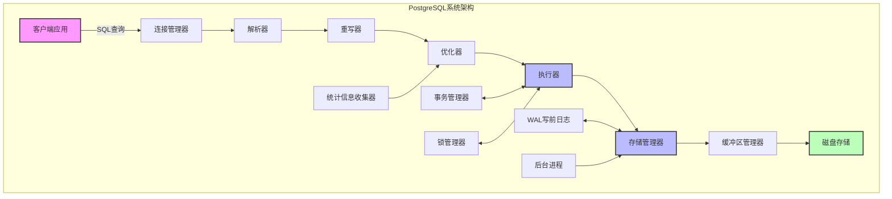
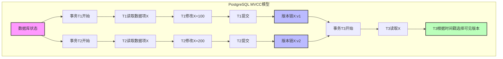
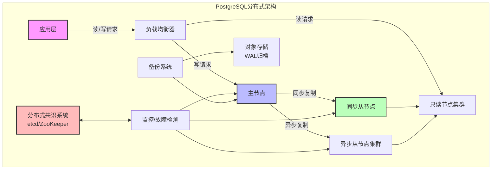
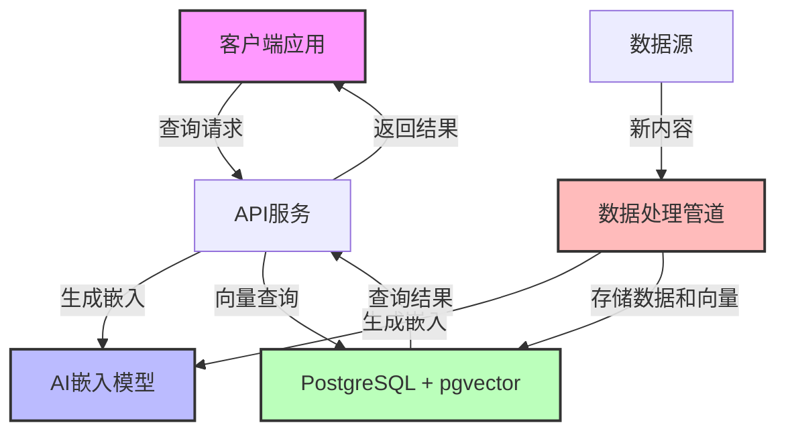
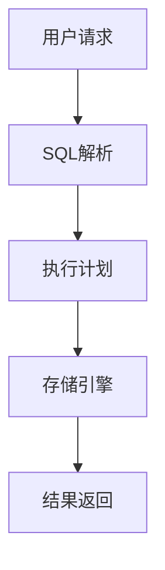
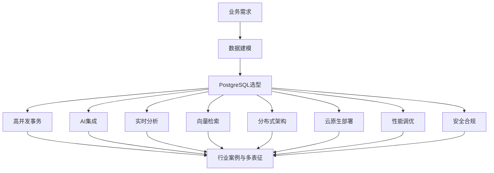
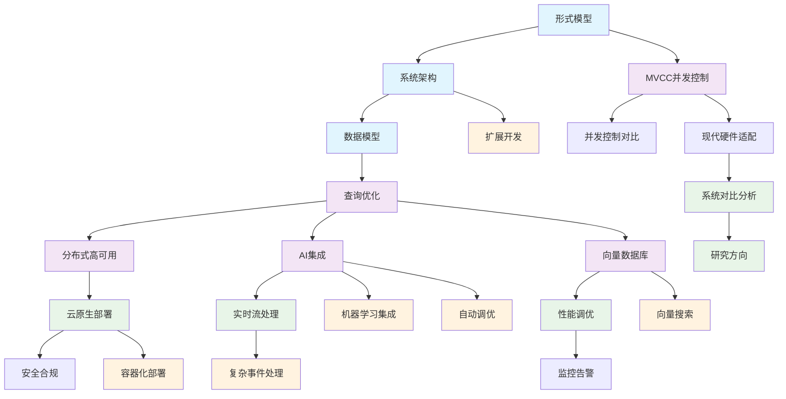

# PostgreSQL分析概述

> **📢 重要更新（2025-10-30）**
> 
> 我们完成了对PostgreSQL AI集成内容的全面批判性评价。发现部分内容存在虚构特性，已进行标注和改进。
> 
> - 🔍 [查看批判性评价报告](./PostgreSQL-AI集成批判性评价报告-2025-10.md)
> - 🚀 [30分钟快速入门：AI集成实战](./00-项目导航/AI集成快速开始.md) - **新手推荐**
> - ☁️ [Azure AI扩展实战指南](./05-前沿技术/05.03-Azure-AI扩展实战.md) - **生产就绪**
> - 📋 [查看改进计划和进度](./00-项目导航/AI集成改进行动计划.md)

## 简介

本目录包含对PostgreSQL数据库系统的全面分析，从形式化模型到实际应用，涵盖了PostgreSQL的核心概念、架构设计、数据模型以及与AI技术的集成。分析遵循严格的形式化方法，结合多种表征方式，包括数学符号、图表和代码示例。

## 文档结构

本分析分为九个主要部分：

1. [**形式模型**](./1.1.1-形式模型.md) - PostgreSQL的理论基础，包括关系代数、事务模型和并发控制的形式化定义。
   - 关系代数基础
   - 事务形式化模型
   - 查询处理形式化
   - 并发控制形式化
   - 形式验证与证明

2. [**系统架构**](./01-核心基础/01.01-系统架构与设计原理.md) - PostgreSQL的整体架构设计，包括进程模型、内存架构和查询处理流程。
   - 进程模型
   - 内存架构
   - 查询处理流程
   - 存储架构
   - 并发控制机制
   - 可靠性与恢复机制

3. [**数据模型**](./1.1.3-数据模型.md) - PostgreSQL的数据模型，重点关注其丰富的类型系统和扩展性。
   - 关系模型基础
   - 类型系统
   - JSON与半结构化数据
   - 继承与分区
   - 扩展与自定义类型
   - 约束与完整性

4. [**查询优化**](./02-查询处理/02.01-查询优化器原理.md) - PostgreSQL的查询优化器设计和执行计划生成。
   - 查询优化基础
   - 统计信息收集
   - 成本模型
   - 连接顺序优化
   - 执行计划选择
   - 查询重写优化

5. [**事务处理**](./1.1.5-事务处理.md) - PostgreSQL的事务处理机制，包括MVCC和隔离级别。
   - 事务基础
   - MVCC实现
   - 隔离级别
   - 锁管理
   - 死锁检测
   - 两阶段提交

6. [**AI与PostgreSQL集成**](./05-前沿技术/05.02-AI模型深度集成.md) - PostgreSQL与AI技术的集成，包括向量搜索和机器学习功能。
   
   **🎯 快速入门（推荐新手）**
   - 🆕 [AI集成快速开始](./00-项目导航/AI集成快速开始.md) - **30分钟实战教程** ⭐推荐新手
   
   **📚 实战指南（生产就绪）**
   - 🆕 [RAG架构实战指南](./05-前沿技术/05.04-RAG架构实战指南.md) - **完整方案** ⭐⭐⭐⭐⭐
   - 🆕 [向量检索性能调优](./05-前沿技术/05.05-向量检索性能调优指南.md) - **系统化调优** ⭐⭐⭐⭐
   - 🆕 [Azure AI扩展实战](./05-前沿技术/05.03-Azure-AI扩展实战.md) - **云原生方案** ⭐⭐⭐⭐
   
   **🚀 端到端案例（完整项目）** ⭐⭐⭐⭐⭐ 新增！
   - 🆕 [语义搜索系统](./06-实战案例/06.01-语义搜索系统端到端实现.md) - **1,568行完整实现** - 文档上传、向量化、混合检索
   - 🆕 [RAG知识库项目](./06-实战案例/06.02-RAG知识库完整项目.md) - **1,684行企业级** - 多租户、LangChain、Celery
   - 🆕 [智能推荐系统](./06-实战案例/06.03-智能推荐系统.md) - **1,327行生产级** - 协同过滤、A/B测试
   - 📊 [P2案例完成总结](./P2-端到端案例完成总结-2025-10-30.md) - **项目成果汇报**
   
   **📖 理论基础**
   - 向量搜索基础
   - PostgreSQL向量扩展
   - 嵌入式AI模型集成
   - 自然语言处理与全文搜索
   - 机器学习集成
   - 实时AI应用架构
   - ⚠️ [文档质量评价和改进](./PostgreSQL-AI集成批判性评价报告-2025-10.md)

7. [**向量数据库扩展**](./03-高级特性/03.05-向量数据库支持.md) - PostgreSQL作为向量数据库的能力，重点关注pgvector扩展。
   - 向量数据库基础
   - pgvector扩展详解
   - 索引算法与性能
   - 扩展性与集群化
   - 应用场景分析
   - 与其他向量数据库比较

8. [**MVCC高级分析与形式证明**](./1.1.8-MVCC高级分析与形式证明.md) - 深入分析PostgreSQL的MVCC模型，提供严格的形式化证明。
   - MVCC数据模型的形式化定义与证明
   - MVCC与其他并发控制模型的深度比较
   - PostgreSQL MVCC实现的特殊性分析
   - 分布式MVCC的形式化模型
   - 系统级优缺点的定量分析

9. [**PostgreSQL分布式架构与系统优缺点**](./1.1.9-PostgreSQL分布式架构与系统优缺点.md) - 分析PostgreSQL的分布式能力和系统级优缺点。
   - PostgreSQL系统设计原则的形式化分析
   - PostgreSQL与其他数据库系统的体系结构比较
   - PostgreSQL分布式架构的理论模型
   - PostgreSQL分布式解决方案的比较与评价
   - 系统级优缺点的全面分析

## 核心概念图示

### PostgreSQL系统架构



### MVCC模型



### PostgreSQL分布式架构



### 向量数据库架构



## 关键特性总结

1. **可扩展性**：PostgreSQL的核心设计原则之一是可扩展性，通过扩展系统允许添加新的数据类型、函数、操作符、索引方法等。

2. **强大的类型系统**：支持丰富的内置类型和自定义类型，包括基本类型、复合类型、枚举类型、数组、范围类型等。

3. **先进的并发控制**：基于多版本并发控制(MVCC)实现高并发性能，避免读写阻塞，支持各种隔离级别。

4. **分布式能力**：通过多种扩展解决方案（如Citus、Postgres-XL、BDR等）支持不同需求的分布式部署，实现水平扩展。

5. **灵活的存储模型**：支持表继承、分区表、外部表等多种存储模式，适应不同的数据管理需求。

6. **AI友好**：通过pgvector等扩展提供向量存储和相似度搜索功能，支持现代AI应用开发。

7. **强大的查询优化器**：基于成本的查询优化器能够处理复杂查询，支持多种连接算法和访问方法。

8. **高可靠性**：通过WAL(预写式日志)、复制、PITR(时间点恢复)等机制确保数据安全。

## 与AI集成的关键优势

1. **向量搜索能力**：通过pgvector扩展支持高效的向量相似度搜索，适用于语义搜索、推荐系统等AI应用。

2. **JSON支持**：强大的JSON/JSONB支持使其能够灵活存储和查询半结构化数据，如AI模型的配置和结果。

3. **可编程性**：支持多种过程语言(PL/Python, PL/R等)，可以直接在数据库中执行机器学习代码。

4. **数据整合**：能够将关系数据和向量数据统一管理，简化AI应用的数据架构。

5. **事务支持**：为AI应用提供ACID保证，确保数据一致性和可靠性。

## 参考文献

1. PostgreSQL Global Development Group. (2023). *PostgreSQL Documentation*. <https://www.postgresql.org/docs/>
2. Momjian, B. (2018). *PostgreSQL: Introduction and Concepts*. Addison-Wesley.
3. Obe, R., & Hsu, L. (2017). *PostgreSQL: Up and Running* (3rd ed.). O'Reilly Media.
4. pgvector. (2023). *pgvector: Open-source vector similarity search for Postgres*. <https://github.com/pgvector/pgvector>
5. Malkov, Y. A., & Yashunin, D. A. (2018). *Efficient and robust approximate nearest neighbor search using Hierarchical Navigable Small World graphs*. IEEE transactions on pattern analysis and machine intelligence.
6. Stonebraker, M., & Rowe, L. A. (1986). "The Design of POSTGRES". ACM SIGMOD.
7. Kleppmann, M. (2017). "Designing Data-Intensive Applications". O'Reilly Media.
8. Bernstein, P. A., & Goodman, N. (1983). "Multiversion Concurrency Control—Theory and Algorithms". ACM Transactions on Database Systems.
9. Ports, D. R. K., & Grittner, K. (2012). "Serializable Snapshot Isolation in PostgreSQL". VLDB.
10. Cahill, M. J., et al. (2008). "Serializable Isolation for Snapshot Databases". ACM SIGMOD.

## 1.1 PostgreSQL 主题导航与多表征案例

## 目录结构与本地跳转

- [1.1.1 形式模型](./1.1.1-形式模型.md)
- [1.1.2 系统架构](./1.1.2-系统架构.md)
- [1.1.3 数据模型](./1.1.3-数据模型.md)
- [1.1.4 查询优化](./1.1.4-查询优化-增强版.md)
- [1.1.6 AI与PostgreSQL集成](./1.1.6-AI与PostgreSQL集成.md)
- [1.1.7 向量数据库扩展](./1.1.7-向量数据库扩展.md)
- [1.1.8 MVCC高级分析与形式证明](./1.1.8-MVCC高级分析与形式证明.md)
- [1.1.9 PostgreSQL分布式架构与系统优缺点](./1.1.9-PostgreSQL分布式架构与系统优缺点.md)
- [1.1.10 MVCC与其他并发控制模型对比与极限分析](./1.1.10-MVCC与其他并发控制模型对比与极限分析.md)
- [1.1.11 PostgreSQL系统设计与现代硬件AI场景适配性分析](./1.1.11-PostgreSQL系统设计与现代硬件AI场景适配性分析.md)
- [1.1.12 PostgreSQL与主流数据库系统对比分析](./1.1.12-PostgreSQL与主流数据库系统对比分析.md)
- [1.1.13 未解难题与未来研究方向](./1.1.13-未解难题与未来研究方向.md)

---

## 行业案例与多表征

### 1.1.x 典型行业案例

- 金融行业：高并发交易与风控、合规审计（详见5.1-金融数据分析、3.3.3-并发控制算法、7-持续集成与演进）
- AI平台：向量数据库与AI检索、模型数据管理（详见1.1.7-向量数据库扩展、1.1.6-AI与PostgreSQL集成、3.5.7-数据存储与访问）
- 实时分析：流式数据处理与ETL（详见3.5.5-数据流处理与架构、3.5.2-ETL理论与实践）

### 1.1.x 多表征示例

- 系统架构图、数据流图、MVCC时序图、SQL执行计划、合规审计流程、Latex公式等



---

[返回数据库系统导航](../README.md)

## 1.1-PostgreSQL 分支导航

## 目录结构与本地跳转1

- [1.1.1-形式模型](1.1.1-形式模型.md)
- [1.1.2-系统架构](1.1.2-系统架构.md)
- [1.1.3-数据模型](1.1.3-数据模型.md)
- [1.1.4-查询优化](1.1.4-查询优化-增强版.md)
- [1.1.5-分布式与高可用](1.1.5-分布式与高可用.md)
- [1.1.6-AI与PostgreSQL集成](1.1.6-AI与PostgreSQL集成.md)
- [1.1.7-向量数据库扩展](1.1.7-向量数据库扩展.md)
- [1.1.8-MVCC高级分析与形式证明](1.1.8-MVCC高级分析与形式证明.md)
- [1.1.9-分布式PostgreSQL架构设计](1.1.9-分布式PostgreSQL架构设计.md)
- [1.1.10-MVCC与其他并发控制模型对比与极限分析](1.1.10-MVCC与其他并发控制模型对比与极限分析.md)
- [1.1.11-PostgreSQL系统设计与现代硬件AI场景适配性分析](1.1.11-PostgreSQL系统设计与现代硬件AI场景适配性分析.md)
- [1.1.12-PostgreSQL与主流数据库系统对比分析](1.1.12-PostgreSQL与主流数据库系统对比分析.md)
- [1.1.13-未解难题与未来研究方向](1.1.13-未解难题与未来研究方向.md)
- [1.1.14-实时流处理与CEP](1.1.14-实时流处理与CEP.md)
- [1.1.15-云原生与容器化部署](1.1.15-云原生与容器化部署.md)
- [1.1.16-性能调优与监控](1.1.16-性能调优与监控.md)
- [1.1.17-安全与合规](1.1.17-安全与合规.md)

---

## 主题交叉引用

| 主题      | 形式模型 | 系统架构 | 数据模型 | 查询优化 | 分布式/高可用 | AI集成 | 向量数据库 | MVCC | 云原生 | 性能调优 | 安全合规 |
|-----------|----------|----------|----------|----------|--------------|--------|------------|------|--------|----------|----------|
| PostgreSQL| ✓        | ✓        | ✓        | ✓        | ✓            | ✓      | ✓          | ✓    | ✓      | ✓        | ✓        |

- 交叉引用：[3.5-数据分析与ETL](../../../3-数据模型与算法/3.5-数据分析与ETL/README.md)、[4.3-微服务架构](../../../4-软件架构与工程/4.3-微服务架构/README.md)、[7-持续集成与演进](../../../7-持续集成与演进/README.md)

---

## 全链路知识流（Mermaid流程图）



---

[返回数据库系统总导航](../README.md)

## 1.1-PostgreSQL - 知识导航索引

## 📚 目录结构

```text
1.1-PostgreSQL/
├── README.md                           # 本导航文件
├── 1.1.1-形式模型.md                   # PostgreSQL形式化模型
├── 1.1.2-系统架构.md                   # PostgreSQL系统架构
├── 1.1.3-数据模型.md                   # PostgreSQL数据模型
├── 1.1.4-查询优化-增强版.md            # PostgreSQL查询优化
├── 1.1.5-分布式与高可用.md             # 分布式PostgreSQL
├── 1.1.6-AI与PostgreSQL集成.md         # AI集成技术
├── 1.1.7-向量数据库扩展.md             # 向量数据库
├── 1.1.8-MVCC高级分析与形式证明.md     # MVCC并发控制
├── 1.1.9-分布式PostgreSQL架构设计.md   # 分布式架构
├── 1.1.10-MVCC与其他并发控制模型对比与极限分析.md # 并发控制对比
├── 1.1.11-PostgreSQL系统设计与现代硬件AI场景适配性分析.md # 现代硬件适配
├── 1.1.12-PostgreSQL与主流数据库系统对比分析.md # 系统对比分析
├── 1.1.13-未解难题与未来研究方向.md   # 研究方向
├── 1.1.14-实时流处理与CEP.md          # 流处理技术
├── 1.1.15-云原生与容器化部署.md       # 云原生部署
├── 1.1.16-性能调优与监控.md           # 性能优化
├── 1.1.17-安全与合规.md               # 安全合规
├── knowledge_map.md                    # 知识图谱
└── INDEX.md                           # 索引文件
```

## 🔗 主题交叉引用表

| 技术分支 | 核心概念 | 关联理论 | 应用领域 |
|---------|---------|---------|---------|
| **形式模型** | 形式化定义、理论证明 | 形式科学理论、数学基础 | 系统验证、理论研究 |
| **系统架构** | 模块化设计、组件交互 | 软件架构、分布式系统 | 系统设计、架构优化 |
| **数据模型** | 关系模型、扩展类型 | 数据模型算法、类型理论 | 数据建模、应用开发 |
| **查询优化** | 执行计划、索引优化 | 算法实现、控制理论 | 性能调优、查询分析 |
| **分布式高可用** | 集群部署、故障恢复 | 分布式系统理论、控制理论 | 大规模部署、容灾 |
| **AI集成** | 机器学习、智能优化 | AI算法、数据科学 | 智能数据库、AI应用 |
| **向量数据库** | 向量检索、相似度计算 | 机器学习算法、图算法 | 推荐系统、图像检索 |
| **MVCC并发控制** | 多版本控制、事务隔离 | 并发控制算法、时态逻辑 | 高并发应用、事务处理 |

## 🌊 全链路知识流图



## 🎯 知识体系特色

### 🏗️ **理论严谨性**

- 基于形式化模型的严格定义
- 可证明的系统正确性
- 数学基础支撑的算法设计

### 🚀 **技术创新性**

- AI与数据库的深度集成
- 向量数据库的扩展能力
- 云原生架构的现代化

### 🔄 **高可用性**

- 分布式集群部署
- 多版本并发控制
- 故障自动恢复机制

### 📊 **性能优化**

- 智能查询优化器
- 自适应索引管理
- 实时性能监控

## 📖 学习路径建议

### 🥇 **入门路径**

1. **形式模型** → 理解理论基础
2. **系统架构** → 掌握整体设计
3. **数据模型** → 学习数据建模

### 🥈 **进阶路径**

1. **查询优化** → 深入性能调优
2. **MVCC并发控制** → 理解并发机制
3. **分布式高可用** → 掌握集群部署

### 🥉 **专家路径**

1. **AI集成** → 智能数据库技术
2. **向量数据库** → 新型数据模型
3. **云原生部署** → 现代化运维

## 🔍 快速导航

- **[形式模型](./1.1.1-形式模型.md)** - PostgreSQL形式化模型
- **[系统架构](./01-核心基础/01.01-系统架构与设计原理.md)** - PostgreSQL系统架构
- **[数据模型](./1.1.3-数据模型.md)** - PostgreSQL数据模型
- **[查询优化](./02-查询处理/02.01-查询优化器原理.md)** - PostgreSQL查询优化
- **[分布式与高可用](./1.1.5-分布式与高可用.md)** - 分布式PostgreSQL
- **[AI与PostgreSQL集成](./05-前沿技术/05.02-AI模型深度集成.md)** - AI集成技术
- **[向量数据库扩展](./03-高级特性/03.05-向量数据库支持.md)** - 向量数据库
- **[MVCC高级分析](./1.1.8-MVCC高级分析与形式证明.md)** - MVCC并发控制
- **[分布式架构设计](./1.1.9-分布式PostgreSQL架构设计.md)** - 分布式架构
- **[并发控制对比](./1.1.10-MVCC与其他并发控制模型对比与极限分析.md)** - 并发控制对比
- **[现代硬件适配](./1.1.11-PostgreSQL系统设计与现代硬件AI场景适配性分析.md)** - 现代硬件适配
- **[系统对比分析](./1.1.12-PostgreSQL与主流数据库系统对比分析.md)** - 系统对比分析
- **[研究方向](./1.1.13-未解难题与未来研究方向.md)** - 研究方向
- **[实时流处理](./1.1.14-实时流处理与CEP.md)** - 流处理技术
- **[云原生部署](./1.1.15-云原生与容器化部署.md)** - 云原生部署
- **[性能调优](./1.1.16-性能调优与监控.md)** - 性能优化
- **[安全合规](./1.1.17-安全与合规.md)** - 安全合规

## 🚀 技术栈映射

### 🏗️ **核心架构**

- **进程模型**：多进程架构、共享内存
- **存储引擎**：堆表存储、索引结构
- **事务处理**：ACID特性、MVCC机制
- **查询处理**：解析器、优化器、执行器

### 🔧 **扩展功能**

- **自定义类型**：复合类型、枚举类型
- **存储过程**：PL/pgSQL、PL/Python
- **触发器**：行级触发器、语句级触发器
- **视图**：普通视图、物化视图

### 🤖 **AI集成**

- **机器学习扩展**：pg_ml、Madlib
- **向量操作**：pgvector、相似度计算
- **智能优化**：自适应查询优化
- **预测分析**：时间序列分析

### ☁️ **云原生技术**

- **容器化**：Docker、Kubernetes
- **服务网格**：Istio、Linkerd
- **监控告警**：Prometheus、Grafana
- **日志管理**：ELK Stack、Fluentd

## 📈 应用场景体系

### 🏢 **企业应用**

- **OLTP系统**：高并发事务处理
- **数据仓库**：大规模数据分析
- **内容管理**：文档存储、版本控制
- **地理信息**：PostGIS空间数据

### 🤖 **AI应用**

- **推荐系统**：向量相似度检索
- **图像识别**：特征向量存储
- **自然语言处理**：文本向量化
- **预测分析**：时间序列建模

### ☁️ **云原生应用**

- **微服务数据库**：服务化部署
- **多租户系统**：资源隔离
- **边缘计算**：分布式部署
- **实时分析**：流数据处理

---

*本导航为PostgreSQL技术体系提供系统化的知识组织框架，支持从基础理论到实际应用的完整学习路径。*

## 多表征

本分支支持多种表征方式，包括：

- 符号表征（数据模型、查询语言、事务、索引、并发控制等）
- 图结构（ER图、系统架构图、数据流图、事务依赖图等）
- 向量/张量（数据嵌入、特征向量、参数矩阵）
- 自然语言（定义、注释、描述）
- 图像/可视化（结构图、流程图、查询与事务可视化等）
这些表征可互映，提升PostgreSQL理论与实践表达力。

## 形式化语义

- 语义域：$D$，如数据对象集、关系空间、查询模型、事务空间、索引结构
- 解释函数：$I: S \to D$，将符号/结构映射到具体数据库语义对象
- 语义一致性：每个结构/查询/事务/索引在$D$中有明确定义

## 形式化语法与证明

- 语法规则：如数据模型定义、SQL语法、事务规则、索引定义、约束条件
- **定理**：本分支的语法系统具一致性与可扩展性。
- **证明**：由数据模型、SQL语法、事务与索引规则递归定义，保证系统一致与可扩展。
