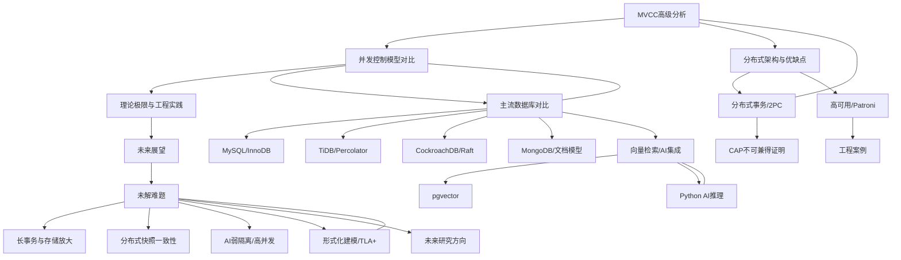

# PostgreSQL 数据库系统全局知识图谱

```mermaid
graph TD
    A[MVCC高级分析] --> B[并发控制模型对比]
    A --> C[分布式架构与优缺点]
    B --> D[理论极限与工程实践]
    D --> E[未来展望]
    C --> F[分布式事务/2PC]
    C --> G[高可用/Patroni]
    F --> H[CAP不可兼得证明]
    G --> I[工程案例]
    B --> J[主流数据库对比]
    J --> K[MySQL/InnoDB]
    J --> L[TiDB/Percolator]
    J --> M[CockroachDB/Raft]
    J --> N[MongoDB/文档模型]
    J --> O[向量检索/AI集成]
    O --> P[pgvector]
    O --> Q[Python AI推理]
    E --> R[未解难题]
    R --> S[长事务与存储放大]
    R --> T[分布式快照一致性]
    R --> U[AI弱隔离/高并发]
    R --> V[形式化建模/TLA+]
    R --> W[未来研究方向]
    %% 交叉引用
    A --- F
    B --- J
    O --- Q
    R --- V
```
