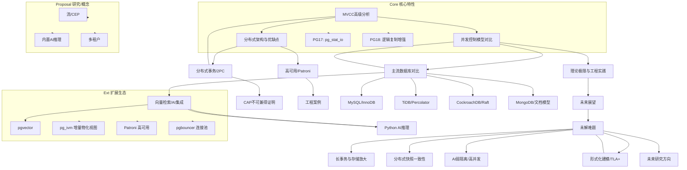

# PostgreSQL 数据库系统全局知识图谱

```mermaid
graph TD
    %% 层级标注
    subgraph Core[Core 核心特性]
        A[MVCC高级分析]
        B[并发控制模型对比]
        C[分布式架构与优缺点]
        A17[PG17: pg_stat_io]
        A18[PG18: 逻辑复制增强]
    end

    subgraph Ext[Ext 扩展生态]
        O[向量检索/AI集成]
        P[pgvector]
        IVM[pg_ivm 增量物化视图]
        HA[Patroni 高可用]
        POOL[pgbouncer 连接池]
    end

    subgraph Proposal[Proposal 研究/概念]
        STREAM[流/CEP]
        AI[内置AI推理]
        TENANT[多租户]
    end

    A --> B
    A --> C
    B --> D[理论极限与工程实践]
    D --> E[未来展望]
    C --> F[分布式事务/2PC]
    C --> G[高可用/Patroni]
    F --> H[CAP不可兼得证明]
    G --> I[工程案例]
    B --> J[主流数据库对比]
    J --> K[MySQL/InnoDB]
    J --> L[TiDB/Percolator]
    J --> M[CockroachDB/Raft]
    J --> N[MongoDB/文档模型]

    %% 向量/AI
    J --> O
    O --> P
    O --> Q[Python AI推理]

    %% 新版PG特性
    Core --> A17
    Core --> A18

    %% 扩展
    Ext --> IVM
    Ext --> HA
    Ext --> POOL

    %% 提案
    Proposal --> STREAM
    Proposal --> AI
    Proposal --> TENANT

    E --> R[未解难题]
    R --> S[长事务与存储放大]
    R --> T[分布式快照一致性]
    R --> U[AI弱隔离/高并发]
    R --> V[形式化建模/TLA+]
    R --> W[未来研究方向]

    %% 交叉引用
    A --- F
    B --- J
    O --- Q
    R --- V
```
