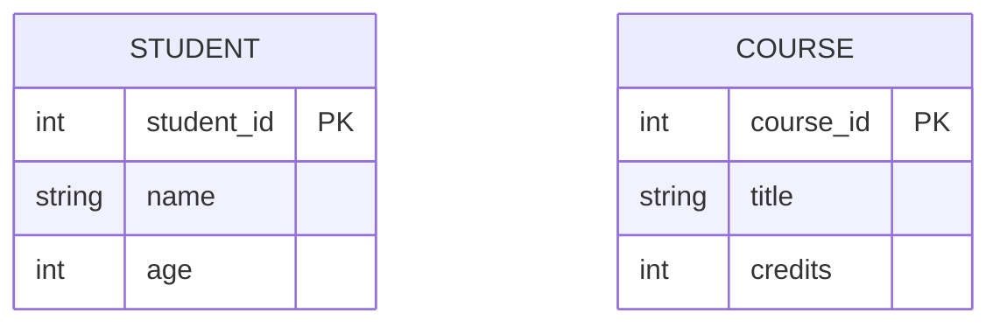
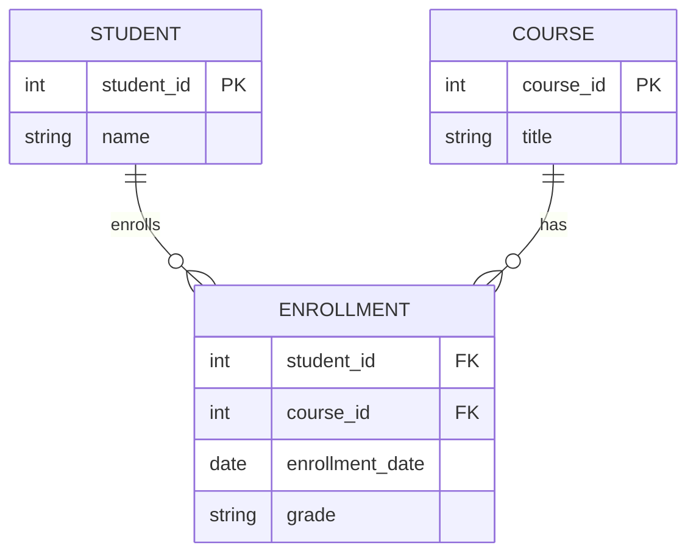
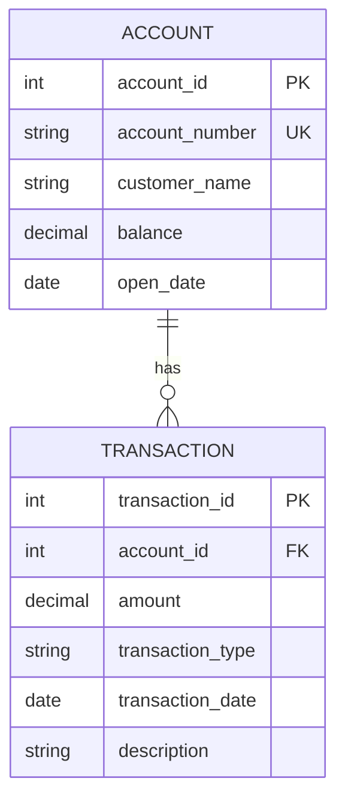
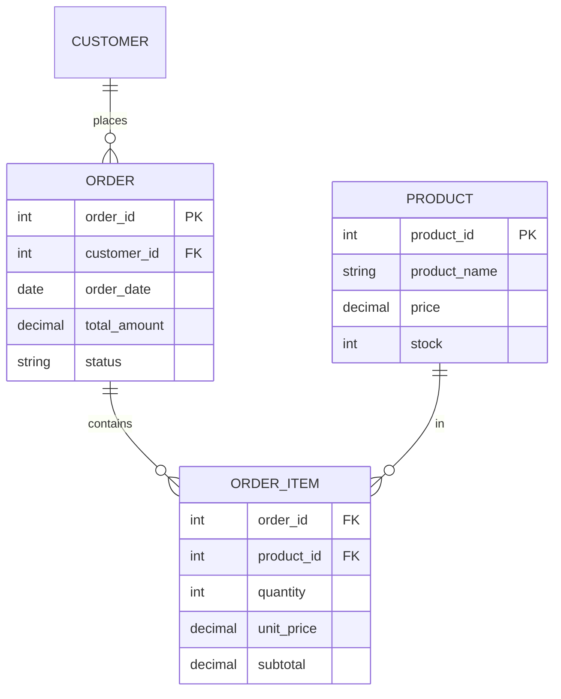
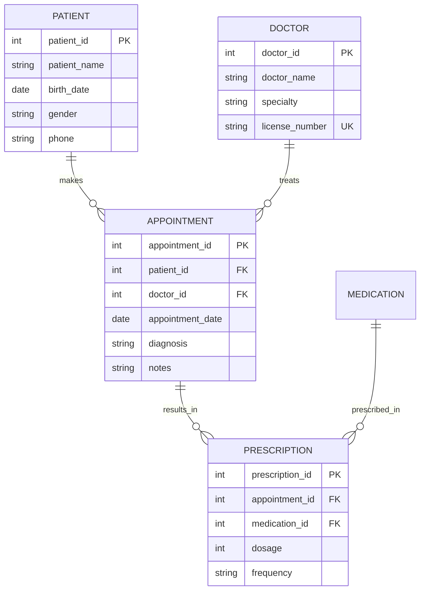

# 1.2.1 MySQL形式模型

## 📑 目录

- [1.2.1 MySQL形式模型](#121-mysql形式模型)
  - [📑 目录](#-目录)
  - [1. 概述](#1-概述)
    - [1.1. 形式模型定义](#11-形式模型定义)
    - [1.2. MySQL形式化特征](#12-mysql形式化特征)
  - [2. 关系模型基础](#2-关系模型基础)
    - [2.1. 关系模型定义](#21-关系模型定义)
      - [2.1.1. 关系定义](#211-关系定义)
      - [2.1.2. 关系模式](#212-关系模式)
    - [2.2. 关系代数](#22-关系代数)
      - [2.2.1. 基本运算](#221-基本运算)
      - [2.2.2. 扩展运算](#222-扩展运算)
    - [2.3. 关系演算](#23-关系演算)
      - [2.3.1. 元组关系演算](#231-元组关系演算)
      - [2.3.2. 域关系演算](#232-域关系演算)
  - [3. ER建模](#3-er建模)
    - [3.1. ER模型基础](#31-er模型基础)
      - [3.1.1. 实体](#311-实体)
      - [3.1.2. 属性](#312-属性)
      - [3.1.3. 关系](#313-关系)
    - [3.2. ER到关系模型转换](#32-er到关系模型转换)
      - [3.2.1. 实体转换](#321-实体转换)
      - [3.2.2. 关系转换](#322-关系转换)
    - [3.3. ER建模工具](#33-er建模工具)
  - [4. 约束与完整性](#4-约束与完整性)
    - [4.1. 实体完整性](#41-实体完整性)
      - [4.1.1. 主键约束](#411-主键约束)
      - [4.1.2. 唯一约束](#412-唯一约束)
    - [4.2. 参照完整性](#42-参照完整性)
      - [4.2.1. 外键约束](#421-外键约束)
      - [4.2.2. 引用动作](#422-引用动作)
    - [4.3. 用户定义完整性](#43-用户定义完整性)
      - [4.3.1. 检查约束](#431-检查约束)
      - [4.3.2. 非空约束](#432-非空约束)
  - [5. 范式理论](#5-范式理论)
    - [5.1. 函数依赖](#51-函数依赖)
      - [5.1.1. 函数依赖定义](#511-函数依赖定义)
      - [5.1.2. Armstrong公理](#512-armstrong公理)
    - [5.2. 第一范式（1NF）](#52-第一范式1nf)
      - [5.2.1. 1NF定义](#521-1nf定义)
      - [5.2.2. 1NF示例](#522-1nf示例)
    - [5.3. 第二范式（2NF）](#53-第二范式2nf)
      - [5.3.1. 2NF定义](#531-2nf定义)
      - [5.3.2. 2NF分解](#532-2nf分解)
    - [5.4. 第三范式（3NF）](#54-第三范式3nf)
      - [5.4.1. 3NF定义](#541-3nf定义)
      - [5.4.2. 3NF分解](#542-3nf分解)
    - [5.5. BCNF范式](#55-bcnf范式)
      - [5.5.1. BCNF定义](#551-bcnf定义)
      - [5.5.2. BCNF判定](#552-bcnf判定)
  - [6. MySQL实现特性](#6-mysql实现特性)
    - [6.1. 存储引擎支持](#61-存储引擎支持)
    - [6.2. 约束实现](#62-约束实现)
    - [6.3. 索引支持](#63-索引支持)
  - [7. 实际应用案例](#7-实际应用案例)
    - [7.1. 金融行业：账户-交易ER建模](#71-金融行业账户-交易er建模)
    - [7.2. 电商行业：订单系统建模](#72-电商行业订单系统建模)
    - [7.3. 医疗行业：患者-就诊ER建模](#73-医疗行业患者-就诊er建模)
  - [8. 形式化定义与证明](#8-形式化定义与证明)
    - [8.1. 关系模型形式化](#81-关系模型形式化)
    - [8.2. 范式理论形式化](#82-范式理论形式化)
  - [9. 多表征](#9-多表征)
  - [10. 总结与展望](#10-总结与展望)
    - [10.1. 总结](#101-总结)
    - [10.2. 发展趋势](#102-发展趋势)
    - [10.3. 最佳实践](#103-最佳实践)

---

## 1. 概述

### 1.1. 形式模型定义

**形式模型（Formal Model）**是使用数学符号和逻辑规则精确描述系统行为的模型。

**MySQL形式模型的核心要素**：

1. **关系模型**：基于集合论的关系数据模型
2. **完整性约束**：实体完整性、参照完整性、用户定义完整性
3. **范式理论**：数据库规范化理论
4. **查询模型**：关系代数和关系演算

### 1.2. MySQL形式化特征

**MySQL形式化特征**：

1. **关系模型兼容**：完全符合SQL标准和关系模型理论
2. **ACID事务**：支持原子性、一致性、隔离性、持久性
3. **完整性约束**：支持主键、外键、唯一、检查等约束
4. **范式支持**：支持1NF到BCNF的规范化设计

---

## 2. 关系模型基础

### 2.1. 关系模型定义

#### 2.1.1. 关系定义

**关系（Relation）**是一个二维表，由行（元组）和列（属性）组成。

**形式化定义**：

设关系 $R$ 为：

$$R = (A_1, A_2, \ldots, A_n)$$

其中 $A_i$ 是属性，$A_i \in D_i$（$D_i$ 是属性域）。

**关系实例**：

$$r(R) = \{t_1, t_2, \ldots, t_m\}$$

其中 $t_i = (a_{i1}, a_{i2}, \ldots, a_{in})$ 是元组。

**关系性质**：

1. **原子性**：每个属性值都是原子的，不可再分
2. **唯一性**：关系中不存在重复的元组
3. **无序性**：元组和属性的顺序无关紧要

**示例**：

```sql
-- 学生关系
CREATE TABLE Student (
    student_id INT PRIMARY KEY,
    name VARCHAR(50),
    age INT,
    major VARCHAR(50)
);

-- 关系实例
-- Student = {
--   (1, 'Alice', 20, 'Computer Science'),
--   (2, 'Bob', 21, 'Mathematics'),
--   (3, 'Charlie', 19, 'Physics')
-- }
```

#### 2.1.2. 关系模式

**关系模式（Relation Schema）**是关系的结构定义。

**形式化定义**：

设关系模式 $R$ 为：

$$R(A_1: D_1, A_2: D_2, \ldots, A_n: D_n)$$

其中 $A_i$ 是属性名，$D_i$ 是属性域。

**数据库模式**：

$$\text{Database Schema} = \{R_1, R_2, \ldots, R_k\}$$

其中 $R_i$ 是关系模式。

### 2.2. 关系代数

#### 2.2.1. 基本运算

**基本关系代数运算**：

1. **选择（Selection）**：$\sigma_{P}(R)$
   - 从关系 $R$ 中选择满足条件 $P$ 的元组
   - $$\sigma_{P}(R) = \{t | t \in R \land P(t)\}$$

2. **投影（Projection）**：$\pi_{A}(R)$
   - 从关系 $R$ 中选择属性集合 $A$ 的列
   - $$\pi_{A}(R) = \{t[A] | t \in R\}$$

3. **并（Union）**：$R \cup S$
   - 两个关系的并集
   - $$R \cup S = \{t | t \in R \lor t \in S\}$$

4. **差（Difference）**：$R - S$
   - 两个关系的差集
   - $$R - S = \{t | t \in R \land t \notin S\}$$

5. **笛卡尔积（Cartesian Product）**：$R \times S$
   - 两个关系的笛卡尔积
   - $$R \times S = \{(r, s) | r \in R \land s \in S\}$$

6. **连接（Join）**：$R \bowtie_{P} S$
   - 两个关系的连接
   - $$R \bowtie_{P} S = \sigma_{P}(R \times S)$$

**SQL实现示例**：

```sql
-- 选择：年龄大于20的学生
SELECT * FROM Student WHERE age > 20;
-- 关系代数：σ_{age > 20}(Student)

-- 投影：选择姓名和专业
SELECT name, major FROM Student;
-- 关系代数：π_{name, major}(Student)

-- 并：两个学生表的并集
SELECT * FROM Student1
UNION
SELECT * FROM Student2;
-- 关系代数：Student1 ∪ Student2

-- 差：Student1中不在Student2中的学生
SELECT * FROM Student1
WHERE student_id NOT IN (SELECT student_id FROM Student2);
-- 关系代数：Student1 - Student2

-- 笛卡尔积
SELECT * FROM Student, Course;
-- 关系代数：Student × Course

-- 连接：学生选课
SELECT * FROM Student s
JOIN Enrollment e ON s.student_id = e.student_id;
-- 关系代数：Student ⋈_{Student.student_id = Enrollment.student_id} Enrollment
```

#### 2.2.2. 扩展运算

**扩展关系代数运算**：

1. **自然连接（Natural Join）**：$R \bowtie S$
   - 自动匹配相同属性名的连接
   - $$R \bowtie S = \pi_{R \cup S}(\sigma_{R.A = S.A}(R \times S))$$

2. **外连接（Outer Join）**：
   - **左外连接**：$R \mathrel{\rlap{\bowtie}\mkern-1.5mu\bowtie} S$
   - **右外连接**：$R \bowtie\mkern-1.5mu\mathrel{\rlap{\bowtie}} S$
   - **全外连接**：$R \mathrel{\rlap{\bowtie}\mkern-1.5mu\bowtie\mkern-1.5mu\mathrel{\rlap{\bowtie}}} S$

3. **除（Division）**：$R \div S$
   - 关系除法运算
   - $$R \div S = \{t | \forall s \in S, (t, s) \in R\}$$

4. **聚合（Aggregation）**：$\gamma_{A, F}(R)$
   - 分组聚合运算
   - 其中 $A$ 是分组属性，$F$ 是聚合函数

**SQL实现示例**：

```sql
-- 自然连接
SELECT * FROM Student NATURAL JOIN Enrollment;
-- 关系代数：Student ⋈ Enrollment

-- 左外连接
SELECT * FROM Student s
LEFT JOIN Enrollment e ON s.student_id = e.student_id;
-- 关系代数：Student ⋈⋈ Enrollment

-- 分组聚合
SELECT major, COUNT(*) as count, AVG(age) as avg_age
FROM Student
GROUP BY major;
-- 关系代数：γ_{major, COUNT(*), AVG(age)}(Student)
```

### 2.3. 关系演算

#### 2.3.1. 元组关系演算

**元组关系演算（Tuple Relational Calculus）**使用元组变量表示查询。

**形式化定义**：

$$\{t | P(t)\}$$

其中 $t$ 是元组变量，$P(t)$ 是谓词。

**示例**：

```sql
-- 查询年龄大于20的学生
-- 元组关系演算：{t | Student(t) ∧ t.age > 20}
SELECT * FROM Student WHERE age > 20;

-- 查询选课的学生
-- 元组关系演算：{t | ∃e (Enrollment(e) ∧ e.student_id = t.student_id)}
SELECT DISTINCT s.* FROM Student s
WHERE EXISTS (SELECT 1 FROM Enrollment e WHERE e.student_id = s.student_id);
```

#### 2.3.2. 域关系演算

**域关系演算（Domain Relational Calculus）**使用域变量表示查询。

**形式化定义**：

$$\{<x_1, x_2, \ldots, x_n> | P(x_1, x_2, \ldots, x_n)\}$$

其中 $x_i$ 是域变量，$P$ 是谓词。

---

## 3. ER建模

### 3.1. ER模型基础

#### 3.1.1. 实体

**实体（Entity）**是现实世界中可以区分的事物。

**实体类型**：

1. **强实体**：有主键的实体
2. **弱实体**：依赖其他实体的实体

**示例**：



#### 3.1.2. 属性

**属性（Attribute）**是实体的特征。

**属性类型**：

1. **简单属性**：不可再分的属性
2. **复合属性**：可以分解的属性
3. **多值属性**：可以有多个值的属性
4. **派生属性**：可以从其他属性计算得到的属性

**键属性**：

1. **主键（Primary Key）**：唯一标识实体的属性
2. **候选键（Candidate Key）**：可以作为主键的属性
3. **外键（Foreign Key）**：引用其他实体主键的属性

#### 3.1.3. 关系

**关系（Relationship）**是实体之间的关联。

**关系类型**：

1. **一对一（1:1）**：一个实体实例对应另一个实体实例
2. **一对多（1:N）**：一个实体实例对应多个实体实例
3. **多对多（M:N）**：多个实体实例对应多个实体实例

**关系基数**：

- **最小基数**：参与关系的最小实体数
- **最大基数**：参与关系的最大实体数

**示例**：



### 3.2. ER到关系模型转换

#### 3.2.1. 实体转换

**强实体转换**：

- 实体转换为关系
- 实体的属性转换为关系的属性
- 实体的主键转换为关系的主键

**弱实体转换**：

- 弱实体转换为关系
- 弱实体的部分键和依赖实体的主键组成复合主键

**示例**：

```sql
-- 强实体：Student
CREATE TABLE Student (
    student_id INT PRIMARY KEY,
    name VARCHAR(50),
    age INT
);

-- 弱实体：Dependent（依赖Employee）
CREATE TABLE Dependent (
    employee_id INT,
    dependent_name VARCHAR(50),
    relationship VARCHAR(20),
    PRIMARY KEY (employee_id, dependent_name),
    FOREIGN KEY (employee_id) REFERENCES Employee(employee_id)
);
```

#### 3.2.2. 关系转换

**1:1关系转换**：

- 在任一实体关系中添加外键
- 外键添加唯一约束

**1:N关系转换**：

- 在N端实体关系中添加外键
- 外键引用1端实体的主键

**M:N关系转换**：

- 创建新的关系表
- 新表包含两个实体的主键作为外键
- 两个外键组成复合主键

**示例**：

```sql
-- 1:1关系：Student - StudentProfile
CREATE TABLE Student (
    student_id INT PRIMARY KEY,
    name VARCHAR(50)
);

CREATE TABLE StudentProfile (
    student_id INT PRIMARY KEY,
    address VARCHAR(100),
    phone VARCHAR(20),
    FOREIGN KEY (student_id) REFERENCES Student(student_id)
);

-- 1:N关系：Department - Employee
CREATE TABLE Department (
    dept_id INT PRIMARY KEY,
    dept_name VARCHAR(50)
);

CREATE TABLE Employee (
    employee_id INT PRIMARY KEY,
    name VARCHAR(50),
    dept_id INT,
    FOREIGN KEY (dept_id) REFERENCES Department(dept_id)
);

-- M:N关系：Student - Course
CREATE TABLE Student (
    student_id INT PRIMARY KEY,
    name VARCHAR(50)
);

CREATE TABLE Course (
    course_id INT PRIMARY KEY,
    title VARCHAR(100)
);

CREATE TABLE Enrollment (
    student_id INT,
    course_id INT,
    enrollment_date DATE,
    grade VARCHAR(2),
    PRIMARY KEY (student_id, course_id),
    FOREIGN KEY (student_id) REFERENCES Student(student_id),
    FOREIGN KEY (course_id) REFERENCES Course(course_id)
);
```

### 3.3. ER建模工具

**常用ER建模工具**：

1. **MySQL Workbench**：MySQL官方工具
2. **dbdiagram.io**：在线ER图工具
3. **Lucidchart**：在线图表工具
4. **draw.io**：免费图表工具
5. **ER/Studio**：专业数据建模工具

---

## 4. 约束与完整性

### 4.1. 实体完整性

#### 4.1.1. 主键约束

**主键（Primary Key）**唯一标识关系中的每个元组。

**主键性质**：

1. **唯一性**：主键值必须唯一
2. **非空性**：主键值不能为NULL
3. **不可变性**：主键值不应改变

**形式化定义**：

设关系 $R$ 的主键为 $K$：

$$\forall t_1, t_2 \in R: t_1[K] = t_2[K] \Rightarrow t_1 = t_2$$

$$\forall t \in R: t[K] \neq \text{NULL}$$

**MySQL实现**：

```sql
-- 单列主键
CREATE TABLE Student (
    student_id INT PRIMARY KEY,
    name VARCHAR(50)
);

-- 复合主键
CREATE TABLE Enrollment (
    student_id INT,
    course_id INT,
    enrollment_date DATE,
    PRIMARY KEY (student_id, course_id)
);

-- 自增主键
CREATE TABLE Student (
    student_id INT AUTO_INCREMENT PRIMARY KEY,
    name VARCHAR(50)
);
```

#### 4.1.2. 唯一约束

**唯一约束（Unique Constraint）**保证属性值的唯一性。

**唯一约束与主键的区别**：

1. 唯一约束允许NULL值（MySQL中多个NULL值视为不同）
2. 一个表可以有多个唯一约束，但只能有一个主键

**MySQL实现**：

```sql
-- 唯一约束
CREATE TABLE User (
    user_id INT PRIMARY KEY,
    username VARCHAR(50) UNIQUE,
    email VARCHAR(100) UNIQUE
);

-- 复合唯一约束
CREATE TABLE UserRole (
    user_id INT,
    role_id INT,
    UNIQUE (user_id, role_id)
);
```

### 4.2. 参照完整性

#### 4.2.1. 外键约束

**外键（Foreign Key）**是引用其他关系主键的属性。

**形式化定义**：

设关系 $R_1$ 的外键 $FK$ 引用关系 $R_2$ 的主键 $PK$：

$$\forall t_1 \in R_1: t_1[FK] \in \pi_{PK}(R_2) \lor t_1[FK] = \text{NULL}$$

**MySQL实现**：

```sql
-- 外键约束
CREATE TABLE Department (
    dept_id INT PRIMARY KEY,
    dept_name VARCHAR(50)
);

CREATE TABLE Employee (
    employee_id INT PRIMARY KEY,
    name VARCHAR(50),
    dept_id INT,
    FOREIGN KEY (dept_id) REFERENCES Department(dept_id)
);

-- 命名外键约束
CREATE TABLE Employee (
    employee_id INT PRIMARY KEY,
    name VARCHAR(50),
    dept_id INT,
    CONSTRAINT fk_dept FOREIGN KEY (dept_id) REFERENCES Department(dept_id)
);
```

#### 4.2.2. 引用动作

**引用动作（Referential Actions）**定义外键引用的行为。

**引用动作类型**：

1. **CASCADE**：级联删除/更新
2. **SET NULL**：设置为NULL
3. **SET DEFAULT**：设置为默认值
4. **RESTRICT**：限制删除/更新（默认）
5. **NO ACTION**：不执行任何动作

**MySQL实现**：

```sql
-- CASCADE：级联删除
CREATE TABLE Employee (
    employee_id INT PRIMARY KEY,
    name VARCHAR(50),
    dept_id INT,
    FOREIGN KEY (dept_id) REFERENCES Department(dept_id)
    ON DELETE CASCADE
    ON UPDATE CASCADE
);

-- SET NULL：设置为NULL
CREATE TABLE Employee (
    employee_id INT PRIMARY KEY,
    name VARCHAR(50),
    dept_id INT,
    FOREIGN KEY (dept_id) REFERENCES Department(dept_id)
    ON DELETE SET NULL
    ON UPDATE SET NULL
);

-- RESTRICT：限制删除
CREATE TABLE Employee (
    employee_id INT PRIMARY KEY,
    name VARCHAR(50),
    dept_id INT,
    FOREIGN KEY (dept_id) REFERENCES Department(dept_id)
    ON DELETE RESTRICT
    ON UPDATE RESTRICT
);
```

### 4.3. 用户定义完整性

#### 4.3.1. 检查约束

**检查约束（Check Constraint）**定义属性值的条件。

**MySQL实现**：

```sql
-- 检查约束（MySQL 8.0.16+）
CREATE TABLE Student (
    student_id INT PRIMARY KEY,
    name VARCHAR(50),
    age INT CHECK (age >= 18 AND age <= 100),
    grade VARCHAR(2) CHECK (grade IN ('A', 'B', 'C', 'D', 'F'))
);

-- 命名检查约束
CREATE TABLE Student (
    student_id INT PRIMARY KEY,
    name VARCHAR(50),
    age INT,
    CONSTRAINT chk_age CHECK (age >= 18 AND age <= 100)
);
```

#### 4.3.2. 非空约束

**非空约束（NOT NULL Constraint）**保证属性值不为NULL。

**MySQL实现**：

```sql
-- 非空约束
CREATE TABLE Student (
    student_id INT PRIMARY KEY,
    name VARCHAR(50) NOT NULL,
    email VARCHAR(100) NOT NULL,
    phone VARCHAR(20)  -- 允许NULL
);
```

---

## 5. 范式理论

### 5.1. 函数依赖

#### 5.1.1. 函数依赖定义

**函数依赖（Functional Dependency）**是属性之间的依赖关系。

**形式化定义**：

设关系 $R$，属性集合 $X, Y \subseteq R$：

$$X \to Y$$

表示如果对于 $R$ 中的任意两个元组 $t_1, t_2$，如果 $t_1[X] = t_2[X]$，则 $t_1[Y] = t_2[Y]$。

**函数依赖类型**：

1. **完全函数依赖**：$X \to Y$，且 $Y$ 不依赖于 $X$ 的任何真子集
2. **部分函数依赖**：$X \to Y$，但 $Y$ 依赖于 $X$ 的某个真子集
3. **传递函数依赖**：$X \to Y$，$Y \to Z$，但 $Y \nrightarrow X$

**示例**：

```sql
-- 关系：StudentCourse
-- 属性：student_id, course_id, student_name, course_title, grade
-- 函数依赖：
-- {student_id} → {student_name}  -- 完全函数依赖
-- {course_id} → {course_title}   -- 完全函数依赖
-- {student_id, course_id} → {grade}  -- 完全函数依赖
-- {student_id, course_id} → {student_name}  -- 部分函数依赖
```

#### 5.1.2. Armstrong公理

**Armstrong公理**是函数依赖的推理规则。

**Armstrong公理**：

1. **自反性（Reflexivity）**：如果 $Y \subseteq X$，则 $X \to Y$
2. **增广性（Augmentation）**：如果 $X \to Y$，则 $XZ \to YZ$
3. **传递性（Transitivity）**：如果 $X \to Y$ 且 $Y \to Z$，则 $X \to Z$

**推导规则**：

1. **合并（Union）**：如果 $X \to Y$ 且 $X \to Z$，则 $X \to YZ$
2. **分解（Decomposition）**：如果 $X \to YZ$，则 $X \to Y$ 且 $X \to Z$
3. **伪传递（Pseudo-transitivity）**：如果 $X \to Y$ 且 $WY \to Z$，则 $WX \to Z$

### 5.2. 第一范式（1NF）

#### 5.2.1. 1NF定义

**第一范式（1NF）**要求关系的每个属性都是原子的。

**形式化定义**：

关系 $R$ 满足1NF，当且仅当：

$$\forall A \in R: \text{dom}(A) \text{ is atomic}$$

**1NF要求**：

1. 每个属性值都是原子的，不可再分
2. 每个属性都有唯一的名称
3. 属性的顺序无关紧要
4. 元组的顺序无关紧要

#### 5.2.2. 1NF示例

**违反1NF的示例**：

```sql
-- 违反1NF：phone属性包含多个值
CREATE TABLE Student (
    student_id INT PRIMARY KEY,
    name VARCHAR(50),
    phone VARCHAR(100)  -- 可能包含多个电话号码，如 "123-456-7890, 098-765-4321"
);
```

**符合1NF的示例**：

```sql
-- 符合1NF：将多值属性分离
CREATE TABLE Student (
    student_id INT PRIMARY KEY,
    name VARCHAR(50)
);

CREATE TABLE StudentPhone (
    student_id INT,
    phone VARCHAR(20),
    PRIMARY KEY (student_id, phone),
    FOREIGN KEY (student_id) REFERENCES Student(student_id)
);
```

### 5.3. 第二范式（2NF）

#### 5.3.1. 2NF定义

**第二范式（2NF）**要求关系满足1NF，且所有非主属性完全函数依赖于主键。

**形式化定义**：

关系 $R$ 满足2NF，当且仅当：

1. $R$ 满足1NF
2. $\forall A \in \text{non-key}(R): \text{key}(R) \to A$ 是完全函数依赖

**2NF要求**：

- 消除部分函数依赖
- 非主属性必须完全依赖于主键

#### 5.3.2. 2NF分解

**2NF分解算法**：

1. 识别部分函数依赖
2. 将关系分解为多个关系
3. 每个关系的主键都是完全函数依赖

**示例**：

```sql
-- 违反2NF的关系：OrderItem
-- 属性：order_id, product_id, product_name, quantity, price
-- 函数依赖：
-- {order_id, product_id} → {quantity, price}  -- 完全函数依赖
-- {order_id, product_id} → {product_name}     -- 部分函数依赖（product_id → product_name）

-- 分解为2NF：
CREATE TABLE Product (
    product_id INT PRIMARY KEY,
    product_name VARCHAR(100)
);

CREATE TABLE OrderItem (
    order_id INT,
    product_id INT,
    quantity INT,
    price DECIMAL(10, 2),
    PRIMARY KEY (order_id, product_id),
    FOREIGN KEY (product_id) REFERENCES Product(product_id)
);
```

### 5.4. 第三范式（3NF）

#### 5.4.1. 3NF定义

**第三范式（3NF）**要求关系满足2NF，且所有非主属性不传递依赖于主键。

**形式化定义**：

关系 $R$ 满足3NF，当且仅当：

1. $R$ 满足2NF
2. $\forall A \in \text{non-key}(R): \neg \exists X \subseteq \text{key}(R), Y \subseteq \text{non-key}(R): \text{key}(R) \to X \to Y \to A$（传递依赖）

**3NF要求**：

- 消除传递函数依赖
- 非主属性不依赖于其他非主属性

#### 5.4.2. 3NF分解

**3NF分解算法**：

1. 识别传递函数依赖
2. 将关系分解为多个关系
3. 每个关系消除传递依赖

**示例**：

```sql
-- 违反3NF的关系：Employee
-- 属性：employee_id, name, dept_id, dept_name, dept_location
-- 函数依赖：
-- {employee_id} → {name, dept_id}
-- {dept_id} → {dept_name, dept_location}
-- 传递依赖：{employee_id} → {dept_id} → {dept_name, dept_location}

-- 分解为3NF：
CREATE TABLE Department (
    dept_id INT PRIMARY KEY,
    dept_name VARCHAR(50),
    dept_location VARCHAR(100)
);

CREATE TABLE Employee (
    employee_id INT PRIMARY KEY,
    name VARCHAR(50),
    dept_id INT,
    FOREIGN KEY (dept_id) REFERENCES Department(dept_id)
);
```

### 5.5. BCNF范式

#### 5.5.1. BCNF定义

**BCNF（Boyce-Codd Normal Form）**要求关系的每个函数依赖的左部都是超键。

**形式化定义**：

关系 $R$ 满足BCNF，当且仅当：

$$\forall X \to Y \in F^+: X \text{ is a superkey of } R$$

其中 $F^+$ 是函数依赖集的闭包。

**BCNF与3NF的关系**：

- BCNF比3NF更严格
- 满足BCNF的关系一定满足3NF
- 满足3NF的关系不一定满足BCNF

#### 5.5.2. BCNF判定

**BCNF判定算法**：

1. 计算函数依赖集的闭包
2. 检查每个函数依赖的左部是否为超键
3. 如果所有函数依赖的左部都是超键，则满足BCNF

**示例**：

```sql
-- 违反BCNF的关系：Teaching
-- 属性：student_id, course_id, instructor_id
-- 函数依赖：
-- {student_id, course_id} → {instructor_id}
-- {instructor_id, course_id} → {student_id}
-- {instructor_id} → {course_id}  -- 违反BCNF（instructor_id不是超键）

-- 分解为BCNF：
CREATE TABLE CourseInstructor (
    course_id INT,
    instructor_id INT,
    PRIMARY KEY (course_id, instructor_id)
);

CREATE TABLE Enrollment (
    student_id INT,
    course_id INT,
    instructor_id INT,
    PRIMARY KEY (student_id, course_id),
    FOREIGN KEY (course_id, instructor_id) REFERENCES CourseInstructor(course_id, instructor_id)
);
```

---

## 6. MySQL实现特性

### 6.1. 存储引擎支持

**MySQL支持多种存储引擎**：

1. **InnoDB**：支持ACID事务、外键约束、行级锁
2. **MyISAM**：高速查询、表级锁、不支持事务
3. **Memory**：内存存储、临时表
4. **Archive**：归档存储、压缩

**存储引擎对约束的支持**：

| 约束类型 | InnoDB | MyISAM | Memory | Archive |
|---------|--------|--------|--------|---------|
| 主键约束 | ✅ | ✅ | ✅ | ✅ |
| 外键约束 | ✅ | ❌ | ❌ | ❌ |
| 唯一约束 | ✅ | ✅ | ✅ | ✅ |
| 检查约束 | ✅ (8.0.16+) | ✅ (8.0.16+) | ✅ (8.0.16+) | ✅ (8.0.16+) |
| 非空约束 | ✅ | ✅ | ✅ | ✅ |

### 6.2. 约束实现

**MySQL约束实现**：

```sql
-- 创建表时定义约束
CREATE TABLE Student (
    student_id INT AUTO_INCREMENT PRIMARY KEY,
    name VARCHAR(50) NOT NULL,
    email VARCHAR(100) UNIQUE,
    age INT CHECK (age >= 18 AND age <= 100),
    dept_id INT,
    CONSTRAINT fk_dept FOREIGN KEY (dept_id) REFERENCES Department(dept_id)
        ON DELETE CASCADE
        ON UPDATE CASCADE
) ENGINE=InnoDB;

-- 修改表添加约束
ALTER TABLE Student
ADD CONSTRAINT chk_age CHECK (age >= 18 AND age <= 100);

-- 删除约束
ALTER TABLE Student
DROP CONSTRAINT chk_age;
```

### 6.3. 索引支持

**MySQL索引类型**：

1. **主键索引**：自动创建，唯一且非空
2. **唯一索引**：保证唯一性
3. **普通索引**：提高查询性能
4. **全文索引**：支持全文搜索
5. **空间索引**：支持空间数据

**索引实现**：

```sql
-- 创建索引
CREATE INDEX idx_name ON Student(name);
CREATE UNIQUE INDEX idx_email ON Student(email);

-- 复合索引
CREATE INDEX idx_dept_age ON Student(dept_id, age);

-- 删除索引
DROP INDEX idx_name ON Student;
```

---

## 7. 实际应用案例

### 7.1. 金融行业：账户-交易ER建模

**场景**：银行账户管理系统

**ER模型**：



**关系模型**：

```sql
-- 账户表
CREATE TABLE Account (
    account_id INT AUTO_INCREMENT PRIMARY KEY,
    account_number VARCHAR(20) UNIQUE NOT NULL,
    customer_name VARCHAR(100) NOT NULL,
    balance DECIMAL(15, 2) NOT NULL DEFAULT 0.00,
    open_date DATE NOT NULL,
    CHECK (balance >= 0)
) ENGINE=InnoDB;

-- 交易表
CREATE TABLE Transaction (
    transaction_id INT AUTO_INCREMENT PRIMARY KEY,
    account_id INT NOT NULL,
    amount DECIMAL(15, 2) NOT NULL,
    transaction_type ENUM('DEPOSIT', 'WITHDRAWAL', 'TRANSFER') NOT NULL,
    transaction_date DATETIME NOT NULL DEFAULT CURRENT_TIMESTAMP,
    description VARCHAR(255),
    FOREIGN KEY (account_id) REFERENCES Account(account_id)
        ON DELETE RESTRICT
        ON UPDATE CASCADE,
    CHECK (amount > 0)
) ENGINE=InnoDB;

-- 索引
CREATE INDEX idx_account_number ON Account(account_number);
CREATE INDEX idx_transaction_date ON Transaction(transaction_date);
CREATE INDEX idx_account_transaction ON Transaction(account_id, transaction_date);
```

**范式分析**：

- **1NF**：✅ 所有属性都是原子的
- **2NF**：✅ 所有非主属性完全依赖于主键
- **3NF**：✅ 没有传递依赖
- **BCNF**：✅ 所有函数依赖的左部都是超键

### 7.2. 电商行业：订单系统建模

**场景**：电商订单管理系统

**ER模型**：



**关系模型**：

```sql
-- 客户表
CREATE TABLE Customer (
    customer_id INT AUTO_INCREMENT PRIMARY KEY,
    customer_name VARCHAR(100) NOT NULL,
    email VARCHAR(100) UNIQUE NOT NULL,
    phone VARCHAR(20),
    address VARCHAR(255)
) ENGINE=InnoDB;

-- 产品表
CREATE TABLE Product (
    product_id INT AUTO_INCREMENT PRIMARY KEY,
    product_name VARCHAR(200) NOT NULL,
    price DECIMAL(10, 2) NOT NULL,
    stock INT NOT NULL DEFAULT 0,
    CHECK (price > 0),
    CHECK (stock >= 0)
) ENGINE=InnoDB;

-- 订单表
CREATE TABLE Order (
    order_id INT AUTO_INCREMENT PRIMARY KEY,
    customer_id INT NOT NULL,
    order_date DATETIME NOT NULL DEFAULT CURRENT_TIMESTAMP,
    total_amount DECIMAL(12, 2) NOT NULL,
    status ENUM('PENDING', 'PAID', 'SHIPPED', 'DELIVERED', 'CANCELLED') NOT NULL DEFAULT 'PENDING',
    FOREIGN KEY (customer_id) REFERENCES Customer(customer_id)
        ON DELETE RESTRICT
        ON UPDATE CASCADE,
    CHECK (total_amount >= 0)
) ENGINE=InnoDB;

-- 订单项表
CREATE TABLE OrderItem (
    order_id INT NOT NULL,
    product_id INT NOT NULL,
    quantity INT NOT NULL,
    unit_price DECIMAL(10, 2) NOT NULL,
    subtotal DECIMAL(12, 2) NOT NULL,
    PRIMARY KEY (order_id, product_id),
    FOREIGN KEY (order_id) REFERENCES Order(order_id)
        ON DELETE CASCADE
        ON UPDATE CASCADE,
    FOREIGN KEY (product_id) REFERENCES Product(product_id)
        ON DELETE RESTRICT
        ON UPDATE CASCADE,
    CHECK (quantity > 0),
    CHECK (unit_price > 0),
    CHECK (subtotal = quantity * unit_price)
) ENGINE=InnoDB;

-- 索引
CREATE INDEX idx_customer_email ON Customer(email);
CREATE INDEX idx_order_date ON Order(order_date);
CREATE INDEX idx_order_status ON Order(status);
CREATE INDEX idx_order_customer ON Order(customer_id, order_date);
```

### 7.3. 医疗行业：患者-就诊ER建模

**场景**：医院患者就诊管理系统

**ER模型**：



**关系模型**：

```sql
-- 患者表
CREATE TABLE Patient (
    patient_id INT AUTO_INCREMENT PRIMARY KEY,
    patient_name VARCHAR(100) NOT NULL,
    birth_date DATE NOT NULL,
    gender ENUM('M', 'F', 'OTHER') NOT NULL,
    phone VARCHAR(20),
    address VARCHAR(255),
    CHECK (birth_date <= CURDATE())
) ENGINE=InnoDB;

-- 医生表
CREATE TABLE Doctor (
    doctor_id INT AUTO_INCREMENT PRIMARY KEY,
    doctor_name VARCHAR(100) NOT NULL,
    specialty VARCHAR(50) NOT NULL,
    license_number VARCHAR(50) UNIQUE NOT NULL,
    phone VARCHAR(20)
) ENGINE=InnoDB;

-- 预约表
CREATE TABLE Appointment (
    appointment_id INT AUTO_INCREMENT PRIMARY KEY,
    patient_id INT NOT NULL,
    doctor_id INT NOT NULL,
    appointment_date DATETIME NOT NULL,
    diagnosis VARCHAR(255),
    notes TEXT,
    FOREIGN KEY (patient_id) REFERENCES Patient(patient_id)
        ON DELETE RESTRICT
        ON UPDATE CASCADE,
    FOREIGN KEY (doctor_id) REFERENCES Doctor(doctor_id)
        ON DELETE RESTRICT
        ON UPDATE CASCADE
) ENGINE=InnoDB;

-- 药物表
CREATE TABLE Medication (
    medication_id INT AUTO_INCREMENT PRIMARY KEY,
    medication_name VARCHAR(100) NOT NULL,
    manufacturer VARCHAR(100),
    unit_price DECIMAL(10, 2),
    CHECK (unit_price >= 0)
) ENGINE=InnoDB;

-- 处方表
CREATE TABLE Prescription (
    prescription_id INT AUTO_INCREMENT PRIMARY KEY,
    appointment_id INT NOT NULL,
    medication_id INT NOT NULL,
    dosage INT NOT NULL,
    frequency VARCHAR(50) NOT NULL,
    FOREIGN KEY (appointment_id) REFERENCES Appointment(appointment_id)
        ON DELETE CASCADE
        ON UPDATE CASCADE,
    FOREIGN KEY (medication_id) REFERENCES Medication(medication_id)
        ON DELETE RESTRICT
        ON UPDATE CASCADE,
    CHECK (dosage > 0)
) ENGINE=InnoDB;

-- 索引
CREATE INDEX idx_patient_name ON Patient(patient_name);
CREATE INDEX idx_appointment_date ON Appointment(appointment_date);
CREATE INDEX idx_appointment_patient ON Appointment(patient_id, appointment_date);
CREATE INDEX idx_appointment_doctor ON Appointment(doctor_id, appointment_date);
```

---

## 8. 形式化定义与证明

### 8.1. 关系模型形式化

**关系模型形式化定义**：

设数据库 $D = (R, C, I)$，其中：

- $R = \{R_1, R_2, \ldots, R_n\}$：关系集合
- $C = \{C_1, C_2, \ldots, C_m\}$：约束集合
- $I = \{I_1, I_2, \ldots, I_k\}$：索引集合

**关系 $R_i$ 的形式化定义**：

$$R_i = (A_{i1}: D_{i1}, A_{i2}: D_{i2}, \ldots, A_{in}: D_{in})$$

其中 $A_{ij}$ 是属性，$D_{ij}$ 是属性域。

**关系实例**：

$$r_i(R_i) = \{t_1, t_2, \ldots, t_m\}$$

其中 $t_j = (a_{j1}, a_{j2}, \ldots, a_{jn})$ 是元组。

### 8.2. 范式理论形式化

**函数依赖形式化**：

设关系 $R$，属性集合 $X, Y \subseteq R$：

$$X \to Y \iff \forall t_1, t_2 \in R: t_1[X] = t_2[X] \Rightarrow t_1[Y] = t_2[Y]$$

**范式形式化**：

- **1NF**：$\forall A \in R: \text{dom}(A) \text{ is atomic}$
- **2NF**：$R \text{ satisfies 1NF} \land \forall A \in \text{non-key}(R): \text{key}(R) \to A \text{ is full FD}$
- **3NF**：$R \text{ satisfies 2NF} \land \neg \exists \text{transitive dependency}$
- **BCNF**：$\forall X \to Y \in F^+: X \text{ is a superkey}$

---

## 9. 多表征

本主题支持多种表征方式：

1. **符号表征**：形式化定义、数学公式
2. **图结构**：ER图、关系图
3. **代码实现**：SQL DDL语句
4. **自然语言**：概念定义、设计原则
5. **表格**：约束对比、范式对比

---

## 10. 总结与展望

### 10.1. 总结

MySQL形式模型基于关系模型理论，提供了：

1. **理论基础**：关系模型、关系代数、关系演算
2. **设计方法**：ER建模、范式理论
3. **完整性保证**：实体完整性、参照完整性、用户定义完整性
4. **实现支持**：多种存储引擎、约束支持、索引优化

### 10.2. 发展趋势

1. **JSON支持**：MySQL 5.7+支持JSON数据类型
2. **检查约束**：MySQL 8.0.16+支持CHECK约束
3. **窗口函数**：MySQL 8.0+支持窗口函数
4. **CTE支持**：MySQL 8.0+支持公共表表达式

### 10.3. 最佳实践

1. **规范化设计**：遵循范式理论，避免数据冗余
2. **合理使用约束**：利用约束保证数据完整性
3. **索引优化**：为常用查询创建合适的索引
4. **存储引擎选择**：根据应用场景选择合适的存储引擎

---

[返回MySQL导航](README.md)
