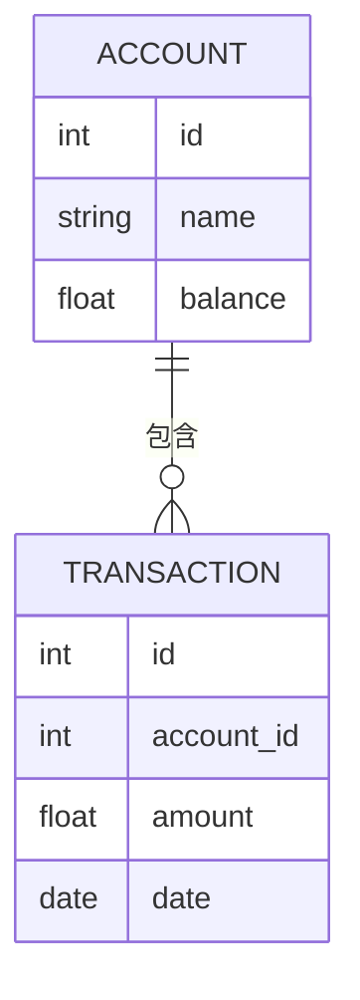

# 1.2.1 形式模型

## 1. 目录

- [1.2.1 形式模型](#121-形式模型)
  - [1. 目录](#1-目录)
  - [2. 关系模型与ER建模](#2-关系模型与er建模)
  - [3. 约束与范式](#3-约束与范式)
  - [4. 行业案例与多表征](#4-行业案例与多表征)
    - [4.1. 金融行业：账户-交易ER建模](#41-金融行业账户-交易er建模)
    - [4.2. 医疗行业：患者-就诊ER建模](#42-医疗行业患者-就诊er建模)
    - [4.3. Latex范式公式](#43-latex范式公式)
    - [4.4. SQL建表示例](#44-sql建表示例)

## 2. 关系模型与ER建模

- MySQL支持关系型数据建模，常用ER图工具辅助设计。
- 典型ER建模流程：实体-属性-关系-主外键。

## 3. 约束与范式

- 支持主键、外键、唯一、非空、检查等约束。
- 常用范式：第一范式（1NF）、第二范式（2NF）、第三范式（3NF）、BCNF。

| 范式 | 约束内容 | 适用场景 |
|------|----------|----------|
| 1NF  | 原子性   | 所有表   |
| 2NF  | 消除部分依赖 | 复杂表 |
| 3NF  | 消除传递依赖 | 规范化 |

## 4. 行业案例与多表征

### 4.1. 金融行业：账户-交易ER建模



### 4.2. 医疗行业：患者-就诊ER建模

- 见[3.5.1-数据分析基础理论](../../3-数据模型与算法/3.5-数据分析与ETL/3.5.1-数据分析基础理论.md)

### 4.3. Latex范式公式

$$
\text{BCNF:} \forall \text{函数依赖} X \to Y, X \text{为超键}
$$

### 4.4. SQL建表示例

```sql
CREATE TABLE account (
  id INT PRIMARY KEY,
  name VARCHAR(100),
  balance DECIMAL(10,2)
);
CREATE TABLE transaction (
  id INT PRIMARY KEY,
  account_id INT,
  amount DECIMAL(10,2),
  date DATE,
  FOREIGN KEY (account_id) REFERENCES account(id)
);
```

[返回MySQL导航](README.md)
