# 1.2.2 MySQL系统架构

## 📑 目录

- [1.2.2 MySQL系统架构](#122-mysql系统架构)
  - [📑 目录](#-目录)
  - [1. 概述](#1-概述)
    - [1.1. 系统架构定义](#11-系统架构定义)
    - [1.2. MySQL架构特点](#12-mysql架构特点)
  - [2. 分层架构](#2-分层架构)
    - [2.1. 连接层](#21-连接层)
      - [2.1.1. 连接管理](#211-连接管理)
      - [2.1.2. 认证授权](#212-认证授权)
    - [2.2. 服务层](#22-服务层)
      - [2.2.1. SQL解析器](#221-sql解析器)
      - [2.2.2. 查询优化器](#222-查询优化器)
      - [2.2.3. 查询缓存](#223-查询缓存)
      - [2.2.4. 执行引擎](#224-执行引擎)
    - [2.3. 存储引擎层](#23-存储引擎层)
      - [2.3.1. 存储引擎接口](#231-存储引擎接口)
      - [2.3.2. 插件式架构](#232-插件式架构)
  - [3. 存储引擎](#3-存储引擎)
    - [3.1. InnoDB存储引擎](#31-innodb存储引擎)
      - [3.1.1. InnoDB架构](#311-innodb架构)
      - [3.1.2. InnoDB特性](#312-innodb特性)
    - [3.2. MyISAM存储引擎](#32-myisam存储引擎)
      - [3.2.1. MyISAM架构](#321-myisam架构)
      - [3.2.2. MyISAM特性](#322-myisam特性)
    - [3.3. 其他存储引擎](#33-其他存储引擎)
      - [3.3.1. Memory存储引擎](#331-memory存储引擎)
      - [3.3.2. Archive存储引擎](#332-archive存储引擎)
  - [4. 复制架构](#4-复制架构)
    - [4.1. 主从复制](#41-主从复制)
      - [4.1.1. 复制原理](#411-复制原理)
      - [4.1.2. 复制配置](#412-复制配置)
    - [4.2. 主主复制](#42-主主复制)
      - [4.2.1. 主主复制原理](#421-主主复制原理)
      - [4.2.2. 主主复制配置](#422-主主复制配置)
    - [4.3. 半同步复制](#43-半同步复制)
      - [4.3.1. 半同步复制原理](#431-半同步复制原理)
      - [4.3.2. 半同步复制配置](#432-半同步复制配置)
  - [5. 高可用架构](#5-高可用架构)
    - [5.1. MySQL Group Replication](#51-mysql-group-replication)
      - [5.1.1. MGR架构](#511-mgr架构)
      - [5.1.2. MGR配置](#512-mgr配置)
    - [5.2. MySQL InnoDB Cluster](#52-mysql-innodb-cluster)
      - [5.2.1. InnoDB Cluster架构](#521-innodb-cluster架构)
    - [5.3. MHA高可用方案](#53-mha高可用方案)
      - [5.3.1. MHA架构](#531-mha架构)
  - [6. 读写分离](#6-读写分离)
    - [6.1. 读写分离原理](#61-读写分离原理)
    - [6.2. 读写分离实现](#62-读写分离实现)
      - [6.2.1. ProxySQL](#621-proxysql)
      - [6.2.2. MySQL Router](#622-mysql-router)
  - [7. 实际应用案例](#7-实际应用案例)
    - [7.1. 电商行业：主从复制架构](#71-电商行业主从复制架构)
    - [7.2. 互联网行业：读写分离架构](#72-互联网行业读写分离架构)
    - [7.3. 金融行业：高可用集群架构](#73-金融行业高可用集群架构)
  - [8. 形式化定义](#8-形式化定义)
    - [8.1. 系统架构形式化](#81-系统架构形式化)
    - [8.2. 复制架构形式化](#82-复制架构形式化)
  - [9. 多表征](#9-多表征)
  - [10. 总结与展望](#10-总结与展望)
    - [10.1. 总结](#101-总结)
    - [10.2. 发展趋势](#102-发展趋势)
    - [10.3. 最佳实践](#103-最佳实践)

---

## 1. 概述

### 1.1. 系统架构定义

**系统架构**是系统各组件的组织结构、相互关系以及设计原则。

**MySQL系统架构的核心要素**：

1. **连接层**：连接管理、认证授权
2. **服务层**：SQL解析、查询优化、执行引擎
3. **存储引擎层**：数据存储、索引管理、事务处理
4. **文件系统层**：数据文件、日志文件

### 1.2. MySQL架构特点

**MySQL架构特点**：

1. **插件式存储引擎**：支持多种存储引擎，可插拔
2. **分层架构**：清晰的层次结构，职责分离
3. **高可用性**：支持主从复制、集群部署
4. **可扩展性**：支持读写分离、分库分表

**架构图**：

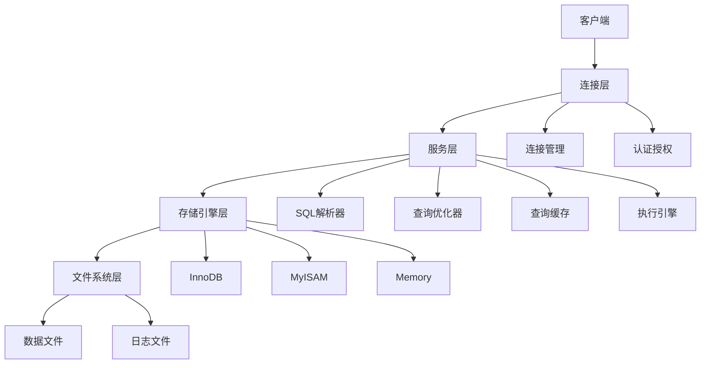

---

## 2. 分层架构

### 2.1. 连接层

#### 2.1.1. 连接管理

**连接管理**负责管理客户端与MySQL服务器的连接。

**连接管理功能**：

1. **连接建立**：接受客户端连接请求
2. **连接维护**：维护连接状态
3. **连接释放**：释放空闲连接

**连接池**：

```python
# 连接池示例
import mysql.connector
from mysql.connector import pooling

config = {
    'user': 'root',
    'password': 'password',
    'host': 'localhost',
    'database': 'test',
    'pool_name': 'mypool',
    'pool_size': 10,
    'pool_reset_session': True
}

pool = mysql.connector.pooling.MySQLConnectionPool(**config)

# 获取连接
connection = pool.get_connection()
cursor = connection.cursor()
cursor.execute("SELECT * FROM users")
results = cursor.fetchall()
cursor.close()
connection.close()
```

**连接参数**：

```ini
# my.cnf配置
[mysqld]
max_connections = 1000        # 最大连接数
max_connect_errors = 100      # 最大连接错误数
connect_timeout = 10          # 连接超时时间（秒）
wait_timeout = 28800          # 等待超时时间（秒）
interactive_timeout = 28800   # 交互超时时间（秒）
```

#### 2.1.2. 认证授权

**认证授权**验证客户端身份和权限。

**认证流程**：

1. **身份验证**：验证用户名和密码
2. **权限检查**：检查用户权限
3. **会话建立**：建立用户会话

**用户管理**：

```sql
-- 创建用户
CREATE USER 'username'@'host' IDENTIFIED BY 'password';

-- 授权
GRANT SELECT, INSERT, UPDATE ON database.table TO 'username'@'host';

-- 撤销权限
REVOKE SELECT ON database.table FROM 'username'@'host';

-- 查看权限
SHOW GRANTS FOR 'username'@'host';
```

### 2.2. 服务层

#### 2.2.1. SQL解析器

**SQL解析器**将SQL语句解析为内部数据结构。

**解析流程**：

1. **词法分析**：将SQL语句分解为词法单元
2. **语法分析**：构建语法树
3. **语义分析**：检查语义正确性

**解析示例**：

```sql
-- SQL语句
SELECT name, age FROM users WHERE age > 18;

-- 解析后的语法树
Query
├── SELECT
│   ├── name
│   └── age
├── FROM
│   └── users
└── WHERE
    └── age > 18
```

#### 2.2.2. 查询优化器

**查询优化器**选择最优的执行计划。

**优化策略**：

1. **规则优化**：基于规则的优化
2. **代价优化**：基于代价的优化
3. **索引选择**：选择最优索引

**优化示例**：

```sql
-- 原始查询
SELECT * FROM users WHERE age > 18 AND name = 'Alice';

-- 优化后的执行计划
EXPLAIN SELECT * FROM users WHERE age > 18 AND name = 'Alice';

-- 结果
-- id | select_type | table | type | possible_keys | key | key_len | ref | rows | Extra
-- 1  | SIMPLE      | users | ref  | idx_name      | idx_name | 102 | const | 1 | Using where
```

**优化器配置**：

```ini
# my.cnf配置
[mysqld]
optimizer_switch = 'index_merge=on,index_merge_union=on,index_merge_sort_union=on'
optimizer_prune_level = 1
optimizer_search_depth = 62
```

#### 2.2.3. 查询缓存

**查询缓存**缓存查询结果，提高查询性能。

**缓存机制**：

1. **缓存命中**：相同查询直接返回缓存结果
2. **缓存失效**：表更新时自动失效缓存
3. **缓存管理**：LRU算法管理缓存

**缓存配置**：

```ini
# my.cnf配置
[mysqld]
query_cache_type = 1          # 启用查询缓存
query_cache_size = 64M        # 缓存大小
query_cache_limit = 2M        # 单个查询结果最大缓存大小
```

**缓存使用**：

```sql
-- 查看缓存状态
SHOW STATUS LIKE 'Qcache%';

-- 清空查询缓存
RESET QUERY CACHE;

-- 禁用查询缓存（MySQL 8.0已移除查询缓存）
SET SESSION query_cache_type = OFF;
```

#### 2.2.4. 执行引擎

**执行引擎**执行优化后的查询计划。

**执行流程**：

1. **计划执行**：按照执行计划执行
2. **结果返回**：返回查询结果
3. **资源释放**：释放相关资源

### 2.3. 存储引擎层

#### 2.3.1. 存储引擎接口

**存储引擎接口**定义了存储引擎必须实现的接口。

**核心接口**：

1. **表操作**：CREATE TABLE、DROP TABLE
2. **数据操作**：INSERT、UPDATE、DELETE、SELECT
3. **索引操作**：CREATE INDEX、DROP INDEX
4. **事务操作**：BEGIN、COMMIT、ROLLBACK

#### 2.3.2. 插件式架构

**插件式架构**允许动态加载和卸载存储引擎。

**存储引擎管理**：

```sql
-- 查看支持的存储引擎
SHOW ENGINES;

-- 查看表的存储引擎
SHOW TABLE STATUS LIKE 'table_name';

-- 修改表的存储引擎
ALTER TABLE table_name ENGINE = InnoDB;
```

---

## 3. 存储引擎

### 3.1. InnoDB存储引擎

#### 3.1.1. InnoDB架构

**InnoDB架构**：

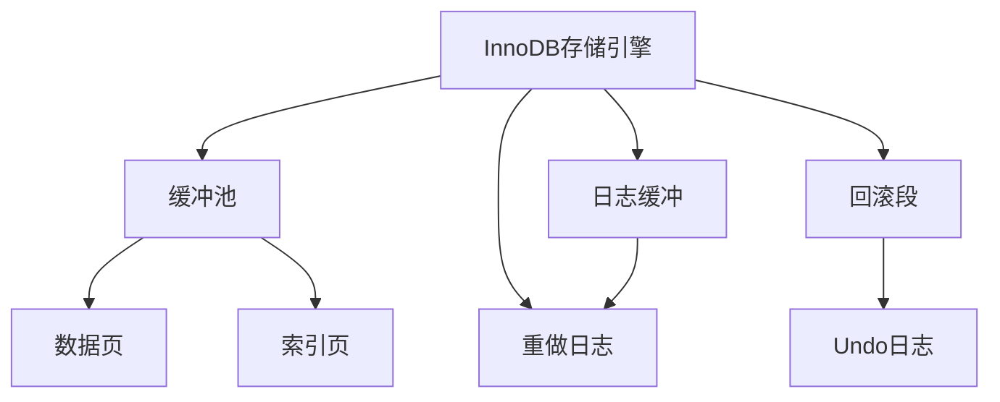

**核心组件**：

1. **缓冲池（Buffer Pool）**：缓存数据和索引页
2. **日志缓冲（Log Buffer）**：缓存重做日志
3. **重做日志（Redo Log）**：事务持久化保证
4. **回滚段（Rollback Segment）**：存储Undo日志

**InnoDB配置**：

```ini
# my.cnf配置
[mysqld]
# InnoDB缓冲池
innodb_buffer_pool_size = 1G
innodb_buffer_pool_instances = 8

# InnoDB日志
innodb_log_file_size = 256M
innodb_log_buffer_size = 16M
innodb_flush_log_at_trx_commit = 1

# InnoDB文件
innodb_file_per_table = 1
innodb_data_file_path = ibdata1:10M:autoextend
```

#### 3.1.2. InnoDB特性

**InnoDB特性**：

1. **ACID事务**：支持完整的事务特性
2. **行级锁**：支持行级锁定
3. **外键约束**：支持外键约束
4. **崩溃恢复**：支持自动崩溃恢复
5. **MVCC**：多版本并发控制

**事务示例**：

```sql
-- 开始事务
START TRANSACTION;

-- 执行操作
INSERT INTO users (name, age) VALUES ('Alice', 25);
UPDATE accounts SET balance = balance - 100 WHERE user_id = 1;

-- 提交事务
COMMIT;

-- 或回滚事务
ROLLBACK;
```

### 3.2. MyISAM存储引擎

#### 3.2.1. MyISAM架构

**MyISAM架构**：

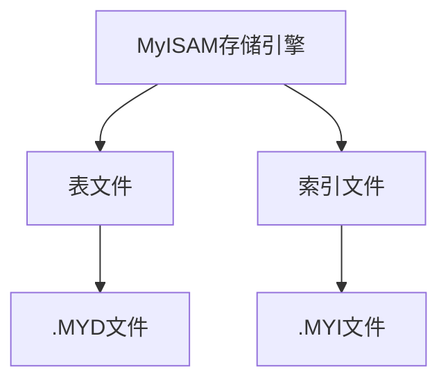

**文件结构**：

1. **.frm文件**：表结构定义
2. **.MYD文件**：数据文件
3. **.MYI文件**：索引文件

#### 3.2.2. MyISAM特性

**MyISAM特性**：

1. **表级锁**：表级锁定
2. **全文索引**：支持全文搜索
3. **压缩表**：支持表压缩
4. **高速查询**：适合读多写少场景

**MyISAM限制**：

1. **不支持事务**：不支持ACID事务
2. **不支持外键**：不支持外键约束
3. **崩溃恢复**：崩溃后需要修复

**MyISAM使用场景**：

- 只读或读多写少的应用
- 日志表、统计表
- 全文搜索应用

### 3.3. 其他存储引擎

#### 3.3.1. Memory存储引擎

**Memory存储引擎**将数据存储在内存中。

**特点**：

1. **高速访问**：数据存储在内存中
2. **表级锁**：表级锁定
3. **临时表**：适合临时表

**使用示例**：

```sql
-- 创建Memory表
CREATE TABLE temp_table (
    id INT PRIMARY KEY,
    name VARCHAR(50)
) ENGINE=MEMORY;

-- 插入数据
INSERT INTO temp_table VALUES (1, 'Alice');

-- 数据在服务器重启后会丢失
```

#### 3.3.2. Archive存储引擎

**Archive存储引擎**用于归档存储。

**特点**：

1. **压缩存储**：高压缩比
2. **只写**：只支持INSERT和SELECT
3. **归档**：适合归档数据

**使用示例**：

```sql
-- 创建Archive表
CREATE TABLE archive_table (
    id INT PRIMARY KEY,
    data TEXT
) ENGINE=ARCHIVE;

-- 只能INSERT和SELECT
INSERT INTO archive_table VALUES (1, 'data');
SELECT * FROM archive_table WHERE id = 1;
```

---

## 4. 复制架构

### 4.1. 主从复制

#### 4.1.1. 复制原理

**主从复制原理**：

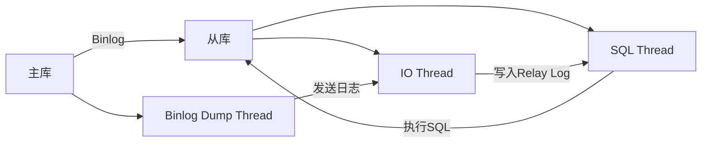

**复制流程**：

1. **主库写入**：主库执行SQL，写入Binlog
2. **从库连接**：从库IO线程连接主库
3. **日志传输**：主库Binlog Dump线程发送日志
4. **日志写入**：从库IO线程写入Relay Log
5. **SQL执行**：从库SQL线程执行Relay Log中的SQL

**复制公式**：

$$\text{Replication Lag} = \text{Master Position} - \text{Slave Position}$$

#### 4.1.2. 复制配置

**主库配置**：

```ini
# my.cnf主库配置
[mysqld]
server-id = 1
log-bin = mysql-bin
binlog-format = ROW
binlog-do-db = testdb
```

**从库配置**：

```ini
# my.cnf从库配置
[mysqld]
server-id = 2
relay-log = mysql-relay-bin
read-only = 1
```

**配置复制**：

```sql
-- 主库创建复制用户
CREATE USER 'repl'@'%' IDENTIFIED BY 'password';
GRANT REPLICATION SLAVE ON *.* TO 'repl'@'%';

-- 从库配置复制
CHANGE MASTER TO
    MASTER_HOST='master_host',
    MASTER_USER='repl',
    MASTER_PASSWORD='password',
    MASTER_LOG_FILE='mysql-bin.000001',
    MASTER_LOG_POS=154;

-- 启动复制
START SLAVE;

-- 查看复制状态
SHOW SLAVE STATUS\G;
```

### 4.2. 主主复制

#### 4.2.1. 主主复制原理

**主主复制**：两个MySQL实例互为主从。

**架构图**：

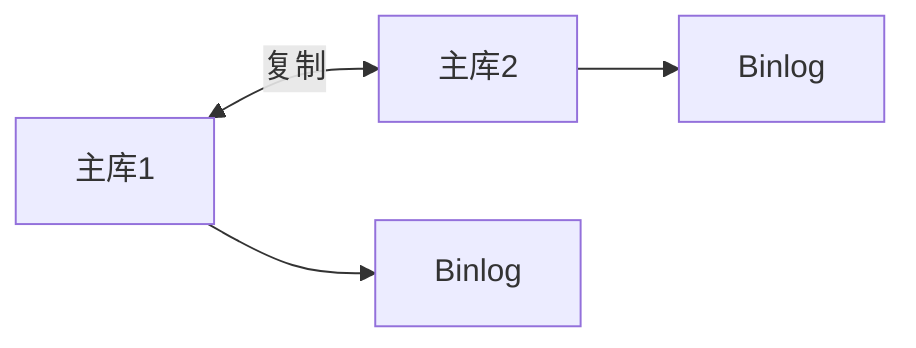

**主主复制特点**：

1. **双向复制**：两个实例都可以写入
2. **负载均衡**：可以分散写入负载
3. **高可用**：一个实例故障，另一个可以继续服务

#### 4.2.2. 主主复制配置

**主库1配置**：

```ini
# my.cnf主库1配置
[mysqld]
server-id = 1
log-bin = mysql-bin
auto-increment-offset = 1
auto-increment-increment = 2
```

**主库2配置**：

```ini
# my.cnf主库2配置
[mysqld]
server-id = 2
log-bin = mysql-bin
auto-increment-offset = 2
auto-increment-increment = 2
```

**配置主主复制**：

```sql
-- 主库1配置
CHANGE MASTER TO
    MASTER_HOST='master2_host',
    MASTER_USER='repl',
    MASTER_PASSWORD='password',
    MASTER_LOG_FILE='mysql-bin.000001',
    MASTER_LOG_POS=154;
START SLAVE;

-- 主库2配置
CHANGE MASTER TO
    MASTER_HOST='master1_host',
    MASTER_USER='repl',
    MASTER_PASSWORD='password',
    MASTER_LOG_FILE='mysql-bin.000001',
    MASTER_LOG_POS=154;
START SLAVE;
```

### 4.3. 半同步复制

#### 4.3.1. 半同步复制原理

**半同步复制**：主库等待至少一个从库确认收到日志后才返回。

**半同步复制流程**：

1. **主库写入**：主库执行SQL，写入Binlog
2. **发送日志**：主库发送日志到从库
3. **从库确认**：从库收到日志后发送确认
4. **主库返回**：主库收到确认后返回客户端

**半同步复制优势**：

- **数据安全**：保证至少一个从库有数据
- **性能平衡**：比同步复制性能好，比异步复制安全

#### 4.3.2. 半同步复制配置

**安装插件**：

```sql
-- 主库安装插件
INSTALL PLUGIN rpl_semi_sync_master SONAME 'semisync_master.so';

-- 从库安装插件
INSTALL PLUGIN rpl_semi_sync_slave SONAME 'semisync_slave.so';
```

**配置参数**：

```ini
# my.cnf主库配置
[mysqld]
plugin-load = "rpl_semi_sync_master=semisync_master.so"
rpl_semi_sync_master_enabled = 1
rpl_semi_sync_master_timeout = 1000

# my.cnf从库配置
[mysqld]
plugin-load = "rpl_semi_sync_slave=semisync_slave.so"
rpl_semi_sync_slave_enabled = 1
```

**启用半同步复制**：

```sql
-- 从库启用半同步复制
STOP SLAVE IO_THREAD;
START SLAVE IO_THREAD;

-- 查看半同步复制状态
SHOW STATUS LIKE 'Rpl_semi_sync%';
```

---

## 5. 高可用架构

### 5.1. MySQL Group Replication

#### 5.1.1. MGR架构

**MySQL Group Replication（MGR）**是MySQL官方提供的组复制方案。

**MGR架构**：

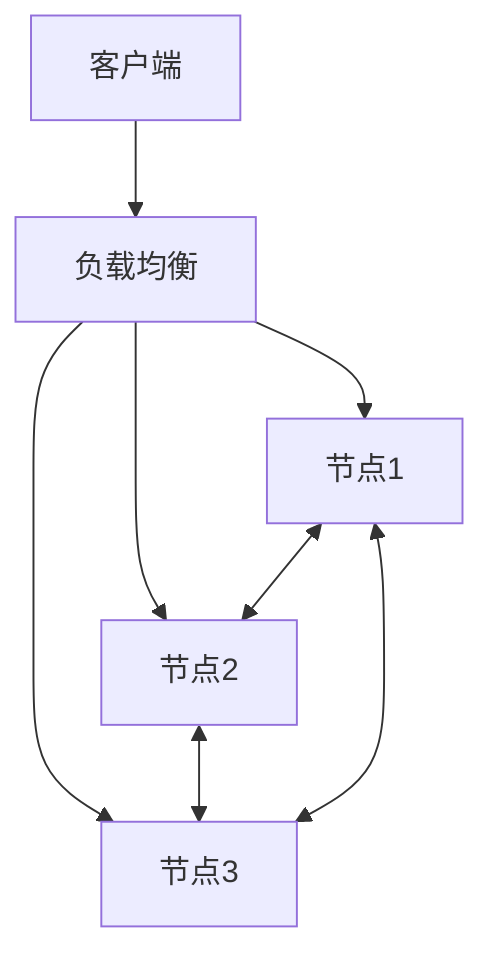

**MGR特点**：

1. **多主模式**：所有节点都可以写入
2. **强一致性**：基于Paxos协议
3. **自动故障转移**：节点故障自动切换
4. **冲突检测**：自动检测和解决冲突

#### 5.1.2. MGR配置

**配置MGR**：

```ini
# my.cnf配置
[mysqld]
server-id = 1
gtid-mode = ON
enforce-gtid-consistency = ON
master-info-repository = TABLE
relay-log-info-repository = TABLE
binlog-checksum = NONE
log-slave-updates = ON
log-bin = binlog
binlog-format = ROW

plugin-load-add = group_replication.so
group_replication_group_name = "aaaaaaaa-aaaa-aaaa-aaaa-aaaaaaaaaaaa"
group_replication_start_on_boot = OFF
group_replication_local_address = "192.168.1.1:33061"
group_replication_group_seeds = "192.168.1.1:33061,192.168.1.2:33061,192.168.1.3:33061"
group_replication_bootstrap_group = OFF
```

**启动MGR**：

```sql
-- 创建复制用户
CREATE USER 'repl'@'%' IDENTIFIED BY 'password';
GRANT REPLICATION SLAVE ON *.* TO 'repl'@'%';
FLUSH PRIVILEGES;

-- 启动组复制
SET GLOBAL group_replication_bootstrap_group = ON;
START GROUP_REPLICATION;
SET GLOBAL group_replication_bootstrap_group = OFF;

-- 查看组复制状态
SELECT * FROM performance_schema.replication_group_members;
```

### 5.2. MySQL InnoDB Cluster

#### 5.2.1. InnoDB Cluster架构

**MySQL InnoDB Cluster**基于MGR和MySQL Shell的高可用方案。

**架构组件**：

1. **MySQL Server**：运行MGR的MySQL实例
2. **MySQL Router**：路由和负载均衡
3. **MySQL Shell**：管理和配置工具

**架构图**：

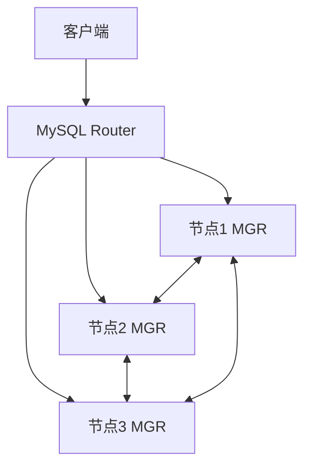

### 5.3. MHA高可用方案

#### 5.3.1. MHA架构

**MHA（Master High Availability）**是MySQL高可用解决方案。

**MHA架构**：

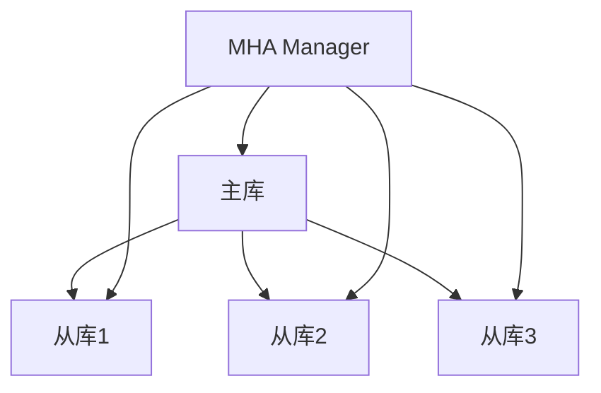

**MHA功能**：

1. **故障检测**：自动检测主库故障
2. **故障转移**：自动切换到新主库
3. **数据一致性**：保证数据一致性
4. **在线切换**：支持在线主从切换

---

## 6. 读写分离

### 6.1. 读写分离原理

**读写分离**将读操作和写操作分离到不同的数据库实例。

**读写分离架构**：

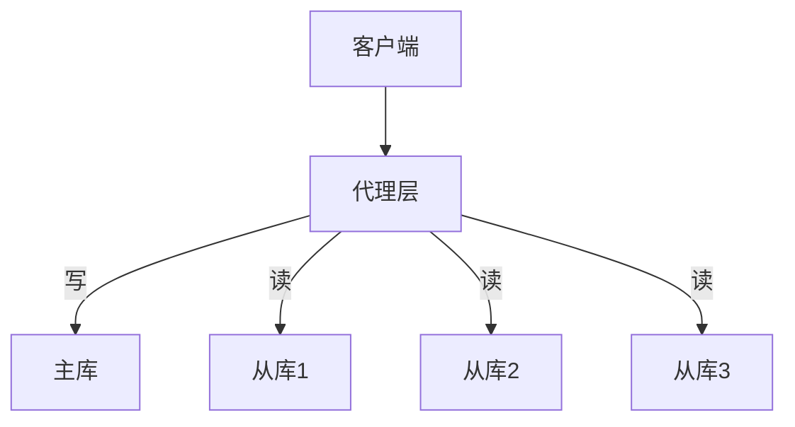

**读写分离优势**：

1. **负载均衡**：分散读操作负载
2. **性能提升**：提高整体性能
3. **高可用**：从库故障不影响写操作

### 6.2. 读写分离实现

#### 6.2.1. ProxySQL

**ProxySQL**是高性能MySQL代理。

**ProxySQL配置**：

```sql
-- 添加MySQL服务器
INSERT INTO mysql_servers(hostgroup_id, hostname, port) VALUES
(0, '192.168.1.1', 3306),  -- 主库
(1, '192.168.1.2', 3306),  -- 从库1
(1, '192.168.1.3', 3306);  -- 从库2

-- 配置用户
INSERT INTO mysql_users(username, password, default_hostgroup) VALUES
('user', 'password', 0);

-- 配置查询规则
INSERT INTO mysql_query_rules(rule_id, active, match_pattern, destination_hostgroup, apply) VALUES
(1, 1, '^SELECT.*FOR UPDATE', 0, 1),  -- SELECT FOR UPDATE路由到主库
(2, 1, '^SELECT', 1, 1),              -- SELECT路由到从库
(3, 1, '.*', 0, 1);                   -- 其他路由到主库

-- 加载配置
LOAD MYSQL SERVERS TO RUNTIME;
LOAD MYSQL USERS TO RUNTIME;
LOAD MYSQL QUERY RULES TO RUNTIME;
SAVE MYSQL SERVERS TO DISK;
SAVE MYSQL USERS TO DISK;
SAVE MYSQL QUERY RULES TO DISK;
```

#### 6.2.2. MySQL Router

**MySQL Router**是MySQL官方提供的路由和负载均衡工具。

**MySQL Router配置**：

```ini
# mysqlrouter.conf
[DEFAULT]
logging_folder = /var/log/mysqlrouter
runtime_folder = /var/run/mysqlrouter
config_folder = /etc/mysqlrouter
data_folder = /var/lib/mysqlrouter

[routing:read_write]
bind_address = 0.0.0.0
bind_port = 6446
destinations = 192.168.1.1:3306
routing_strategy = first-available
mode = read-write

[routing:read_only]
bind_address = 0.0.0.0
bind_port = 6447
destinations = 192.168.1.2:3306,192.168.1.3:3306
routing_strategy = round-robin
mode = read-only
```

---

## 7. 实际应用案例

### 7.1. 电商行业：主从复制架构

**场景**：电商平台订单系统

**架构设计**：

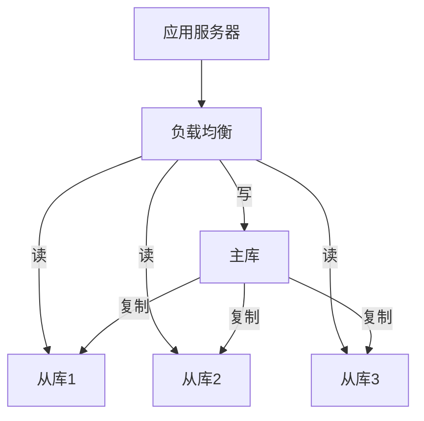

**配置要点**：

1. **主库**：处理所有写操作（订单创建、更新）
2. **从库**：处理读操作（订单查询、统计）
3. **负载均衡**：使用ProxySQL或MySQL Router
4. **监控**：监控复制延迟和主从状态

### 7.2. 互联网行业：读写分离架构

**场景**：内容管理系统

**架构设计**：

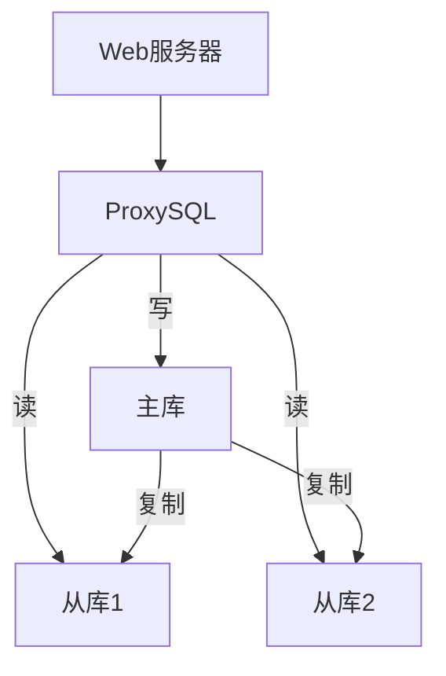

**性能指标**：

- **TPS**：主库5000 TPS，从库10000 QPS
- **延迟**：复制延迟 < 100ms
- **可用性**：99.9%

### 7.3. 金融行业：高可用集群架构

**场景**：银行核心系统

**架构设计**：

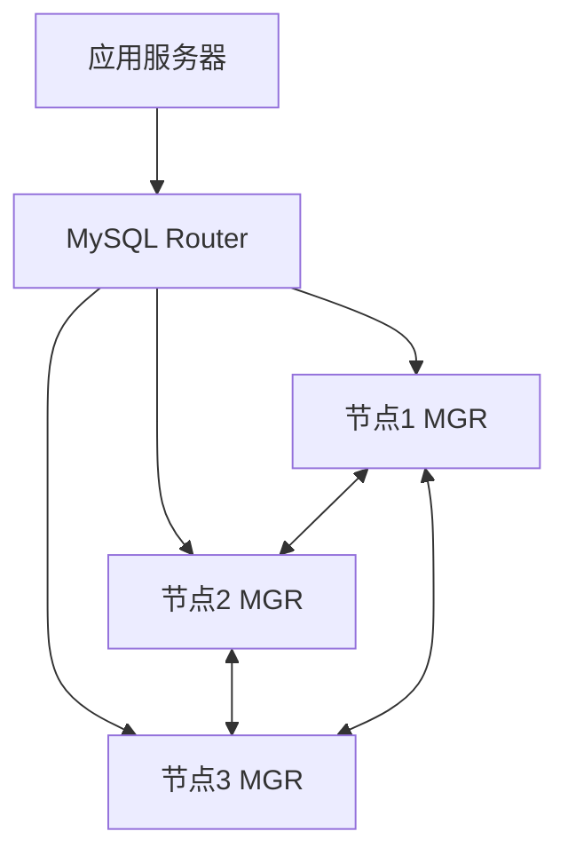

**高可用要求**：

1. **RTO < 30秒**：故障恢复时间
2. **RPO = 0**：零数据丢失
3. **强一致性**：基于MGR的强一致性
4. **自动故障转移**：自动切换

---

## 8. 形式化定义

### 8.1. 系统架构形式化

**MySQL系统架构形式化定义**：

设MySQL系统 $M = (L, S, E, F)$，其中：

- $L$：连接层（Connection Layer）
- $S$：服务层（Service Layer）
- $E$：存储引擎层（Storage Engine Layer）
- $F$：文件系统层（File System Layer）

**连接层**：

$$L = (C, A)$$

其中 $C$ 是连接集合，$A$ 是认证授权模块。

**服务层**：

$$S = (P, O, Q, E)$$

其中 $P$ 是解析器，$O$ 是优化器，$Q$ 是查询缓存，$E$ 是执行引擎。

**存储引擎层**：

$$E = \{E_1, E_2, \ldots, E_n\}$$

其中 $E_i$ 是第 $i$ 个存储引擎。

### 8.2. 复制架构形式化

**主从复制形式化定义**：

设主库 $M$，从库集合 $S = \{S_1, S_2, \ldots, S_n\}$：

$$\text{Replication}(M, S) = \{(m, s) | m \in M.\text{Binlog}, s \in S\}$$

其中 $M.\text{Binlog}$ 是主库的Binlog集合。

**复制延迟**：

$$\text{Lag}(S_i) = M.\text{Position} - S_i.\text{Position}$$

其中 $M.\text{Position}$ 是主库位置，$S_i.\text{Position}$ 是从库位置。

---

## 9. 多表征

本主题支持多种表征方式：

1. **符号表征**：形式化定义、数学公式
2. **图结构**：架构图、流程图
3. **代码实现**：配置示例、SQL语句
4. **自然语言**：概念定义、设计原则
5. **表格**：特性对比、性能指标

---

## 10. 总结与展望

### 10.1. 总结

MySQL系统架构提供了：

1. **分层架构**：清晰的层次结构
2. **插件式存储引擎**：灵活的存储引擎选择
3. **复制架构**：主从复制、主主复制、半同步复制
4. **高可用方案**：MGR、InnoDB Cluster、MHA
5. **读写分离**：ProxySQL、MySQL Router

### 10.2. 发展趋势

1. **云原生**：容器化、Kubernetes支持
2. **自动化**：自动化运维、自动扩缩容
3. **性能优化**：查询优化、存储优化
4. **高可用**：更强的故障恢复能力

### 10.3. 最佳实践

1. **架构设计**：根据业务需求选择合适的架构
2. **存储引擎**：根据场景选择合适的存储引擎
3. **高可用**：部署高可用方案保证服务可用性
4. **监控**：监控系统状态和性能指标

---

[返回MySQL导航](README.md)
