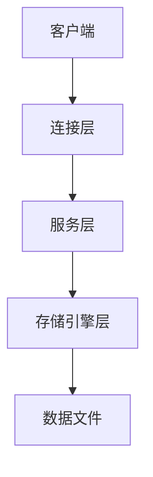
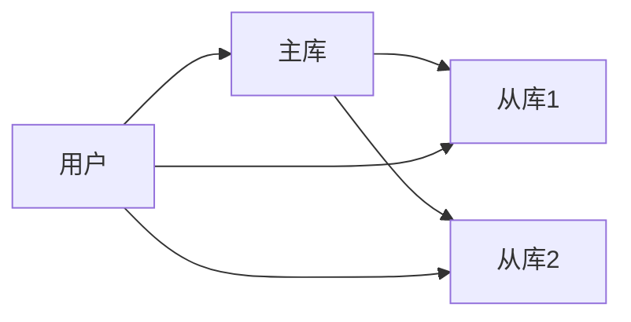

# 1.2.2 系统架构

## 1.2.2.1 体系结构

- MySQL采用分层架构：连接层、服务层、存储引擎层。
- 支持插件式存储引擎（InnoDB、MyISAM等）。



## 1.2.2.2 存储引擎

| 存储引擎 | 特点 | 适用场景 |
|----------|------|----------|
| InnoDB   | 事务、行级锁、外键 | OLTP、高并发 |
| MyISAM   | 读写分离、表级锁   | 只读、分析型 |

## 1.2.2.3 行业案例与多表征

### 电商行业：主从复制架构



### 互联网行业：读写分离

- 见[3.5.7-数据存储与访问](../../3-数据模型与算法/3.5-数据分析与ETL/3.5.7-数据存储与访问.md)

### Latex公式

$$
\text{TPS} = \frac{\text{总事务数}}{\text{总时间(s)}}
$$

### 配置示例

```ini
[mysqld]
server-id=1
log-bin=mysql-bin
```

[返回MySQL导航](README.md)
