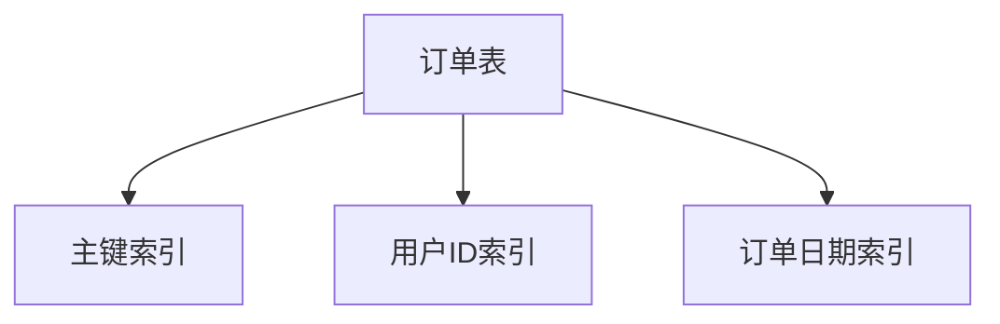

# 1.2.3 数据模型

## 1.2.3.1 表结构设计

- 规范化设计，字段类型选择，主外键约束。
- 典型设计：用户表、订单表、商品表。

## 1.2.3.2 索引与分区

| 类型 | 说明 | 适用场景 |
|------|------|----------|
| 主键索引 | 唯一性、加速查询 | 主键字段 |
| 普通索引 | 提高查询效率 | 高频查询 |
| 联合索引 | 多字段组合 | 复合条件 |
| 分区表   | 水平拆分 | 大表分区 |

## 1.2.3.3 行业案例与多表征

### 零售行业：订单表分区设计

```sql
CREATE TABLE orders (
  id INT PRIMARY KEY,
  user_id INT,
  amount DECIMAL(10,2),
  order_date DATE
)
PARTITION BY RANGE (YEAR(order_date)) (
  PARTITION p2022 VALUES LESS THAN (2023),
  PARTITION p2023 VALUES LESS THAN (2024)
);
```

### 互联网行业：联合索引优化

- 见[3.3.2-查询优化算法](../../3-数据模型与算法/3.3-算法实现/3.3.2-查询优化算法.md)

### Mermaid索引结构图



### Latex公式

$$
\text{索引选择性} = \frac{\text{唯一值个数}}{\text{总记录数}}
$$

[返回MySQL导航](README.md)
