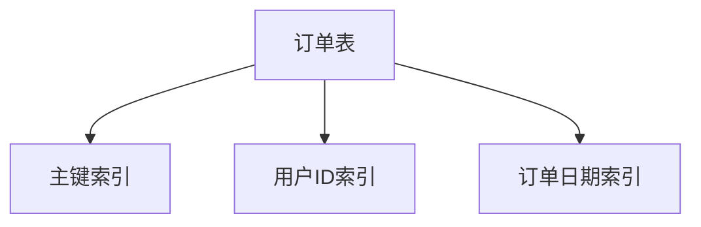

# 1.2.3 数据模型

## 📑 目录

- [1.2.3 数据模型](#123-数据模型)
  - [📑 目录](#-目录)
  - [1. 表结构设计](#1-表结构设计)
  - [2. 索引与分区](#2-索引与分区)
  - [3. 行业案例与多表征](#3-行业案例与多表征)
    - [3.1. 零售行业：订单表分区设计](#31-零售行业订单表分区设计)
    - [3.2. 互联网行业：联合索引优化](#32-互联网行业联合索引优化)
    - [3.3. Mermaid索引结构图](#33-mermaid索引结构图)
    - [3.4. Latex公式](#34-latex公式)

---


## 1. 表结构设计

- 规范化设计，字段类型选择，主外键约束。
- 典型设计：用户表、订单表、商品表。

## 2. 索引与分区

| 类型 | 说明 | 适用场景 |
|------|------|----------|
| 主键索引 | 唯一性、加速查询 | 主键字段 |
| 普通索引 | 提高查询效率 | 高频查询 |
| 联合索引 | 多字段组合 | 复合条件 |
| 分区表   | 水平拆分 | 大表分区 |

## 3. 行业案例与多表征

### 3.1. 零售行业：订单表分区设计

```sql
CREATE TABLE orders (
  id INT PRIMARY KEY,
  user_id INT,
  amount DECIMAL(10,2),
  order_date DATE
)
PARTITION BY RANGE (YEAR(order_date)) (
  PARTITION p2022 VALUES LESS THAN (2023),
  PARTITION p2023 VALUES LESS THAN (2024)
);
```

### 3.2. 互联网行业：联合索引优化

- 见[3.3.2-查询优化算法](../../3-数据模型与算法/3.3-算法实现/3.3.2-查询优化算法.md)

### 3.3. Mermaid索引结构图


```mermaid
flowchart TD
  T[订单表] --> PK[主键索引]
  T --> IDX1[用户ID索引]
  T --> IDX2[订单日期索引]
```

### 3.4. Latex公式

$$
\text{索引选择性} = \frac{\text{唯一值个数}}{\text{总记录数}}
$$

---

## 4. 参考资料

### 4.1. 相关理论文档

- [MySQL知识导航索引](./README.md) - MySQL完整知识体系
- [数据库系统知识导航索引](../README.md) - 数据库系统知识导航
- [形式模型](./1.2.1-形式模型.md) - MySQL形式化模型
- [系统架构](./1.2.2-系统架构.md) - MySQL系统架构
- [查询优化](./1.2.4-查询优化.md) - MySQL查询优化
- [数据模型形式化规范](../../../Design/06-数据模型理论体系/06.03-数据模型形式化规范.md) - 数据模型形式化理论
- [Schema设计方法论](../../../Design/07-数据库设计实践/07.01-Schema设计方法论.md) - Schema设计方法论

### 4.2. 相关资源

- [MySQL索引文档](https://dev.mysql.com/doc/refman/8.0/en/optimization-indexes.html)
- [MySQL分区文档](https://dev.mysql.com/doc/refman/8.0/en/partitioning.html)

---

[返回MySQL导航](README.md)
