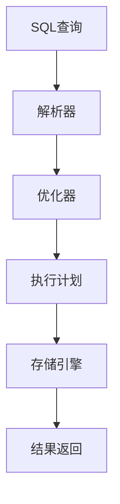

# 1.2.4 查询优化

## 📑 目录

- [1.2.4 查询优化](#124-查询优化)
  - [📑 目录](#-目录)
  - [1. 查询优化原理](#1-查询优化原理)
  - [2. 执行计划与索引优化](#2-执行计划与索引优化)
  - [3. 行业案例与多表征](#3-行业案例与多表征)
    - [3.1. 互联网行业：高并发查询优化](#31-互联网行业高并发查询优化)
    - [3.2. 金融行业：索引覆盖与回表](#32-金融行业索引覆盖与回表)
    - [3.3. Mermaid执行计划流程图](#33-mermaid执行计划流程图)
    - [3.4. Latex公式](#34-latex公式)

---


## 1. 查询优化原理

- SQL解析、语法树生成、逻辑优化、物理优化。
- 优化器选择最优执行计划。

## 2. 执行计划与索引优化

- EXPLAIN分析SQL执行计划。
- 索引覆盖、回表、联合索引优化。

| 优化手段 | 说明 | 适用场景 |
|----------|------|----------|
| 覆盖索引 | 查询只访问索引 | 高频只读 |
| 联合索引 | 多条件复合查询 | 复杂查询 |
| 子查询优化 | 子查询转JOIN | 复杂SQL |

## 3. 行业案例与多表征

### 3.1. 互联网行业：高并发查询优化

```sql
EXPLAIN SELECT user_id, amount FROM orders WHERE order_date > '2024-01-01' AND user_id = 123;
```

### 3.2. 金融行业：索引覆盖与回表

- 见[3.3.2-查询优化算法](../../3-数据模型与算法/3.3-算法实现/3.3.2-查询优化算法.md)

### 3.3. Mermaid执行计划流程图



### 3.4. Latex公式

$$
\text{Cost}_{plan} = \sum_{i=1}^n \text{IO}_i + \text{CPU}_i
$$

[返回MySQL导航](README.md)
