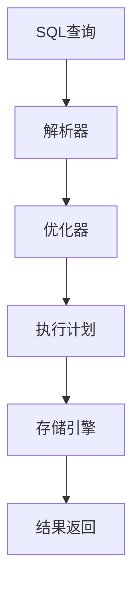

# 1.2.4 查询优化

## 📑 目录

- [1.2.4 查询优化](#124-查询优化)
  - [📑 目录](#-目录)
  - [1. 查询优化原理](#1-查询优化原理)
  - [2. 执行计划与索引优化](#2-执行计划与索引优化)
  - [3. 行业案例与多表征](#3-行业案例与多表征)
    - [3.1. 互联网行业：高并发查询优化](#31-互联网行业高并发查询优化)
    - [3.2. 金融行业：索引覆盖与回表](#32-金融行业索引覆盖与回表)
    - [3.3. Mermaid执行计划流程图](#33-mermaid执行计划流程图)
    - [3.4. Latex公式](#34-latex公式)

---


## 1. 查询优化原理

- SQL解析、语法树生成、逻辑优化、物理优化。
- 优化器选择最优执行计划。

## 2. 执行计划与索引优化

- EXPLAIN分析SQL执行计划。
- 索引覆盖、回表、联合索引优化。

| 优化手段 | 说明 | 适用场景 |
|----------|------|----------|
| 覆盖索引 | 查询只访问索引 | 高频只读 |
| 联合索引 | 多条件复合查询 | 复杂查询 |
| 子查询优化 | 子查询转JOIN | 复杂SQL |

## 3. 行业案例与多表征

### 3.1. 互联网行业：高并发查询优化

```sql
EXPLAIN SELECT user_id, amount FROM orders WHERE order_date > '2024-01-01' AND user_id = 123;
```

### 3.2. 金融行业：索引覆盖与回表

- 见[3.3.2-查询优化算法](../../3-数据模型与算法/3.3-算法实现/3.3.2-查询优化算法.md)

### 3.3. Mermaid执行计划流程图


```mermaid
flowchart TD
  Q[SQL查询] --> P[解析器]
  P --> O[优化器]
  O --> E[执行计划]
  E --> S[存储引擎]
  S --> R[结果返回]
```

### 3.4. Latex公式

$$
\text{Cost}_{plan} = \sum_{i=1}^n \text{IO}_i + \text{CPU}_i
$$

---

## 4. 参考资料

### 4.1. 相关理论文档

- [MySQL知识导航索引](./README.md) - MySQL完整知识体系
- [数据库系统知识导航索引](../README.md) - 数据库系统知识导航
- [形式模型](./1.2.1-形式模型.md) - MySQL形式化模型
- [系统架构](./1.2.2-系统架构.md) - MySQL系统架构
- [数据模型](./1.2.3-数据模型.md) - MySQL数据模型
- [性能调优与监控](./1.2.6-性能调优与监控.md) - MySQL性能优化
- [数据库性能调优实战](../../../Design/07-数据库设计实践/07.08-数据库性能调优实战.md) - 数据库性能调优实践
- [查询优化算法](../../3-数据模型与算法/3.3-算法实现/README.md) - 查询优化算法实现

### 4.2. 相关资源

- [MySQL查询优化文档](https://dev.mysql.com/doc/refman/8.0/en/optimization.html)
- [MySQL EXPLAIN文档](https://dev.mysql.com/doc/refman/8.0/en/explain.html)

---

[返回MySQL导航](README.md)
