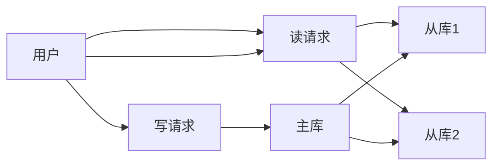

# 1.2.5 分布式与高可用

## 1.2.5.1 主从复制

- 基于binlog的异步/半同步/全同步复制。
- 典型架构：一主多从，主从延迟监控。

## 1.2.5.2 读写分离与高可用

- 读写分离：主库写、从库读，提升并发。
- 高可用方案：MGR、Keepalived、ProxySQL等。

| 架构模式 | 特点 | 适用场景 |
|----------|------|----------|
| 一主多从 | 简单、易扩展 | 读多写少 |
| MGR集群 | 自动故障切换 | 金融级高可用 |
| 读写分离 | 提升吞吐 | 互联网、电商 |

## 1.2.5.3 行业案例与多表征

### 电商行业：主从复制与读写分离



### 金融行业：MGR高可用集群

- 见[4.3.1-微服务架构基础理论](../../4-软件架构与工程/4.3-微服务架构/4.3.1-微服务架构基础理论.md)

### Latex公式

$$
Availability = \frac{MTBF}{MTBF + MTTR}
$$

### 配置示例

```ini
[mysqld]
server-id=1
log-bin=mysql-bin
read_only=1
```

[返回MySQL导航](README.md)
