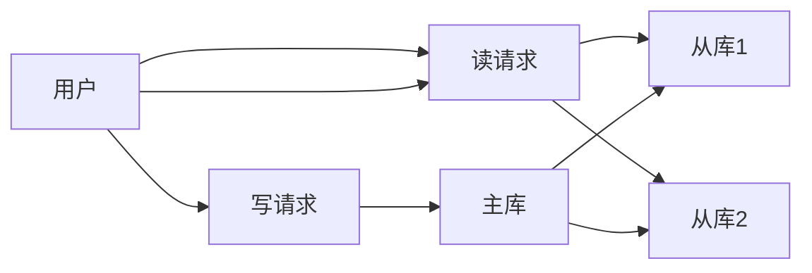

# 1.2.5 分布式与高可用

## 📑 目录

- [1.2.5 分布式与高可用](#125-分布式与高可用)
  - [📑 目录](#-目录)
  - [1. 主从复制](#1-主从复制)
  - [2. 读写分离与高可用](#2-读写分离与高可用)
  - [3. 行业案例与多表征](#3-行业案例与多表征)
    - [3.1. 电商行业：主从复制与读写分离](#31-电商行业主从复制与读写分离)
    - [3.2. 金融行业：MGR高可用集群](#32-金融行业mgr高可用集群)
    - [3.3. Latex公式](#33-latex公式)
    - [3.4. 配置示例](#34-配置示例)

---


## 1. 主从复制

- 基于binlog的异步/半同步/全同步复制。
- 典型架构：一主多从，主从延迟监控。

## 2. 读写分离与高可用

- 读写分离：主库写、从库读，提升并发。
- 高可用方案：MGR、Keepalived、ProxySQL等。

| 架构模式 | 特点 | 适用场景 |
|----------|------|----------|
| 一主多从 | 简单、易扩展 | 读多写少 |
| MGR集群 | 自动故障切换 | 金融级高可用 |
| 读写分离 | 提升吞吐 | 互联网、电商 |

## 3. 行业案例与多表征

### 3.1. 电商行业：主从复制与读写分离


```mermaid
flowchart LR
  U[用户] --> W[写请求] --> M[主库]
  U --> R[读请求] --> S1[从库1]
  U --> R --> S2[从库2]
  M --> S1
  M --> S2
```

### 3.2. 金融行业：MGR高可用集群

- 见[4.3.1-微服务架构基础理论](../../4-软件架构与工程/4.3-微服务架构/4.3.1-微服务架构基础理论.md)

### 3.3. Latex公式

$$
Availability = \frac{MTBF}{MTBF + MTTR}
$$

### 3.4. 配置示例

```ini
[mysqld]
server-id=1
log-bin=mysql-bin
read_only=1
```

---

## 4. 参考资料

### 4.1. 相关理论文档

- [MySQL知识导航索引](./README.md) - MySQL完整知识体系
- [数据库系统知识导航索引](../README.md) - 数据库系统知识导航
- [系统架构](./1.2.2-系统架构.md) - MySQL系统架构
- [分布式系统理论](../../2-形式科学理论/2.5-分布式系统理论/README.md) - 分布式系统理论基础
- [分布式系统理论深化](../../8-形式理论深化/8.5-分布式系统理论深化/README.md) - 分布式系统理论深化
- [微服务架构](../../4-软件架构与工程/4.3-微服务架构/README.md) - 微服务架构设计
- [微服务架构深化](../../9-软件工程深化/9.2-微服务架构深化/README.md) - 微服务架构深化

### 4.2. 相关资源

- [MySQL复制文档](https://dev.mysql.com/doc/refman/8.0/en/replication.html)
- [MySQL Group Replication文档](https://dev.mysql.com/doc/refman/8.0/en/group-replication.html)

---

[返回MySQL导航](README.md)
