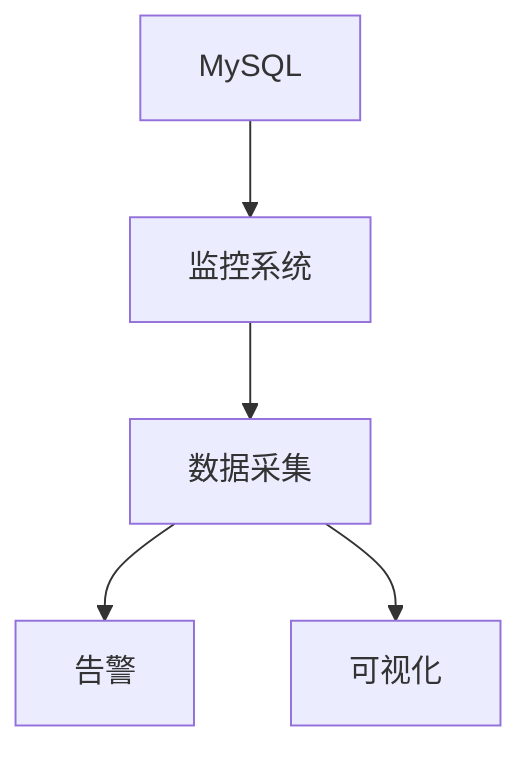

# 1.2.6 性能调优与监控

## 📑 目录

- [1.2.6 性能调优与监控](#126-性能调优与监控)
  - [📑 目录](#-目录)
  - [1. 性能调优方法](#1-性能调优方法)
  - [2. 监控与诊断](#2-监控与诊断)
  - [3. 行业案例与多表征](#3-行业案例与多表征)
    - [3.1. 互联网行业：性能监控大盘](#31-互联网行业性能监控大盘)
    - [3.2. 金融行业：性能调优最佳实践](#32-金融行业性能调优最佳实践)
    - [3.3. Latex公式](#33-latex公式)
    - [3.4. 监控查询示例](#34-监控查询示例)

---


## 1. 性能调优方法

- 参数调优、索引优化、查询重写。
- 硬件资源优化、并发控制调优。

## 2. 监控与诊断

| 监控维度 | 指标 | 工具 |
|----------|------|------|
| 性能指标 | QPS、TPS、延迟 | Performance Schema |
| 资源使用 | CPU、内存、IO | SHOW PROCESSLIST |
| 慢查询   | 执行时间、计划 | Slow Query Log |

## 3. 行业案例与多表征

### 3.1. 互联网行业：性能监控大盘



### 3.2. 金融行业：性能调优最佳实践

- 见[7.4.1-CI_CD最佳实践](../../../../7-持续集成与演进/7.4-CI_CD/7.4.1-CI_CD最佳实践.md)

### 3.3. Latex公式

$$
\text{性能提升} = \frac{\text{优化后TPS}}{\text{优化前TPS}}
$$

### 3.4. 监控查询示例

```sql
SELECT * FROM performance_schema.events_statements_summary_by_digest
ORDER BY SUM_TIMER_WAIT DESC LIMIT 10;
```

[返回MySQL导航](README.md)
