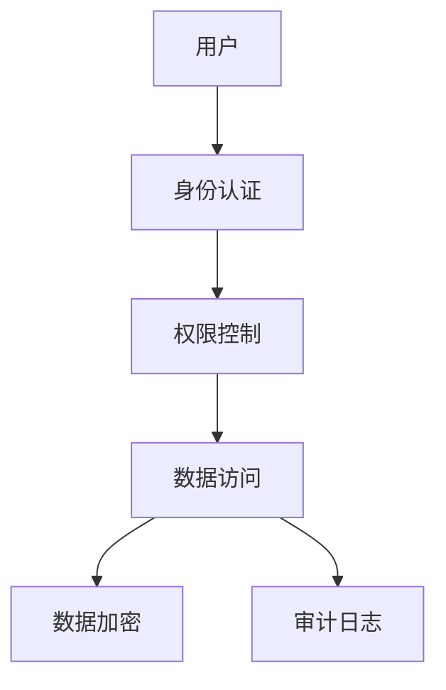

# 1.2.7 安全与合规

## 📑 目录

- [1.2.7 安全与合规](#127-安全与合规)
  - [📑 目录](#-目录)
  - [1. 安全机制](#1-安全机制)
  - [2. 合规要求](#2-合规要求)
  - [3. 行业案例与多表征](#3-行业案例与多表征)
    - [3.1. 金融行业：数据安全架构](#31-金融行业数据安全架构)
    - [3.2. 医疗行业：HIPAA合规](#32-医疗行业hipaa合规)
    - [3.3. Latex公式](#33-latex公式)
    - [3.4. 安全配置示例](#34-安全配置示例)

---


## 1. 安全机制

- 身份认证、权限控制、数据加密。
- 审计日志、行级安全、数据脱敏。

## 2. 合规要求

| 合规标准 | 要求 | MySQL支持 |
|----------|------|-----------|
| GDPR     | 数据保护 | 行级安全、加密 |
| SOX      | 审计追踪 | 审计日志 |
| PCI DSS  | 支付安全 | 数据加密 |

## 3. 行业案例与多表征

### 3.1. 金融行业：数据安全架构



### 3.2. 医疗行业：HIPAA合规

- 见[5.1.1-金融数据科学基础理论](../../../../5-行业应用与场景/5.1-金融数据分析/5.1.1-金融数据科学基础理论.md)

### 3.3. Latex公式

$$
\text{安全等级} = \text{认证强度} \times \text{加密强度} \times \text{审计完整性}
$$

### 3.4. 安全配置示例

```sql
-- 创建用户并授权
CREATE USER 'app_user'@'%' IDENTIFIED BY 'password';
GRANT SELECT, INSERT ON database.* TO 'app_user'@'%';

-- 审计日志
CREATE TABLE audit_log (
  id INT AUTO_INCREMENT PRIMARY KEY,
  user_name VARCHAR(100),
  action VARCHAR(50),
  table_name VARCHAR(100),
  timestamp TIMESTAMP
);
```

[返回MySQL导航](README.md)
