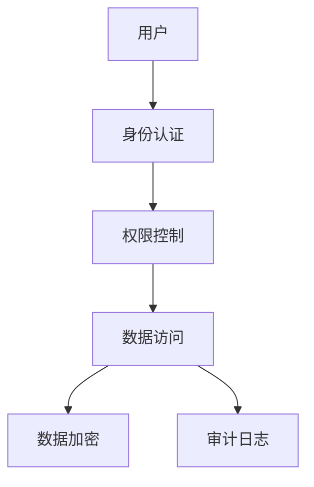

# 1.2.7 安全与合规

## 📑 目录

- [1.2.7 安全与合规](#127-安全与合规)
  - [📑 目录](#-目录)
  - [1. 安全机制](#1-安全机制)
  - [2. 合规要求](#2-合规要求)
  - [3. 行业案例与多表征](#3-行业案例与多表征)
    - [3.1. 金融行业：数据安全架构](#31-金融行业数据安全架构)
    - [3.2. 医疗行业：HIPAA合规](#32-医疗行业hipaa合规)
    - [3.3. Latex公式](#33-latex公式)
    - [3.4. 安全配置示例](#34-安全配置示例)

---


## 1. 安全机制

- 身份认证、权限控制、数据加密。
- 审计日志、行级安全、数据脱敏。

## 2. 合规要求

| 合规标准 | 要求 | MySQL支持 |
|----------|------|-----------|
| GDPR     | 数据保护 | 行级安全、加密 |
| SOX      | 审计追踪 | 审计日志 |
| PCI DSS  | 支付安全 | 数据加密 |

## 3. 行业案例与多表征

### 3.1. 金融行业：数据安全架构


```mermaid
flowchart TD
  U[用户] --> A[身份认证] --> P[权限控制]
  P --> D[数据访问]
  D --> E[数据加密]
  D --> L[审计日志]
```

### 3.2. 医疗行业：HIPAA合规

- 见[5.1.1-金融数据科学基础理论](../../../../5-行业应用与场景/5.1-金融数据分析/5.1.1-金融数据科学基础理论.md)

### 3.3. Latex公式

$$
\text{安全等级} = \text{认证强度} \times \text{加密强度} \times \text{审计完整性}
$$

### 3.4. 安全配置示例

```sql
-- 创建用户并授权
CREATE USER 'app_user'@'%' IDENTIFIED BY 'password';
GRANT SELECT, INSERT ON database.* TO 'app_user'@'%';

-- 审计日志
CREATE TABLE audit_log (
  id INT AUTO_INCREMENT PRIMARY KEY,
  user_name VARCHAR(100),
  action VARCHAR(50),
  table_name VARCHAR(100),
  timestamp TIMESTAMP
);
```

---

## 4. 参考资料

### 4.1. 相关理论文档

- [MySQL知识导航索引](./README.md) - MySQL完整知识体系
- [数据库系统知识导航索引](../README.md) - 数据库系统知识导航
- [数据库安全设计模式](../../../Design/07-数据库设计实践/07.23-数据库安全设计模式.md) - 数据库安全设计模式
- [数据安全模型](../../数据模型理论体系/3-技术实现/3.4-数据安全模型/README.md) - 数据安全模型理论
- [安全与合规实践案例](./1.2.8-MySQL实践案例.md#7-安全配置实践案例) - MySQL安全配置实践

### 4.2. 相关资源

- [MySQL安全文档](https://dev.mysql.com/doc/refman/8.0/en/security.html)
- [MySQL审计日志文档](https://dev.mysql.com/doc/refman/8.0/en/audit-log.html)

---

[返回MySQL导航](README.md)
