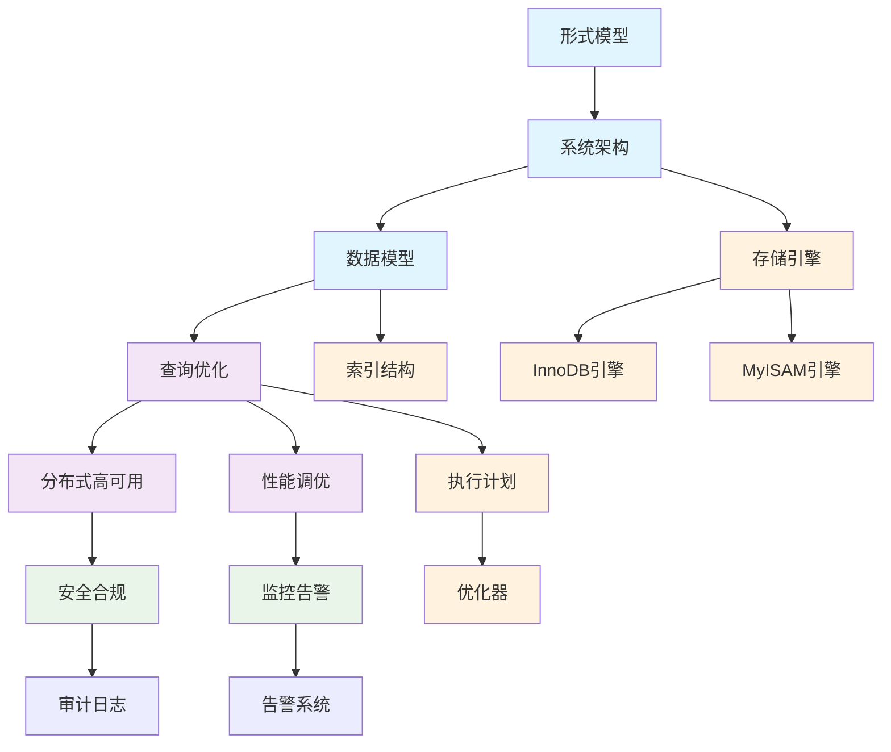

# 1.2-MySQL - 知识导航索引

## 📚 目录结构

```
1.2-MySQL/
├── README.md                           # 本导航文件
├── 1.2.1-形式模型.md                   # MySQL形式化模型
├── 1.2.2-系统架构.md                   # MySQL系统架构
├── 1.2.3-数据模型.md                   # MySQL数据模型
├── 1.2.4-查询优化.md                   # MySQL查询优化
├── 1.2.5-分布式与高可用.md             # 分布式MySQL
├── 1.2.6-性能调优与监控.md             # 性能优化
└── 1.2.7-安全与合规.md                 # 安全合规
```

## 🔗 主题交叉引用表

| 技术分支 | 核心概念 | 关联理论 | 应用领域 |
|---------|---------|---------|---------|
| **形式模型** | 形式化定义、理论证明 | 形式科学理论、数学基础 | 系统验证、理论研究 |
| **系统架构** | 模块化设计、组件交互 | 软件架构、分布式系统 | 系统设计、架构优化 |
| **数据模型** | 关系模型、存储引擎 | 数据模型算法、类型理论 | 数据建模、应用开发 |
| **查询优化** | 执行计划、索引优化 | 算法实现、控制理论 | 性能调优、查询分析 |
| **分布式高可用** | 集群部署、故障恢复 | 分布式系统理论、控制理论 | 大规模部署、容灾 |
| **性能调优** | 参数优化、监控告警 | 性能分析、运维工程 | 系统优化、问题诊断 |
| **安全合规** | 访问控制、数据加密 | 安全理论、合规标准 | 数据保护、审计追踪 |

## 🌊 全链路知识流图



## 🎯 知识体系特色

### 🏗️ **理论严谨性**

- 基于形式化模型的严格定义
- 可证明的系统正确性
- 数学基础支撑的算法设计

### 🚀 **高性能设计**

- 多存储引擎架构
- 智能查询优化器
- 高效索引结构

### 🔄 **高可用性**

- 主从复制机制
- 集群部署方案
- 故障自动恢复

### 🛡️ **安全可靠**

- 多层次安全防护
- 数据加密存储
- 审计日志追踪

## 📖 学习路径建议

### 🥇 **入门路径**

1. **形式模型** → 理解理论基础
2. **系统架构** → 掌握整体设计
3. **数据模型** → 学习数据建模

### 🥈 **进阶路径**

1. **查询优化** → 深入性能调优
2. **分布式高可用** → 掌握集群部署
3. **性能调优** → 系统优化技术

### 🥉 **专家路径**

1. **存储引擎** → 深入引擎设计
2. **安全合规** → 数据安全保护
3. **监控运维** → 生产环境管理

## 🔍 快速导航

- **[形式模型](./1.2.1-形式模型.md)** - MySQL形式化模型
- **[系统架构](./1.2.2-系统架构.md)** - MySQL系统架构
- **[数据模型](./1.2.3-数据模型.md)** - MySQL数据模型
- **[查询优化](./1.2.4-查询优化.md)** - MySQL查询优化
- **[分布式与高可用](./1.2.5-分布式与高可用.md)** - 分布式MySQL
- **[性能调优与监控](./1.2.6-性能调优与监控.md)** - 性能优化
- **[安全与合规](./1.2.7-安全与合规.md)** - 安全合规

## 🚀 技术栈映射

### 🏗️ **核心架构**

- **连接层**：连接池、认证授权
- **服务层**：查询解析、优化、缓存
- **引擎层**：InnoDB、MyISAM、Memory
- **存储层**：文件系统、日志管理

### 🔧 **存储引擎**

- **InnoDB**：事务安全、行级锁
- **MyISAM**：表级锁、全文索引
- **Memory**：内存表、临时表
- **Archive**：归档存储、压缩

### 🔍 **查询优化**

- **执行计划**：EXPLAIN分析
- **索引优化**：B+树索引、复合索引
- **查询缓存**：结果集缓存
- **统计信息**：表统计、索引统计

### 🔄 **高可用技术**

- **主从复制**：异步复制、半同步
- **读写分离**：ProxySQL、MySQL Router
- **集群部署**：MySQL Group Replication
- **分库分表**：水平拆分、垂直拆分

## 📈 应用场景体系

### 🏢 **企业应用**

- **OLTP系统**：高并发事务处理
- **Web应用**：动态网站、内容管理
- **电商平台**：订单处理、库存管理
- **金融系统**：交易记录、账户管理

### 📊 **数据分析**

- **数据仓库**：历史数据存储
- **报表系统**：统计分析报表
- **BI应用**：商业智能分析
- **日志分析**：系统日志存储

### ☁️ **云原生应用**

- **微服务数据库**：服务化部署
- **多租户系统**：资源隔离
- **容器化部署**：Docker、Kubernetes
- **自动化运维**：监控、备份、恢复

### 🔒 **安全应用**

- **数据加密**：透明数据加密
- **访问控制**：用户权限管理
- **审计日志**：操作记录追踪
- **合规认证**：GDPR、SOX合规

---

*本导航为MySQL技术体系提供系统化的知识组织框架，支持从基础理论到实际应用的完整学习路径。*
