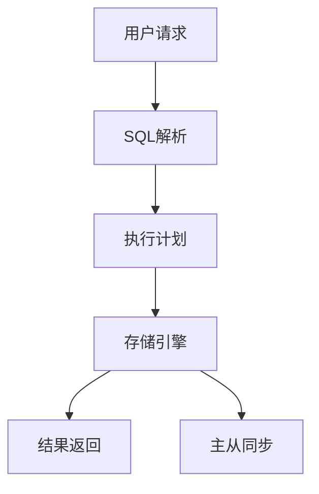

# 1.2 MySQL 主题导航与多表征案例

## 目录结构与本地跳转

- 1.2.1 形式模型（预留）
- 1.2.2 系统架构（预留）
- 1.2.3 数据模型（预留）
- 1.2.4 查询优化（预留）
- 1.2.5 分布式与高可用（预留）

---

## 行业案例与多表征

### 1.2.x 典型行业案例

- 互联网高并发与分布式事务（详见3.3.3-并发控制算法、4.3-微服务架构、7-持续集成与演进）
- 电商平台：主从复制与读写分离（详见1.2.5-分布式与高可用、3.5.7-数据存储与访问）
- 实时分析：OLAP与OLTP混合架构（详见3.5-数据分析与ETL、1.1-PostgreSQL）

### 1.2.x 多表征示例

- 系统架构图、主从复制流程、分布式一致性流程、SQL执行计划、Latex公式等

---

[返回数据库系统导航](../README.md)
