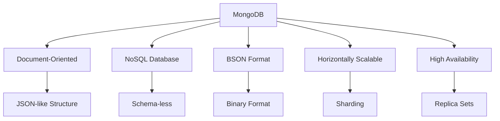
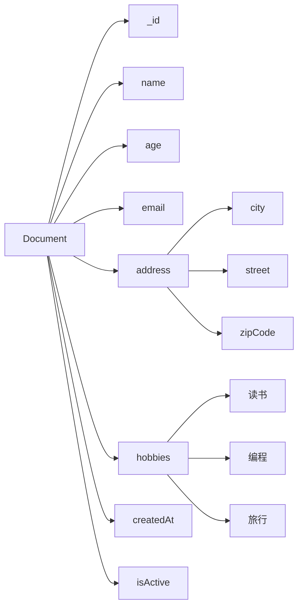
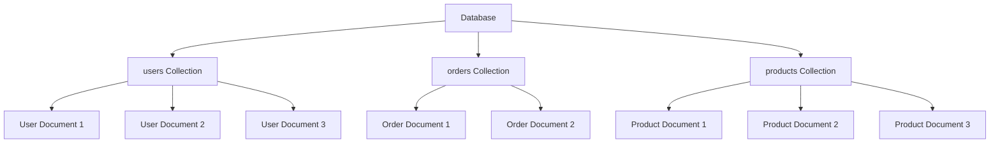
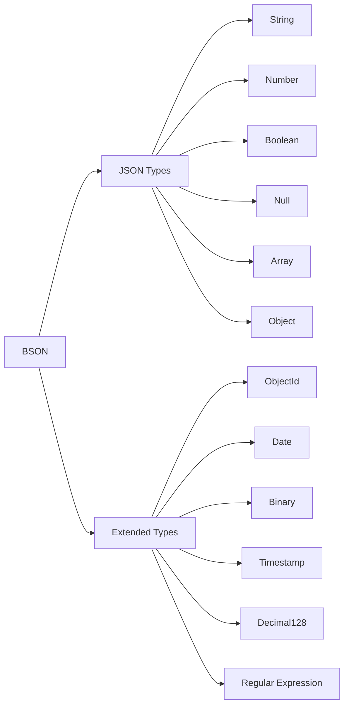

# MongoDB概念定义国际化标准示例

## 1. 概述

本文档展示如何按照国际化Wiki标准定义MongoDB的核心概念，包括概念定义、多表示形式、双语术语映射和知识图谱集成。

## 2. 核心概念定义

### 2.1 MongoDB数据库管理系统

```yaml
# MongoDB DBMS概念定义
concept:
  name: "MongoDB"
  type: "Database Management System"
  category: "NoSQL Database"
  definition_zh: "MongoDB是一个基于文档的NoSQL数据库管理系统，使用JSON-like的BSON格式存储数据，支持水平扩展和高可用性"
  definition_en: "MongoDB is a document-based NoSQL database management system that stores data in JSON-like BSON format, supporting horizontal scaling and high availability"
  formal_definition: "MongoDB = (D, Q, T, C) where D is document collection, Q is query language, T is transaction model, C is consistency model"
  mathematical_notation: "MongoDB ∈ NoSQL_DBMS ∧ MongoDB ⊆ Document_DB"
  properties:
    - "Document-oriented"
    - "Schema-less"
    - "Horizontally scalable"
    - "High availability"
    - "Rich query language"
    - "Aggregation framework"
  synonyms:
    - "Document Database"
    - "NoSQL Database"
    - "BSON Database"
  antonyms:
    - "Relational Database"
    - "SQL Database"
    - "ACID Database"
  wikidata: "Q193207"
```

**多表示形式**:

```markdown
**文本描述**:
MongoDB是一个面向文档的NoSQL数据库管理系统，它使用BSON（Binary JSON）格式存储数据。MongoDB的设计理念是提供高性能、高可用性和易扩展性的数据存储解决方案。

**数学表示**:
MongoDB = (D, Q, T, C)
其中：
- D: Document Collection (文档集合)
- Q: Query Language (查询语言)
- T: Transaction Model (事务模型)
- C: Consistency Model (一致性模型)

**代码示例**:
```javascript
// MongoDB连接示例
const { MongoClient } = require('mongodb');

const uri = "mongodb://localhost:27017";
const client = new MongoClient(uri);

async function connectToMongoDB() {
    try {
        await client.connect();
        console.log("Connected to MongoDB");
        return client.db("test");
    } catch (error) {
        console.error("MongoDB connection error:", error);
        throw error;
    }
}
```

**图表表示**:



### 2.2 文档（Document）

```yaml
# Document概念定义
concept:
  name: "Document"
  type: "Data Structure"
  category: "Data Model"
  definition_zh: "MongoDB中的基本数据单元，使用BSON格式存储，可以包含嵌套的字段和数组"
  definition_en: "The basic data unit in MongoDB, stored in BSON format, which can contain nested fields and arrays"
  formal_definition: "Document = {field₁: value₁, field₂: value₂, ..., fieldₙ: valueₙ}"
  mathematical_notation: "Document ∈ BSON_Object"
  properties:
    - "Self-contained"
    - "Hierarchical"
    - "Flexible schema"
    - "BSON encoded"
    - "Unique _id field"
  synonyms:
    - "BSON Document"
    - "JSON Document"
    - "Data Record"
  antonyms:
    - "Row"
    - "Tuple"
    - "Record"
  wikidata: "Q193207_Document"
```

**多表示形式**:

```markdown
**文本描述**:
文档是MongoDB中的基本数据单元，类似于关系数据库中的行。每个文档都是一个BSON对象，包含字段名和值的键值对。文档可以包含嵌套的文档和数组，支持复杂的数据结构。

**数学表示**:
Document = {(field₁, value₁), (field₂, value₂), ..., (fieldₙ, valueₙ)}
其中 fieldᵢ ∈ String, valueᵢ ∈ BSON_Value

**代码示例**:
```javascript
// 文档示例
const document = {
    _id: ObjectId("507f1f77bcf86cd799439011"),
    name: "张三",
    age: 30,
    email: "zhangsan@example.com",
    address: {
        city: "北京",
        street: "中关村大街",
        zipCode: "100080"
    },
    hobbies: ["读书", "编程", "旅行"],
    createdAt: new Date("2023-01-01"),
    isActive: true
};
```

**图表表示**:



### 2.3 集合（Collection）

```yaml
# Collection概念定义
concept:
  name: "Collection"
  type: "Data Organization"
  category: "Data Model"
  definition_zh: "MongoDB中存储文档的容器，类似于关系数据库中的表"
  definition_en: "A container in MongoDB that stores documents, similar to a table in relational databases"
  formal_definition: "Collection = {doc₁, doc₂, ..., docₙ} where docᵢ ∈ Document"
  mathematical_notation: "Collection ⊆ Document*"
  properties:
    - "Unordered"
    - "Dynamic"
    - "Indexable"
    - "Shardable"
    - "Replicable"
  synonyms:
    - "Document Container"
    - "Document Set"
    - "Data Container"
  antonyms:
    - "Table"
    - "Relation"
    - "File"
  wikidata: "Q193207_Collection"
```

**多表示形式**:

```markdown
**文本描述**:
集合是MongoDB中存储文档的容器，类似于关系数据库中的表。集合是无模式的，其中的文档可以有不同的字段结构。集合支持索引、分片和复制，提供高性能的数据访问。

**数学表示**:
Collection = {doc₁, doc₂, ..., docₙ}
其中 docᵢ ∈ Document, i ∈ {1, 2, ..., n}

**代码示例**:
```javascript
// 集合操作示例
const database = client.db("test");
const collection = database.collection("users");

// 创建集合
await database.createCollection("users");

// 插入文档到集合
await collection.insertOne({
    name: "李四",
    age: 25,
    email: "lisi@example.com"
});

// 查询集合中的文档
const users = await collection.find({}).toArray();
```

**图表表示**:



### 2.4 BSON数据格式

```yaml
# BSON概念定义
concept:
  name: "BSON"
  type: "Data Format"
  category: "Serialization"
  definition_zh: "Binary JSON，MongoDB使用的二进制数据格式，扩展了JSON以支持更多数据类型"
  definition_en: "Binary JSON, the binary data format used by MongoDB, extending JSON to support more data types"
  formal_definition: "BSON = JSON ∪ {ObjectId, Date, Binary, ...}"
  mathematical_notation: "BSON ⊃ JSON"
  properties:
    - "Binary format"
    - "Type-rich"
    - "Efficient"
    - "Lightweight"
    - "Traversable"
  synonyms:
    - "Binary JSON"
    - "MongoDB Format"
    - "Binary Serialization"
  antonyms:
    - "JSON"
    - "XML"
    - "Text Format"
  wikidata: "Q193207_BSON"
```

**多表示形式**:

```markdown
**文本描述**:
BSON（Binary JSON）是MongoDB使用的二进制数据格式，它扩展了JSON以支持更多的数据类型，如ObjectId、Date、Binary等。BSON格式高效且易于遍历，适合数据库存储和网络传输。

**数学表示**:
BSON = JSON ∪ {ObjectId, Date, Binary, Timestamp, Decimal128, ...}
其中 JSON = {String, Number, Boolean, Null, Array, Object}

**代码示例**:
```javascript
// BSON数据类型示例
const bsonDocument = {
    _id: ObjectId("507f1f77bcf86cd799439011"),
    name: "王五",
    age: 28,
    salary: NumberDecimal("50000.50"),
    birthDate: new Date("1995-06-15"),
    profile: {
        avatar: new Binary(Buffer.from("image_data")),
        bio: "Software Engineer"
    },
    tags: ["JavaScript", "MongoDB", "Node.js"],
    isActive: true,
    createdAt: new Timestamp(Date.now(), 1)
};
```

**图表表示**:



## 3. 双语术语映射表

### 3.1 核心概念术语映射

| 中文术语 | 英文术语 | 定义 | Wikidata ID |
|---------|---------|------|-------------|
| MongoDB | MongoDB | 面向文档的NoSQL数据库管理系统 | Q193207 |
| 文档 | Document | MongoDB中的基本数据单元 | Q193207_Document |
| 集合 | Collection | 存储文档的容器 | Q193207_Collection |
| BSON | BSON | 二进制JSON格式 | Q193207_BSON |
| 数据库 | Database | 存储集合的容器 | Q193207_Database |
| 索引 | Index | 提高查询性能的数据结构 | Q193207_Index |
| 查询 | Query | 检索数据的操作 | Q193207_Query |
| 聚合 | Aggregation | 数据处理管道 | Q193207_Aggregation |
| 分片 | Sharding | 水平数据分区 | Q193207_Sharding |
| 副本集 | Replica Set | 高可用性配置 | Q193207_ReplicaSet |

### 3.2 数据类型术语映射

| 中文术语 | 英文术语 | BSON类型 | 示例 |
|---------|---------|----------|------|
| 字符串 | String | string | "Hello World" |
| 数字 | Number | int32/int64/double | 42, 3.14 |
| 布尔值 | Boolean | bool | true, false |
| 日期 | Date | date | new Date() |
| 对象ID | ObjectId | objectId | ObjectId() |
| 数组 | Array | array | [1, 2, 3] |
| 对象 | Object | object | {key: "value"} |
| 空值 | Null | null | null |
| 正则表达式 | Regular Expression | regex | /pattern/ |
| 二进制数据 | Binary Data | binData | new Binary() |

### 3.3 操作符术语映射

| 中文术语 | 英文术语 | 操作符 | 描述 |
|---------|---------|--------|------|
| 等于 | Equal | $eq | 等于比较 |
| 不等于 | Not Equal | $ne | 不等于比较 |
| 大于 | Greater Than | $gt | 大于比较 |
| 大于等于 | Greater Than or Equal | $gte | 大于等于比较 |
| 小于 | Less Than | $lt | 小于比较 |
| 小于等于 | Less Than or Equal | $lte | 小于等于比较 |
| 在数组中 | In Array | $in | 值在数组中 |
| 不在数组中 | Not In Array | $nin | 值不在数组中 |
| 存在 | Exists | $exists | 字段存在检查 |
| 类型匹配 | Type Match | $type | 数据类型匹配 |

## 4. RDF知识图谱表示

```turtle
# MongoDB概念知识图谱
@prefix rdf: <http://www.w3.org/1999/02/22-rdf-syntax-ns#> .
@prefix rdfs: <http://www.w3.org/2000/01/rdf-schema#> .
@prefix wd: <http://www.wikidata.org/entity/> .
@prefix wdt: <http://www.wikidata.org/prop/direct/> .
@prefix schema: <http://schema.org/> .

# MongoDB主实体
wd:Q193207 rdfs:label "MongoDB"@en, "MongoDB"@zh ;
    rdfs:description "Document-oriented NoSQL database management system"@en, "面向文档的NoSQL数据库管理系统"@zh ;
    wdt:P31 wd:Q176165 ;
    wdt:P178 wd:Q2087 ;
    wdt:P856 "https://www.mongodb.com" ;
    schema:programmingLanguage "JavaScript", "Python", "Java", "C++" .

# 文档概念
wd:Q193207_Document rdfs:label "Document"@en, "文档"@zh ;
    rdfs:description "Basic data unit in MongoDB"@en, "MongoDB中的基本数据单元"@zh ;
    wdt:P31 wd:Q193207 ;
    wdt:P279 wd:Q193207 ;
    schema:dataFormat wd:Q193207_BSON .

# 集合概念
wd:Q193207_Collection rdfs:label "Collection"@en, "集合"@zh ;
    rdfs:description "Container for documents in MongoDB"@en, "MongoDB中存储文档的容器"@zh ;
    wdt:P31 wd:Q193207 ;
    wdt:P279 wd:Q193207 ;
    wdt:P527 wd:Q193207_Document .

# BSON概念
wd:Q193207_BSON rdfs:label "BSON"@en, "BSON"@zh ;
    rdfs:description "Binary JSON format used by MongoDB"@en, "MongoDB使用的二进制JSON格式"@zh ;
    wdt:P31 wd:Q193207 ;
    wdt:P279 wd:Q193207 ;
    wdt:P1195 wd:Q2063 .

# 查询语言
wd:Q193207_Query rdfs:label "MongoDB Query Language"@en, "MongoDB查询语言"@zh ;
    rdfs:description "Query language for MongoDB"@en, "MongoDB的查询语言"@zh ;
    wdt:P31 wd:Q193207 ;
    wdt:P279 wd:Q193207 ;
    wdt:P1195 wd:Q2063 .

# 聚合管道
wd:Q193207_Aggregation rdfs:label "Aggregation Pipeline"@en, "聚合管道"@zh ;
    rdfs:description "Data processing pipeline in MongoDB"@en, "MongoDB中的数据处理管道"@zh ;
    wdt:P31 wd:Q193207 ;
    wdt:P279 wd:Q193207 ;
    wdt:P527 wd:Q193207_Stage .

# 索引
wd:Q193207_Index rdfs:label "Index"@en, "索引"@zh ;
    rdfs:description "Data structure for efficient querying"@en, "用于高效查询的数据结构"@zh ;
    wdt:P31 wd:Q193207 ;
    wdt:P279 wd:Q193207 ;
    wdt:P527 wd:Q193207_Field .

# 分片
wd:Q193207_Sharding rdfs:label "Sharding"@en, "分片"@zh ;
    rdfs:description "Horizontal partitioning of data"@en, "数据的水平分区"@zh ;
    wdt:P31 wd:Q193207 ;
    wdt:P279 wd:Q193207 ;
    wdt:P527 wd:Q193207_Shard .

# 副本集
wd:Q193207_ReplicaSet rdfs:label "Replica Set"@en, "副本集"@zh ;
    rdfs:description "Group of MongoDB processes for high availability"@en, "用于高可用性的MongoDB进程组"@zh ;
    wdt:P31 wd:Q193207 ;
    wdt:P279 wd:Q193207 ;
    wdt:P527 wd:Q193207_Node .
```

## 5. 概念映射关系

```yaml
# MongoDB概念映射关系
concept_mapping_relations:
  mongodb_core:
    mongodb:
      - document: "包含"
      - collection: "组织"
      - database: "管理"
      - bson: "使用"
      
  document_related:
    document:
      - field: "包含"
      - value: "存储"
      - bson: "编码为"
      - collection: "属于"
      
  collection_related:
    collection:
      - document: "存储"
      - index: "支持"
      - shard: "可分片"
      - replica: "可复制"
      
  bson_related:
    bson:
      - json: "扩展"
      - binary: "二进制格式"
      - mongodb: "被使用"
      - document: "编码"
      
  query_related:
    query:
      - document: "检索"
      - collection: "操作"
      - index: "利用"
      - aggregation: "支持"
      
  aggregation_related:
    aggregation:
      - pipeline: "使用"
      - stage: "包含"
      - document: "处理"
      - result: "产生"
```

## 6. 内容质量标准与验证检查清单

```yaml
# MongoDB概念定义质量标准
quality_standards:
  accuracy:
    description: "概念定义准确性和技术正确性"
    criteria:
      - "概念定义准确无误"
      - "技术细节正确"
      - "示例代码可执行"
      - "数学表示正确"
    weight: 0.3
    
  completeness:
    description: "概念覆盖完整性和全面性"
    criteria:
      - "核心概念完整覆盖"
      - "多表示形式齐全"
      - "双语术语映射完整"
      - "知识图谱关系完整"
    weight: 0.25
    
  clarity:
    description: "表达清晰性和可理解性"
    criteria:
      - "语言表达清晰"
      - "逻辑结构合理"
      - "图表说明清楚"
      - "术语使用一致"
    weight: 0.2
    
  consistency:
    description: "内容一致性和规范性"
    criteria:
      - "术语使用一致"
      - "格式规范统一"
      - "引用标准一致"
      - "风格保持统一"
    weight: 0.15
    
  relevance:
    description: "内容相关性和实用性"
    criteria:
      - "符合MongoDB实际"
      - "具有实用价值"
      - "反映最新技术"
      - "解决实际问题"
    weight: 0.1

# 验证检查清单
validation_checklist:
  concept_definition:
    - "概念名称是否准确"
    - "中英文定义是否完整"
    - "形式化定义是否正确"
    - "数学表示是否规范"
    - "属性描述是否全面"
    - "同义词反义词是否准确"
    - "Wikidata映射是否正确"
    
  mathematical_content:
    - "LaTeX语法是否正确"
    - "数学符号是否规范"
    - "公式推导是否合理"
    - "符号定义是否清晰"
    
  code_examples:
    - "代码语法是否正确"
    - "示例是否可执行"
    - "注释是否清晰"
    - "最佳实践是否体现"
    
  diagrams:
    - "图表是否清晰"
    - "关系是否正确"
    - "标签是否准确"
    - "布局是否合理"
    
  terminology:
    - "术语使用是否一致"
    - "双语映射是否准确"
    - "专业术语是否规范"
    - "新术语是否定义"
    
  knowledge_graph:
    - "RDF三元组是否正确"
    - "实体关系是否准确"
    - "Wikidata对齐是否正确"
    - "概念映射是否完整"
```

## 7. 总结

本文档展示了MongoDB概念定义的国际化Wiki标准示例，包括：

1. **标准概念定义**: 建立了MongoDB、Document、Collection、BSON等核心概念的标准定义
2. **多表示形式**: 提供了文本、数学、代码、图表等多种表示方式
3. **双语术语映射**: 实现了中英文术语的完整映射表
4. **知识图谱集成**: 建立了RDF三元组表示和概念映射关系
5. **质量标准**: 定义了内容质量标准和验证检查清单

这些示例为MongoDB知识内容的标准化和国际化提供了具体的实施指导，确保了内容的学术严谨性、一致性和可访问性。
