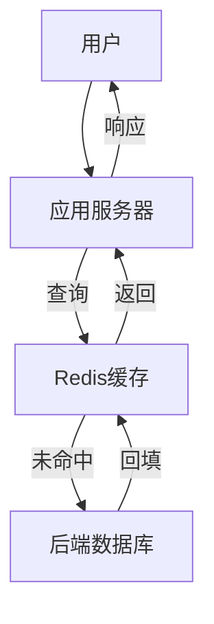

# 1.3.1 NoSQL形式模型

## 📑 目录

- [1.3.1 NoSQL形式模型](#131-nosql形式模型)
  - [📑 目录](#-目录)
  - [1. 概述](#1-概述)
    - [1.1. NoSQL模型分类](#11-nosql模型分类)
    - [1.2. 形式化定义](#12-形式化定义)
  - [2. 键值模型](#2-键值模型)
    - [2.1. 键值模型定义](#21-键值模型定义)
    - [2.2. 键值模型形式化](#22-键值模型形式化)
    - [2.3. 典型系统](#23-典型系统)
      - [2.3.1. Redis](#231-redis)
      - [2.3.2. DynamoDB](#232-dynamodb)
  - [3. 文档模型](#3-文档模型)
    - [3.1. 文档模型定义](#31-文档模型定义)
    - [3.2. 文档模型形式化](#32-文档模型形式化)
    - [3.3. 典型系统](#33-典型系统)
      - [3.3.1. MongoDB](#331-mongodb)
      - [3.3.2. CouchDB](#332-couchdb)
  - [4. 列族模型](#4-列族模型)
    - [4.1. 列族模型定义](#41-列族模型定义)
    - [4.2. 列族模型形式化](#42-列族模型形式化)
    - [4.3. 典型系统](#43-典型系统)
      - [4.3.1. HBase](#431-hbase)
      - [4.3.2. Cassandra](#432-cassandra)
  - [5. 图模型](#5-图模型)
    - [5.1. 图模型定义](#51-图模型定义)
    - [5.2. 图模型形式化](#52-图模型形式化)
    - [5.3. 典型系统](#53-典型系统)
      - [5.3.1. Neo4j](#531-neo4j)
      - [5.3.2. JanusGraph](#532-janusgraph)
  - [6. 模型对比与选择](#6-模型对比与选择)
    - [6.1. 模型特性对比](#61-模型特性对比)
    - [6.2. 适用场景](#62-适用场景)
  - [7. 实际应用案例](#7-实际应用案例)
    - [7.1. 互联网行业：Redis缓存架构](#71-互联网行业redis缓存架构)
    - [7.2. 金融行业：MongoDB文档存储](#72-金融行业mongodb文档存储)
  - [8. 形式化理论](#8-形式化理论)
    - [8.1. 模型等价性](#81-模型等价性)
    - [8.2. 可扩展性形式化](#82-可扩展性形式化)
  - [9. 多表征](#9-多表征)
  - [10. 总结与展望](#10-总结与展望)
    - [10.1. 总结](#101-总结)
    - [10.2. 发展趋势](#102-发展趋势)

---

## 1. 概述

### 1.1. NoSQL模型分类

**NoSQL数据模型分类**：

1. **键值模型（Key-Value）**：最简单的数据模型，通过键访问值
2. **文档模型（Document）**：存储半结构化文档，如JSON、BSON
3. **列族模型（Column Family）**：按列族组织数据，适合大规模分布式存储
4. **图模型（Graph）**：以节点和边表示实体和关系

### 1.2. 形式化定义

**NoSQL数据模型形式化定义**：

设NoSQL数据模型 $M$ 为：

$$M = (S, O, Q, C)$$

其中：

- $S$：数据结构（Structure）
- $O$：操作集合（Operations）
- $Q$：查询语言（Query Language）
- $C$：一致性模型（Consistency Model）

---

## 2. 键值模型

### 2.1. 键值模型定义

**键值模型**：最简单的NoSQL数据模型，通过唯一的键访问对应的值。

**特点**：

- **简单性**：数据结构简单，易于实现
- **高性能**：O(1)时间复杂度访问
- **灵活性**：值可以是任意类型
- **可扩展性**：易于水平扩展

### 2.2. 键值模型形式化

**键值模型形式化定义**：

设键值模型 $M_{KV} = (K, V, O_{KV})$，其中：

- $K$：键集合（Key Set）
- $V$：值集合（Value Set）
- $O_{KV}$：操作集合

**操作定义**：

1. **GET(k)**：获取键 $k$ 对应的值
   $$GET: K \to V \cup \{\bot\}$$

2. **PUT(k, v)**：存储键值对 $(k, v)$
   $$PUT: K \times V \to \text{Boolean}$$

3. **DELETE(k)**：删除键 $k$
   $$DELETE: K \to \text{Boolean}$$

4. **EXISTS(k)**：检查键 $k$ 是否存在
   $$EXISTS: K \to \text{Boolean}$$

**实现示例**：

```python
class KeyValueStore:
    def __init__(self):
        self.store = {}

    def get(self, key):
        """获取值"""
        return self.store.get(key, None)

    def put(self, key, value):
        """存储键值对"""
        self.store[key] = value
        return True

    def delete(self, key):
        """删除键"""
        if key in self.store:
            del self.store[key]
            return True
        return False

    def exists(self, key):
        """检查键是否存在"""
        return key in self.store
```

### 2.3. 典型系统

#### 2.3.1. Redis

**Redis特点**：

- **内存存储**：数据存储在内存中
- **数据结构丰富**：支持String、Hash、List、Set、Sorted Set等
- **持久化**：支持RDB和AOF持久化
- **高性能**：单线程模型，性能极高

**Redis示例**：

```bash
# 字符串操作
SET user:1 "Alice"
GET user:1

# 哈希操作
HSET user:1 name "Alice" age 30
HGETALL user:1

# 列表操作
LPUSH orders:1 "order1" "order2"
LRANGE orders:1 0 -1
```

#### 2.3.2. DynamoDB

**DynamoDB特点**：

- **托管服务**：AWS托管服务
- **自动扩展**：自动扩展容量
- **多模型支持**：支持键值和文档模型
- **全球表**：支持多区域复制

**DynamoDB示例**：

```json
{
  "TableName": "users",
  "Key": {
    "user_id": "123"
  },
  "Item": {
    "user_id": "123",
    "name": "Alice",
    "age": 30
  }
}
```

---

## 3. 文档模型

### 3.1. 文档模型定义

**文档模型**：以文档为单位存储数据，文档可以是JSON、BSON等格式。

**特点**：

- **半结构化**：支持嵌套结构
- **灵活性**：文档结构可以不同
- **查询能力**：支持复杂查询
- **开发友好**：与应用程序数据结构匹配

### 3.2. 文档模型形式化

**文档模型形式化定义**：

设文档模型 $M_{Doc} = (D, C, O_{Doc})$，其中：

- $D$：文档集合（Document Set）
- $C$：集合集合（Collection Set）
- $O_{Doc}$：操作集合

**文档定义**：

文档 $d \in D$ 是一个键值对的集合：

$$d = \{(k_1, v_1), (k_2, v_2), \ldots, (k_n, v_n)\}$$

其中 $v_i$ 可以是：

- 基本类型：字符串、数字、布尔值
- 嵌套文档：另一个文档
- 数组：文档数组

**操作定义**：

1. **INSERT(d)**：插入文档 $d$
   $$INSERT: D \to \text{Boolean}$$

2. **FIND(P)**：查找满足谓词 $P$ 的文档
   $$FIND: P \to 2^D$$

3. **UPDATE(d, P)**：更新满足谓词 $P$ 的文档
   $$UPDATE: D \times P \to \text{Boolean}$$

4. **DELETE(P)**：删除满足谓词 $P$ 的文档
   $$DELETE: P \to \text{Boolean}$$

**实现示例**：

```python
class DocumentStore:
    def __init__(self):
        self.collections = {}

    def insert(self, collection, document):
        """插入文档"""
        if collection not in self.collections:
            self.collections[collection] = []
        self.collections[collection].append(document)
        return True

    def find(self, collection, predicate):
        """查找文档"""
        if collection not in self.collections:
            return []
        return [doc for doc in self.collections[collection] if predicate(doc)]

    def update(self, collection, predicate, update_func):
        """更新文档"""
        if collection not in self.collections:
            return False
        for doc in self.collections[collection]:
            if predicate(doc):
                update_func(doc)
        return True
```

### 3.3. 典型系统

#### 3.3.1. MongoDB

**MongoDB特点**：

- **BSON格式**：使用BSON存储文档
- **灵活模式**：支持动态模式
- **丰富查询**：支持复杂查询和聚合
- **水平扩展**：支持分片和副本集

**MongoDB示例**：

```javascript
// 插入文档
db.users.insert({
  _id: 1,
  name: "Alice",
  age: 30,
  address: {
    city: "Beijing",
    country: "China"
  },
  orders: [
    { id: 101, amount: 200 },
    { id: 102, amount: 150 }
  ]
})

// 查询文档
db.users.find({ age: { $gte: 25 } })

// 更新文档
db.users.update(
  { _id: 1 },
  { $set: { age: 31 } }
)
```

#### 3.3.2. CouchDB

**CouchDB特点**：

- **RESTful API**：通过HTTP访问
- **MVCC**：多版本并发控制
- **MapReduce**：内置MapReduce支持
- **离线同步**：支持离线同步

---

## 4. 列族模型

### 4.1. 列族模型定义

**列族模型**：按列族组织数据，适合大规模分布式存储和分析。

**特点**：

- **列式存储**：按列存储数据
- **稀疏性**：支持稀疏数据
- **可扩展性**：易于水平扩展
- **分析友好**：适合分析查询

### 4.2. 列族模型形式化

**列族模型形式化定义**：

设列族模型 $M_{CF} = (R, CF, C, O_{CF})$，其中：

- $R$：行键集合（Row Key Set）
- $CF$：列族集合（Column Family Set）
- $C$：列集合（Column Set）
- $O_{CF}$：操作集合

**数据组织**：

数据按 $(row\_key, column\_family, column, timestamp, value)$ 组织：

$$Data = \{(r, cf, c, t, v) | r \in R, cf \in CF, c \in C, t \in T, v \in V\}$$

**操作定义**：

1. **GET(r, cf, c)**：获取行 $r$、列族 $cf$、列 $c$ 的值
   $$GET: R \times CF \times C \to V \cup \{\bot\}$$

2. **PUT(r, cf, c, v)**：存储值
   $$PUT: R \times CF \times C \times V \to \text{Boolean}$$

3. **SCAN(r_start, r_end)**：扫描行范围
   $$SCAN: R \times R \to 2^{Data}$$

**实现示例**：

```python
class ColumnFamilyStore:
    def __init__(self):
        self.data = {}

    def get(self, row_key, column_family, column):
        """获取值"""
        key = (row_key, column_family, column)
        if key in self.data:
            return self.data[key]
        return None

    def put(self, row_key, column_family, column, value):
        """存储值"""
        key = (row_key, column_family, column)
        self.data[key] = value
        return True

    def scan(self, row_start, row_end):
        """扫描行范围"""
        result = []
        for (r, cf, c), v in self.data.items():
            if row_start <= r <= row_end:
                result.append(((r, cf, c), v))
        return result
```

### 4.3. 典型系统

#### 4.3.1. HBase

**HBase特点**：

- **Hadoop集成**：基于HDFS
- **强一致性**：保证强一致性
- **自动分片**：自动分片和负载均衡
- **版本控制**：支持多版本数据

**HBase示例**：

```java
// 创建表
HTableDescriptor table = new HTableDescriptor(TableName.valueOf("users"));
table.addFamily(new HColumnDescriptor("info"));
table.addFamily(new HColumnDescriptor("orders"));
admin.createTable(table);

// 插入数据
Put put = new Put(Bytes.toBytes("user1"));
put.addColumn(Bytes.toBytes("info"), Bytes.toBytes("name"), Bytes.toBytes("Alice"));
table.put(put);

// 查询数据
Get get = new Get(Bytes.toBytes("user1"));
Result result = table.get(get);
```

#### 4.3.2. Cassandra

**Cassandra特点**：

- **无中心架构**：无单点故障
- **最终一致性**：默认最终一致性
- **高可用性**：高可用性设计
- **CQL查询**：类似SQL的查询语言

**Cassandra示例**：

```cql
-- 创建表
CREATE TABLE users (
    user_id UUID PRIMARY KEY,
    name TEXT,
    email TEXT,
    age INT
);

-- 插入数据
INSERT INTO users (user_id, name, email, age)
VALUES (uuid(), 'Alice', 'alice@example.com', 30);

-- 查询数据
SELECT * FROM users WHERE user_id = ?;
```

---

## 5. 图模型

### 5.1. 图模型定义

**图模型**：以节点和边表示实体和关系。

**特点**：

- **关系表达**：直观表达实体间关系
- **复杂查询**：支持复杂图查询
- **模式匹配**：支持图模式匹配
- **路径查询**：支持路径查询

### 5.2. 图模型形式化

**图模型形式化定义**：

设图模型 $M_{Graph} = (G, O_{Graph})$，其中：

- $G = (V, E)$：图，$V$ 是节点集合，$E$ 是边集合
- $O_{Graph}$：操作集合

**节点定义**：

节点 $v \in V$ 是一个属性集合：

$$v = \{(label, properties)\}$$

其中 $properties$ 是属性键值对。

**边定义**：

边 $e \in E$ 是一个三元组：

$$e = (v_1, label, v_2)$$

其中 $v_1, v_2 \in V$ 是节点，$label$ 是边标签。

**操作定义**：

1. **CREATE_NODE(v)**：创建节点 $v$
   $$CREATE\_NODE: V \to \text{Boolean}$$

2. **CREATE_EDGE(e)**：创建边 $e$
   $$CREATE\_EDGE: E \to \text{Boolean}$$

3. **MATCH(pattern)**：匹配图模式
   $$MATCH: Pattern \to 2^G$$

4. **SHORTEST_PATH(v_1, v_2)**：查找最短路径
   $$SHORTEST\_PATH: V \times V \to Path$$

**实现示例**：

```python
class GraphStore:
    def __init__(self):
        self.nodes = {}
        self.edges = []

    def create_node(self, node_id, label, properties):
        """创建节点"""
        self.nodes[node_id] = {
            'label': label,
            'properties': properties
        }
        return True

    def create_edge(self, from_node, to_node, label, properties=None):
        """创建边"""
        edge = {
            'from': from_node,
            'to': to_node,
            'label': label,
            'properties': properties or {}
        }
        self.edges.append(edge)
        return True

    def match(self, pattern):
        """匹配图模式"""
        results = []
        for edge in self.edges:
            if self._matches_pattern(edge, pattern):
                results.append(edge)
        return results

    def shortest_path(self, from_node, to_node):
        """查找最短路径"""
        from collections import deque
        queue = deque([(from_node, [from_node])])
        visited = {from_node}

        while queue:
            current, path = queue.popleft()
            if current == to_node:
                return path

            for edge in self.edges:
                if edge['from'] == current and edge['to'] not in visited:
                    visited.add(edge['to'])
                    queue.append((edge['to'], path + [edge['to']]))

        return None
```

### 5.3. 典型系统

#### 5.3.1. Neo4j

**Neo4j特点**：

- **原生图存储**：原生图存储引擎
- **Cypher查询**：Cypher查询语言
- **ACID事务**：支持ACID事务
- **高性能**：高性能图查询

**Neo4j示例**：

```cypher
// 创建节点
CREATE (u:User {id: 1, name: "Alice", age: 30})

// 创建关系
MATCH (u1:User {id: 1}), (u2:User {id: 2})
CREATE (u1)-[:FOLLOWS]->(u2)

// 查询
MATCH (u:User)-[:FOLLOWS]->(f:User)
WHERE u.id = 1
RETURN f

// 最短路径
MATCH path = shortestPath(
  (u1:User {id: 1})-[*]-(u2:User {id: 2})
)
RETURN path
```

#### 5.3.2. JanusGraph

**JanusGraph特点**：

- **分布式图数据库**：支持分布式部署
- **多种后端**：支持多种存储后端
- **Gremlin查询**：Gremlin图遍历语言
- **可扩展性**：易于水平扩展

---

## 6. 模型对比与选择

### 6.1. 模型特性对比

| 特性 | 键值模型 | 文档模型 | 列族模型 | 图模型 |
|------|---------|---------|---------|--------|
| **数据结构** | 键值对 | 文档 | 列族 | 节点和边 |
| **查询能力** | 简单 | 中等 | 中等 | 复杂 |
| **扩展性** | 高 | 高 | 高 | 中等 |
| **一致性** | 最终一致 | 最终一致 | 最终一致 | 强一致 |
| **适用场景** | 缓存、会话 | Web应用 | 大数据分析 | 社交网络 |

### 6.2. 适用场景

**键值模型适用场景**：

- 缓存系统
- 会话存储
- 配置管理
- 计数器

**文档模型适用场景**：

- Web应用
- 内容管理
- 用户配置
- 日志存储

**列族模型适用场景**：

- 大数据分析
- 时序数据
- 日志存储
- 推荐系统

**图模型适用场景**：

- 社交网络
- 知识图谱
- 推荐系统
- 欺诈检测

---

## 7. 实际应用案例

### 7.1. 互联网行业：Redis缓存架构

**场景**：

- 高并发Web应用
- 缓存热点数据
- 会话存储

**实现**：



### 7.2. 金融行业：MongoDB文档存储

**场景**：

- 交易记录存储
- 用户信息管理
- 报表生成

**实现**：

```javascript
// 交易记录文档
{
  _id: ObjectId("..."),
  transaction_id: "TXN001",
  user_id: 123,
  amount: 1000,
  timestamp: ISODate("2024-01-01T00:00:00Z"),
  status: "completed"
}
```

---

## 8. 形式化理论

### 8.1. 模型等价性

**模型等价性定义**：

两个NoSQL模型 $M_1$ 和 $M_2$ 等价，当且仅当：

$$\forall d_1 \in D_1, \exists d_2 \in D_2: f(d_1) = d_2$$

其中 $f$ 是转换函数。

### 8.2. 可扩展性形式化

**可扩展性定义**：

NoSQL系统的可扩展性定义为：

$$Scalability(n) = \lim_{n \to \infty} \frac{Throughput(n)}{n}$$

其中 $n$ 是节点数，$Throughput(n)$ 是 $n$ 个节点的吞吐量。

---

## 9. 多表征

本主题支持多种表征方式：

1. **符号表征**：形式化定义、数学公式
2. **图结构**：数据模型图、架构图
3. **代码实现**：模型实现代码
4. **自然语言**：概念定义、应用场景
5. **可视化**：数据可视化、查询可视化

---

## 10. 总结与展望

### 10.1. 总结

NoSQL形式模型的核心要点：

1. **模型分类**：键值、文档、列族、图四种主要模型
2. **形式化定义**：每种模型都有严格的形式化定义
3. **适用场景**：不同模型适用于不同场景
4. **系统实现**：Redis、MongoDB、HBase、Neo4j等典型系统

### 10.2. 发展趋势

**未来发展方向**：

1. **多模型数据库**：支持多种数据模型
2. **统一查询语言**：统一的查询接口
3. **智能模型选择**：AI驱动的模型选择

---

**参考文献**：

1. Cattell, R. (2011). "Scalable SQL and NoSQL data stores"
2. Stonebraker, M. (2010). "SQL databases v. NoSQL databases"

---

[返回NoSQL导航](README.md)
