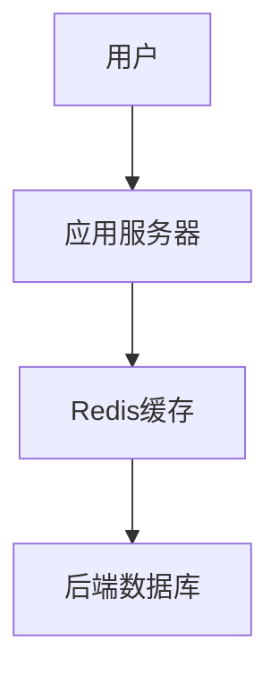

# 1.3.1 形式模型

## 1.3.1.1 键值模型
- 典型代表：Redis、DynamoDB。
- 结构简单，适合缓存、会话等场景。

## 1.3.1.2 文档模型
- 典型代表：MongoDB、CouchDB。
- 支持嵌套文档，灵活性高。

## 1.3.1.3 列存模型
- 典型代表：HBase、Cassandra。
- 适合大规模分布式存储与分析。

## 1.3.1.4 图模型
- 典型代表：Neo4j、JanusGraph。
- 适合社交网络、知识图谱等关系密集型场景。

| 模型类型 | 代表系统 | 适用场景 |
|----------|----------|----------|
| 键值     | Redis    | 缓存、会话 |
| 文档     | MongoDB  | 半结构化数据 |
| 列存     | HBase    | 大数据分析 |
| 图       | Neo4j    | 关系网络 |

## 1.3.1.5 行业案例与多表征

### 互联网行业：Redis缓存架构


### 金融行业：MongoDB文档存储
- 见[3.5.7-数据存储与访问](../../3-数据模型与算法/3.5-数据分析与ETL/3.5.7-数据存储与访问.md)

### Latex公式
$$
\text{NoSQL可扩展性} = \lim_{n \to \infty} \frac{\text{吞吐量}(n)}{n}
$$

### 代码示例
```json
{
  "_id": 1,
  "name": "Alice",
  "orders": [
    {"id": 101, "amount": 200},
    {"id": 102, "amount": 150}
  ]
}
```

[返回NoSQL导航](README.md) 