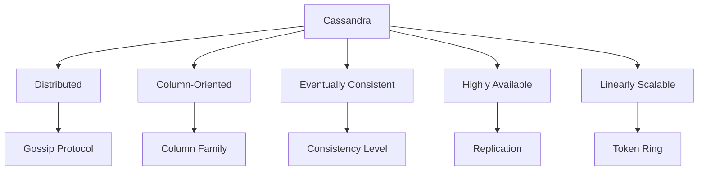
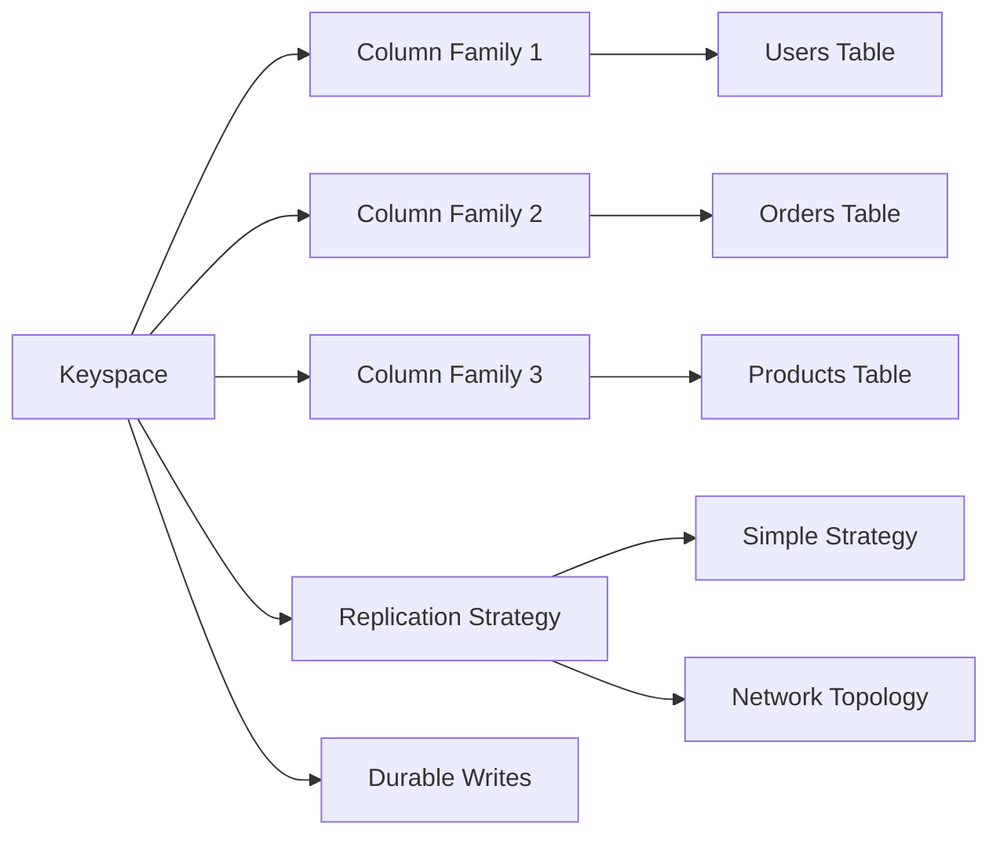
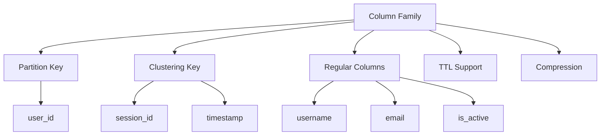
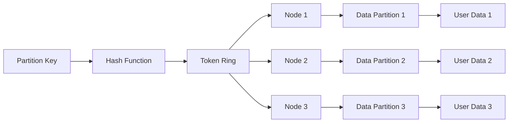
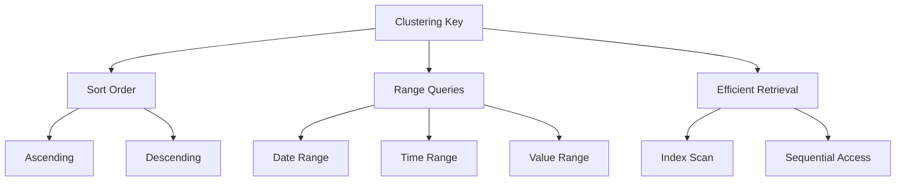

# Cassandra概念定义国际化标准示例

## 📑 目录

- [Cassandra概念定义国际化标准示例](#cassandra概念定义国际化标准示例)
  - [📑 目录](#-目录)
  - [1. 概述](#1-概述)
  - [2. 核心概念定义](#2-核心概念定义)
    - [2.1. Cassandra数据库管理系统](#21-cassandra数据库管理系统)
  - [3. 键空间（Keyspace）](#3-键空间keyspace)
  - [4. 列族（Column Family）](#4-列族column-family)
  - [5. 分区键（Partition Key）](#5-分区键partition-key)
  - [6. 聚类键（Clustering Key）](#6-聚类键clustering-key)
  - [7. 双语术语映射表](#7-双语术语映射表)
    - [7.1. 核心概念术语映射](#71-核心概念术语映射)
    - [7.2. 一致性级别术语映射](#72-一致性级别术语映射)
    - [7.3. 复制策略术语映射](#73-复制策略术语映射)
  - [8. RDF知识图谱表示](#8-rdf知识图谱表示)
  - [9. 概念映射关系](#9-概念映射关系)
  - [10. 内容质量标准与验证检查清单](#10-内容质量标准与验证检查清单)
  - [11. 总结](#11-总结)

---

## 1. 概述

本文档展示如何按照国际化Wiki标准定义Cassandra的核心概念，包括概念定义、多表示形式、双语术语映射和知识图谱集成。

## 2. 核心概念定义

### 2.1. Cassandra数据库管理系统

```yaml
# Cassandra DBMS概念定义
concept:
  name: "Cassandra"
  type: "Database Management System"
  category: "NoSQL Database"
  definition_zh: "Cassandra是一个分布式NoSQL数据库管理系统，使用列族数据模型，支持高可用性和线性扩展"
  definition_en: "Cassandra is a distributed NoSQL database management system that uses column family data model, supporting high availability and linear scalability"
  formal_definition: "Cassandra = (K, CF, PK, CK, CL, RF) where K is keyspace, CF is column family, PK is partition key, CK is clustering key, CL is consistency level, RF is replication factor"
  mathematical_notation: "Cassandra ∈ NoSQL_DBMS ∧ Cassandra ⊆ Distributed_DB"
  properties:
    - "Distributed"
    - "Column-oriented"
    - "Eventually consistent"
    - "Highly available"
    - "Linearly scalable"
    - "Fault-tolerant"
  synonyms:
    - "Apache Cassandra"
    - "Distributed Database"
    - "Column Family Database"
  antonyms:
    - "Relational Database"
    - "SQL Database"
    - "ACID Database"
  wikidata: "Q118356"
```

**多表示形式**:

```markdown
**文本描述**:
Cassandra是一个分布式NoSQL数据库管理系统，它使用列族数据模型来存储数据。Cassandra的设计理念是提供高可用性、线性扩展性和最终一致性的数据存储解决方案。

**数学表示**:
Cassandra = (K, CF, PK, CK, CL, RF)
其中：
- K: Keyspace (键空间)
- CF: Column Family (列族)
- PK: Partition Key (分区键)
- CK: Clustering Key (聚类键)
- CL: Consistency Level (一致性级别)
- RF: Replication Factor (复制因子)

**代码示例**:
```cql
-- Cassandra连接示例
CREATE KEYSPACE IF NOT EXISTS test_keyspace
WITH replication = {
    'class': 'SimpleStrategy',
    'replication_factor': 3
};

USE test_keyspace;

CREATE TABLE users (
    user_id uuid PRIMARY KEY,
    username text,
    email text,
    created_at timestamp
);
```

**图表表示**:



## 3. 键空间（Keyspace）

```yaml
# Keyspace概念定义
concept:
  name: "Keyspace"
  type: "Data Organization"
  category: "Namespace"
  definition_zh: "Cassandra中的逻辑容器，类似于关系数据库中的数据库，包含列族和复制策略配置"
  definition_en: "Logical container in Cassandra, similar to database in RDBMS, containing column families and replication strategy configuration"
  formal_definition: "Keyspace = {cf₁, cf₂, ..., cfₙ} where cfᵢ ∈ ColumnFamily"
  mathematical_notation: "Keyspace ⊆ ColumnFamily*"
  properties:
    - "Logical container"
    - "Replication configuration"
    - "Column family grouping"
    - "Strategy definition"
  synonyms:
    - "Namespace"
    - "Database"
    - "Schema"
  antonyms:
    - "Table"
    - "Column"
    - "Row"
  wikidata: "Q118356_Keyspace"
```

**多表示形式**:

```markdown
**文本描述**:
键空间是Cassandra中的逻辑容器，类似于关系数据库中的数据库。每个键空间包含多个列族，并定义复制策略和复制因子。键空间提供了数据组织的逻辑边界。

**数学表示**:
Keyspace = {cf₁, cf₂, ..., cfₙ}
其中 cfᵢ ∈ ColumnFamily, i ∈ {1, 2, ..., n}

**代码示例**:
```cql
-- 创建键空间
CREATE KEYSPACE ecommerce
WITH replication = {
    'class': 'NetworkTopologyStrategy',
    'datacenter1': 3,
    'datacenter2': 2
}
AND durable_writes = true;

-- 使用键空间
USE ecommerce;

-- 查看键空间信息
DESCRIBE KEYSPACE ecommerce;
```

**图表表示**:



## 4. 列族（Column Family）

```yaml
# Column Family概念定义
concept:
  name: "Column Family"
  type: "Data Structure"
  category: "Table"
  definition_zh: "Cassandra中的表结构，存储行和列数据，使用分区键和聚类键进行数据组织"
  definition_en: "Table structure in Cassandra that stores rows and columns, using partition key and clustering key for data organization"
  formal_definition: "ColumnFamily = {row₁, row₂, ..., rowₘ} where rowᵢ = (PK, CK, data)"
  mathematical_notation: "ColumnFamily ⊆ Row*"
  properties:
    - "Partition key"
    - "Clustering key"
    - "Column definition"
    - "TTL support"
  synonyms:
    - "Table"
    - "CF"
    - "Data Table"
  antonyms:
    - "Keyspace"
    - "Column"
    - "Index"
  wikidata: "Q118356_ColumnFamily"
```

**多表示形式**:

```markdown
**文本描述**:
列族是Cassandra中的表结构，类似于关系数据库中的表。每个列族包含多行数据，每行由分区键和聚类键组成。列族支持TTL（生存时间）和压缩等特性。

**数学表示**:
ColumnFamily = {row₁, row₂, ..., rowₘ}
其中 rowᵢ = (PK, CK, data), PK ∈ PartitionKey, CK ∈ ClusteringKey

**代码示例**:
```cql
-- 创建列族（表）
CREATE TABLE users (
    user_id uuid,
    username text,
    email text,
    created_at timestamp,
    last_login timestamp,
    is_active boolean,
    PRIMARY KEY (user_id)
);

-- 创建复合主键的列族
CREATE TABLE user_sessions (
    user_id uuid,
    session_id uuid,
    login_time timestamp,
    logout_time timestamp,
    ip_address inet,
    user_agent text,
    PRIMARY KEY (user_id, session_id)
);
```

**图表表示**:



## 5. 分区键（Partition Key）

```yaml
# Partition Key概念定义
concept:
  name: "Partition Key"
  type: "Data Key"
  category: "Primary Key"
  definition_zh: "决定数据在集群中分布位置的键，相同分区键的数据存储在同一节点上"
  definition_en: "Key that determines data distribution across cluster, data with same partition key stored on same node"
  formal_definition: "PartitionKey = hash(key_value) % token_ring_size"
  mathematical_notation: "PartitionKey ∈ TokenRing"
  properties:
    - "Hash distribution"
    - "Token assignment"
    - "Node routing"
    - "Data locality"
  synonyms:
    - "Primary Key"
    - "Hash Key"
    - "Distribution Key"
  antonyms:
    - "Clustering Key"
    - "Secondary Key"
    - "Index Key"
  wikidata: "Q118356_PartitionKey"
```

**多表示形式**:

```markdown
**文本描述**:
分区键是Cassandra中决定数据分布的关键组件。通过哈希函数将分区键值映射到令牌环上的特定位置，相同分区键的所有数据都存储在同一个节点上，确保数据局部性。

**数学表示**:
PartitionKey = hash(key_value) % token_ring_size
其中 hash: String → [0, 2^64-1]

**代码示例**:
```cql
-- 单列分区键
CREATE TABLE users (
    user_id uuid PRIMARY KEY,  -- 分区键
    username text,
    email text
);

-- 复合分区键
CREATE TABLE user_posts (
    user_id uuid,
    post_id uuid,
    title text,
    content text,
    created_at timestamp,
    PRIMARY KEY ((user_id, post_id))  -- 复合分区键
);

-- 查询分区键
SELECT * FROM users WHERE user_id = 123e4567-e89b-12d3-a456-426614174000;
```

**图表表示**:



## 6. 聚类键（Clustering Key）

```yaml
# Clustering Key概念定义
concept:
  name: "Clustering Key"
  type: "Data Key"
  category: "Secondary Key"
  definition_zh: "决定分区内数据排序的键，支持范围查询和高效的数据检索"
  definition_en: "Key that determines data ordering within partition, supporting range queries and efficient data retrieval"
  formal_definition: "ClusteringKey = (ck₁, ck₂, ..., ckₙ) where ckᵢ ∈ Column"
  mathematical_notation: "ClusteringKey ⊆ Column*"
  properties:
    - "Sorting order"
    - "Column ordering"
    - "Range queries"
    - "Efficient retrieval"
  synonyms:
    - "Sort Key"
    - "Ordering Key"
    - "Secondary Key"
  antonyms:
    - "Partition Key"
    - "Primary Key"
    - "Hash Key"
  wikidata: "Q118356_ClusteringKey"
```

**多表示形式**:

```markdown
**文本描述**:
聚类键用于决定分区内数据的排序顺序。它支持范围查询和高效的数据检索，可以指定升序或降序排列。聚类键通常用于时间序列数据或需要排序的场景。

**数学表示**:
ClusteringKey = (ck₁, ck₂, ..., ckₙ)
其中 ckᵢ ∈ Column, order(ckᵢ) ∈ {ASC, DESC}

**代码示例**:
```cql
-- 单列聚类键
CREATE TABLE user_sessions (
    user_id uuid,
    session_id uuid,
    login_time timestamp,
    logout_time timestamp,
    PRIMARY KEY (user_id, session_id)  -- user_id是分区键，session_id是聚类键
);

-- 多列聚类键
CREATE TABLE user_activities (
    user_id uuid,
    activity_date date,
    activity_time timestamp,
    activity_type text,
    activity_data text,
    PRIMARY KEY (user_id, activity_date, activity_time)
) WITH CLUSTERING ORDER BY (activity_date DESC, activity_time DESC);

-- 范围查询
SELECT * FROM user_activities
WHERE user_id = 123e4567-e89b-12d3-a456-426614174000
AND activity_date >= '2023-01-01'
AND activity_date <= '2023-01-31';
```

**图表表示**:



## 7. 双语术语映射表

### 7.1. 核心概念术语映射

| 中文术语 | 英文术语 | 定义 | Wikidata ID |
|---------|---------|------|-------------|
| Cassandra | Cassandra | 分布式NoSQL数据库管理系统 | Q118356 |
| 键空间 | Keyspace | Cassandra中的逻辑容器 | Q118356_Keyspace |
| 列族 | Column Family | Cassandra中的表结构 | Q118356_ColumnFamily |
| 分区键 | Partition Key | 决定数据分布的键 | Q118356_PartitionKey |
| 聚类键 | Clustering Key | 决定数据排序的键 | Q118356_ClusteringKey |
| 一致性级别 | Consistency Level | 读写一致性配置 | Q118356_ConsistencyLevel |
| 复制因子 | Replication Factor | 数据复制数量 | Q118356_ReplicationFactor |
| SSTable | SSTable | 排序字符串表 | Q118356_SSTable |
| 内存表 | MemTable | 内存写入缓冲区 | Q118356_MemTable |
| 提交日志 | Commit Log | 持久化写入日志 | Q118356_CommitLog |

### 7.2. 一致性级别术语映射

| 中文术语 | 英文术语 | 描述 | 节点要求 |
|---------|---------|------|----------|
| ONE | ONE | 只需要一个副本响应 | 1个节点 |
| QUORUM | QUORUM | 需要多数副本响应 | ceil(RF/2) + 1 |
| ALL | ALL | 需要所有副本响应 | RF个节点 |
| LOCAL_QUORUM | LOCAL_QUORUM | 本地数据中心多数响应 | ceil(RF_local/2) + 1 |
| EACH_QUORUM | EACH_QUORUM | 每个数据中心多数响应 | 每个数据中心多数 |

### 7.3. 复制策略术语映射

| 中文术语 | 英文术语 | 描述 | 适用场景 |
|---------|---------|------|----------|
| 简单策略 | Simple Strategy | 单数据中心复制 | 开发环境 |
| 网络拓扑策略 | Network Topology Strategy | 多数据中心复制 | 生产环境 |
| 旧网络拓扑策略 | Old Network Topology Strategy | 兼容旧版本 | 迁移场景 |

## 8. RDF知识图谱表示

```turtle
# Cassandra概念知识图谱
@prefix rdf: <http://www.w3.org/1999/02/22-rdf-syntax-ns#> .
@prefix rdfs: <http://www.w3.org/2000/01/rdf-schema#> .
@prefix wd: <http://www.wikidata.org/entity/> .
@prefix wdt: <http://www.wikidata.org/prop/direct/> .
@prefix schema: <http://schema.org/> .

# Cassandra主实体
wd:Q118356 rdfs:label "Apache Cassandra"@en, "Apache Cassandra"@zh ;
    rdfs:description "Distributed NoSQL database management system"@en, "分布式NoSQL数据库管理系统"@zh ;
    wdt:P31 wd:Q7397 ;
    wdt:P178 wd:Q124 ;
    wdt:P856 "https://cassandra.apache.org" ;
    wdt:P1195 wd:Q2063 ;
    wdt:P277 wd:Q251 ;
    schema:programmingLanguage "Java" ;
    schema:license "Apache License 2.0" .

# 键空间概念
wd:Q118356_Keyspace rdfs:label "Keyspace"@en, "键空间"@zh ;
    rdfs:description "Logical container in Cassandra"@en, "Cassandra中的逻辑容器"@zh ;
    wdt:P31 wd:Q118356 ;
    wdt:P279 wd:Q118356 ;
    wdt:P527 wd:Q118356_ColumnFamily .

# 列族概念
wd:Q118356_ColumnFamily rdfs:label "Column Family"@en, "列族"@zh ;
    rdfs:description "Table structure in Cassandra"@en, "Cassandra中的表结构"@zh ;
    wdt:P31 wd:Q118356 ;
    wdt:P279 wd:Q118356 ;
    wdt:P527 wd:Q118356_PartitionKey ;
    wdt:P527 wd:Q118356_ClusteringKey .

# 分区键概念
wd:Q118356_PartitionKey rdfs:label "Partition Key"@en, "分区键"@zh ;
    rdfs:description "Key that determines data distribution"@en, "决定数据分布的键"@zh ;
    wdt:P31 wd:Q118356 ;
    wdt:P279 wd:Q118356 ;
    wdt:P527 wd:Q118356_ColumnFamily .

# 聚类键概念
wd:Q118356_ClusteringKey rdfs:label "Clustering Key"@en, "聚类键"@zh ;
    rdfs:description "Key that determines data ordering"@en, "决定数据排序的键"@zh ;
    wdt:P31 wd:Q118356 ;
    wdt:P279 wd:Q118356 ;
    wdt:P527 wd:Q118356_ColumnFamily .

# 一致性级别概念
wd:Q118356_ConsistencyLevel rdfs:label "Consistency Level"@en, "一致性级别"@zh ;
    rdfs:description "Consistency configuration in Cassandra"@en, "Cassandra中的一致性配置"@zh ;
    wdt:P31 wd:Q118356 ;
    wdt:P279 wd:Q118356 ;
    wdt:P527 wd:Q118356_ONE ;
    wdt:P527 wd:Q118356_QUORUM ;
    wdt:P527 wd:Q118356_ALL .

# SSTable概念
wd:Q118356_SSTable rdfs:label "SSTable"@en, "SSTable"@zh ;
    rdfs:description "Sorted String Table storage format"@en, "排序字符串表存储格式"@zh ;
    wdt:P31 wd:Q118356 ;
    wdt:P279 wd:Q118356 ;
    wdt:P527 wd:Q118356_ColumnFamily .

# MemTable概念
wd:Q118356_MemTable rdfs:label "MemTable"@en, "内存表"@zh ;
    rdfs:description "In-memory write buffer"@en, "内存写入缓冲区"@zh ;
    wdt:P31 wd:Q118356 ;
    wdt:P279 wd:Q118356 ;
    wdt:P527 wd:Q118356_ColumnFamily .

# 提交日志概念
wd:Q118356_CommitLog rdfs:label "Commit Log"@en, "提交日志"@zh ;
    rdfs:description "Persistent write log"@en, "持久化写入日志"@zh ;
    wdt:P31 wd:Q118356 ;
    wdt:P279 wd:Q118356 ;
    wdt:P527 wd:Q118356_ColumnFamily .
```

## 9. 概念映射关系

```yaml
# Cassandra概念映射关系
concept_mapping_relations:
  cassandra_core:
    cassandra:
      - keyspace: "包含"
      - column_family: "组织"
      - partition_key: "使用"
      - clustering_key: "支持"
      - consistency_level: "配置"
      - replication_factor: "设置"

  keyspace_related:
    keyspace:
      - column_family: "包含"
      - replication_strategy: "定义"
      - replication_factor: "配置"
      - cassandra: "属于"

  column_family_related:
    column_family:
      - partition_key: "使用"
      - clustering_key: "使用"
      - regular_columns: "包含"
      - sstable: "存储为"
      - memtable: "使用"
      - keyspace: "属于"

  partition_key_related:
    partition_key:
      - hash_function: "使用"
      - token_ring: "映射到"
      - node: "分配到"
      - column_family: "定义"
      - data_distribution: "决定"

  clustering_key_related:
    clustering_key:
      - sort_order: "定义"
      - range_queries: "支持"
      - column_family: "定义"
      - data_ordering: "决定"
      - efficient_retrieval: "提供"

  storage_related:
    sstable:
      - column_family: "存储"
      - compression: "使用"
      - bloom_filter: "包含"
      - immutable: "不可变"

    memtable:
      - column_family: "缓冲"
      - memory: "在内存中"
      - mutable: "可变"
      - flush: "刷新到SSTable"

    commit_log:
      - write_operations: "记录"
      - durability: "保证"
      - recovery: "用于恢复"
```

## 10. 内容质量标准与验证检查清单

```yaml
# Cassandra概念定义质量标准
quality_standards:
  accuracy:
    description: "概念定义准确性和技术正确性"
    criteria:
      - "Cassandra概念定义准确无误"
      - "技术细节正确"
      - "示例代码可执行"
      - "数学表示正确"
    weight: 0.3

  completeness:
    description: "概念覆盖完整性和全面性"
    criteria:
      - "Cassandra核心概念完整覆盖"
      - "多表示形式齐全"
      - "双语术语映射完整"
      - "知识图谱关系完整"
    weight: 0.25

  clarity:
    description: "表达清晰性和可理解性"
    criteria:
      - "语言表达清晰"
      - "逻辑结构合理"
      - "图表说明清楚"
      - "术语使用一致"
    weight: 0.2

  consistency:
    description: "内容一致性和规范性"
    criteria:
      - "术语使用一致"
      - "格式规范统一"
      - "引用标准一致"
      - "风格保持统一"
    weight: 0.15

  relevance:
    description: "内容相关性和实用性"
    criteria:
      - "符合Cassandra实际"
      - "具有实用价值"
      - "反映最新技术"
      - "解决实际问题"
    weight: 0.1

# 验证检查清单
validation_checklist:
  concept_definition:
    - "Cassandra概念名称是否准确"
    - "中英文定义是否完整"
    - "形式化定义是否正确"
    - "数学表示是否规范"
    - "属性描述是否全面"
    - "同义词反义词是否准确"
    - "Wikidata映射是否正确"

  mathematical_content:
    - "LaTeX语法是否正确"
    - "数学符号是否规范"
    - "公式推导是否合理"
    - "符号定义是否清晰"

  code_examples:
    - "CQL代码语法是否正确"
    - "示例是否可执行"
    - "注释是否清晰"
    - "最佳实践是否体现"

  diagrams:
    - "架构图是否清晰"
    - "关系是否正确"
    - "标签是否准确"
    - "布局是否合理"

  terminology:
    - "术语使用是否一致"
    - "双语映射是否准确"
    - "专业术语是否规范"
    - "新术语是否定义"

  knowledge_graph:
    - "RDF三元组是否正确"
    - "实体关系是否准确"
    - "Wikidata对齐是否正确"
    - "概念映射是否完整"
```

## 11. 总结

本文档展示了Cassandra概念定义的国际化Wiki标准示例，包括：

1. **标准概念定义**: 建立了Cassandra、Keyspace、Column Family、Partition Key、Clustering Key等核心概念的标准定义
2. **多表示形式**: 提供了文本、数学、代码、图表等多种表示方式
3. **双语术语映射**: 实现了中英文术语的完整映射表
4. **知识图谱集成**: 建立了RDF三元组表示和概念映射关系
5. **质量标准**: 定义了内容质量标准和验证检查清单

这些示例为Cassandra知识内容的标准化和国际化提供了具体的实施指导，确保了内容的学术严谨性、一致性和可访问性。
