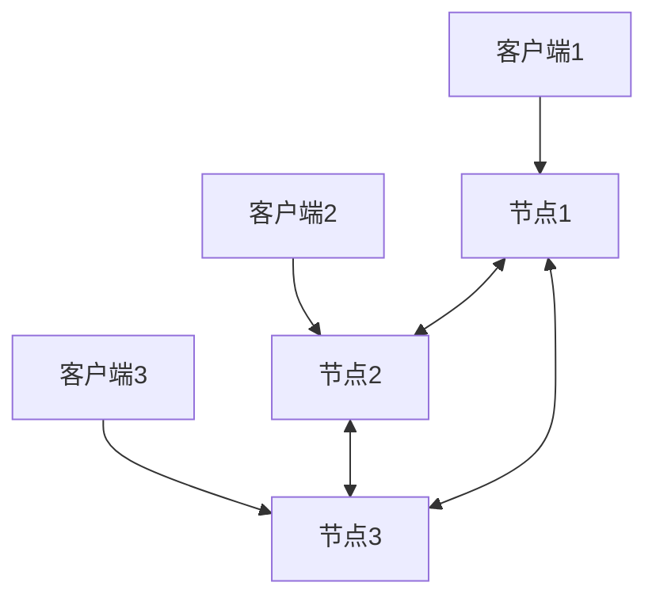
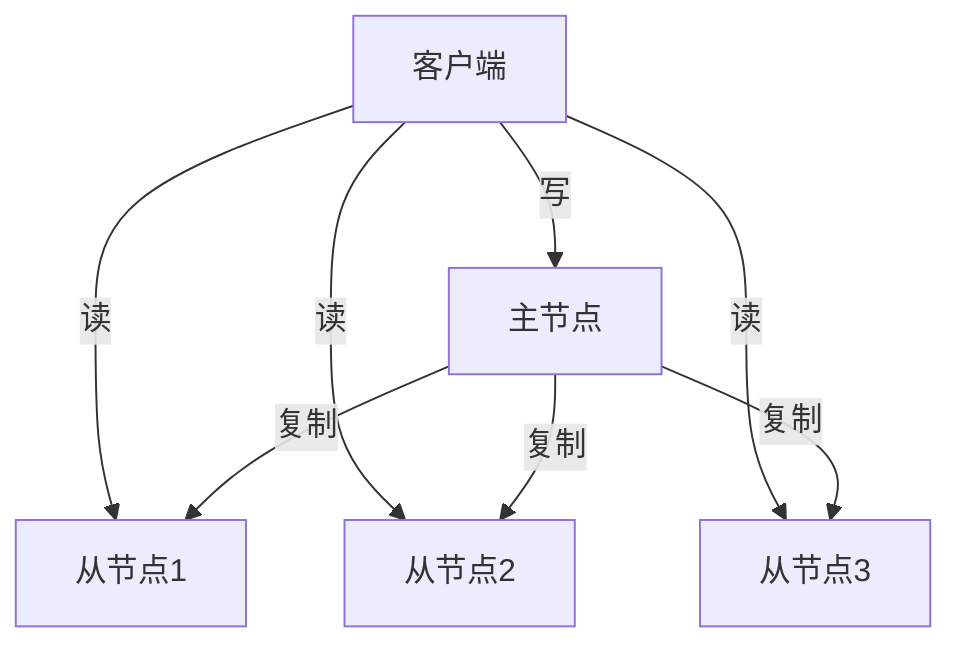
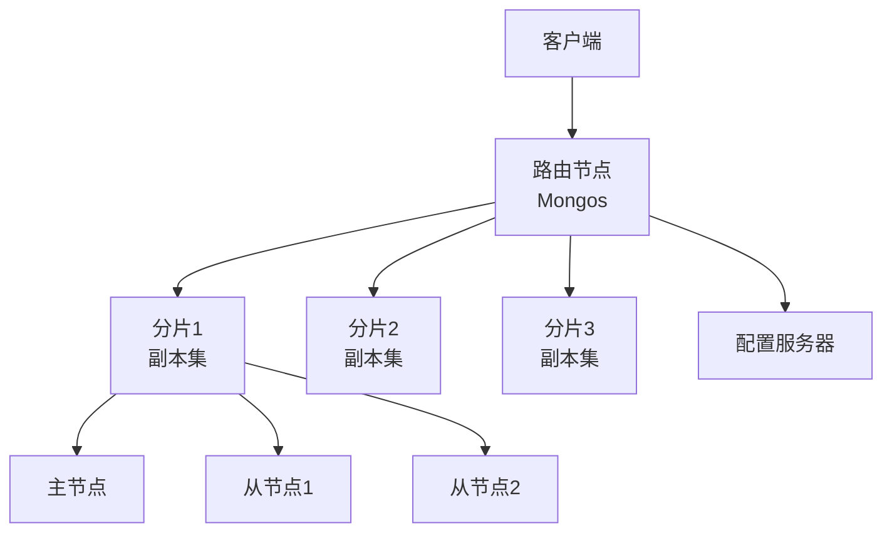
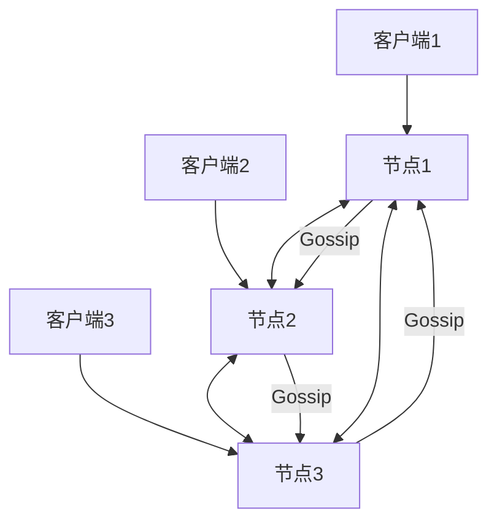
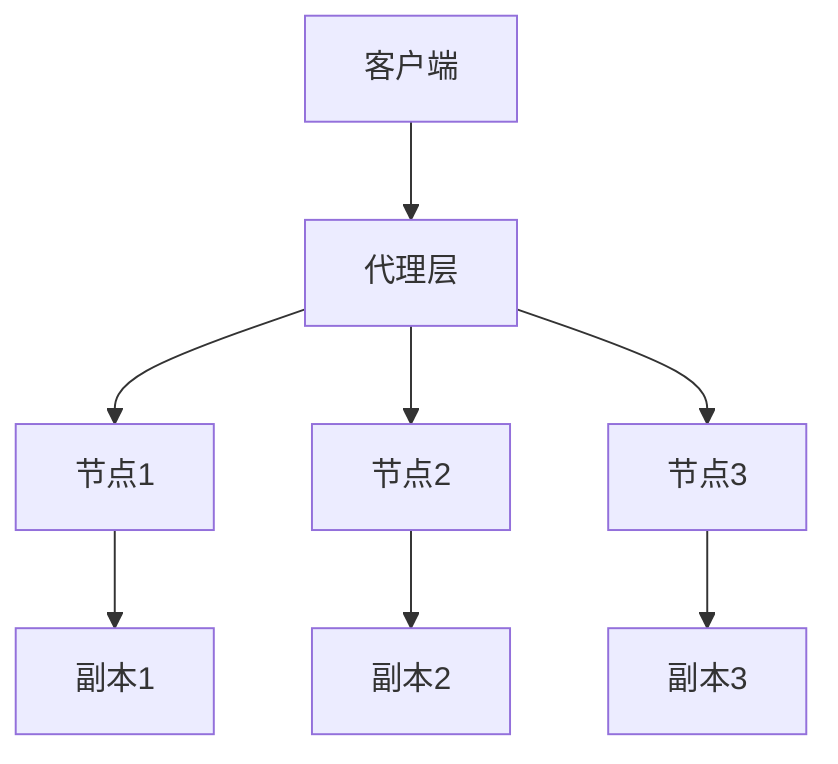

# 1.3.2 NoSQL系统架构

## 📑 目录

- [1.3.2 NoSQL系统架构](#132-nosql系统架构)
  - [📑 目录](#-目录)
  - [1. 概述](#1-概述)
    - [1.1. NoSQL架构特点](#11-nosql架构特点)
    - [1.2. 架构设计原则](#12-架构设计原则)
  - [2. 分布式架构](#2-分布式架构)
    - [2.1. 无中心架构](#21-无中心架构)
      - [2.1.1. 无中心架构定义](#211-无中心架构定义)
      - [2.1.2. 无中心架构实现](#212-无中心架构实现)
    - [2.2. 主从架构](#22-主从架构)
      - [2.2.1. 主从架构定义](#221-主从架构定义)
      - [2.2.2. 主从架构实现](#222-主从架构实现)
    - [2.3. 混合架构](#23-混合架构)
      - [2.3.1. 混合架构定义](#231-混合架构定义)
  - [3. 数据分片](#3-数据分片)
    - [3.1. 分片策略](#31-分片策略)
      - [3.1.1. 分片策略类型](#311-分片策略类型)
    - [3.2. 分片算法](#32-分片算法)
      - [3.2.1. 哈希分片](#321-哈希分片)
      - [3.2.2. 一致性哈希](#322-一致性哈希)
    - [3.3. 分片管理](#33-分片管理)
      - [3.3.1. 分片路由](#331-分片路由)
  - [4. 数据复制](#4-数据复制)
    - [4.1. 复制策略](#41-复制策略)
      - [4.1.1. 复制策略类型](#411-复制策略类型)
    - [4.2. 复制协议](#42-复制协议)
      - [4.2.1. 异步复制](#421-异步复制)
      - [4.2.2. 同步复制](#422-同步复制)
    - [4.3. 副本一致性](#43-副本一致性)
      - [4.3.1. 一致性级别](#431-一致性级别)
  - [5. 实际系统架构](#5-实际系统架构)
    - [5.1. MongoDB架构](#51-mongodb架构)
      - [5.1.1. MongoDB分片集群](#511-mongodb分片集群)
    - [5.2. Cassandra架构](#52-cassandra架构)
      - [5.2.1. Cassandra无中心架构](#521-cassandra无中心架构)
    - [5.3. Redis架构](#53-redis架构)
      - [5.3.1. Redis集群架构](#531-redis集群架构)
  - [6. 高可用性设计](#6-高可用性设计)
    - [6.1. 故障检测](#61-故障检测)
      - [6.1.1. 心跳检测](#611-心跳检测)
    - [6.2. 故障恢复](#62-故障恢复)
      - [6.2.1. 自动故障转移](#621-自动故障转移)
    - [6.3. 负载均衡](#63-负载均衡)
      - [6.3.1. 负载均衡策略](#631-负载均衡策略)
  - [7. 实际应用案例](#7-实际应用案例)
    - [7.1. 大数据行业：Cassandra分布式架构](#71-大数据行业cassandra分布式架构)
    - [7.2. 互联网行业：MongoDB分片集群](#72-互联网行业mongodb分片集群)
  - [8. 形式化定义](#8-形式化定义)
    - [8.1. 分片形式化](#81-分片形式化)
    - [8.2. 复制形式化](#82-复制形式化)
  - [9. 多表征](#9-多表征)
  - [10. 总结与展望](#10-总结与展望)
    - [10.1. 总结](#101-总结)
    - [10.2. 发展趋势](#102-发展趋势)

---

## 1. 概述

### 1.1. NoSQL架构特点

**NoSQL系统架构特点**：

1. **横向扩展**：支持水平扩展，节点可动态增减
2. **分布式设计**：天然分布式架构
3. **高可用性**：通过复制和分片保证高可用
4. **无单点故障**：消除单点故障

### 1.2. 架构设计原则

**NoSQL架构设计原则**：

1. **可扩展性**：易于水平扩展
2. **可用性**：高可用性设计
3. **一致性**：根据需求选择一致性级别
4. **性能**：高性能设计

---

## 2. 分布式架构

### 2.1. 无中心架构

#### 2.1.1. 无中心架构定义

**无中心架构（Peer-to-Peer）**：所有节点地位平等，无中心节点。

**特点**：

- **无单点故障**：无中心节点，无单点故障
- **高可用性**：节点故障不影响整体服务
- **负载均衡**：负载均匀分布

**架构图**：



#### 2.1.2. 无中心架构实现

**Gossip协议**：

节点间通过Gossip协议交换信息：

```python
class GossipNode:
    def __init__(self, node_id, nodes):
        self.node_id = node_id
        self.nodes = nodes
        self.state = {}

    def gossip(self):
        """Gossip协议"""
        # 随机选择节点
        target = random.choice(self.nodes)

        # 交换状态
        target.receive_state(self.state)
        self.state.update(target.get_state())

    def receive_state(self, other_state):
        """接收其他节点状态"""
        self.state.update(other_state)
```

### 2.2. 主从架构

#### 2.2.1. 主从架构定义

**主从架构（Master-Slave）**：一个主节点，多个从节点。

**特点**：

- **主节点**：负责写操作
- **从节点**：负责读操作和复制
- **故障转移**：主节点故障时，从节点可提升为主节点

**架构图**：



#### 2.2.2. 主从架构实现

**MongoDB副本集**：

```javascript
// 初始化副本集
rs.initiate({
  _id: "rs0",
  members: [
    { _id: 0, host: "mongodb1:27017" },
    { _id: 1, host: "mongodb2:27017" },
    { _id: 2, host: "mongodb3:27017" }
  ]
})

// 查看状态
rs.status()
```

### 2.3. 混合架构

#### 2.3.1. 混合架构定义

**混合架构**：结合无中心和主从架构的优点。

**特点**：

- **分片层**：无中心架构
- **副本层**：主从架构
- **灵活性**：根据需求选择架构

---

## 3. 数据分片

### 3.1. 分片策略

#### 3.1.1. 分片策略类型

**分片策略**：

1. **哈希分片**：根据键的哈希值分片
2. **范围分片**：根据键的范围分片
3. **目录分片**：使用目录表分片
4. **一致性哈希**：使用一致性哈希分片

**分片策略对比**：

| 策略 | 优点 | 缺点 | 适用场景 |
|------|------|------|----------|
| **哈希分片** | 均匀分布 | 范围查询困难 | 键值存储 |
| **范围分片** | 范围查询高效 | 可能热点 | 有序数据 |
| **目录分片** | 灵活 | 目录表瓶颈 | 复杂场景 |
| **一致性哈希** | 动态扩展 | 实现复杂 | 大规模系统 |

### 3.2. 分片算法

#### 3.2.1. 哈希分片

**哈希分片算法**：

$$shard\_id = hash(key) \bmod num\_shards$$

**实现**：

```python
class HashSharding:
    def __init__(self, num_shards):
        self.num_shards = num_shards

    def get_shard(self, key):
        """获取分片ID"""
        return hash(key) % self.num_shards

    def route(self, key):
        """路由到分片"""
        shard_id = self.get_shard(key)
        return f"shard_{shard_id}"
```

#### 3.2.2. 一致性哈希

**一致性哈希算法**：

```python
import hashlib

class ConsistentHash:
    def __init__(self, nodes, replicas=3):
        self.replicas = replicas
        self.ring = {}
        self.sorted_keys = []

        for node in nodes:
            for i in range(replicas):
                key = self._hash(f"{node}:{i}")
                self.ring[key] = node
                self.sorted_keys.append(key)

        self.sorted_keys.sort()

    def _hash(self, key):
        """哈希函数"""
        return int(hashlib.md5(key.encode()).hexdigest(), 16)

    def get_node(self, key):
        """获取节点"""
        hash_key = self._hash(key)

        # 查找第一个大于等于hash_key的节点
        for ring_key in self.sorted_keys:
            if ring_key >= hash_key:
                return self.ring[ring_key]

        # 如果没有找到，返回第一个节点
        return self.ring[self.sorted_keys[0]]
```

### 3.3. 分片管理

#### 3.3.1. 分片路由

**分片路由**：

```python
class ShardRouter:
    def __init__(self, shards):
        self.shards = shards
        self.sharding = HashSharding(len(shards))

    def route(self, key):
        """路由到分片"""
        shard_id = self.sharding.get_shard(key)
        return self.shards[shard_id]

    def route_range(self, start_key, end_key):
        """路由范围查询"""
        # 范围查询可能需要访问多个分片
        shards = set()
        for key in [start_key, end_key]:
            shards.add(self.route(key))
        return list(shards)
```

---

## 4. 数据复制

### 4.1. 复制策略

#### 4.1.1. 复制策略类型

**复制策略**：

1. **主从复制**：主节点写入，从节点复制
2. **多主复制**：多个主节点，相互复制
3. **链式复制**：链式复制结构

**复制策略对比**：

| 策略 | 优点 | 缺点 | 适用场景 |
|------|------|------|----------|
| **主从复制** | 简单、一致性好 | 主节点瓶颈 | 读多写少 |
| **多主复制** | 高可用、负载均衡 | 冲突解决复杂 | 多区域部署 |
| **链式复制** | 高效、一致性好 | 链断裂影响大 | 大规模系统 |

### 4.2. 复制协议

#### 4.2.1. 异步复制

**异步复制**：

```python
class AsyncReplication:
    def __init__(self, master, slaves):
        self.master = master
        self.slaves = slaves

    def write(self, key, value):
        """写入主节点"""
        self.master.write(key, value)

        # 异步复制到从节点
        for slave in self.slaves:
            slave.async_replicate(key, value)

    def read(self, key):
        """从主节点读取"""
        return self.master.read(key)
```

#### 4.2.2. 同步复制

**同步复制**：

```python
class SyncReplication:
    def __init__(self, nodes, quorum):
        self.nodes = nodes
        self.quorum = quorum

    def write(self, key, value):
        """同步写入多数节点"""
        success_count = 0
        for node in self.nodes:
            if node.write(key, value):
                success_count += 1
                if success_count >= self.quorum:
                    return True
        return False
```

### 4.3. 副本一致性

#### 4.3.1. 一致性级别

**副本一致性级别**：

1. **强一致性**：所有副本同步更新
2. **最终一致性**：最终达到一致状态
3. **会话一致性**：同一会话内一致

**一致性计算**：

$$\text{可用性} = 1 - (1-p)^n$$

其中 $p$ 是单节点可用性，$n$ 是副本数。

---

## 5. 实际系统架构

### 5.1. MongoDB架构

#### 5.1.1. MongoDB分片集群

**MongoDB分片集群架构**：



**配置示例**：

```yaml
# 分片配置
sharding:
  clusterRole: shardsvr

# 副本集配置
replication:
  replSetName: rs0
```

### 5.2. Cassandra架构

#### 5.2.1. Cassandra无中心架构

**Cassandra架构**：



**配置示例**：

```yaml
# Cassandra配置
cluster_name: 'MyCluster'
num_tokens: 256
seed_provider:
  - class_name: org.apache.cassandra.locator.SimpleSeedProvider
    parameters:
      - seeds: "node1,node2,node3"
```

### 5.3. Redis架构

#### 5.3.1. Redis集群架构

**Redis集群架构**：



**配置示例**：

```yaml
# Redis集群配置
cluster-enabled yes
cluster-config-file nodes.conf
cluster-node-timeout 5000
```

---

## 6. 高可用性设计

### 6.1. 故障检测

#### 6.1.1. 心跳检测

**心跳检测**：

```python
class HeartbeatMonitor:
    def __init__(self, nodes, timeout=5):
        self.nodes = nodes
        self.timeout = timeout
        self.last_heartbeat = {}

    def check_heartbeat(self):
        """检查心跳"""
        for node in self.nodes:
            if node.is_alive():
                self.last_heartbeat[node.id] = time.time()
            else:
                if time.time() - self.last_heartbeat.get(node.id, 0) > self.timeout:
                    self.handle_failure(node)

    def handle_failure(self, node):
        """处理节点故障"""
        # 标记节点为故障
        node.mark_failed()

        # 触发故障转移
        self.trigger_failover(node)
```

### 6.2. 故障恢复

#### 6.2.1. 自动故障转移

**自动故障转移**：

```python
class FailoverManager:
    def __init__(self, master, slaves):
        self.master = master
        self.slaves = slaves

    def failover(self):
        """故障转移"""
        if not self.master.is_alive():
            # 选择新的主节点
            new_master = self.elect_master()

            # 提升为主节点
            new_master.promote_to_master()

            # 更新配置
            self.update_config(new_master)
```

### 6.3. 负载均衡

#### 6.3.1. 负载均衡策略

**负载均衡策略**：

1. **轮询**：依次分配请求
2. **加权轮询**：根据权重分配
3. **最少连接**：分配给连接数最少的节点
4. **一致性哈希**：根据键哈希分配

**实现**：

```python
class LoadBalancer:
    def __init__(self, nodes):
        self.nodes = nodes
        self.current = 0

    def get_node(self):
        """获取节点（轮询）"""
        node = self.nodes[self.current]
        self.current = (self.current + 1) % len(self.nodes)
        return node

    def get_node_by_key(self, key):
        """根据键获取节点（一致性哈希）"""
        hash_value = hash(key)
        return self.nodes[hash_value % len(self.nodes)]
```

---

## 7. 实际应用案例

### 7.1. 大数据行业：Cassandra分布式架构

**场景**：

- 大规模数据存储
- 高可用性要求
- 最终一致性可接受

**架构**：


### 7.2. 互联网行业：MongoDB分片集群

**场景**：

- 大规模Web应用
- 读写分离
- 水平扩展

**架构**：

- 分片层：数据分片
- 副本层：数据复制
- 路由层：查询路由

---

## 8. 形式化定义

### 8.1. 分片形式化

**分片定义**：

设分片函数 $f: K \to S$，其中 $K$ 是键集合，$S$ 是分片集合。

**一致性哈希形式化**：

$$f(k) = \arg\min_{s \in S} \{hash(s) \geq hash(k)\}$$

### 8.2. 复制形式化

**复制定义**：

设复制函数 $R: D \to 2^N$，其中 $D$ 是数据集合，$N$ 是节点集合。

**副本一致性**：

$$\forall n_1, n_2 \in R(d): \text{Read}(n_1, d) = \text{Read}(n_2, d)$$

---

## 9. 多表征

本主题支持多种表征方式：

1. **符号表征**：形式化定义、数学公式
2. **图结构**：架构图、流程图
3. **代码实现**：架构实现代码
4. **自然语言**：概念定义、架构描述
5. **可视化**：架构可视化、监控可视化

---

## 10. 总结与展望

### 10.1. 总结

NoSQL系统架构的核心要点：

1. **分布式架构**：无中心、主从、混合架构
2. **数据分片**：哈希、范围、一致性哈希分片
3. **数据复制**：主从、多主、链式复制
4. **高可用性**：故障检测、故障恢复、负载均衡

### 10.2. 发展趋势

**未来发展方向**：

1. **云原生架构**：容器化、微服务化
2. **智能调度**：AI驱动的资源调度
3. **自动扩展**：自动扩展和收缩

---

**参考文献**：

1. DeCandia, G., et al. (2007). "Dynamo: Amazon's Highly Available Key-value Store"
2. Lakshman, A., & Malik, P. (2010). "Cassandra: A Decentralized Structured Storage System"

---

[返回NoSQL导航](README.md)
