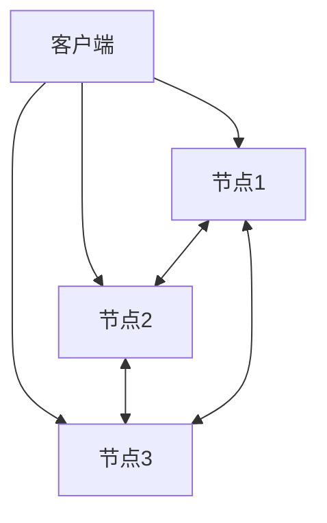

# 1.3.2 系统架构

## 1. 分布式架构

- 支持横向扩展，节点可动态增减。
- 典型架构：分片、复制、无中心节点。

## 2. 数据分片与副本

- 分片：按键、范围、哈希等方式分布数据。
- 副本：提升高可用与容错能力。

| 架构特性 | 说明 | 适用场景 |
|----------|------|----------|
| 分片     | 水平扩展 | 大数据量 |
| 副本     | 容错高可用 | 关键业务 |
| 无中心   | 消除单点故障 | 云原生 |

## 3. 行业案例与多表征

### 3.1. 大数据行业：Cassandra分布式架构



### 3.2. 互联网行业：MongoDB分片集群

- 见[3.5.7-数据存储与访问](../../3-数据模型与算法/3.5-数据分析与ETL/3.5.7-数据存储与访问.md)

### 3.3. Latex公式

$$
\text{副本数} = n,\ \text{可用性} = 1 - (1-p)^n
$$

### 3.4. 配置示例

```yaml
replication:
  replSetName: rs0
sharding:
  clusterRole: shardsvr
```

[返回NoSQL导航](README.md)
