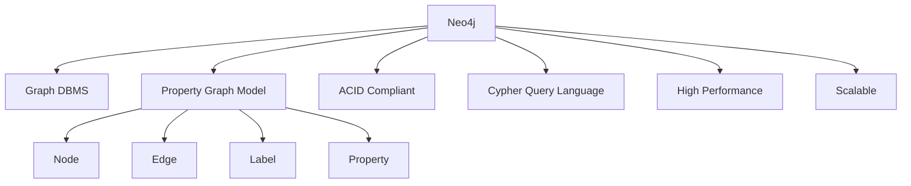
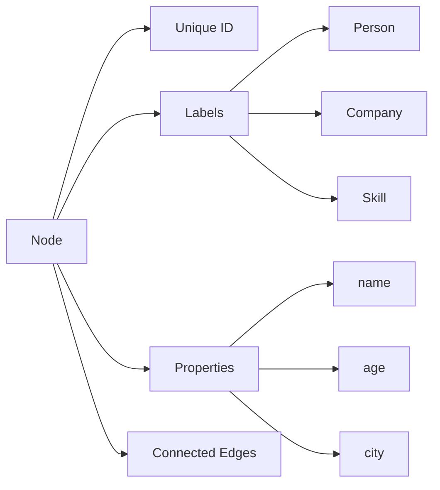
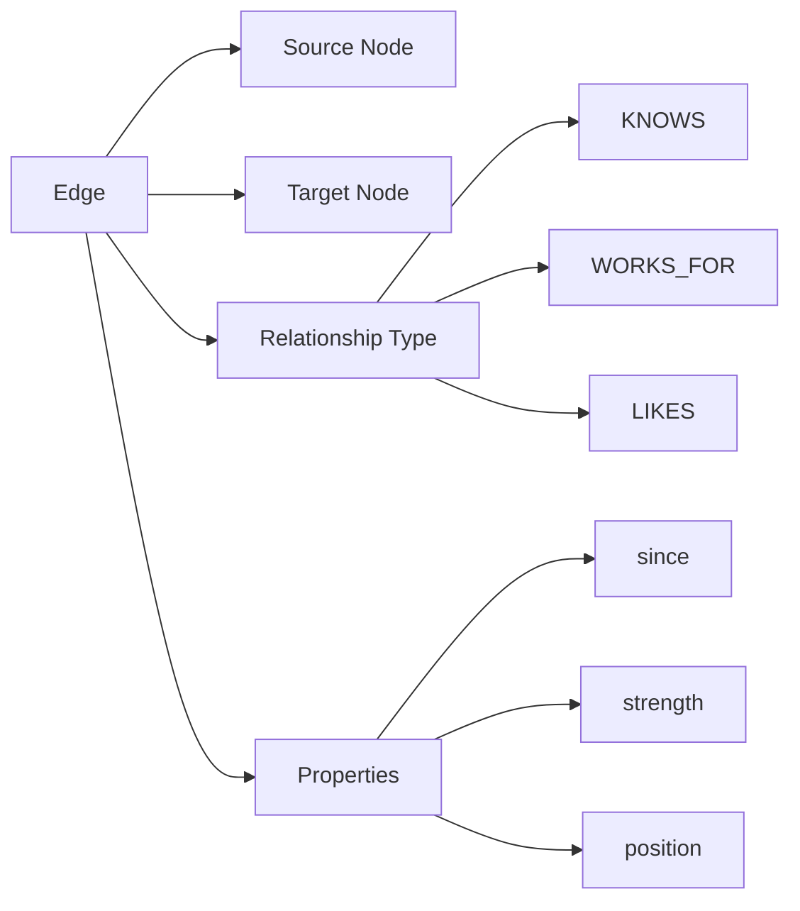
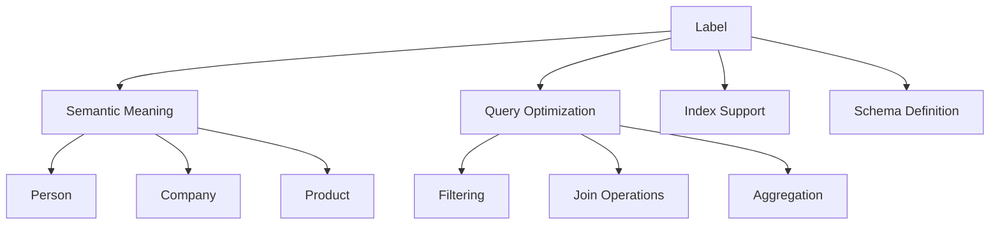
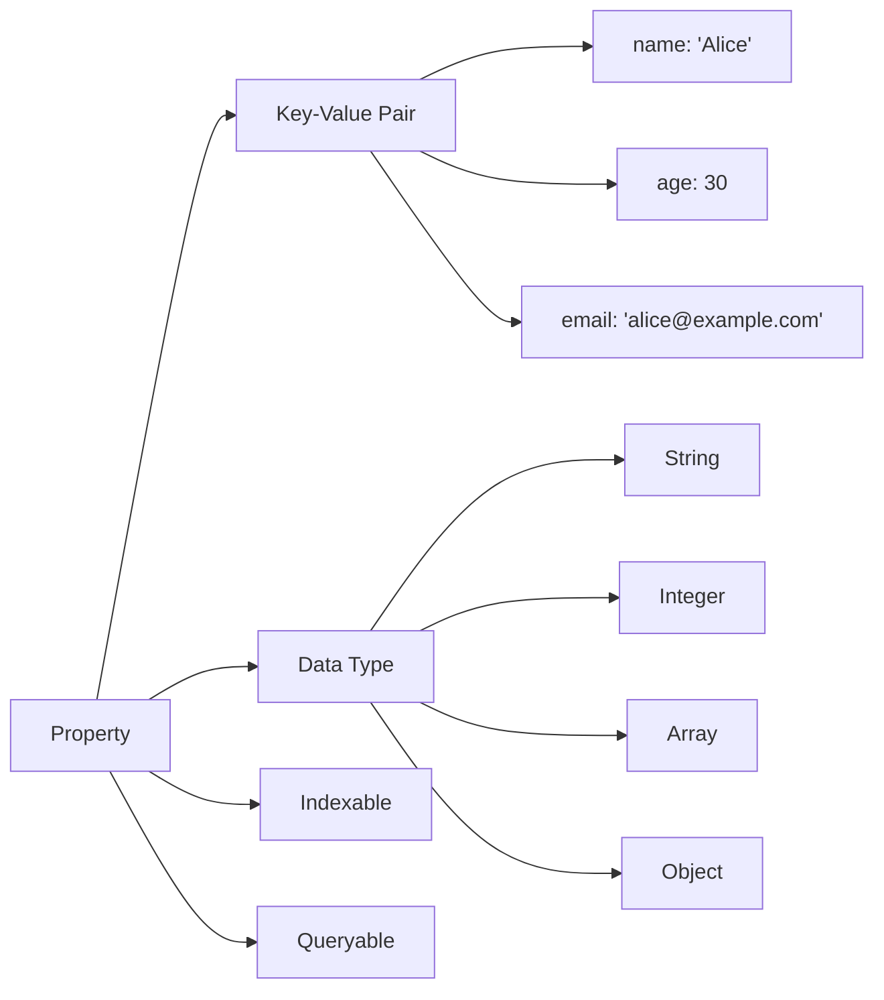
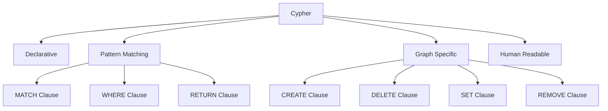

# Neo4j概念定义国际化标准示例

## 1. 概述

本文档提供Neo4j图数据库核心概念的国际化标准定义示例，遵循国际化Wiki标准，包含多表示形式、双语术语映射和知识图谱集成。

## 2. 核心概念定义

### 2.1. Neo4j DBMS

```yaml
# Neo4j DBMS概念定义
concept:
  name: "Neo4j"
  type: "Graph Database Management System"
  category: "NoSQL Database"
  definition_zh: "Neo4j是一个原生图数据库管理系统，使用属性图模型存储和查询数据，支持ACID事务和高性能图遍历"
  definition_en: "Neo4j is a native graph database management system that uses property graph model for data storage and querying, supporting ACID transactions and high-performance graph traversal"
  formal_definition: "Neo4j = (N, E, P, L, T) where N is nodes, E is edges, P is properties, L is labels, T is transactions"
  mathematical_notation: "Neo4j ∈ Graph_DBMS ∧ Neo4j ⊆ NoSQL_DB ∧ Neo4j ⊆ ACID_Compliant"
  properties:
    - "Native Graph"
    - "Property Graph Model"
    - "ACID Compliant"
    - "Schema Optional"
    - "High Performance"
    - "Scalable"
    - "Graph Traversal"
    - "Index Support"
  synonyms:
    - "Graph Database"
    - "Property Graph Database"
    - "Native Graph DBMS"
    - "Relationship Database"
  antonyms:
    - "Relational Database"
    - "Document Database"
    - "Key-Value Store"
    - "Column Family Database"
  wikidata: "Q118357"
  related_concepts:
    - "Graph Theory"
    - "Property Graph Model"
    - "Cypher Query Language"
    - "Graph Algorithms"
```

**多表示形式**:

**文本描述**:
Neo4j是一个专门为图数据设计的数据库管理系统，它使用属性图模型来存储数据，其中节点和边都可以包含属性。Neo4j支持ACID事务，提供高性能的图遍历能力，是处理复杂关系数据的理想选择。

**数学表示**:
\[
\text{Neo4j} = (N, E, P, L, T)
\]
其中：

- \(N\) 是节点集合
- \(E\) 是边集合
- \(P\) 是属性集合
- \(L\) 是标签集合
- \(T\) 是事务集合

**代码示例**:

```cypher
// Neo4j连接示例
CREATE (alice:Person {name: 'Alice', age: 30})
CREATE (bob:Person {name: 'Bob', age: 25})
CREATE (alice)-[:KNOWS {since: 2020}]->(bob)
RETURN alice, bob
```

**图表表示**:



## 3. Node（节点）

```yaml
# Node概念定义
concept:
  name: "Node"
  type: "Graph Element"
  category: "Graph Data Model"
  definition_zh: "图中的顶点，可以包含属性和标签，是图数据模型的基本构建块"
  definition_en: "A vertex in the graph that can contain properties and labels, serving as the fundamental building block of the graph data model"
  formal_definition: "Node = (id, labels, properties) where id is unique identifier, labels is set of labels, properties is key-value pairs"
  mathematical_notation: "n ∈ N ∧ n = (id_n, L_n, P_n)"
  properties:
    - "Unique Identifier"
    - "Labels"
    - "Properties"
    - "Connected by Edges"
    - "Immutable ID"
    - "Optional Labels"
  synonyms:
    - "Vertex"
    - "Entity"
    - "Object"
    - "Record"
  antonyms:
    - "Edge"
    - "Relationship"
    - "Connection"
  wikidata: "Q118357_Node"
  related_concepts:
    - "Graph Theory"
    - "Property Graph"
    - "Label"
    - "Property"
```

**多表示形式**:

**文本描述**:
节点是图中的基本元素，代表现实世界中的实体。每个节点都有唯一的标识符，可以包含一个或多个标签来分类，以及任意数量的属性来存储数据。

**数学表示**:
\[
n = (id_n, L_n, P_n)
\]
其中：

- \(id_n\) 是节点的唯一标识符
- \(L_n\) 是标签集合
- \(P_n\) 是属性集合

**代码示例**:

```cypher
// 创建带标签和属性的节点
CREATE (person:Person {name: 'Alice', age: 30, city: 'New York'})
CREATE (company:Company {name: 'TechCorp', founded: 2010})
CREATE (skill:Skill {name: 'Python', level: 'Expert'})
```

**图表表示**:



## 4. Edge（边）

```yaml
# Edge概念定义
concept:
  name: "Edge"
  type: "Graph Element"
  category: "Graph Data Model"
  definition_zh: "图中连接节点的边，表示节点间的关系，可以包含属性和类型"
  definition_en: "A connection between nodes in the graph representing relationships, which can contain properties and types"
  formal_definition: "Edge = (source, target, type, properties) where source and target are node ids, type is relationship type, properties is key-value pairs"
  mathematical_notation: "e ∈ E ∧ e = (s_e, t_e, type_e, P_e)"
  properties:
    - "Source Node"
    - "Target Node"
    - "Relationship Type"
    - "Properties"
    - "Directed"
    - "Unique Type"
  synonyms:
    - "Relationship"
    - "Connection"
    - "Link"
    - "Arc"
  antonyms:
    - "Node"
    - "Vertex"
    - "Entity"
  wikidata: "Q118357_Edge"
  related_concepts:
    - "Graph Theory"
    - "Relationship Type"
    - "Property"
    - "Directed Graph"
```

**多表示形式**:

**文本描述**:
边表示图中节点之间的关系，每条边都有一个源节点和一个目标节点，以及一个关系类型。边可以包含属性来存储关系的额外信息。

**数学表示**:
\[
e = (s_e, t_e, type_e, P_e)
\]
其中：

- \(s_e\) 是源节点ID
- \(t_e\) 是目标节点ID
- \(type_e\) 是关系类型
- \(P_e\) 是边属性集合

**代码示例**:

```cypher
// 创建带属性的关系
MATCH (alice:Person {name: 'Alice'})
MATCH (bob:Person {name: 'Bob'})
CREATE (alice)-[:KNOWS {since: 2020, strength: 'close'}]->(bob)

MATCH (alice:Person {name: 'Alice'})
MATCH (company:Company {name: 'TechCorp'})
CREATE (alice)-[:WORKS_FOR {position: 'Developer', start_date: '2021-01-01'}]->(company)
```

**图表表示**:



## 5. Label（标签）

```yaml
# Label概念定义
concept:
  name: "Label"
  type: "Classification Element"
  category: "Graph Data Model"
  definition_zh: "节点的分类标识，用于对节点进行分组和查询优化"
  definition_en: "A classification identifier for nodes, used for grouping nodes and query optimization"
  formal_definition: "Label = (name, category) where name is label identifier, category is semantic category"
  mathematical_notation: "l ∈ L ∧ l = (name_l, category_l)"
  properties:
    - "Semantic Meaning"
    - "Query Optimization"
    - "Index Support"
    - "Schema Definition"
    - "Multiple Labels"
  synonyms:
    - "Type"
    - "Category"
    - "Class"
    - "Tag"
  antonyms:
    - "Property"
    - "Value"
    - "Data"
  wikidata: "Q118357_Label"
  related_concepts:
    - "Node Classification"
    - "Schema"
    - "Index"
    - "Query Optimization"
```

**多表示形式**:

**文本描述**:
标签是节点的分类标识符，用于对节点进行语义分组。标签有助于查询优化和索引构建，一个节点可以有多个标签。

**数学表示**:
\[
l = (name_l, category_l)
\]
其中：

- \(name_l\) 是标签名称
- \(category_l\) 是语义类别

**代码示例**:

```cypher
// 使用标签创建节点
CREATE (alice:Person:Employee {name: 'Alice'})
CREATE (bob:Person:Manager {name: 'Bob'})
CREATE (company:Company:Startup {name: 'TechCorp'})

// 基于标签查询
MATCH (p:Person) RETURN p
MATCH (e:Employee) RETURN e
MATCH (p:Person:Employee) RETURN p
```

**图表表示**:



## 6. Property（属性）

```yaml
# Property概念定义
concept:
  name: "Property"
  type: "Data Element"
  category: "Graph Data Model"
  definition_zh: "节点或边的数据属性，以键值对形式存储具体的数据值"
  definition_en: "Data attributes of nodes or edges, stored as key-value pairs containing specific data values"
  formal_definition: "Property = (key, value, type) where key is property name, value is property value, type is data type"
  mathematical_notation: "p ∈ P ∧ p = (key_p, value_p, type_p)"
  properties:
    - "Key-Value Pair"
    - "Data Type"
    - "Indexable"
    - "Queryable"
    - "Optional"
  synonyms:
    - "Attribute"
    - "Field"
    - "Data"
    - "Value"
  antonyms:
    - "Label"
    - "Type"
    - "Category"
  wikidata: "Q118357_Property"
  related_concepts:
    - "Key-Value Store"
    - "Data Type"
    - "Index"
    - "Query Language"
```

**多表示形式**:

**文本描述**:
属性是节点或边存储具体数据的方式，以键值对的形式存在。属性可以是任意数据类型，支持索引和查询操作。

**数学表示**:
\[
p = (key_p, value_p, type_p)
\]
其中：

- \(key_p\) 是属性键
- \(value_p\) 是属性值
- \(type_p\) 是数据类型

**代码示例**:

```cypher
// 节点属性
CREATE (person:Person {
    name: 'Alice',
    age: 30,
    email: 'alice@example.com',
    skills: ['Python', 'Java', 'SQL'],
    address: {
        street: '123 Main St',
        city: 'New York',
        zip: '10001'
    }
})

// 边属性
MATCH (alice:Person {name: 'Alice'})
MATCH (bob:Person {name: 'Bob'})
CREATE (alice)-[:KNOWS {
    since: date('2020-01-01'),
    strength: 'close',
    projects: ['Project A', 'Project B']
}]->(bob)
```

**图表表示**:



## 7. Cypher（查询语言）

```yaml
# Cypher概念定义
concept:
  name: "Cypher"
  type: "Query Language"
  category: "Graph Query Language"
  definition_zh: "Neo4j的声明式图查询语言，用于图数据的查询、创建、更新和删除操作"
  definition_en: "Neo4j's declarative graph query language for querying, creating, updating, and deleting graph data"
  formal_definition: "Cypher = (MATCH, WHERE, RETURN, CREATE, DELETE, SET, REMOVE) where each is a clause type"
  mathematical_notation: "Cypher ∈ Graph_QL ∧ Cypher ⊆ Declarative_QL"
  properties:
    - "Declarative"
    - "Pattern Matching"
    - "Graph Specific"
    - "Human Readable"
    - "SQL-like"
    - "ASCII Art"
  synonyms:
    - "Graph Query Language"
    - "Neo4j Query Language"
    - "Pattern Language"
  antonyms:
    - "Imperative Language"
    - "Procedural Language"
    - "Low-level Language"
  wikidata: "Q118357_Cypher"
  related_concepts:
    - "Query Language"
    - "Pattern Matching"
    - "Graph Theory"
    - "SQL"
```

**多表示形式**:

**文本描述**:
Cypher是Neo4j的专用查询语言，使用声明式语法和ASCII艺术来表示图模式。它类似于SQL，但专门为图数据设计，支持复杂的图遍历和模式匹配。

**数学表示**:
\[
\text{Cypher} = \{\text{MATCH}, \text{WHERE}, \text{RETURN}, \text{CREATE}, \text{DELETE}, \text{SET}, \text{REMOVE}\}
\]

**代码示例**:

```cypher
// 基本查询
MATCH (p:Person)-[:WORKS_FOR]->(c:Company)
WHERE p.age > 25 AND c.name = 'TechCorp'
RETURN p.name, p.age, c.name

// 模式匹配
MATCH (alice:Person {name: 'Alice'})-[:KNOWS*1..3]->(friend:Person)
WHERE friend.age > 25
RETURN friend.name, friend.age

// 创建数据
CREATE (alice:Person {name: 'Alice', age: 30})
CREATE (bob:Person {name: 'Bob', age: 25})
CREATE (alice)-[:KNOWS {since: 2020}]->(bob)

// 更新数据
MATCH (p:Person {name: 'Alice'})
SET p.age = 31, p.last_updated = datetime()

// 删除数据
MATCH (p:Person {name: 'Bob'})
DELETE p
```

**图表表示**:



## 8. 双语术语映射表

| 中文术语 | 英文术语 | 定义 | Wikidata ID |
|---------|---------|------|-------------|
| Neo4j | Neo4j | 原生图数据库管理系统 | Q118357 |
| 节点 | Node | 图中的顶点 | Q118357_Node |
| 边 | Edge | 连接节点的边 | Q118357_Edge |
| 标签 | Label | 节点的分类标识 | Q118357_Label |
| 属性 | Property | 节点或边的数据属性 | Q118357_Property |
| Cypher | Cypher | Neo4j的图查询语言 | Q118357_Cypher |
| 属性图 | Property Graph | 节点和边都可以包含属性的图模型 | Q118357_PropertyGraph |
| 图数据库 | Graph Database | 专门存储图结构数据的数据库 | Q118357_GraphDatabase |
| 图遍历 | Graph Traversal | 图的遍历操作 | Q118357_Traversal |
| 索引 | Index | 提高查询性能的数据结构 | Q118357_Index |
| 关系类型 | Relationship Type | 边的语义类型 | Q118357_RelationshipType |
| 模式匹配 | Pattern Matching | 匹配图模式的查询方式 | Q118357_PatternMatching |

## 9. RDF三元组（Turtle格式）

```turtle
# Neo4j知识图谱RDF三元组
@prefix neo4j: <http://www.wikidata.org/entity/Q118357> .
@prefix node: <http://www.wikidata.org/entity/Q118357_Node> .
@prefix edge: <http://www.wikidata.org/entity/Q118357_Edge> .
@prefix label: <http://www.wikidata.org/entity/Q118357_Label> .
@prefix property: <http://www.wikidata.org/entity/Q118357_Property> .
@prefix cypher: <http://www.wikidata.org/entity/Q118357_Cypher> .
@prefix rdf: <http://www.w3.org/1999/02/22-rdf-syntax-ns#> .
@prefix rdfs: <http://www.w3.org/2000/01/rdf-schema#> .
@prefix wdt: <http://www.wikidata.org/prop/direct/> .
@prefix wd: <http://www.wikidata.org/entity/> .

# Neo4j实体定义
neo4j: rdf:type wd:Q118357 ;
       rdfs:label "Neo4j"@en, "Neo4j"@zh ;
       rdfs:comment "Native graph database management system"@en, "原生图数据库管理系统"@zh ;
       wdt:P31 wd:Q118357_GraphDatabase ;
       wdt:P277 cypher: ;
       wdt:P178 wd:Q118357_PropertyGraph .

# Node实体定义
node: rdf:type wd:Q118357_Node ;
      rdfs:label "Node"@en, "节点"@zh ;
      rdfs:comment "Vertex in the graph"@en, "图中的顶点"@zh ;
      wdt:P31 wd:Q118357_GraphElement ;
      wdt:P279 wd:Q118357_GraphComponent .

# Edge实体定义
edge: rdf:type wd:Q118357_Edge ;
      rdfs:label "Edge"@en, "边"@zh ;
      rdfs:comment "Connection between nodes"@en, "连接节点的边"@zh ;
      wdt:P31 wd:Q118357_GraphElement ;
      wdt:P279 wd:Q118357_GraphComponent .

# Label实体定义
label: rdf:type wd:Q118357_Label ;
       rdfs:label "Label"@en, "标签"@zh ;
       rdfs:comment "Classification identifier for nodes"@en, "节点的分类标识"@zh ;
       wdt:P31 wd:Q118357_ClassificationElement ;
       wdt:P279 wd:Q118357_GraphComponent .

# Property实体定义
property: rdf:type wd:Q118357_Property ;
          rdfs:label "Property"@en, "属性"@zh ;
          rdfs:comment "Data attributes of nodes or edges"@en, "节点或边的数据属性"@zh ;
          wdt:P31 wd:Q118357_DataElement ;
          wdt:P279 wd:Q118357_GraphComponent .

# Cypher实体定义
cypher: rdf:type wd:Q118357_Cypher ;
        rdfs:label "Cypher"@en, "Cypher"@zh ;
        rdfs:comment "Graph query language for Neo4j"@en, "Neo4j的图查询语言"@zh ;
        wdt:P31 wd:Q118357_QueryLanguage ;
        wdt:P279 wd:Q118357_DeclarativeLanguage .

# 关系定义
neo4j: wdt:P178 wd:Q118357_PropertyGraph ;
       wdt:P277 cypher: ;
       wdt:P31 wd:Q118357_GraphDatabase .

node: wdt:P279 wd:Q118357_GraphComponent ;
      wdt:P31 wd:Q118357_GraphElement .

edge: wdt:P279 wd:Q118357_GraphComponent ;
      wdt:P31 wd:Q118357_GraphElement .

label: wdt:P279 wd:Q118357_GraphComponent ;
       wdt:P31 wd:Q118357_ClassificationElement .

property: wdt:P279 wd:Q118357_GraphComponent ;
          wdt:P31 wd:Q118357_DataElement .

cypher: wdt:P279 wd:Q118357_DeclarativeLanguage ;
        wdt:P31 wd:Q118357_QueryLanguage .
```

## 10. 概念映射关系

```yaml
# Neo4j概念映射关系
concept_mapping_relations:
  neo4j:
    contains:
      - "node"
      - "edge"
      - "label"
      - "property"
    uses:
      - "cypher"
      - "property_graph_model"
    implements:
      - "acid_transactions"
      - "graph_traversal"
      - "indexing"

  node:
    has:
      - "label"
      - "property"
    connected_by:
      - "edge"
    part_of:
      - "neo4j"

  edge:
    connects:
      - "node"
    has:
      - "property"
    has_type:
      - "relationship_type"
    part_of:
      - "neo4j"

  label:
    classifies:
      - "node"
    enables:
      - "indexing"
      - "query_optimization"
    part_of:
      - "neo4j"

  property:
    belongs_to:
      - "node"
      - "edge"
    supports:
      - "indexing"
      - "querying"
    part_of:
      - "neo4j"

  cypher:
    queries:
      - "neo4j"
    supports:
      - "pattern_matching"
      - "graph_traversal"
      - "data_manipulation"
    used_by:
      - "neo4j"
```

## 11. 质量标准与验证清单

```yaml
# Neo4j概念定义质量标准
quality_standards:
# 定义完整性
  definition_completeness:
    required_elements:
      - "中文定义"
      - "英文定义"
      - "形式化定义"
      - "数学表示"
      - "属性列表"
      - "同义词"
      - "反义词"
      - "Wikidata ID"
      - "相关概念"

# 多表示形式完整性
  multi_representation_completeness:
    required_forms:
      - "文本描述"
      - "数学公式"
      - "代码示例"
      - "图表表示"

# 双语对应性
  bilingual_correspondence:
    required_mappings:
      - "术语对应"
      - "定义对应"
      - "属性对应"
      - "示例对应"

# Wikidata对齐性
  wikidata_alignment:
    required_elements:
      - "实体ID映射"
      - "属性映射"
      - "关系映射"
      - "标签映射"

# 验证清单
validation_checklist:
  content_quality:
    - "所有核心概念是否已定义"
    - "定义是否准确和完整"
    - "数学表示是否正确"
    - "代码示例是否可执行"
    - "图表是否清晰易懂"

  terminology_consistency:
    - "术语使用是否一致"
    - "双语术语是否对应"
    - "新术语是否已定义"
    - "术语更新是否及时"

  format_standardization:
    - "Markdown格式是否正确"
    - "YAML结构是否规范"
    - "LaTeX语法是否正确"
    - "Mermaid语法是否正确"

  reference_integrity:
    - "参考文献是否完整"
    - "链接是否有效"
    - "引用格式是否规范"
    - "来源是否可靠"

  wikidata_integration:
    - "实体映射是否正确"
    - "属性定义是否完整"
    - "关系表示是否正确"
    - "更新是否同步"

  multilingual_support:
    - "中文内容是否完整"
    - "英文内容是否完整"
    - "翻译是否准确"
    - "术语是否一致"
```

## 12. 总结

本文档提供了Neo4j图数据库核心概念的国际化标准定义示例，包括：

1. **完整的概念定义**: 每个概念都包含中文定义、英文定义、形式化定义和数学表示
2. **多表示形式**: 文本描述、数学公式、代码示例和图表表示
3. **双语术语映射**: 中英文术语的完整对应关系
4. **知识图谱集成**: RDF三元组和Wikidata实体映射
5. **质量标准**: 内容质量标准和验证清单

通过这些标准化的定义，可以确保Neo4j相关内容的国际化标准和质量，支持多语言、多表示形式的知识组织和管理。
