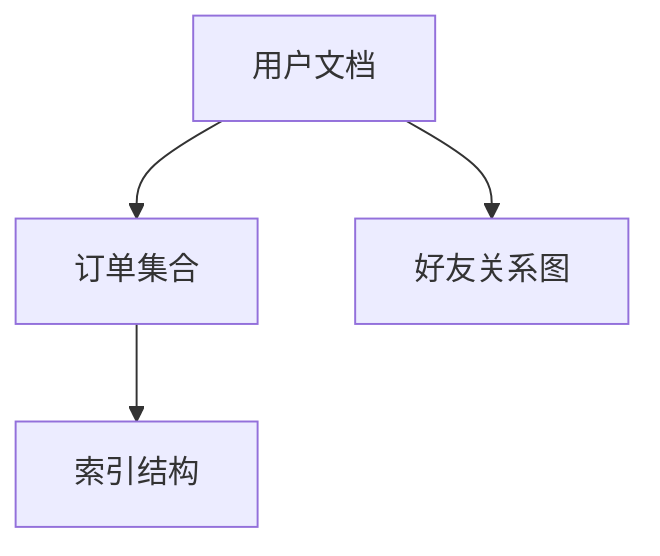

# 1.3.3 数据模型

## 1. 数据结构设计

- 键值、文档、列族、图等多种结构。
- 典型设计：用户文档、订单集合、图节点与边。

## 2. 索引与查询

| 类型 | 说明 | 适用场景 |
|------|------|----------|
| 主键索引 | 唯一性、加速定位 | 键值/文档/列存 |
| 二级索引 | 支持多字段查询 | 文档/列存 |
| 复合索引 | 多条件组合 | 复杂查询 |
| 图索引   | 节点/边关系 | 图数据库 |

## 3. 行业案例与多表征

### 3.1. 互联网行业：MongoDB复合索引

```json
{
  "createIndexes": "orders",
  "indexes": [
    {"key": {"user_id": 1, "order_date": -1}, "name": "user_date_idx"}
  ]
}
```

### 3.2. 金融行业：HBase列族设计

- 见[3.5.7-数据存储与访问](../../3-数据模型与算法/3.5-数据分析与ETL/3.5.7-数据存储与访问.md)

### 3.3. Mermaid数据结构图



### 3.4. Latex公式

$$
\text{索引效率} = \frac{\text{命中查询数}}{\text{总查询数}}
$$

[返回NoSQL导航](README.md)
