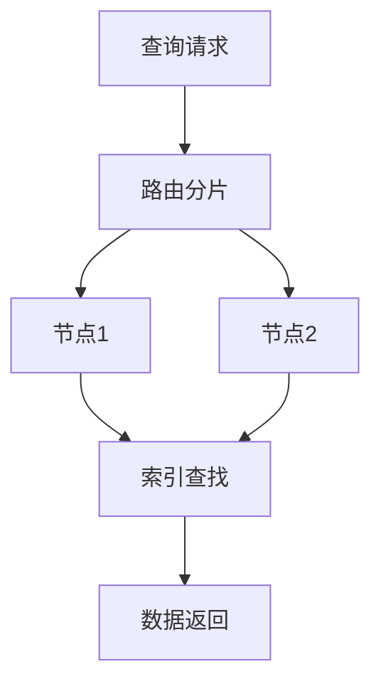

# 1.3.4 查询与索引

## 1.3.4.1 查询机制

- 支持键值、文档、范围、图遍历等多种查询。
- 查询语言：MongoDB Query、CQL、Gremlin等。

## 1.3.4.2 索引类型

| 类型 | 说明 | 适用场景 |
|------|------|----------|
| 哈希索引 | 快速定位 | 键值/文档 |
| B树索引 | 范围查询 | 文档/列存 |
| 二级索引 | 多字段 | 文档/列存 |
| 图索引   | 节点/边 | 图数据库 |

## 1.3.4.3 行业案例与多表征

### 互联网行业：Redis哈希索引

```bash
HSET user:1 name "Alice" age 30
HGETALL user:1
```

### 金融行业：Cassandra范围查询

- 见[3.5.7-数据存储与访问](../../3-数据模型与算法/3.5-数据分析与ETL/3.5.7-数据存储与访问.md)

### Mermaid查询流程图



### Latex公式

$$
\text{查询延迟} = \frac{\text{总响应时间}}{\text{查询次数}}
$$

[返回NoSQL导航](README.md)
