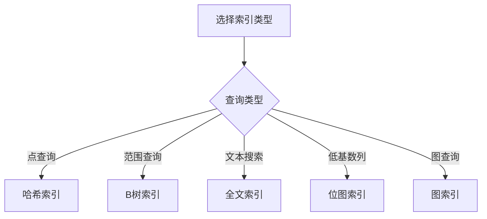
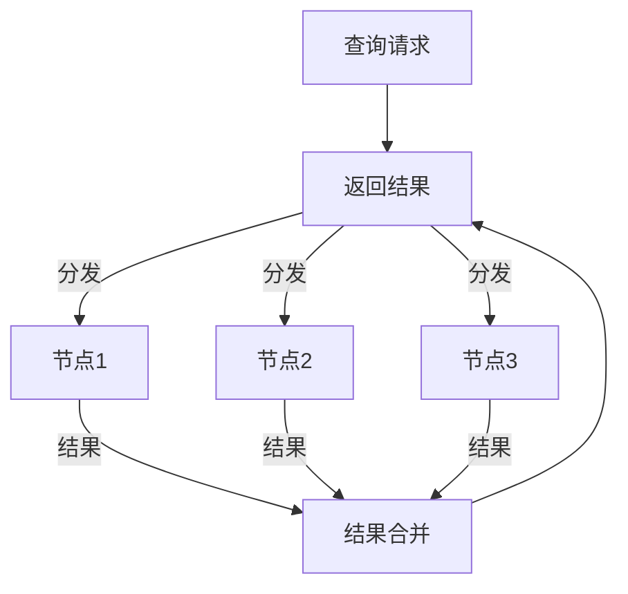

# 1.3.4 NoSQL查询与索引

## 📑 目录

- [1.3.4 NoSQL查询与索引](#134-nosql查询与索引)
  - [📑 目录](#-目录)
  - [1. 概述](#1-概述)
    - [1.1. NoSQL查询特点](#11-nosql查询特点)
    - [1.2. 索引的作用](#12-索引的作用)
  - [2. 查询机制](#2-查询机制)
    - [2.1. 键值查询](#21-键值查询)
      - [2.1.1. 键值查询特点](#211-键值查询特点)
    - [2.2. 文档查询](#22-文档查询)
      - [2.2.1. 文档查询特点](#221-文档查询特点)
    - [2.3. 列族查询](#23-列族查询)
      - [2.3.1. 列族查询特点](#231-列族查询特点)
    - [2.4. 图查询](#24-图查询)
      - [2.4.1. 图查询特点](#241-图查询特点)
  - [3. 索引类型](#3-索引类型)
    - [3.1. 哈希索引](#31-哈希索引)
      - [3.1.1. 哈希索引特点](#311-哈希索引特点)
    - [3.2. B树索引](#32-b树索引)
      - [3.2.1. B树索引特点](#321-b树索引特点)
    - [3.3. 位图索引](#33-位图索引)
      - [3.3.1. 位图索引特点](#331-位图索引特点)
    - [3.4. 全文索引](#34-全文索引)
      - [3.4.1. 全文索引特点](#341-全文索引特点)
    - [3.5. 图索引](#35-图索引)
      - [3.5.1. 图索引特点](#351-图索引特点)
  - [4. 查询语言](#4-查询语言)
    - [4.1. MongoDB Query](#41-mongodb-query)
      - [4.1.1. MongoDB查询语法](#411-mongodb查询语法)
    - [4.2. CQL（Cassandra Query Language）](#42-cqlcassandra-query-language)
      - [4.2.1. CQL语法](#421-cql语法)
    - [4.3. Gremlin（图查询语言）](#43-gremlin图查询语言)
      - [4.3.1. Gremlin语法](#431-gremlin语法)
  - [5. 索引优化策略](#5-索引优化策略)
    - [5.1. 索引选择](#51-索引选择)
      - [5.1.1. 索引选择原则](#511-索引选择原则)
    - [5.2. 复合索引](#52-复合索引)
      - [5.2.1. 复合索引设计](#521-复合索引设计)
    - [5.3. 覆盖索引](#53-覆盖索引)
      - [5.3.1. 覆盖索引优化](#531-覆盖索引优化)
    - [5.4. 索引维护](#54-索引维护)
      - [5.4.1. 索引维护策略](#541-索引维护策略)
  - [6. 实际系统实现](#6-实际系统实现)
    - [6.1. MongoDB查询与索引](#61-mongodb查询与索引)
      - [6.1.1. MongoDB索引类型](#611-mongodb索引类型)
    - [6.2. Cassandra查询与索引](#62-cassandra查询与索引)
      - [6.2.1. Cassandra索引](#621-cassandra索引)
    - [6.3. Redis查询与索引](#63-redis查询与索引)
      - [6.3.1. Redis索引](#631-redis索引)
    - [6.4. Neo4j查询与索引](#64-neo4j查询与索引)
      - [6.4.1. Neo4j索引](#641-neo4j索引)
  - [7. 查询优化](#7-查询优化)
    - [7.1. 查询计划分析](#71-查询计划分析)
      - [7.1.1. 执行计划](#711-执行计划)
    - [7.2. 查询重写](#72-查询重写)
      - [7.2.1. 查询优化](#721-查询优化)
    - [7.3. 并行查询](#73-并行查询)
      - [7.3.1. 并行查询实现](#731-并行查询实现)
  - [8. 实际应用案例](#8-实际应用案例)
    - [8.1. 互联网行业：Redis哈希索引](#81-互联网行业redis哈希索引)
    - [8.2. 金融行业：Cassandra范围查询](#82-金融行业cassandra范围查询)
  - [9. 形式化定义](#9-形式化定义)
    - [9.1. 查询形式化](#91-查询形式化)
    - [9.2. 索引形式化](#92-索引形式化)
  - [10. 多表征](#10-多表征)
  - [11. 总结与展望](#11-总结与展望)
    - [11.1. 总结](#111-总结)
    - [11.2. 发展趋势](#112-发展趋势)

---

## 1. 概述

### 1.1. NoSQL查询特点

**NoSQL查询特点**：

1. **多样化查询**：支持键值、文档、列族、图等多种查询
2. **灵活查询语言**：不同系统有不同的查询语言
3. **分布式查询**：支持跨节点查询
4. **高性能查询**：通过索引优化查询性能

### 1.2. 索引的作用

**索引的作用**：

1. **加速查询**：快速定位数据
2. **减少扫描**：避免全表扫描
3. **支持排序**：支持排序操作
4. **唯一约束**：保证数据唯一性

---

## 2. 查询机制

### 2.1. 键值查询

#### 2.1.1. 键值查询特点

**键值查询**：通过键直接访问值。

**查询操作**：

- **GET**：根据键获取值
- **PUT**：存储键值对
- **DELETE**：删除键值对

**Redis键值查询**：

```bash
# 设置键值
SET user:1 "Alice"

# 获取值
GET user:1

# 删除键
DEL user:1

# 批量操作
MGET user:1 user:2 user:3
MSET user:1 "Alice" user:2 "Bob" user:3 "Charlie"
```

### 2.2. 文档查询

#### 2.2.1. 文档查询特点

**文档查询**：查询文档数据库中的文档。

**查询操作**：

- **精确匹配**：字段精确匹配
- **范围查询**：数值范围查询
- **正则表达式**：文本模式匹配
- **嵌套查询**：嵌套文档查询

**MongoDB文档查询**：

```javascript
// 精确匹配
db.users.find({ name: "Alice" })

// 范围查询
db.orders.find({ amount: { $gte: 100, $lte: 1000 } })

// 正则表达式
db.users.find({ email: /@example\.com$/ })

// 嵌套查询
db.users.find({ "address.city": "Beijing" })

// 复合查询
db.orders.find({
  user_id: 123,
  status: "paid",
  order_date: { $gte: ISODate("2024-01-01") }
})
```

### 2.3. 列族查询

#### 2.3.1. 列族查询特点

**列族查询**：查询列族数据库中的数据。

**查询操作**：

- **行键查询**：根据行键查询
- **列查询**：查询特定列
- **范围查询**：行键范围查询

**Cassandra列族查询**：

```cql
-- 根据分区键查询
SELECT * FROM users WHERE user_id = 123;

-- 范围查询
SELECT * FROM orders
WHERE user_id = 123
  AND order_date >= '2024-01-01'
  AND order_date < '2024-02-01';

-- 限制结果
SELECT * FROM orders WHERE user_id = 123 LIMIT 10;
```

### 2.4. 图查询

#### 2.4.1. 图查询特点

**图查询**：查询图数据库中的节点和边。

**查询操作**：

- **节点查询**：查询节点
- **边查询**：查询边
- **路径查询**：查询路径
- **模式匹配**：图模式匹配

**Neo4j图查询**：

```cypher
// 查询节点
MATCH (u:User {id: 123})
RETURN u

// 查询关系
MATCH (u:User)-[r:FOLLOWS]->(f:User)
WHERE u.id = 123
RETURN f

// 路径查询
MATCH path = (u:User)-[:FOLLOWS*1..3]->(f:User)
WHERE u.id = 123
RETURN path

// 最短路径
MATCH path = shortestPath(
  (u1:User {id: 123})-[*]-(u2:User {id: 456})
)
RETURN path
```

---

## 3. 索引类型

### 3.1. 哈希索引

#### 3.1.1. 哈希索引特点

**哈希索引**：使用哈希函数映射键到值。

**特点**：

- **快速查找**：O(1)平均时间复杂度
- **不支持范围查询**：只能精确匹配
- **适合点查询**：适合键值查询

**实现**：

```python
class HashIndex:
    def __init__(self, size=1024):
        self.size = size
        self.buckets = [[] for _ in range(size)]

    def _hash(self, key):
        """哈希函数"""
        return hash(key) % self.size

    def insert(self, key, value):
        """插入索引"""
        bucket = self.buckets[self._hash(key)]
        for i, (k, v) in enumerate(bucket):
            if k == key:
                bucket[i] = (key, value)
                return
        bucket.append((key, value))

    def get(self, key):
        """查找索引"""
        bucket = self.buckets[self._hash(key)]
        for k, v in bucket:
            if k == key:
                return v
        return None
```

### 3.2. B树索引

#### 3.2.1. B树索引特点

**B树索引**：使用B树数据结构组织索引。

**特点**：

- **支持范围查询**：支持范围扫描
- **有序存储**：数据有序存储
- **适合范围查询**：适合范围查询和排序

**MongoDB B树索引**：

```javascript
// 创建B树索引
db.orders.createIndex({ order_date: 1 })

// 范围查询使用索引
db.orders.find({
  order_date: { $gte: ISODate("2024-01-01") }
}).explain("executionStats")
```

### 3.3. 位图索引

#### 3.3.1. 位图索引特点

**位图索引**：使用位图表示索引。

**特点**：

- **低基数列**：适合低基数列
- **压缩存储**：存储空间小
- **快速集合运算**：支持AND、OR运算

**应用场景**：

- 性别、状态等低基数列
- 数据仓库分析查询

### 3.4. 全文索引

#### 3.4.1. 全文索引特点

**全文索引**：支持文本搜索的索引。

**特点**：

- **文本搜索**：支持全文搜索
- **分词支持**：支持分词
- **相关性排序**：按相关性排序

**MongoDB全文索引**：

```javascript
// 创建全文索引
db.articles.createIndex({ title: "text", content: "text" })

// 全文搜索
db.articles.find({ $text: { $search: "machine learning" } })

// 相关性排序
db.articles.find(
  { $text: { $search: "machine learning" } },
  { score: { $meta: "textScore" } }
).sort({ score: { $meta: "textScore" } })
```

### 3.5. 图索引

#### 3.5.1. 图索引特点

**图索引**：图数据库中的索引。

**索引类型**：

- **节点索引**：节点属性索引
- **边索引**：边属性索引
- **标签索引**：节点标签索引

**Neo4j索引**：

```cypher
// 创建节点索引
CREATE INDEX ON :User(id)

// 创建复合索引
CREATE INDEX ON :User(id, name)

// 使用索引
MATCH (u:User {id: 123})
RETURN u
```

---

## 4. 查询语言

### 4.1. MongoDB Query

#### 4.1.1. MongoDB查询语法

**查询操作符**：

- **比较操作符**：$eq, $ne, $gt, $gte, $lt, $lte
- **逻辑操作符**：$and, $or, $not, $nor
- **元素操作符**：$exists, $type
- **数组操作符**：$in, $nin, $all, $elemMatch

**查询示例**：

```javascript
// 比较查询
db.orders.find({ amount: { $gt: 100, $lt: 1000 } })

// 逻辑查询
db.orders.find({
  $or: [
    { status: "paid" },
    { status: "shipped" }
  ]
})

// 数组查询
db.users.find({ tags: { $in: ["vip", "premium"] } })

// 聚合查询
db.orders.aggregate([
  { $match: { status: "paid" } },
  { $group: { _id: "$user_id", total: { $sum: "$amount" } } },
  { $sort: { total: -1 } },
  { $limit: 10 }
])
```

### 4.2. CQL（Cassandra Query Language）

#### 4.2.1. CQL语法

**CQL特点**：

- **类似SQL**：语法类似SQL
- **分区键限制**：WHERE子句必须包含分区键
- **聚类键范围**：聚类键支持范围查询

**查询示例**：

```cql
-- 基本查询
SELECT * FROM users WHERE user_id = 123;

-- 范围查询
SELECT * FROM orders
WHERE user_id = 123
  AND order_date >= '2024-01-01'
  AND order_date < '2024-02-01';

-- 聚合查询
SELECT user_id, COUNT(*) as order_count, SUM(amount) as total
FROM orders
WHERE user_id IN (123, 456, 789)
GROUP BY user_id;
```

### 4.3. Gremlin（图查询语言）

#### 4.3.1. Gremlin语法

**Gremlin特点**：

- **图遍历**：支持图遍历
- **函数式**：函数式编程风格
- **灵活查询**：灵活的查询能力

**查询示例**：

```groovy
// 基本查询
g.V().has('User', 'id', 123)

// 遍历查询
g.V().has('User', 'id', 123)
  .out('FOLLOWS')
  .values('name')

// 路径查询
g.V().has('User', 'id', 123)
  .repeat(out('FOLLOWS'))
  .times(3)
  .path()

// 聚合查询
g.V().hasLabel('User')
  .groupCount()
  .by('city')
```

---

## 5. 索引优化策略

### 5.1. 索引选择

#### 5.1.1. 索引选择原则

**索引选择原则**：

1. **查询模式**：根据查询模式选择索引
2. **数据分布**：考虑数据分布
3. **更新频率**：考虑更新频率
4. **存储成本**：考虑存储成本

**索引选择决策树**：



### 5.2. 复合索引

#### 5.2.1. 复合索引设计

**复合索引**：多个字段组成的索引。

**设计原则**：

1. **最左前缀**：遵循最左前缀原则
2. **字段顺序**：考虑字段选择性和查询频率
3. **覆盖查询**：尽量覆盖常用查询

**MongoDB复合索引**：

```javascript
// 创建复合索引
db.orders.createIndex({ user_id: 1, order_date: -1, status: 1 })

// 可以使用索引的查询
db.orders.find({ user_id: 123 })  // 使用索引
db.orders.find({ user_id: 123, order_date: { $gte: ISODate("2024-01-01") } })  // 使用索引
db.orders.find({ user_id: 123, status: "paid" })  // 使用索引

// 不能使用索引的查询
db.orders.find({ order_date: { $gte: ISODate("2024-01-01") } })  // 不使用索引（缺少user_id）
```

### 5.3. 覆盖索引

#### 5.3.1. 覆盖索引优化

**覆盖索引**：索引包含查询所需的所有字段。

**优势**：

- **避免回表**：不需要访问数据表
- **提高性能**：减少I/O操作
- **减少内存**：减少内存使用

**MongoDB覆盖索引**：

```javascript
// 创建覆盖索引
db.orders.createIndex({ user_id: 1, order_date: 1, amount: 1 })

// 覆盖查询
db.orders.find(
  { user_id: 123 },
  { user_id: 1, order_date: 1, amount: 1, _id: 0 }
).hint({ user_id: 1, order_date: 1, amount: 1 })
```

### 5.4. 索引维护

#### 5.4.1. 索引维护策略

**索引维护**：

1. **定期重建**：定期重建索引
2. **监控索引使用**：监控索引使用情况
3. **删除无用索引**：删除不使用的索引

**MongoDB索引维护**：

```javascript
// 重建索引
db.orders.reIndex()

// 查看索引使用情况
db.orders.aggregate([
  { $indexStats: {} }
])

// 删除索引
db.orders.dropIndex({ user_id: 1, order_date: -1 })
```

---

## 6. 实际系统实现

### 6.1. MongoDB查询与索引

#### 6.1.1. MongoDB索引类型

**MongoDB索引类型**：

1. **单字段索引**：单个字段索引
2. **复合索引**：多个字段索引
3. **多键索引**：数组字段索引
4. **文本索引**：全文搜索索引
5. **地理空间索引**：地理位置索引

**索引示例**：

```javascript
// 单字段索引
db.users.createIndex({ email: 1 })

// 复合索引
db.orders.createIndex({ user_id: 1, order_date: -1 })

// 文本索引
db.articles.createIndex({ title: "text", content: "text" })

// 地理空间索引
db.places.createIndex({ location: "2dsphere" })
```

### 6.2. Cassandra查询与索引

#### 6.2.1. Cassandra索引

**Cassandra索引类型**：

1. **主键索引**：分区键和聚类键索引
2. **二级索引**：非主键字段索引
3. **SASI索引**：文本搜索索引

**索引示例**：

```cql
-- 主键索引（自动创建）
CREATE TABLE orders (
    user_id UUID,
    order_date TIMESTAMP,
    order_id UUID,
    amount DECIMAL,
    PRIMARY KEY (user_id, order_date, order_id)
);

-- 二级索引
CREATE INDEX idx_status ON orders(status);

-- SASI索引
CREATE CUSTOM INDEX idx_user_name ON users(name)
USING 'org.apache.cassandra.index.sasi.SASIIndex'
WITH OPTIONS = {
    'mode': 'CONTAINS',
    'case_sensitive': 'false'
};
```

### 6.3. Redis查询与索引

#### 6.3.1. Redis索引

**Redis索引特点**：

- **内存索引**：所有索引在内存中
- **自动索引**：键自动索引
- **数据结构索引**：不同数据结构有不同的索引方式

**Redis哈希索引**：

```bash
# 哈希表索引
HSET user:1 name "Alice" age 30 email "alice@example.com"
HGETALL user:1
HGET user:1 name

# 有序集合索引（用于范围查询）
ZADD leaderboard 1000 "user:1"
ZRANGE leaderboard 0 9 WITHSCORES
ZRANGEBYSCORE leaderboard 800 1200
```

### 6.4. Neo4j查询与索引

#### 6.4.1. Neo4j索引

**Neo4j索引类型**：

1. **节点索引**：节点属性索引
2. **关系索引**：关系属性索引
3. **全文索引**：全文搜索索引

**索引示例**：

```cypher
// 创建节点索引
CREATE INDEX ON :User(id)
CREATE INDEX ON :User(email)

// 创建复合索引
CREATE INDEX ON :User(id, name)

// 使用索引
MATCH (u:User {id: 123})
RETURN u

// 全文索引
CALL db.index.fulltext.createNodeIndex(
  "userFulltext",
  ["User"],
  ["name", "email"]
)
```

---

## 7. 查询优化

### 7.1. 查询计划分析

#### 7.1.1. 执行计划

**执行计划分析**：

- **索引使用**：检查是否使用索引
- **扫描方式**：检查扫描方式（索引扫描 vs 全表扫描）
- **执行成本**：评估执行成本

**MongoDB执行计划**：

```javascript
// 查看执行计划
db.orders.find({ user_id: 123 }).explain("executionStats")

// 分析结果
{
  "executionStats": {
    "executionTimeMillis": 10,
    "totalDocsExamined": 1,
    "totalKeysExamined": 1,
    "indexesUsed": ["user_id_1"]
  }
}
```

### 7.2. 查询重写

#### 7.2.1. 查询优化

**查询重写策略**：

1. **谓词下推**：将谓词下推到数据源
2. **投影下推**：只选择需要的字段
3. **连接重排序**：优化连接顺序

**优化示例**：

```javascript
// ❌ 低效：全表扫描
db.orders.find({ $expr: { $eq: [{ $year: "$order_date" }, 2024] } })

// ✅ 高效：使用索引
db.orders.find({
  order_date: {
    $gte: ISODate("2024-01-01"),
    $lt: ISODate("2025-01-01")
  }
})
```

### 7.3. 并行查询

#### 7.3.1. 并行查询实现

**并行查询**：将查询分发到多个节点并行执行。

**并行查询流程**：



---

## 8. 实际应用案例

### 8.1. 互联网行业：Redis哈希索引

**场景**：

- 用户信息存储
- 快速查询
- 高并发访问

**实现**：

```bash
# 用户信息存储
HSET user:1 name "Alice" age 30 email "alice@example.com"

# 快速查询
HGETALL user:1
HGET user:1 name
```

### 8.2. 金融行业：Cassandra范围查询

**场景**：

- 交易记录查询
- 时间范围查询
- 高吞吐量

**实现**：

```cql
-- 时间范围查询
SELECT * FROM transactions
WHERE account_id = 123
  AND transaction_time >= '2024-01-01'
  AND transaction_time < '2024-02-01';
```

---

## 9. 形式化定义

### 9.1. 查询形式化

**查询定义**：

设查询 $Q$ 为：

$$Q = (S, P, F)$$

其中：

- $S$：选择的数据源
- $P$：谓词条件
- $F$：投影字段

### 9.2. 索引形式化

**索引定义**：

设索引 $I$ 为：

$$I = \{(k, loc) | k \in K, loc \in L\}$$

其中 $K$ 是键集合，$L$ 是位置集合。

---

## 10. 多表征

本主题支持多种表征方式：

1. **符号表征**：查询语言、索引定义
2. **图结构**：查询流程图、索引结构图
3. **代码实现**：查询代码、索引代码
4. **自然语言**：概念定义、查询描述
5. **可视化**：查询计划可视化、索引可视化

---

## 11. 总结与展望

### 11.1. 总结

NoSQL查询与索引的核心要点：

1. **查询机制**：键值、文档、列族、图查询
2. **索引类型**：哈希、B树、位图、全文、图索引
3. **查询语言**：MongoDB Query、CQL、Gremlin
4. **索引优化**：索引选择、复合索引、覆盖索引

### 11.2. 发展趋势

**未来发展方向**：

1. **智能索引**：AI驱动的索引选择
2. **自适应索引**：根据查询模式自动调整索引
3. **混合索引**：结合多种索引类型

---

**参考文献**：

1. MongoDB Query Language: <https://docs.mongodb.com/manual/reference/operator/query/>
2. Cassandra Query Language: <https://cassandra.apache.org/doc/latest/cql/>

---

[返回NoSQL导航](README.md)
